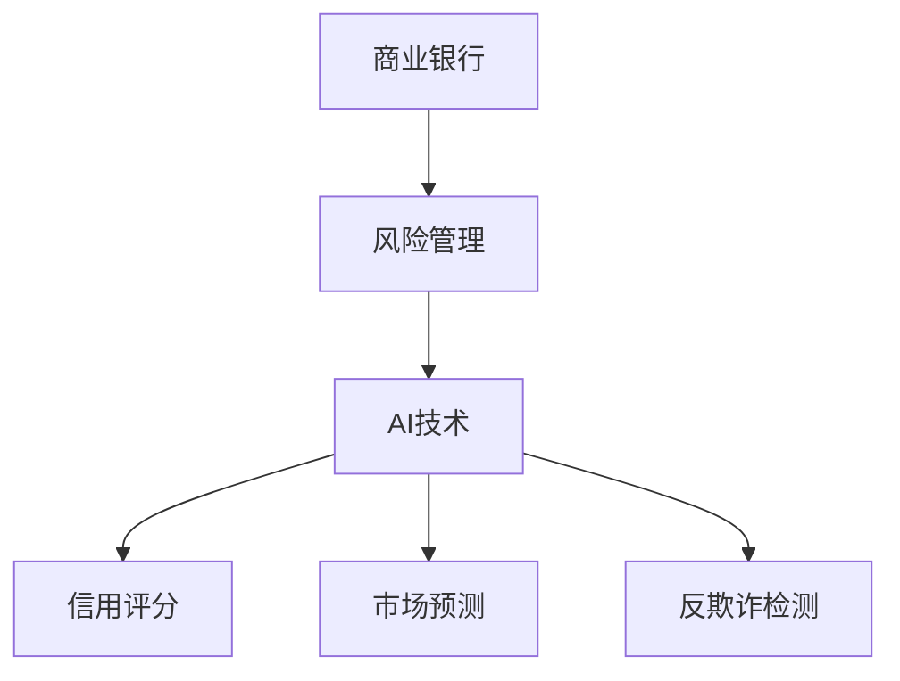
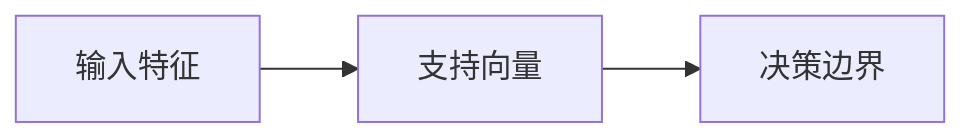
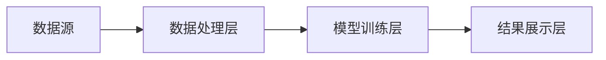
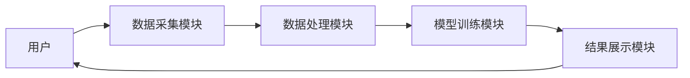

                 


# AI在商业银行风险管理中的应用

> 关键词：AI, 商业银行, 风险管理, 机器学习, 金融分析

> 摘要：本文深入探讨了人工智能技术在商业银行风险管理中的应用，分析了传统风险管理的局限性，介绍了AI技术的核心概念与算法原理，并结合实际案例展示了AI在信用风险评估、市场风险预测和操作风险监控等场景中的具体应用。本文还详细阐述了AI风险管理系统的架构设计，以及系统实现的关键步骤与代码示例，为商业银行风险管理的智能化转型提供了理论支持与实践指导。

---

# 第1章: AI与商业银行风险管理概述

## 1.1 AI技术的背景与发展趋势

### 1.1.1 人工智能技术的发展历程
人工智能（Artificial Intelligence, AI）技术的发展可以追溯到20世纪50年代。从最初的符号推理到现代的深度学习，AI技术经历了多个阶段的演变。近年来，随着计算能力的提升和大数据技术的普及，AI技术迎来了爆发式增长。

### 1.1.2 AI在金融行业的应用现状
在金融行业，AI技术已经被广泛应用于金融分析、风险管理、智能投顾等领域。商业银行作为金融行业的重要组成部分，也在积极探索AI技术的应用场景。

### 1.1.3 商业银行风险管理的核心目标
商业银行风险管理的核心目标是通过识别、评估和控制风险，确保银行资产的安全性和收益的稳定性。传统的风险管理方法依赖于人工判断和经验，效率较低且容易受到主观因素的影响。

---

## 1.2 商业银行风险管理的挑战与机遇

### 1.2.1 传统风险管理的局限性
传统风险管理方法存在以下问题：
- 数据处理能力有限，难以应对海量数据的分析需求。
- 风险评估过程依赖人工经验，结果可能存在偏差。
- 风险监控效率低，难以及时发现潜在风险。

### 1.2.2 AI技术在风险管理中的潜在价值
AI技术可以通过以下方式提升风险管理能力：
- 利用机器学习算法对海量数据进行分析，提取潜在风险信号。
- 通过自然语言处理技术分析非结构化数据，如新闻、社交媒体信息等。
- 实现实时监控，快速识别异常交易和潜在风险。

### 1.2.3 人工智能如何提升风险管理效率
AI技术可以通过自动化、智能化的方式，帮助商业银行实现以下目标：
- 快速识别高风险客户，降低信用风险。
- 精准预测市场波动，优化资产配置。
- 实时监控操作风险，确保合规性。

---

## 1.3 本章小结
本章介绍了AI技术的发展历程及其在金融行业的应用现状，分析了商业银行风险管理的核心目标与传统方法的局限性，最后探讨了AI技术在提升风险管理效率方面的潜在价值。

---

# 第2章: 商业银行风险管理的核心概念

## 2.1 风险管理的基本框架

### 2.1.1 风险的定义与分类
风险是指在特定条件下，某一事件可能发生的概率及其影响程度的综合度量。根据商业银行的业务特点，风险可以分为以下几类：
- **信用风险**：客户违约的可能性。
- **市场风险**：市场价格波动对资产价值的影响。
- **操作风险**：内部操作失误或外部事件导致的损失。
- **流动性风险**：银行资产无法及时变现的风险。

### 2.1.2 风险管理的流程与方法
风险管理的流程包括以下几个步骤：
1. **风险识别**：识别潜在风险源。
2. **风险评估**：量化风险的影响程度和发生概率。
3. **风险控制**：制定和实施风险管理策略。
4. **风险监控**：实时监控风险变化，及时调整管理策略。

### 2.1.3 商业银行风险管理的关键要素
商业银行风险管理的关键要素包括：
- **数据**：全面、准确的风险数据是风险管理的基础。
- **模型**：科学、可靠的数学模型是风险评估的核心工具。
- **技术**：先进的技术手段是提升风险管理效率的重要保障。

---

## 2.2 AI在风险管理中的应用场景

### 2.2.1 信用风险评估
AI技术可以通过分析客户的信用历史、财务状况等数据，利用机器学习算法对客户的信用风险进行评估。例如，可以使用逻辑回归模型预测客户违约的概率。

### 2.2.2 市场风险预测
通过分析市场数据，AI技术可以预测市场价格波动，帮助银行优化资产配置，降低市场风险。

### 2.2.3 操作风险监控
AI技术可以通过分析交易数据和日志信息，识别异常交易行为，及时发现潜在的操作风险。

---

## 2.3 核心概念与联系

### 2.3.1 AI技术与风险管理的实体关系图


---

## 2.4 本章小结
本章详细介绍了商业银行风险管理的基本框架，分析了AI技术在信用风险评估、市场风险预测和操作风险监控等场景中的应用，并通过实体关系图展示了AI技术与风险管理的核心联系。

---

# 第3章: AI技术基础与算法原理

## 3.1 机器学习基础

### 3.1.1 机器学习的基本概念
机器学习是一种通过数据训练模型，使其能够从数据中学习规律并进行预测的技术。机器学习可以分为 supervised learning（监督学习）、unsupervised learning（无监督学习）和 reinforcement learning（强化学习）等。

### 3.1.2 监督学习与无监督学习
- **监督学习**：输入数据带有标签，模型通过学习数据的特征与标签之间的关系进行预测。
- **无监督学习**：输入数据没有标签，模型通过分析数据的特征进行聚类或降维。

### 3.1.3 神经网络与深度学习
神经网络是一种受生物神经网络启发的计算模型，深度学习则是神经网络的一种高级形式，通过多层网络结构提取数据的高层次特征。

---

## 3.2 常见AI算法在风险管理中的应用

### 3.2.1 线性回归模型
线性回归是一种简单而有效的预测模型，适用于线性关系的数据。其数学模型如下：
$$ y = \beta_0 + \beta_1x + \epsilon $$

### 3.2.2 支持向量机（SVM）
支持向量机是一种用于分类和回归的机器学习算法，通过寻找数据的最优分隔线（超平面）实现分类。

### 3.2.3 随机森林与梯度提升树
随机森林是一种基于决策树的集成学习方法，通过组合多个决策树的预测结果提高模型的准确性和稳定性。

---

## 3.3 算法原理讲解

### 3.3.1 线性回归的数学模型
$$ y = \beta_0 + \beta_1x + \epsilon $$

### 3.3.2 支持向量机的分类原理


---

## 3.4 本章小结
本章介绍了机器学习的基本概念与常见算法，重点讲解了线性回归、支持向量机和随机森林等算法的原理及其在风险管理中的应用。

---

# 第4章: AI在商业银行风险管理中的系统架构设计

## 4.1 系统功能设计

### 4.1.1 数据采集模块
数据采集模块负责从各种数据源（如数据库、API接口等）获取风险相关的数据。

### 4.1.2 风险评估模块
风险评估模块利用机器学习算法对风险数据进行分析，生成风险评估报告。

### 4.1.3 监控与预警模块
监控与预警模块实时监控风险指标的变化，当风险超过预设阈值时触发预警。

---

## 4.2 系统架构设计

### 4.2.1 系统架构图


---

## 4.3 系统交互流程

### 4.3.1 系统交互图


---

## 4.4 本章小结
本章详细描述了AI风险管理系统的功能设计与架构设计，通过系统架构图和交互图展示了系统的整体流程。

---

# 第5章: 项目实战——基于Python的信用评分系统

## 5.1 环境搭建

### 5.1.1 安装Python与相关库
安装Python和以下库：
- NumPy
- Pandas
- Scikit-learn
- Matplotlib

## 5.2 数据处理与特征工程

### 5.2.1 数据清洗
处理缺失值、异常值等。

### 5.2.2 特征提取
从数据中提取有用的特征，例如客户的收入、信用历史等。

## 5.3 模型实现

### 5.3.1 训练线性回归模型
```python
from sklearn.linear_model import LinearRegression
model = LinearRegression()
model.fit(X_train, y_train)
```

### 5.3.2 模型评估
使用均方误差（MSE）等指标评估模型的性能。

### 5.3.3 模型部署
将模型部署到生产环境，实现在线信用评分。

---

## 5.4 实际案例分析

### 5.4.1 数据分析
分析客户信用评分的分布情况。

### 5.4.2 模型优化
通过调整模型参数或尝试不同的算法（如随机森林）优化模型性能。

---

## 5.5 本章小结
本章通过一个实际案例展示了AI技术在信用评分系统中的应用，详细讲解了系统的实现步骤与代码示例。

---

# 第6章: 总结与展望

## 6.1 本章总结
本文详细探讨了AI技术在商业银行风险管理中的应用，分析了传统风险管理的局限性，介绍了AI技术的核心概念与算法原理，并结合实际案例展示了AI在信用风险评估、市场风险预测和操作风险监控等场景中的具体应用。

## 6.2 对AI在风险管理中的变革展望
随着AI技术的不断发展，商业银行风险管理将更加智能化和自动化。未来，AI技术将在以下方面发挥更大的作用：
- 更精准的客户画像与风险评估。
- 更高效的市场风险预测与资产配置。
- 更智能的操作风险监控与预警。

## 6.3 最佳实践 tips
- 在实际应用中，建议商业银行结合自身特点选择合适的AI技术。
- 数据安全与隐私保护是AI风险管理系统建设中的重要考虑因素。
- 建议商业银行与技术服务商合作，共同推动AI技术在风险管理中的应用。

---

## 6.4 本章小结
本章总结了全文的主要内容，展望了AI技术在风险管理中的未来发展方向，并给出了实际应用中的注意事项与建议。

---

# 作者：AI天才研究院/AI Genius Institute & 禅与计算机程序设计艺术 /Zen And The Art of Computer Programming

