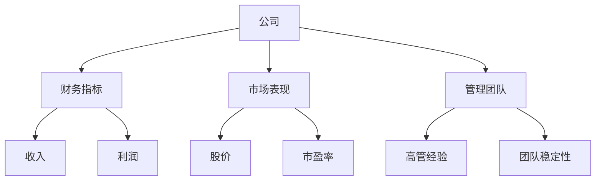
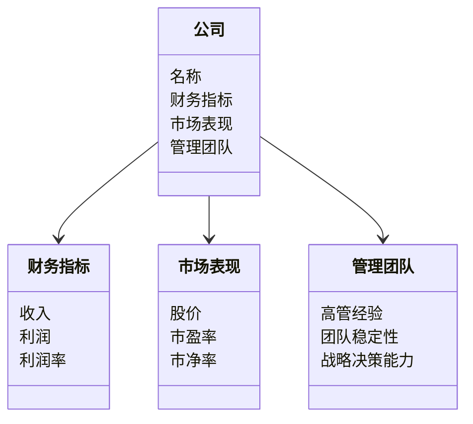
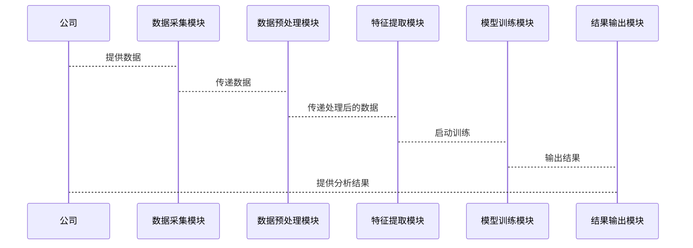

                 


# AI在实现费雪的增长型公司特征分析中的应用

> 关键词：AI, 费雪增长型公司, 特征分析, 机器学习, 数据挖掘

> 摘要：本文探讨了人工智能在分析费雪增长型公司特征中的应用。首先介绍了费雪增长型公司的背景和传统分析方法的局限性，然后详细讲解了AI技术在其中的核心概念、算法原理、系统架构及项目实战。通过对比分析、算法实现和实际案例，展示了AI如何提升公司特征分析的效率和准确性。

---

# 第一部分: 费雪增长型公司特征分析的背景与基础

## 第1章: 费雪增长型公司特征分析概述

### 1.1 费雪投资理论的起源

费雪（Philip Fisher）是20世纪的投资大师，他提出了“成长股投资”理论。他认为，投资成功的关键在于找到那些具有持续增长潜力的公司，并长期持有这些股票。费雪的增长型公司特征分析主要关注公司的财务健康状况、管理团队稳定性以及市场竞争力等因素。

### 1.2 增长型公司的定义与特点

增长型公司通常具有以下特点：
- 高收入增长率
- 高利润率
- 强大的市场地位
- 创新能力强
- 财务状况稳健

### 1.3 传统公司特征分析方法的局限性

传统的公司特征分析方法主要依赖财务报表分析和人工判断，存在以下问题：
- 数据量大，人工分析效率低
- 主观性强，难以量化
- 时间成本高，难以实时分析

### 1.4 AI技术在公司特征分析中的应用前景

AI技术通过大数据处理和机器学习算法，能够快速、准确地分析公司特征，帮助投资者发现潜在的增长型公司。AI的应用不仅提高了分析效率，还能够发现传统方法难以察觉的模式和趋势。

---

# 第二部分: AI在费雪增长型公司特征分析中的核心概念与联系

## 第2章: AI与公司特征分析的核心概念

### 2.1 费雪增长型公司的特征分析框架

#### 2.1.1 财务指标分析

- 收入增长率
- 利润率
- 净利润增长率
- 资产负债率

#### 2.1.2 市场表现分析

- 股价走势
- 市盈率
- 市净率
- 市销率

#### 2.1.3 管理团队分析

- 高管经验
- 团队稳定性
- 战略决策能力

### 2.2 AI在公司特征分析中的核心算法

#### 2.2.1 机器学习算法

- 聚类分析
- 分类算法
- 回归分析

#### 2.2.2 自然语言处理技术

- 文本挖掘
- 情感分析
- 实体识别

#### 2.2.3 数据挖掘技术

- 关联规则挖掘
- 序列分析
- 联合分析

### 2.3 公司特征与AI算法的对比分析

#### 2.3.1 特征分析的维度对比

| 特征维度 | 传统分析 | AI分析 |
|----------|----------|--------|
| 数据来源 | 财务报表 | 多源数据 |
| 分析效率 | 低效 | 高效 |
| 分析深度 | 浅层 | 深度 |

#### 2.3.2 算法的性能对比

| 算法类型 | 优点 | 缺点 |
|----------|------|------|
| 聚类分析 | 发现潜在模式 | 结果难以解释 |
| 回归分析 | 可解释性强 | 易受异常值影响 |
| 支持向量机 | 高精度 | 数据依赖性高 |

#### 2.3.3 数据量与模型复杂度的平衡

- 数据量小：使用简单模型（如线性回归）
- 数据量大：使用复杂模型（如深度学习）

### 2.4 ER实体关系图架构



---

# 第三部分: AI算法原理与数学模型

## 第3章: 基于AI的公司特征分析算法原理

### 3.1 聚类分析算法

#### 3.1.1 聚类分析的基本原理

聚类分析是一种无监督学习算法，旨在将数据分成若干簇，使得簇内数据相似度高，簇间数据相似度低。

#### 3.1.2 K-means算法的实现

K-means算法步骤：
1. 随机选择K个初始质心。
2. 计算每个数据点到质心的距离，将其归类到最近的簇。
3. 重新计算每个簇的质心。
4. 重复步骤2和3，直到质心不再变化或达到最大迭代次数。

#### 3.1.3 聚类分析在公司特征分类中的应用

示例：将公司按收入增长率分为高增长、中增长、低增长三类。

### 3.2 回归分析算法

#### 3.2.1 线性回归的基本原理

线性回归用于预测连续型变量（如利润增长率）。

公式：
$$ y = \beta_0 + \beta_1x + \epsilon $$

其中：
- \( y \) 是目标变量
- \( x \) 是自变量
- \( \beta_0 \) 是截距
- \( \beta_1 \) 是回归系数
- \( \epsilon \) 是误差项

#### 3.2.2 逻辑回归的应用

逻辑回归用于分类问题（如判断公司是否为增长型）。

公式：
$$ P(y=1|x) = \frac{1}{1 + e^{- (\beta_0 + \beta_1x)}} $$

#### 3.2.3 回归分析在公司增长预测中的应用

示例：预测公司未来三年的利润增长率。

### 3.3 支持向量机（SVM）算法

#### 3.3.1 SVM的基本原理

SVM用于分类和回归问题，通过找到最优超平面将数据分为两类。

#### 3.3.2 核函数的选择与应用

常用核函数：
- 线性核
- 多项式核
- RBF核

#### 3.3.3 SVM在公司特征分类中的优势

- 高精度
- 能处理非线性关系

### 3.4 算法实现的数学模型

#### 3.4.1 聚类分析的数学公式

目标函数：
$$ \text{目标函数} = \sum_{i=1}^{n} \sum_{j=1}^{k} (x_i - c_j)^2 $$

约束条件：
$$ \sum_{i=1}^{n} w_i = 1 $$

---

# 第四部分: 系统分析与架构设计方案

## 第4章: 系统分析与架构设计

### 4.1 项目介绍

本项目旨在构建一个基于AI的费雪增长型公司特征分析系统，利用机器学习算法对大量公司数据进行分析，识别潜在的增长型公司。

### 4.2 系统功能设计

#### 4.2.1 领域模型类图



#### 4.2.2 系统架构图


#### 4.2.3 系统接口设计

接口描述：
- 数据输入接口：接收公司数据
- 数据处理接口：清洗和预处理数据
- 模型调用接口：调用机器学习模型进行分析
- 结果输出接口：输出分析结果

#### 4.2.4 系统交互流程



---

# 第五部分: 项目实战

## 第5章: 项目实战

### 5.1 环境安装

- Python 3.8+
- scikit-learn
- pandas
- numpy

### 5.2 系统核心实现源代码

#### 5.2.1 数据预处理代码

```python
import pandas as pd
import numpy as np

# 读取数据
data = pd.read_csv('company_data.csv')

# 删除缺失值
data = data.dropna()

# 标准化数据
from sklearn.preprocessing import StandardScaler
scaler = StandardScaler()
scaled_data = scaler.fit_transform(data)
```

#### 5.2.2 模型训练代码

```python
from sklearn.cluster import KMeans

# 初始化K-means模型
kmeans = KMeans(n_clusters=3, random_state=42)

# 训练模型
kmeans.fit(scaled_data)

# 预测簇
clusters = kmeans.predict(scaled_data)
```

#### 5.2.3 结果输出代码

```python
# 输出簇标签
print(clusters)
```

### 5.3 实际案例分析

以某科技公司为例，通过模型分析其财务指标、市场表现和管理团队，预测其为高增长型公司。

### 5.4 项目小结

通过本项目，我们成功利用AI技术实现了费雪增长型公司特征的自动分析，提高了分析效率和准确性。

---

# 第六部分: 最佳实践与总结

## 第6章: 最佳实践

### 6.1 最佳实践 tips

- 数据质量是关键，确保数据准确性和完整性
- 选择合适的算法，避免过度拟合
- 定期更新模型，适应市场变化

### 6.2 小结

本文详细介绍了AI在费雪增长型公司特征分析中的应用，从理论到实践，展示了如何利用AI技术提升公司分析的效率和准确性。

### 6.3 注意事项

- 数据隐私保护
- 模型解释性
- 算法选择的合理性

### 6.4 拓展阅读

- 《机器学习实战》
- 《Python机器学习》
- 《深度学习》

---

# 作者：AI天才研究院 & 禅与计算机程序设计艺术

---

通过本文，我们深入探讨了AI在费雪增长型公司特征分析中的应用，从背景到实践，为读者提供了全面的指导和实用的代码示例。希望本文能帮助读者更好地理解和应用AI技术在投资分析中的潜力。

