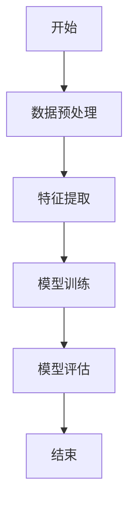
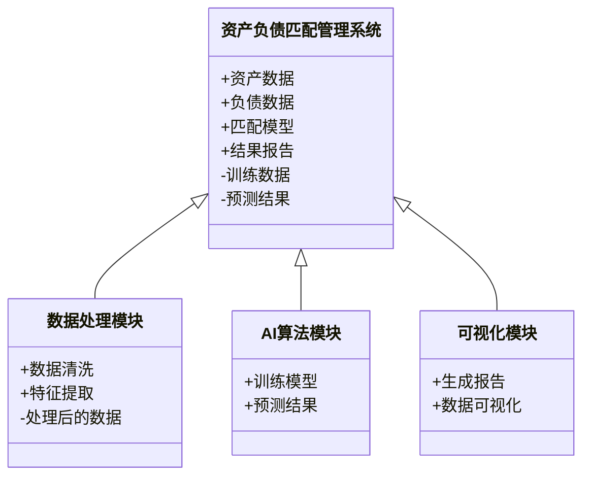
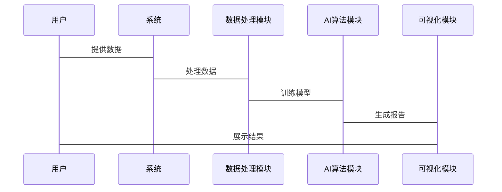

                 


# AI在资产负债匹配管理中的应用

> 关键词：人工智能、资产负债管理、匹配优化、机器学习、风险评估、系统架构

> 摘要：随着人工智能技术的迅速发展，AI在金融领域的应用越来越广泛。本文详细探讨了AI在资产负债匹配管理中的应用，分析了传统资产负债管理的局限性，介绍了AI技术的核心算法及其在资产负债匹配管理中的具体应用，通过实际案例展示了AI如何优化资产负债匹配效率和准确性。文章内容涵盖了AI算法原理、系统架构设计、项目实战等多个方面，为企业应用AI技术提供了理论支持和实践指导。

---

## 第1章 资产负债匹配管理概述

### 1.1 资产负债匹配管理的定义与特点

#### 1.1.1 资产负债匹配管理的定义
资产负债匹配管理是指通过合理配置资产和负债，确保在不同时间段内资产的流动性、收益性和安全性与负债的需求相匹配。其核心目标是实现资产与负债在期限、风险和收益上的动态平衡，以优化企业财务状况和经营绩效。

#### 1.1.2 资产负债匹配管理的核心特点
- **动态性**：根据市场环境和企业经营状况的变化，实时调整资产和负债的配置。
- **风险控制**：通过匹配管理降低企业因资产和负债错配带来的财务风险。
- **效率提升**：利用技术手段提高匹配管理的效率和准确性。

#### 1.1.3 资产负债匹配管理与企业财务健康的关系
资产负债匹配管理是企业财务健康的重要组成部分。通过科学匹配资产和负债，企业可以降低财务风险，提高资金使用效率，从而增强企业的财务健康和市场竞争力。

---

### 1.2 AI在金融领域的应用背景

#### 1.2.1 人工智能在金融领域的应用现状
人工智能技术在金融领域的应用日益广泛，包括智能投顾、信用评估、风险管理、高频交易等。AI技术的引入显著提高了金融业务的效率和准确性。

#### 1.2.2 人工智能在资产负债管理中的潜在价值
AI可以通过大数据分析和机器学习算法，帮助企业更精准地预测市场趋势、评估风险、优化资产配置，从而提高资产负债匹配的效率和准确性。

#### 1.2.3 当前行业面临的挑战与机遇
传统资产负债管理依赖人工判断，存在效率低、风险高、成本高等问题。AI技术的应用为企业提供了新的解决方案，但也面临数据隐私、技术瓶颈等挑战。

---

### 1.3 资产负债匹配管理的AI应用前景

#### 1.3.1 AI在资产负债匹配管理中的优势
- **数据驱动**：AI可以通过分析海量数据，发现潜在规律，优化匹配策略。
- **自动化决策**：AI可以实时分析市场变化，快速做出调整决策。
- **精准预测**：通过机器学习模型，AI可以更准确地预测市场趋势和风险。

#### 1.3.2 未来发展趋势与技术路线
随着技术的进步，AI在资产负债匹配管理中的应用将更加智能化、自动化。未来，可能会出现更多基于深度学习的算法，进一步提高匹配的精准度和效率。

#### 1.3.3 企业级应用的可行性分析
企业需要具备一定的技术能力和数据资源，才能有效应用AI技术进行资产负债匹配管理。对于大型企业来说，这是一项可行且具有战略意义的举措。

---

## 第2章 资产负债匹配管理的核心概念与AI联系

### 2.1 资产负债匹配管理的关键要素

#### 2.1.1 资产与负债的定义与分类
- **资产**：企业拥有的资源，如现金、存货、应收账款等。
- **负债**：企业需要偿还的债务，如短期借款、长期债券等。
- **分类**：根据流动性、期限、风险等因素进行分类。

#### 2.1.2 资产负债匹配的核心要素
- **期限匹配**：确保资产和负债在期限上匹配，避免流动性风险。
- **风险匹配**：根据负债的风险特征，选择合适的资产进行匹配。
- **收益匹配**：通过资产收益覆盖负债成本，实现收益最大化。

#### 2.1.3 资产负债匹配管理的目标与原则
目标：实现资产和负债在期限、风险和收益上的动态平衡。  
原则：安全性、流动性、收益性。

---

### 2.2 AI在资产负债匹配管理中的核心作用

#### 2.2.1 数据驱动的匹配优化
AI通过分析历史数据和市场趋势，优化资产和负债的配置，提高匹配效率。

#### 2.2.2 AI算法在风险评估中的应用
通过机器学习模型，AI可以评估资产和负债的风险，帮助制定更科学的匹配策略。

#### 2.2.3 自动化决策的优势
AI可以实时分析市场变化，自动调整资产和负债的配置，减少人为干预，提高决策效率。

---

### 2.3 资产负债匹配管理与AI的联系

#### 2.3.1 数据流与AI算法的结合
AI通过处理大量的财务数据，提取关键特征，优化匹配策略。

#### 2.3.2 AI如何提升匹配效率
通过机器学习算法，AI可以快速找到最优匹配方案，减少试错成本。

#### 2.3.3 AI在动态调整中的应用
AI可以实时监控市场变化，动态调整资产和负债的配置，降低风险。

---

## 第3章 AI算法原理与数学模型

### 3.1 常见AI算法概述

#### 3.1.1 机器学习算法
- **监督学习**：如线性回归、支持向量机（SVM）。
- **无监督学习**：如聚类分析、主成分分析（PCA）。
- **强化学习**：如Q-Learning。

#### 3.1.2 深度学习算法
- **神经网络**：如卷积神经网络（CNN）、循环神经网络（RNN）。
- **深度强化学习**：如Deep Q-Network（DQN）。

#### 3.1.3 自然语言处理与AI结合
- **NLP技术**：如文本挖掘、情感分析。

---

### 3.2 资产负债匹配管理中的算法选择

#### 3.2.1 回归分析与分类算法
- **回归分析**：用于预测资产和负债的未来趋势。
- **分类算法**：用于识别资产和负债的类别。

#### 3.2.2 时间序列预测模型
- **ARIMA模型**：用于预测负债的时间序列变化。
- **LSTM网络**：用于处理时间序列数据，捕捉长期依赖关系。

#### 3.2.3 神经网络在风险评估中的应用
- **神经网络模型**：用于评估资产和负债的风险。

---

### 3.3 算法流程图



---

### 3.4 算法实现代码示例

```python
import pandas as pd
from sklearn.linear_model import LinearRegression

# 示例数据加载
data = pd.read_csv('balance_sheet.csv')

# 特征与目标变量分离
X = data[['资产', '负债']]
y = data['匹配度']

# 模型训练
model = LinearRegression()
model.fit(X, y)

# 预测
predictions = model.predict(X)
```

---

## 第4章 系统分析与架构设计

### 4.1 系统分析

#### 4.1.1 问题场景介绍
企业需要实时监控资产和负债的匹配情况，及时调整配置以应对市场变化。

#### 4.1.2 系统功能设计
- 数据采集与处理
- 资产负债匹配分析
- AI模型训练与预测
- 结果可视化与报告生成

---

### 4.2 系统架构设计

#### 4.2.1 领域模型类图



---

### 4.3 系统架构图


---

### 4.4 系统交互图



---

## 第5章 项目实战

### 5.1 环境安装

#### 5.1.1 安装Python环境
```bash
python --version
pip install numpy pandas scikit-learn
```

#### 5.1.2 安装可视化工具
```bash
pip install matplotlib seaborn
```

---

### 5.2 核心代码实现

#### 5.2.1 数据加载与处理
```python
import pandas as pd
data = pd.read_csv('balance_sheet.csv')
data.head()
```

#### 5.2.2 特征提取与模型训练
```python
from sklearn.linear_model import LinearRegression
model = LinearRegression()
model.fit(X_train, y_train)
```

#### 5.2.3 模型评估
```python
from sklearn.metrics import mean_squared_error
mse = mean_squared_error(y_test, model.predict(X_test))
print(f"均方误差: {mse}")
```

---

### 5.3 案例分析

#### 5.3.1 数据分析与可视化
```python
import matplotlib.pyplot as plt
plt.plot(data['时间'], data['资产'], label='资产')
plt.plot(data['时间'], data['负债'], label='负债')
plt.xlabel('时间')
plt.ylabel('金额')
plt.legend()
plt.show()
```

---

### 5.4 项目小结

通过本项目，我们实现了AI在资产负债匹配管理中的应用，验证了AI技术在优化匹配效率和准确性方面的优势。未来，可以进一步研究更复杂的算法，如深度学习模型，以提高匹配的精准度。

---

## 第6章 最佳实践与总结

### 6.1 最佳实践

- **数据质量**：确保数据的准确性和完整性。
- **算法选择**：根据具体场景选择合适的AI算法。
- **模型优化**：定期更新模型，适应市场变化。

---

### 6.2 小结

本文详细探讨了AI在资产负债匹配管理中的应用，从算法原理到系统架构设计，再到项目实战，全面展示了AI技术在这一领域的潜力和价值。通过实际案例分析，我们验证了AI技术在优化资产负债匹配效率和准确性方面的优势。

---

### 6.3 注意事项

- **数据隐私**：在处理财务数据时，需要注意数据的隐私和安全。
- **技术局限性**：AI技术目前仍存在一些局限性，如模型的解释性和数据的依赖性。

---

### 6.4 拓展阅读

- **书籍推荐**：《Python机器学习实战》、《深度学习入门》。
- **在线课程**：Coursera上的《机器学习》课程。

---

## 作者：AI天才研究院 & 禅与计算机程序设计艺术

---

通过本文的详细讲解，读者可以全面了解AI在资产负债匹配管理中的应用，掌握相关的技术原理和实践方法，为企业优化财务管理和风险管理提供有力支持。

