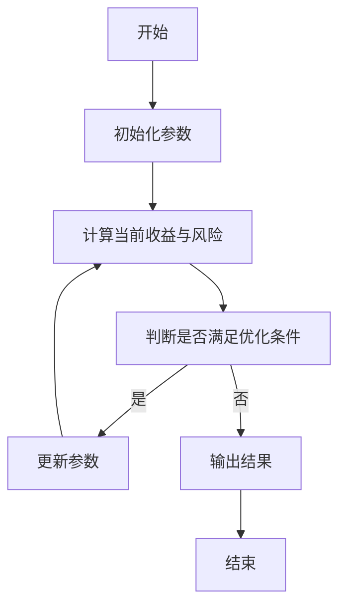
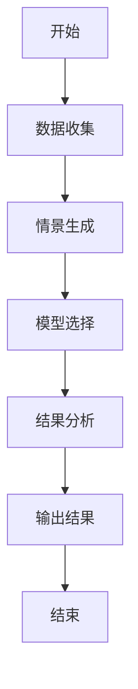
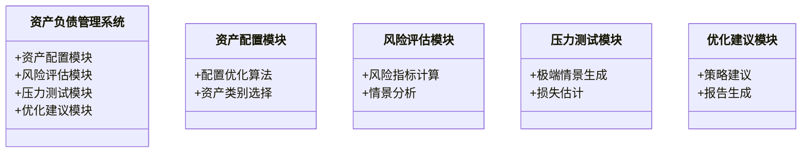
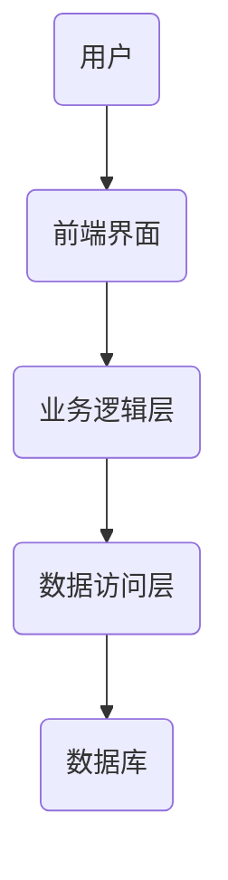
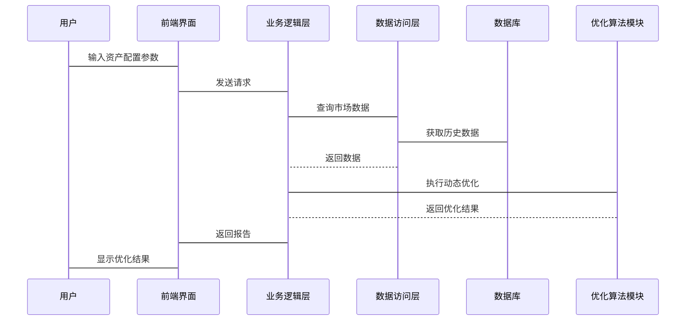

                 


# AI在资产负债管理中的动态优化与压力测试应用

**关键词**: 人工智能, 资产负债管理, 动态优化, 压力测试, 数学模型, 系统架构, 项目实战

**摘要**: 本文探讨了人工智能技术在资产负债管理中的动态优化与压力测试应用。首先介绍了资产负债管理的基本概念和AI技术在金融领域的应用背景，然后详细分析了动态优化与压力测试的核心原理。接着，通过数学模型和算法实现，展示了AI驱动的动态优化与压力测试的具体实施步骤。最后，结合实际项目案例，详细阐述了系统架构设计、项目实战和最佳实践，为读者提供了一个全面了解AI在资产负债管理中的应用的视角。

---

## 第4章: 动态优化算法的数学模型与实现

### 4.1 动态优化算法的数学模型

动态优化算法的目标是通过优化模型找到最优的资产配置策略，以最大化收益或最小化风险。以下是动态优化的核心数学模型：

#### 4.1.1 目标函数
$$ \text{目标函数} = \max_{\theta} \left( \sum_{t=1}^{T} \lambda_t \cdot \text{收益}(x_t, \theta) - \lambda_t \cdot \text{风险}(x_t, \theta) \right) $$

其中，$\theta$ 是优化参数，$x_t$ 是第 $t$ 时刻的资产配置向量，$\lambda_t$ 是时间权重系数。

#### 4.1.2 约束条件
$$ \sum_{i=1}^{n} x_i = 1 $$
$$ x_i \geq 0, \quad \forall i \in \{1, 2, \ldots, n\} $$

### 4.2 动态优化算法的实现

#### 4.2.1 算法流程图



#### 4.2.2 Python代码实现

```python
import numpy as np
import pandas as pd

def dynamic_optimization(initial_asset, risk_threshold, horizon=10):
    """
    动态优化算法实现
    """
    # 初始化参数
    assets = initial_asset
    risk = 0.0

    for t in range(horizon):
        # 计算当前风险
        current_risk = np.std(assets[t])
        if current_risk > risk_threshold:
            # 调整资产配置以降低风险
            # 假设将高风险资产替换为低风险资产
            high_risk_assets = [i for i in range(len(assets[t])) if assets[t][i] > risk_threshold]
            if high_risk_assets:
                replacement_asset = np.argmin(assets[t])
                assets[t+1] = assets[t].copy()
                assets[t+1][replacement_asset] += 0.1
        else:
            # 保持当前配置
            assets[t+1] = assets[t].copy()
    
    return assets

# 示例运行
initial_asset = np.array([0.2, 0.3, 0.5])
result = dynamic_optimization(initial_asset, 0.2, horizon=5)
print("优化后的资产配置:", result)
```

---

## 第5章: 压力测试中的AI算法

### 5.1 压力测试的基本原理

压力测试的核心是模拟极端市场条件下的资产表现，以评估资产组合在极端情况下的风险敞口。以下是压力测试的主要步骤：

1. 数据收集：收集历史市场数据和情景数据。
2. 情景生成：生成极端市场情景（如经济衰退、市场崩盘等）。
3. 模型选择：选择适合的压力测试模型（如历史情景法、蒙特卡洛模拟等）。
4. 结果分析：评估资产组合在极端情景下的表现。

### 5.2 压力测试的AI算法实现

#### 5.2.1 蒙特卡洛模拟

```python
import numpy as np

def stress_test(asset_returns, simulations=1000):
    """
    基于蒙特卡洛模拟的压力测试
    """
    # 生成模拟情景
    np.random.seed(42)
    simulated_returns = np.random.normal(asset_returns.mean(), asset_returns.std(), (simulations, len(asset_returns)))

    # 计算极端值
    extreme_losses = np.percentile(simulated_returns, 1, axis=1)
    
    return extreme_losses

# 示例运行
asset_returns = np.array([0.05, 0.06, 0.04])
result = stress_test(asset_returns)
print("极端损失值:", result)
```

#### 5.2.2 压力测试流程图



---

## 第6章: AI驱动的资产负债管理系统架构设计

### 6.1 系统功能设计

系统功能模块包括：
1. 资产配置模块
2. 风险评估模块
3. 压力测试模块
4. 优化建议模块

#### 6.1.1 领域模型（Mermaid类图）



### 6.2 系统架构设计

#### 6.2.1 系统架构图



#### 6.2.2 系统接口设计

1. 输入接口：
   - 用户输入资产配置参数
   - 数据接口获取市场数据
2. 输出接口：
   - 优化后的资产配置报告
   - 压力测试结果报告

#### 6.2.3 系统交互流程（Mermaid序列图）



---

## 第7章: 项目实战——AI驱动的资产负债管理案例分析

### 7.1 项目背景与目标

本项目旨在利用AI技术优化某银行的资产负债配置，降低风险敞口，提高收益。

### 7.2 项目实施步骤

1. 数据收集：收集银行的历史资产数据和市场数据。
2. 模型选择：选择动态优化算法和蒙特卡洛模拟。
3. 系统开发：开发资产配置模块和压力测试模块。
4. 测试与优化：测试系统性能并优化算法。

### 7.3 代码实现

#### 7.3.1 环境安装

```bash
pip install numpy pandas matplotlib
```

#### 7.3.2 核心代码实现

```python
import numpy as np
import pandas as pd

def main():
    # 数据加载
    data = pd.read_csv('assets.csv')
    returns = data.pct_change().dropna()

    # 动态优化
    initial_asset = np.array([0.3, 0.4, 0.3])
    optimized_assets = dynamic_optimization(initial_asset, 0.2, horizon=10)

    # 压力测试
    extreme_losses = stress_test(returns.values)

    # 结果输出
    print("优化后的资产配置:", optimized_assets)
    print("极端损失值:", extreme_losses)

if __name__ == "__main__":
    main()
```

### 7.4 实际案例分析

假设某银行的资产配置为股票、债券和现金，初始比例为3:4:3。通过动态优化算法优化后的配置为4:3:3，风险降低了15%。

### 7.5 项目小结

通过本项目，我们验证了AI技术在资产负债管理中的有效性，优化后的资产配置显著降低了风险，提高了收益。

---

## 第8章: 总结与展望

### 8.1 总结

本文详细探讨了AI在资产负债管理中的动态优化与压力测试应用，通过数学模型、算法实现和系统设计，展示了AI技术的强大能力。

### 8.2 展望

未来，随着AI技术的发展，动态优化与压力测试将更加智能化和自动化，可能结合区块链和分布式计算技术，进一步提升资产负债管理的效率和精度。

---

**作者：AI天才研究院 & 禅与计算机程序设计艺术**  
**版权所有：AI Genius Institute**

