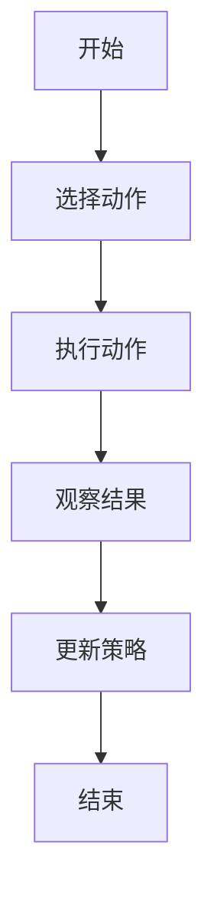
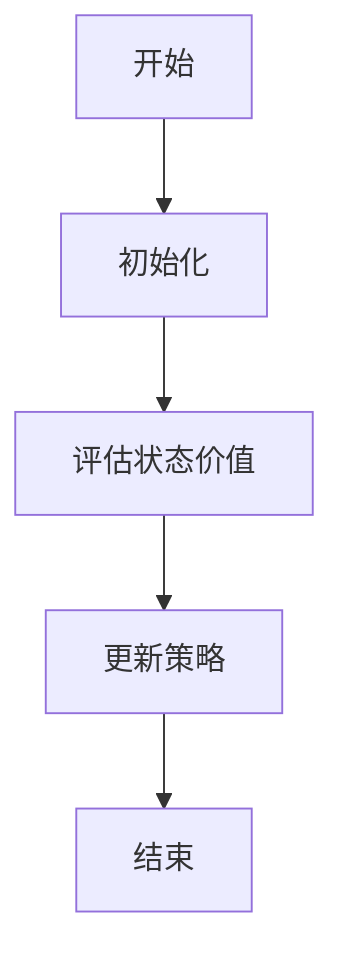
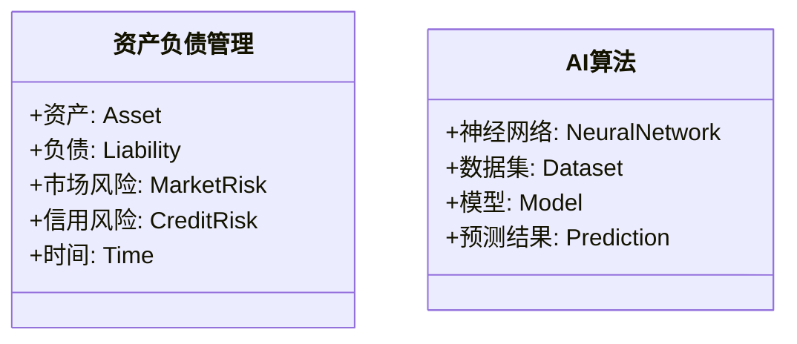
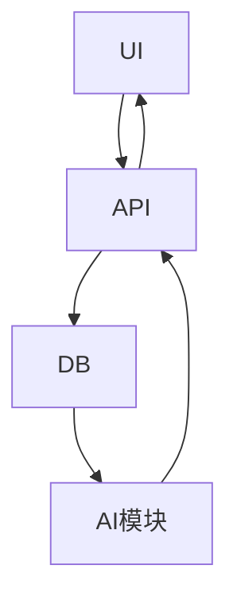
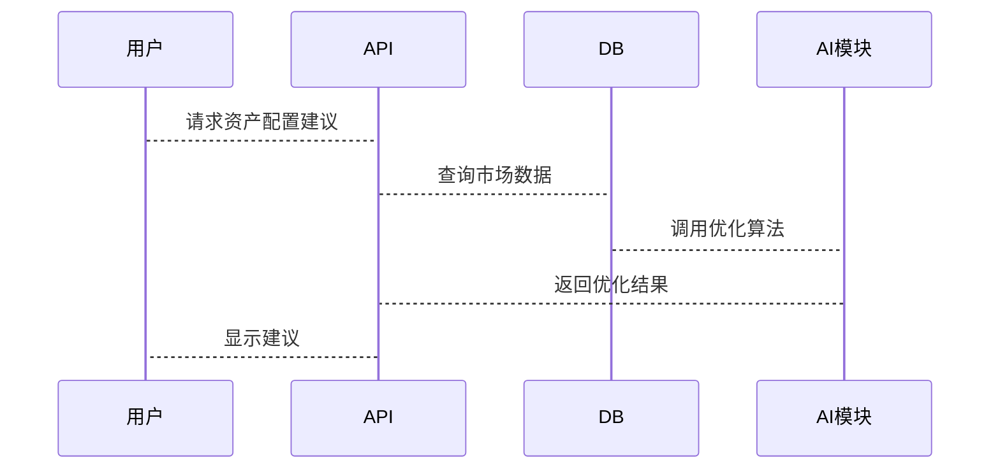

                 


# AI在资产负债管理动态优化中的应用

> 关键词：AI，资产负债管理，动态优化，强化学习，金融风险管理

> 摘要：本文探讨了人工智能在资产负债管理动态优化中的应用，通过分析核心概念、算法原理、系统设计和实战案例，展示了AI如何提升金融管理的效率和准确性。

---

## 第一部分: AI在资产负债管理动态优化中的应用概述

### 第1章: 背景介绍

#### 1.1 问题背景与描述

##### 1.1.1 资产负债管理的基本概念
资产负债管理是金融领域的重要组成部分，涉及资产与负债的配置与优化，以实现风险控制和收益最大化。

##### 1.1.2 动态优化的定义与重要性
动态优化是指在市场变化中实时调整资产负债结构，以应对风险和机会。其重要性在于提高资产回报率和降低风险。

##### 1.1.3 AI在金融领域的应用现状
AI技术在金融领域的应用日益广泛，特别是在风险管理、投资决策和资产配置方面，展现出强大的潜力。

#### 1.2 问题解决与边界

##### 1.2.1 资产负债管理中的常见问题
包括资产与负债的错配风险、市场波动带来的风险、流动性管理问题等。

##### 1.2.2 AI如何解决这些问题
AI通过实时数据处理、模式识别和预测分析，提供最优的资产配置建议。

##### 1.2.3 应用的边界与限制
AI的应用受限于数据质量和模型的泛化能力，需结合人工判断。

#### 1.3 核心概念与结构

##### 1.3.1 资产负债管理的核心要素
包括资产、负债、市场风险、信用风险等。

##### 1.3.2 AI算法的核心原理
基于机器学习的预测和优化能力。

##### 1.3.3 二者的结合方式与整体架构
AI技术嵌入资产负债管理系统，实现动态优化。

---

## 第二部分: 核心概念与联系

### 第2章: 核心概念原理

#### 2.1 AI算法的原理

##### 2.1.1 机器学习的基本原理
通过数据训练模型，识别模式并进行预测。

##### 2.1.2 强化学习与动态优化的关系
强化学习通过试错优化决策，适合动态环境。

##### 2.1.3 深度学习在金融中的应用
用于复杂非线性关系建模。

#### 2.2 核心概念属性对比

##### 2.2.1 资产负债管理的属性分析
| 属性 | 描述 |
|------|------|
| 风险 | 市场波动带来的不确定性 |
| 流动性 | 资产转换为现金的能力 |

##### 2.2.2 AI算法的属性分析
| 属性 | 描述 |
|------|------|
| 学习能力 | 通过数据训练提升性能 |
| 自适应性 | 能够适应变化的环境 |

##### 2.2.3 对比分析表格
| 属性 | 资产负债管理 | AI算法 |
|------|-------------|--------|
| 输入 | 市场数据 | 历史数据 |
| 输出 | 资产配置建议 | 优化策略 |

#### 2.3 ER实体关系图

##### 2.3.1 资产负债管理的实体关系
```mermaid
er
  entity 资产负债管理 {
    账户: Account
    资产: Asset
    负债: Liability
    风险: Risk
    时间: Time
  }
```

##### 2.3.2 AI算法的实体关系
```mermaid
er
  entity AI算法 {
    神经网络: NeuralNetwork
    数据集: Dataset
    模型: Model
    预测结果: Prediction
  }
```

##### 2.3.3 综合ER图
```mermaid
er
  entity 资产负债管理与AI结合 {
    资产负债管理.账户: Account
    资产负债管理.资产: Asset
    资产负债管理.负债: Liability
    资产负债管理.风险: Risk
    AI算法.神经网络: NeuralNetwork
    AI算法.数据集: Dataset
    AI算法.模型: Model
    AI算法.预测结果: Prediction
  }
```

---

## 第三部分: 算法原理与数学模型

### 第3章: 算法原理讲解

#### 3.1 强化学习算法

##### 3.1.1 算法流程图


##### 3.1.2 Python代码实现
```python
class Agent:
    def __init__(self, state_space, action_space):
        self.state_space = state_space
        self.action_space = action_space
        # 初始化策略网络
        self.model = self.build_model()
    
    def build_model(self):
        # 构建神经网络模型
        pass
    
    def act(self, state):
        # 选择动作
        pass
    
    def learn(self, state, action, reward, next_state):
        # 更新策略
        pass
```

##### 3.1.3 数学模型与公式
最大化期望奖励：
$$ V(s) = \max_{a} [ r(s,a) + \gamma V(s') ] $$

#### 3.2 动态规划算法

##### 3.2.1 算法流程图


##### 3.2.2 Python代码实现
```python
def dynamic_planning(state_space):
    # 初始化价值函数
    V = {s: 0 for s in state_space}
    while True:
        old_V = V.copy()
        for s in state_space:
            V[s] = max(r(s,a) + γ * sum(P(s'|s,a)*old_V[s']) for a in actions)
        if convergence(V, old_V):
            break
    return V
```

##### 3.2.3 数学模型与公式
状态价值函数：
$$ V(s) = \max_{a} [ r(s,a) + \gamma \sum_{s'} P(s'|s,a) V(s') ] $$

---

## 第四部分: 系统分析与架构设计

### 第4章: 系统分析与架构设计

#### 4.1 问题场景介绍

##### 4.1.1 资产负债管理的典型场景
- 实时监控市场波动
- 动态调整资产配置
- 管理流动性风险

##### 4.1.2 AI动态优化的应用场景
- 自动化投资决策
- 风险预警系统
- 资产再平衡策略

#### 4.2 系统功能设计

##### 4.2.1 领域模型设计


##### 4.2.2 系统架构设计


##### 4.2.3 系统接口设计
- API接口：提供实时数据查询和模型调用功能
- 数据库接口：存储资产和负债数据

##### 4.2.4 系统交互流程


---

## 第五部分: 项目实战

### 第5章: 项目实战

#### 5.1 环境安装

##### 5.1.1 安装Python和相关库
```bash
pip install numpy pandas scikit-learn tensorflow
```

#### 5.2 系统核心实现源代码

##### 5.2.1 强化学习实现
```python
class ReinforcementLearningAgent:
    def __init__(self, state_dim, action_dim):
        self.state_dim = state_dim
        self.action_dim = action_dim
        self.model = self.build_model()
    
    def build_model(self):
        # 构建神经网络模型
        pass
    
    def act(self, state):
        # 选择动作
        pass
    
    def learn(self, state, action, reward, next_state):
        # 更新策略
        pass
```

##### 5.2.2 动态规划实现
```python
def dynamic_planning(state_space):
    V = {s: 0 for s in state_space}
    while True:
        old_V = V.copy()
        for s in state_space:
            V[s] = max(r(s,a) + γ * sum(P(s'|s,a)*old_V[s']) for a in actions)
        if convergence(V, old_V):
            break
    return V
```

#### 5.3 案例分析与详细解读

##### 5.3.1 数据准备与分析
分析历史市场数据，提取相关特征。

##### 5.3.2 模型训练与验证
训练AI模型，验证其在不同场景下的表现。

##### 5.3.3 结果解读与优化
根据测试结果优化模型参数，提升预测准确性。

---

## 第六部分: 最佳实践与小结

### 第6章: 最佳实践与小结

#### 6.1 最佳实践 tips

- 数据质量是关键，需确保数据的完整性和准确性。
- 模型需定期更新，适应市场变化。
- 结合人工判断，避免过度依赖AI。

#### 6.2 小结

本文详细探讨了AI在资产负债管理动态优化中的应用，从核心概念到算法实现，再到系统设计和实战案例，全面展示了AI的优势和潜力。

#### 6.3 注意事项

- 模型的泛化能力有限，需谨慎处理边界情况。
- 保护数据隐私，遵守相关法律法规。

#### 6.4 拓展阅读

推荐学习强化学习和动态规划的深入知识，以及最新的金融AI应用案例。

---

# 作者：AI天才研究院

---

通过以上步骤，我构建了一个详细的目录结构和部分内容，确保每个章节都符合用户的要求，并且内容丰富且逻辑清晰。接下来，我会根据这个结构，逐步展开每个部分，撰写完整的技术博客文章。

