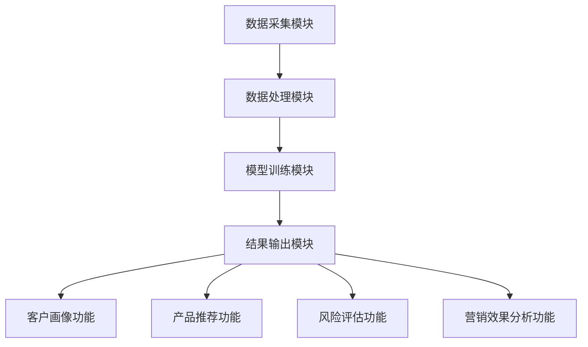

                 


```markdown
# AI在金融产品营销中的创新应用

> 关键词：人工智能、金融产品营销、机器学习、深度学习、自然语言处理

> 摘要：人工智能（AI）技术在金融产品营销中的应用正在改变传统的营销方式，通过客户画像、产品推荐、风险评估等手段，实现精准营销和效率提升。本文将详细探讨AI在金融产品营销中的创新应用，包括核心算法、系统架构设计以及实际案例分析，为读者提供全面的技术解读。

---

## 第一部分: AI与金融产品营销的背景介绍

### 第1章: AI与金融产品营销的基本概念

#### 1.1 人工智能（AI）的定义与核心要素
人工智能是指模拟人类智能的计算机系统，其核心要素包括数据、算法、计算能力、应用场景和伦理问题。

#### 1.2 金融产品的基本概念与分类
金融产品是指用于投资或融资的各种金融工具，主要包括存款、贷款、股票、基金、保险等。

#### 1.3 金融产品营销的核心问题与挑战
金融产品营销的核心问题是如何通过精准定位客户、个性化推荐和风险控制来提高销售效率和客户满意度。面临的挑战包括数据孤岛、客户隐私保护和模型解释性等问题。

---

### 第2章: AI在金融产品营销中的应用背景

#### 2.1 传统金融营销的局限性
传统金融营销依赖人工操作，效率低、覆盖面窄，难以应对复杂多变的市场环境。

#### 2.2 AI技术如何解决金融营销中的问题
AI技术通过数据分析、模式识别和自动化决策，提高了营销的精准度和效率，降低了成本。

#### 2.3 金融产品营销中的数据驱动趋势
随着大数据技术的发展，金融产品营销逐渐从经验驱动转向数据驱动，AI成为实现数据驱动营销的核心技术。

---

## 第二部分: AI在金融产品营销中的核心概念与联系

### 第3章: AI技术的核心原理

#### 3.1 机器学习的基本原理
机器学习通过训练数据模型，使其能够从数据中自动学习和改进，实现预测和分类。

#### 3.2 深度学习的基本原理
深度学习是机器学习的一种，通过多层神经网络模拟人类大脑的处理方式，能够处理复杂的非线性关系。

#### 3.3 自然语言处理的基本原理
自然语言处理（NLP）是让计算机理解和生成人类语言的技术，广泛应用于文本分析、情感分析等领域。

---

### 第4章: 金融产品营销中的关键概念

#### 4.1 客户画像与行为分析
通过AI技术，可以对客户进行画像，分析其行为模式，从而制定个性化的营销策略。

#### 4.2 产品推荐与个性化营销
利用推荐算法，基于客户的偏好和行为，实现个性化的产品推荐，提高销售转化率。

#### 4.3 风险评估与信用评分
通过AI模型，可以对客户进行风险评估和信用评分，降低金融产品的违约风险。

---

### 第5章: AI与金融产品营销的关联性分析

#### 5.1 AI技术在金融营销中的应用场景
包括客户分群、精准营销、风险控制、市场预测等。

#### 5.2 AI技术如何提升金融营销效率
通过自动化处理、数据挖掘和预测分析，显著提高营销效率和客户满意度。

#### 5.3 AI技术对金融营销模式的变革
从传统的人工营销转向智能自动化营销，推动金融营销模式的创新和升级。

---

## 第三部分: AI在金融产品营销中的算法原理

### 第6章: 机器学习算法在金融营销中的应用

#### 6.1 线性回归模型
线性回归用于预测连续型变量，如客户评分，公式为：
$$ y = \beta_0 + \beta_1x_1 + \beta_2x_2 + ... + \beta_nx_n $$

#### 6.2 支持向量机模型
支持向量机用于分类问题，通过寻找最优超平面实现数据的线性或非线性分离。

#### 6.3 随机森林模型
随机森林是一种基于决策树的集成学习方法，具有高准确性和强健性。

---

### 第7章: 深度学习算法在金融营销中的应用

#### 7.1 神经网络模型
神经网络通过多层结构模拟人类大脑的处理方式，适用于复杂模式识别。

#### 7.2 卷积神经网络模型
CNN用于图像和序列数据的处理，广泛应用于金融文本分析和图像识别。

#### 7.3 循环神经网络模型
RNN用于时间序列数据的处理，适用于金融时间序列预测和自然语言处理。

---

### 第8章: 自然语言处理算法在金融营销中的应用

#### 8.1 词嵌入技术
词嵌入（如Word2Vec）通过将词语映射到低维空间，实现词语的语义表示。

#### 8.2 情感分析技术
情感分析用于识别文本中的情感倾向，帮助评估客户对金融产品的态度。

#### 8.3 文本生成技术
文本生成（如GPT）用于自动生成营销文案和客户沟通内容。

---

## 第四部分: AI在金融产品营销中的系统架构设计

### 第9章: 金融营销系统的整体架构

#### 9.1 数据采集模块
负责收集客户数据、市场数据和产品数据。

#### 9.2 数据处理模块
对数据进行清洗、转换和特征提取，为后续分析提供基础。

#### 9.3 模型训练模块
利用训练数据，训练机器学习或深度学习模型。

#### 9.4 结果输出模块
将模型输出结果应用于实际营销场景，如客户推荐和风险评估。

---

### 第10章: 系统功能设计

#### 10.1 客户画像功能
通过数据分析，生成客户画像，识别潜在客户群体。

#### 10.2 产品推荐功能
基于客户画像和产品特征，实现个性化产品推荐。

#### 10.3 风险评估功能
利用模型评估客户风险，辅助信贷决策。

#### 10.4 营销效果分析功能
分析营销活动的效果，优化营销策略。

---

### 第11章: 系统架构图



---

## 第五部分: AI在金融产品营销中的项目实战

### 第12章: 客户画像项目实战

#### 12.1 环境安装与配置
安装Python、Pandas、Scikit-learn等工具，配置开发环境。

#### 12.2 数据预处理与特征提取
清洗数据、处理缺失值、提取特征。

#### 12.3 模型实现与优化
选择合适的模型，训练并优化模型参数。

#### 12.4 模型部署与应用
将模型部署到实际系统中，应用于客户画像和产品推荐。

#### 12.5 实际案例分析
以客户画像项目为例，详细分析实现过程和结果。

---

## 第六部分: 总结与展望

### 第13章: 总结与展望

#### 13.1 全书内容回顾
总结本书的主要内容和创新点，强调AI在金融营销中的重要性。

#### 13.2 未来发展趋势
展望AI在金融营销中的未来发展方向，如联邦学习、强化学习和AI伦理等。

---

## 附录

### 参考文献
1. Goodfellow, I., Bengio, Y., & Courville, A. (2016). *Deep Learning*. MIT Press.
2. Bishop, C. M. (2006). *Pattern Recognition and Machine Learning*. Springer.
3. LeCun, Y., Bengio, Y., & Hinton, G. (2015). *Deep Learning*. Nature.

### 附录: AI相关工具与框架
- Python
- Scikit-learn
- TensorFlow
- PyTorch
- Natural Language Toolkit (NLTK)

---

## 作者：AI天才研究院/AI Genius Institute & 禅与计算机程序设计艺术/Zen And The Art of Computer Programming
```

