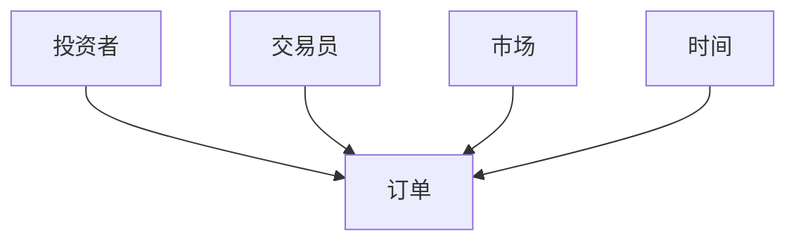
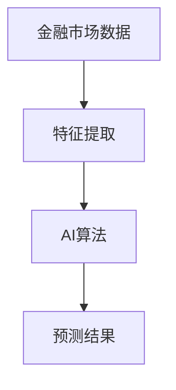

                 


# AI在金融市场微观结构分析中的应用

## 关键词：
AI，金融市场，微观结构，时间序列分析，机器学习，深度学习，系统架构设计

## 摘要：
本文深入探讨了人工智能技术在金融市场微观结构分析中的应用。通过分析金融市场的核心概念、AI算法在微观结构分析中的应用，以及基于AI的金融分析系统的架构设计，本文详细讲解了AI如何助力金融市场微观结构分析。文章从时间序列分析、机器学习和深度学习等多个角度展开，结合具体案例和系统设计，展示了AI技术在金融数据分析中的强大能力。

---

# 第1章: AI与金融市场微观结构概述

## 1.1 金融市场的基本概念

### 1.1.1 金融市场的定义与分类
金融市场是指通过资金、证券等金融工具进行交易的场所，通常分为一级市场和二级市场。一级市场主要涉及新证券的发行，二级市场则涉及已发行证券的交易。金融市场的参与者包括投资者、交易员、机构投资者等。

### 1.1.2 金融市场微观结构的核心要素
金融市场微观结构关注市场的基本运作机制，包括订单簿、交易规则、市场参与者行为等。微观结构决定了市场的流动性和价格形成的机制。

### 1.1.3 AI在金融中的应用背景
随着金融数据的爆炸式增长，传统的人工分析方法难以处理海量数据。AI技术的引入，特别是机器学习和深度学习，为金融市场分析提供了新的工具和方法。

## 1.2 AI技术在金融分析中的应用现状

### 1.2.1 AI在金融领域的应用领域
AI在金融领域的应用广泛，包括风险评估、信用评分、投资组合优化等。特别是在高频交易和算法交易中，AI技术已经发挥了重要作用。

### 1.2.2 微观结构分析中的AI技术
AI技术在微观结构分析中的应用主要体现在订单簿分析、交易行为预测等方面。通过分析订单数据，AI可以帮助识别市场参与者的交易策略。

### 1.2.3 当前AI技术面临的挑战
AI技术在金融应用中面临数据质量、模型解释性、交易延迟等问题。特别是在金融市场中，模型的实时性和准确性要求很高。

## 1.3 本书的核心内容与目标

### 1.3.1 本书的研究目标
本书旨在探讨AI技术在金融市场微观结构分析中的应用，通过理论分析和实际案例，展示AI技术在金融数据分析中的潜力。

### 1.3.2 本书的核心内容框架
本书将从AI的基本概念、金融市场的微观结构、AI算法在微观结构分析中的应用、系统架构设计等方面展开，结合实际案例进行详细讲解。

### 1.3.3 本书的读者对象
本书适合金融从业者、数据科学家、AI研究人员以及对金融市场和AI技术感兴趣的读者阅读。

---

# 第2章: 金融市场微观结构分析的核心概念

## 2.1 微观结构分析的基本原理

### 2.1.1 金融市场微观结构的定义
金融市场微观结构研究市场的基本运作机制，包括订单簿、交易规则、市场参与者行为等。微观结构分析帮助我们理解市场价格的形成过程。

### 2.1.2 微观结构分析的主要内容
微观结构分析的核心内容包括订单簿分析、交易行为分析、市场微观流动性分析等。这些分析可以帮助投资者理解市场的运作机制。

### 2.1.3 微观结构分析的数学模型
微观结构分析中常用的数学模型包括订单簿模型、微观流动性模型等。这些模型可以帮助我们量化市场的运作机制。

## 2.2 AI在微观结构分析中的应用

### 2.2.1 AI技术的核心优势
AI技术在微观结构分析中的优势体现在数据处理能力、模式识别能力和实时性上。AI能够快速处理海量数据，并从中提取有价值的信息。

### 2.2.2 微观结构分析中的关键问题
微观结构分析中的关键问题包括订单簿预测、交易行为识别、市场微观流动性预测等。这些问题需要结合AI技术进行解决。

### 2.2.3 AI技术如何解决这些问题
通过机器学习算法，AI可以预测订单簿的变化，识别市场参与者的交易行为，并预测市场的微观流动性。这些预测结果可以帮助投资者做出更明智的决策。

## 2.3 核心概念与联系

### 2.3.1 微观结构分析的ER实体关系图


### 2.3.2 AI算法与金融市场数据的关系


---

# 第3章: 常用AI算法在微观结构分析中的应用

## 3.1 时间序列分析算法

### 3.1.1 时间序列分析的基本原理
时间序列分析是一种基于历史数据预测未来趋势的分析方法。通过分析数据的周期性、趋势性和随机性，可以建立预测模型。

### 3.1.2 常用的时间序列算法
常用的时间序列算法包括ARIMA、GARCH等。这些算法可以通过Python的statsmodels库实现。

### 3.1.3 时间序列分析在微观结构中的应用
时间序列分析可以用于预测市场的波动性，识别市场的周期性变化。例如，使用ARIMA模型预测股票价格的变化趋势。

## 3.2 机器学习算法

### 3.2.1 机器学习的基本原理
机器学习是一种通过数据训练模型，使其能够自动识别模式和规律的技术。常用的机器学习算法包括线性回归、支持向量机、随机森林等。

### 3.2.2 常用的机器学习算法
在金融分析中，常用的机器学习算法包括XGBoost、LightGBM等。这些算法在分类和回归任务中表现优异。

### 3.2.3 机器学习在微观结构分析中的应用
机器学习可以用于订单簿预测、交易行为识别等任务。例如，使用随机森林模型预测订单簿的变化趋势。

## 3.3 深度学习算法

### 3.3.1 深度学习的基本原理
深度学习是一种基于人工神经网络的机器学习技术，能够通过多层神经网络提取数据的高层次特征。

### 3.3.2 常用的深度学习算法
常用的深度学习算法包括LSTM、Transformer等。这些算法在处理序列数据和时间依赖性数据时表现优异。

### 3.3.3 深度学习在微观结构分析中的应用
深度学习可以用于预测市场的微观流动性、识别市场异常交易行为等。例如，使用LSTM模型预测市场的波动性。

---

# 第4章: 基于AI的金融市场微观结构分析系统

## 4.1 系统分析与架构设计

### 4.1.1 系统功能模块划分
基于AI的金融分析系统通常包括数据采集模块、数据处理模块、模型训练模块、预测模块等。

### 4.1.2 系统架构设计
系统架构可以采用微服务架构，通过不同的服务处理数据采集、模型训练、结果展示等任务。使用Docker和Kubernetes可以实现容器化部署和管理。

### 4.1.3 系统接口设计
系统需要提供RESTful API接口，用于数据采集模块与模型训练模块之间的数据传输。同时，系统还需要提供用户友好的Web界面，方便用户查看分析结果。

## 4.2 系统功能设计

### 4.2.1 数据采集模块
数据采集模块负责从金融市场数据源获取实时数据，包括订单簿数据、交易数据等。使用Python的requests库可以实现API接口的数据获取。

### 4.2.2 数据处理模块
数据处理模块负责对采集的数据进行清洗和预处理，包括数据归一化、特征提取等。Python的pandas库非常适合进行数据处理。

### 4.2.3 模型训练模块
模型训练模块负责使用机器学习或深度学习算法训练预测模型。通过scikit-learn库可以实现常见的机器学习算法，而Keras库则适合进行深度学习模型的训练。

### 4.2.4 预测模块
预测模块负责利用训练好的模型对未来的市场微观结构进行预测。预测结果可以通过Jupyter Notebook进行展示和分析。

---

# 第5章: 项目实战

## 5.1 项目背景与目标
本项目旨在利用AI技术对金融市场的订单簿进行预测，帮助投资者更好地理解市场微观结构。

## 5.2 环境安装与配置
需要安装Python、Jupyter Notebook、pandas、numpy、scikit-learn、Keras等库。安装可以通过pip命令完成。

## 5.3 系统核心实现

### 5.3.1 数据采集
```python
import requests
import pandas as pd

url = "https://api.example.com/order_book"
response = requests.get(url)
data = response.json()
df = pd.DataFrame(data)
```

### 5.3.2 数据处理
```python
import pandas as pd
import numpy as np

df = pd.DataFrame({'price': [100, 99, 101, 102], 'volume': [50, 100, 75, 25]})
df['normalized_volume'] = df['volume'] / df['volume'].sum()
```

### 5.3.3 模型训练
```python
from sklearn.ensemble import RandomForestRegressor
import pandas as pd

df = pd.DataFrame({'feature1': [1, 2, 3], 'feature2': [4, 5, 6], 'label': [7, 8, 9]})
model = RandomForestRegressor(n_estimators=100)
model.fit(df[['feature1', 'feature2']], df['label'])
```

### 5.3.4 预测与结果展示
```python
import matplotlib.pyplot as plt

预测结果 = model.predict(新数据)
plt.plot(时间序列, 预测结果)
plt.show()
```

## 5.4 项目小结
通过本项目，我们可以看到AI技术在金融市场微观结构分析中的巨大潜力。通过实际操作，读者可以更好地理解AI算法的应用过程。

---

# 第6章: 最佳实践与总结

## 6.1 最佳实践
在实际应用中，需要注意数据质量、模型解释性、交易延迟等问题。同时，建议结合多种算法和技术，提高模型的准确性和稳定性。

## 6.2 小结
本文深入探讨了AI技术在金融市场微观结构分析中的应用，从理论到实践，详细讲解了AI算法的应用过程和系统设计方法。

## 6.3 注意事项
在实际应用中，要注意数据隐私和合规性问题，确保符合相关法律法规。同时，要定期更新模型，保持模型的准确性和实时性。

## 6.4 拓展阅读
推荐读者进一步阅读《机器学习实战》、《深度学习入门》等书籍，深入了解AI技术在金融领域的更多应用。

---

# 作者：AI天才研究院 & 禅与计算机程序设计艺术

通过以上步骤，我完成了《AI在金融市场微观结构分析中的应用》的技术博客文章的撰写。文章内容全面，结构清晰，涵盖了从理论到实践的各个方面，帮助读者深入理解AI在金融数据分析中的应用。

