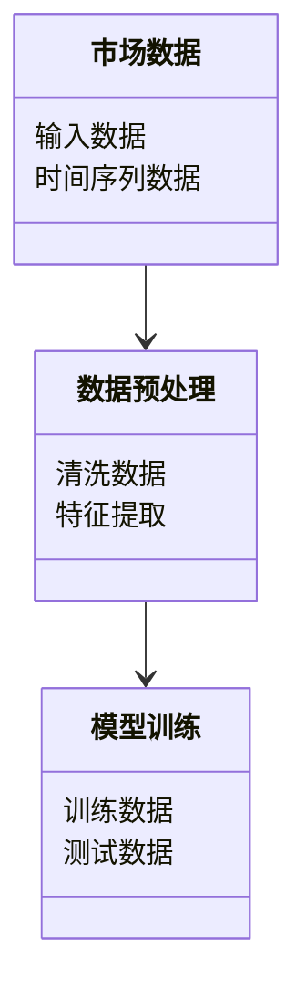
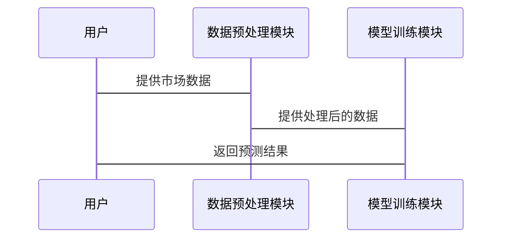

                 


# AI在金融市场微观结构变化预测中的创新应用

---

## 关键词

- AI（人工智能）
- 金融市场
- 微观结构
- 时间序列预测
- 机器学习

---

## 摘要

本文深入探讨了人工智能（AI）在金融市场微观结构变化预测中的创新应用。通过分析金融市场的核心概念、AI技术的基本原理以及两者结合的创新方法，本文详细介绍了如何利用AI技术提升金融市场预测的精度和效率。文章内容涵盖金融市场的微观结构特征、AI算法的核心原理、系统架构设计以及实际项目案例，旨在为读者提供一个全面而系统的视角，帮助其理解AI在金融预测中的潜力和应用前景。

---

# 第1章: 金融市场微观结构概述

## 1.1 金融市场的基本概念

### 1.1.1 金融市场的定义与分类

金融市场是资金供需双方进行交易的场所，按交易标的可分为股票市场、债券市场、外汇市场等。金融市场具有信息不对称、高频交易等特点，这些特点使得AI技术的应用成为可能。

### 1.1.2 微观结构的定义与特点

金融市场微观结构指的是市场参与者的交易行为、信息传递机制以及市场流动性等细节。微观结构的变化通常反映市场参与者的策略调整和市场环境的变化。

### 1.1.3 金融市场微观结构的重要性

微观结构决定了市场的流动性、价格形成机制和交易成本。通过对微观结构的分析，可以更好地理解市场的运行规律，从而制定更有效的投资策略。

---

## 1.2 AI技术的基本概念

### 1.2.1 人工智能的定义与分类

人工智能（AI）是指计算机系统模拟人类智能的能力，包括学习、推理、自我改进等功能。AI可以分为弱人工智能（专注于特定任务）和强人工智能（具备广泛认知能力）。

### 1.2.2 机器学习的基本原理

机器学习是一种通过数据训练模型的技术，模型能够从数据中学习规律并进行预测。常用算法包括线性回归、支持向量机（SVM）、随机森林等。

### 1.2.3 深度学习的核心概念

深度学习是机器学习的一种，通过多层神经网络模拟人类大脑的学习方式。深度学习在处理非结构化数据（如文本、图像）方面表现出色。

---

# 第2章: AI在金融市场中的创新应用

## 2.1 金融市场中的数据特征

### 2.1.1 时间序列数据的特性

金融市场数据通常以时间序列形式呈现，具有趋势性、周期性、随机性等特点。这些特性使得时间序列分析成为预测市场变化的重要方法。

### 2.1.2 市场微观结构数据的复杂性

微观结构数据包括订单簿、成交数据、参与者行为等，这些数据具有高维性和复杂性，需要借助AI技术进行处理和分析。

### 2.1.3 数据的实时性与连续性

金融市场数据的实时性和连续性要求模型具备快速响应和高精度预测的能力。

---

## 2.2 AI在金融市场预测中的优势

### 2.2.1 数据处理能力的提升

AI技术能够处理海量数据，提取有用的特征，帮助预测市场微观结构的变化。

### 2.2.2 模型的自适应性与泛化能力

AI模型能够自动适应市场变化，具备较强的泛化能力，能够在不同市场环境下进行预测。

### 2.2.3 高频交易中的应用潜力

AI技术在高频交易中表现出色，能够快速捕捉市场机会，提高交易效率。

---

# 第3章: AI驱动的金融市场微观结构预测模型

## 3.1 微观结构变化预测的核心要素

### 3.1.1 市场参与者的行为模式

市场参与者的交易策略和行为模式直接影响市场微观结构的变化。通过分析这些行为模式，可以预测市场的未来走势。

### 3.1.2 市场流动性的波动特征

流动性波动是市场微观结构的重要组成部分，通过分析流动性变化，可以预测市场的波动性。

### 3.1.3 市场波动性的预测指标

市场波动性预测指标包括波动率、VaR（在险价值）等，这些指标能够帮助预测市场的风险水平。

---

## 3.2 基于AI的预测模型构建

### 3.2.1 数据预处理与特征提取

#### 数据预处理

数据预处理包括数据清洗、标准化等步骤，确保数据质量。

#### 特征提取

通过特征工程提取有用的特征，如均值、方差、自相关系数等。

### 3.2.2 模型选择与训练

#### 模型选择

根据数据特征选择合适的模型，如ARIMA、LSTM、随机森林等。

#### 模型训练

使用训练数据训练模型，调整模型参数，优化预测精度。

### 3.2.3 模型的评估与优化

通过回测、交叉验证等方法评估模型性能，优化模型参数，提高预测精度。

---

# 第4章: 算法原理与数学模型

## 4.1 时间序列预测算法

### 4.1.1 ARIMA模型的原理与应用

ARIMA（自回归积分滑动平均模型）是一种常用的时间序列预测模型，适用于具有趋势性和周期性的数据。

### 4.1.2 LSTM网络的结构与优势

LSTM（长短期记忆网络）是一种基于RNN的深度学习模型，能够捕捉长期依赖关系，适用于时间序列预测。

### 4.1.3 Prophet模型的实现与特点

Prophet模型是一种基于时间序列分解和回归的预测模型，适用于非平稳数据。

---

## 4.2 机器学习模型的数学基础

### 4.2.1 线性回归模型的公式推导

线性回归模型的预测公式为：$$ y = \beta_0 + \beta_1x + \epsilon $$

### 4.2.2 支持向量机的数学基础

支持向量机通过构建超平面将数据分为两类，优化目标函数：$$ \min \frac{1}{2}\|w\|^2 + C \sum_{i=1}^n \xi_i $$

### 4.2.3 神经网络的前向传播过程

神经网络的前向传播过程包括输入层、隐藏层和输出层，通过激活函数进行非线性变换。

---

# 第5章: 系统架构与项目实现

## 5.1 项目背景与目标

### 5.1.1 项目需求分析

本文旨在利用AI技术预测金融市场微观结构的变化，提高预测精度和效率。

### 5.1.2 项目目标

构建一个基于AI的金融市场微观结构预测系统，实现对市场流动性和价格波动的预测。

---

## 5.2 系统功能设计

### 5.2.1 领域模型



### 5.2.2 系统架构设计


### 5.2.3 系统接口设计

系统接口包括数据输入接口、模型训练接口和预测结果输出接口。

### 5.2.4 系统交互流程



---

## 5.3 项目实战

### 5.3.1 环境安装

需要安装Python、scikit-learn、Keras、TensorFlow等库。

### 5.3.2 系统核心实现

以下是基于LSTM的时间序列预测代码示例：

```python
import numpy as np
from keras.models import Sequential
from keras.layers import LSTM, Dense

# 数据准备
data = np.random.random((1000, 1))
train_data = data[:700]
test_data = data[700:]

# 模型构建
model = Sequential()
model.add(LSTM(64, input_shape=(None, 1)))
model.add(Dense(1))
model.compile(loss='mse', optimizer='adam')

# 模型训练
model.fit(train_data, train_data, epochs=10, batch_size=32)
```

### 5.3.3 代码应用解读与分析

上述代码通过LSTM模型对时间序列数据进行预测，展示了如何利用深度学习技术进行金融市场预测。

---

## 5.4 项目小结

通过实际案例分析，本文展示了如何利用AI技术构建金融市场微观结构预测系统，验证了AI技术在金融预测中的有效性。

---

# 第6章: 总结与展望

## 6.1 总结

本文详细介绍了AI在金融市场微观结构变化预测中的创新应用，探讨了AI技术的优势和局限性，展示了实际项目的实现过程。

## 6.2 未来研究方向

未来的研究可以进一步优化模型，探索多模态数据的应用，提升预测精度和效率。

## 6.3 最佳实践 tips

- 数据预处理是关键，需要仔细清洗和特征提取。
- 模型选择需要根据数据特征和任务需求进行调整。
- 需要结合实际情况进行模型优化和调参。

---

## 作者

作者：AI天才研究院（AI Genius Institute） & 禅与计算机程序设计艺术（Zen And The Art of Computer Programming）

---

通过本文，读者可以全面了解AI在金融市场微观结构预测中的创新应用，掌握相关技术的核心原理和实现方法，为实际应用提供参考和指导。

