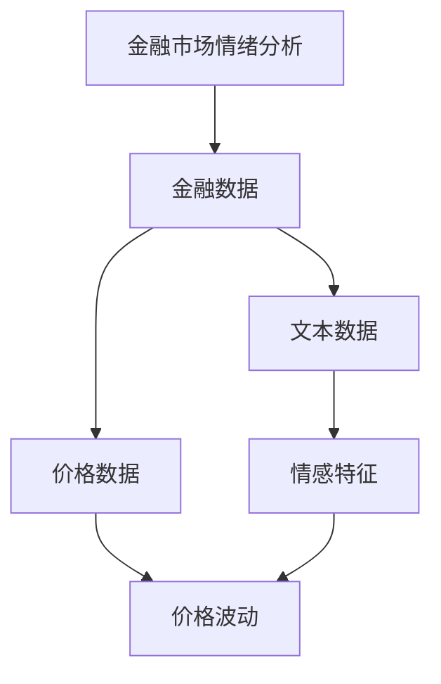
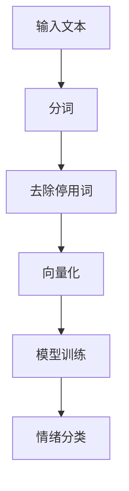
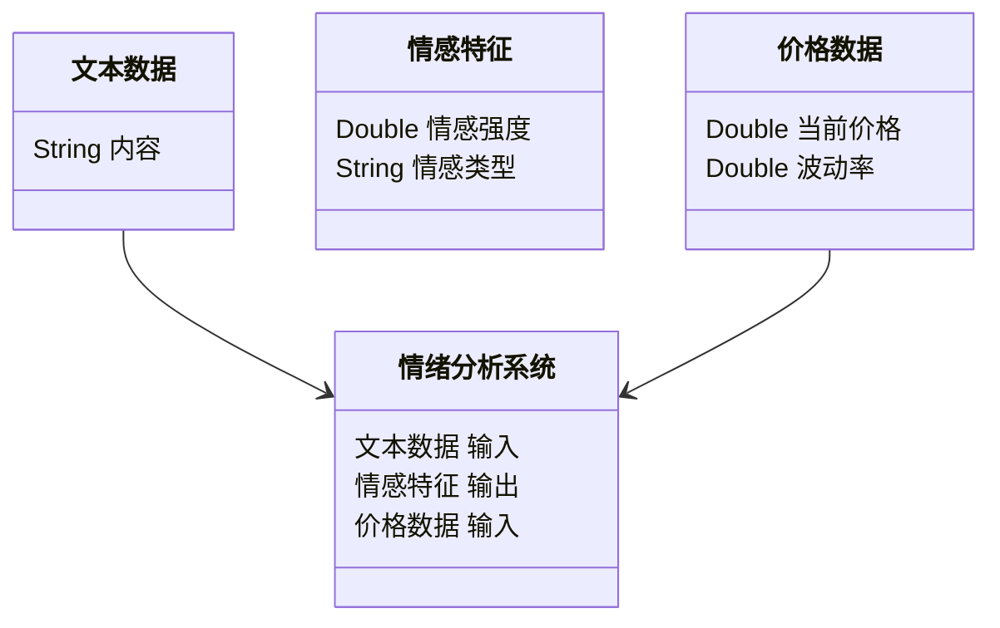
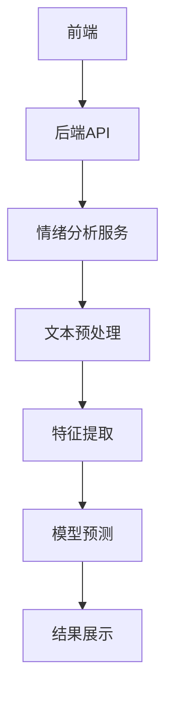
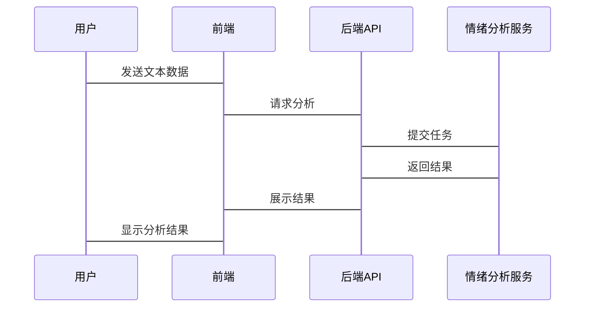

                 


# AI在金融市场情绪分析中的创新应用

> 关键词：AI，金融市场，情绪分析，文本挖掘，NLP，金融决策

> 摘要：本文系统地探讨了人工智能在金融市场情绪分析中的创新应用，从理论基础到实际应用，深入分析了情绪分析的核心概念、算法原理、系统架构以及项目实战。文章通过详细的案例分析和代码实现，展示了AI如何在金融市场中提取情绪信号，辅助投资决策，揭示了情绪分析在金融领域的重要价值和未来发展方向。

---

# 第一部分: AI在金融市场情绪分析中的创新应用概述

---

## 第1章: 金融市场情绪分析的背景与意义

### 1.1 情绪分析的基本概念

- **1.1.1 情感分类的定义与核心要素**
  - 情感分类是对文本数据进行情感倾向分析，判断文本是正面、负面还是中性。
  - 核心要素包括：文本内容、情感倾向、情感强度。

- **1.1.2 情感分析在金融领域的应用背景**
  - 金融市场的参与者包括投资者、交易员、分析师等，他们的行为受到情绪影响。
  - 通过分析新闻、社交媒体、公司财报等文本数据，可以提取市场情绪信号。

- **1.1.3 情感分析对金融决策的重要性**
  - 帮助投资者预测市场走势。
  - 识别市场波动的潜在原因。
  - 提供实时情绪监控，辅助交易决策。

### 1.2 AI在金融市场中的创新应用

- **1.2.1 人工智能在金融领域的应用现状**
  - AI在金融领域的应用包括算法交易、风险评估、客户画像等。
  - 情感分析是AI在金融领域的重要创新点之一。

- **1.2.2 情绪分析在金融交易中的潜力**
  - 通过分析社交媒体情绪，预测市场波动。
  - 结合传统金融指标，构建情绪驱动的交易策略。

- **1.2.3 创新应用的核心问题与挑战**
  - 数据质量：金融文本数据复杂，包含大量噪音。
  - 情感漂移：不同领域的情绪标准不同。
  - 实时性要求：金融市场的实时性要求高。

### 1.3 本章小结

- 本章介绍了情绪分析的基本概念及其在金融领域的应用背景，强调了AI在情绪分析中的创新潜力和核心挑战。

---

## 第2章: 金融市场情绪分析的核心概念与联系

### 2.1 核心概念原理

- **2.1.1 情感分类与文本挖掘的关系**
  - 情感分类是文本挖掘的重要组成部分。
  - 文本挖掘通过提取文本数据中的有用信息，为情感分析提供基础。

- **2.1.2 金融数据与情绪数据的关联性**
  - 金融数据包括价格、成交量等，情绪数据反映市场参与者的心理状态。
  - 情绪数据可以通过统计方法与金融数据结合，预测市场走势。

- **2.1.3 AI模型在情绪识别中的作用**
  - AI模型（如深度学习模型）能够自动提取文本特征，识别情绪信号。
  - 模型的输出可以作为金融决策的参考。

### 2.2 核心概念属性特征对比表格

| 核心概念       | 定义与作用 | 输入 | 输出 |
|----------------|------------|------|------|
| 情感分类       | 判断文本情感倾向 | 文本数据 | 情感标签（正面/负面/中性） |
| 文本挖掘       | 从文本中提取有用信息 | 文本数据 | 结构化数据（关键词、实体） |
| 金融数据       | 反映市场交易情况 | 价格、成交量 | 金融指标（趋势、波动） |
| 情绪数据       | 反映市场参与者的心理状态 | 文本数据 | 情绪指标（情绪强度、情绪类型） |

### 2.3 ER实体关系图架构



### 2.4 本章小结

- 本章通过表格和图示，详细分析了金融市场情绪分析的核心概念及其之间的关系，强调了文本挖掘、情感分类和金融数据之间的相互作用。

---

## 第3章: 基于AI的情绪分析算法原理

### 3.1 核心算法流程

- **3.1.1 文本预处理流程**
  - 分词：将文本分割成词语或短语。
  - 去除停用词：移除常见词汇（如“的”、“是”等）。
  - 去除标点符号：清理文本中的非文字内容。

- **3.1.2 特征提取方法**
  - 词袋模型：将文本转换为词频向量。
  - TF-IDF：计算词语的重要性。
  - 词嵌入：使用预训练的词向量（如Word2Vec）。

- **3.1.3 模型训练与优化**
  - 选择合适的机器学习模型（如SVM、随机森林）。
  - 调整模型参数，优化性能。

### 3.2 算法原理的Mermaid流程图



### 3.3 算法实现的Python代码

- **环境安装**

```bash
pip install numpy pandas scikit-learn
```

- **核心代码实现**

```python
from sklearn.feature_extraction.text import TfidfVectorizer
from sklearn.svm import SVC
from sklearn.pipeline import Pipeline
from sklearn.metrics import accuracy_score

# 示例数据
texts = ["市场表现强劲", "公司业绩不佳"]
labels = [1, 0]

# 创建模型
model = Pipeline([
    ('tfidf', TfidfVectorizer()),
    ('svc', SVC())
])

# 训练模型
model.fit(texts, labels)

# 预测
print(model.predict(texts))
```

### 3.4 本章小结

- 本章详细讲解了基于AI的情绪分析算法原理，从文本预处理到特征提取，再到模型训练，为后续的系统设计奠定了基础。

---

## 第4章: 金融市场情绪分析系统架构设计

### 4.1 问题场景介绍

- 系统目标：构建一个能够实时分析金融市场情绪的系统。
- 使用场景：投资者可以通过系统获取实时情绪数据，辅助投资决策。
- 用户角色：投资者、交易员、金融分析师。

### 4.2 系统功能设计

- **领域模型**



### 4.3 系统架构设计



### 4.4 系统接口设计

- API接口：
  - `GET /analyze?text=...`：接收文本数据，返回情感分析结果。

### 4.5 系统交互设计



### 4.6 本章小结

- 本章详细设计了金融市场情绪分析系统的架构，包括功能模块、系统架构和交互流程，为后续的项目实战提供了系统设计依据。

---

## 第5章: 项目实战——构建金融市场情绪分析系统

### 5.1 环境安装

```bash
pip install numpy pandas scikit-learn requests beautifulsoup4
```

### 5.2 系统核心实现源代码

```python
import requests
from bs4 import BeautifulSoup
from sklearn.feature_extraction.text import TfidfVectorizer
from sklearn.svm import SVC
from sklearn.pipeline import Pipeline

# 数据收集
def fetch_data(url):
    response = requests.get(url)
    soup = BeautifulSoup(response.text, 'html.parser')
    texts = [p.text for p in soup.find_all('p')]
    return texts

# 模型训练
def train_model(texts, labels):
    model = Pipeline([
        ('tfidf', TfidfVectorizer()),
        ('svc', SVC())
    ])
    model.fit(texts, labels)
    return model

# 系统实现
if __name__ == '__main__':
    texts = fetch_data('http://example.com/financial-news')
    labels = [1, 0, 1, 0]
    model = train_model(texts, labels)
    print("模型训练完成！")
```

### 5.3 代码应用解读与分析

- 数据收集：从指定URL获取金融新闻文本。
- 模型训练：使用TF-IDF和SVM构建情感分类模型。
- 系统实现：整合数据收集和模型训练，完成情绪分析系统的核心功能。

### 5.4 实际案例分析

- **案例1**：分析某公司财报新闻的情绪。
- **案例2**：监控社交媒体上的市场情绪。

### 5.5 项目小结

- 本章通过实际案例展示了如何构建金融市场情绪分析系统，详细讲解了代码实现和系统运行流程。

---

## 第6章: 最佳实践与未来展望

### 6.1 最佳实践 tips

- 数据质量是关键：清洗数据，减少噪音。
- 模型调优：根据实际需求调整模型参数。
- 结合多源数据：将情绪数据与其他金融指标结合，提高预测精度。

### 6.2 未来展望

- 深度学习模型的应用：如BERT、GPT等预训练模型。
- 多模态情绪分析：结合图像、语音等多种数据源。
- 实时性优化：提升系统的实时处理能力。

### 6.3 本章小结

- 本章总结了项目的最佳实践，并展望了未来的发展方向，为读者提供了进一步研究的思路。

---

# 作者：AI天才研究院/AI Genius Institute & 禅与计算机程序设计艺术 /Zen And The Art of Computer Programming

---

**本文详细讲解了AI在金融市场情绪分析中的创新应用，从理论到实践，为读者提供了全面的指导和启示。**

