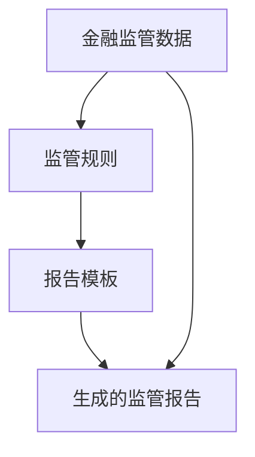
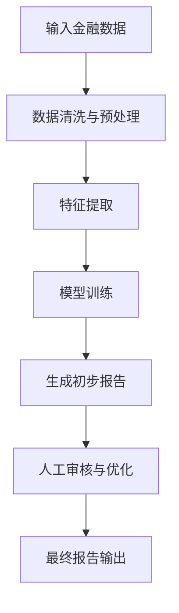
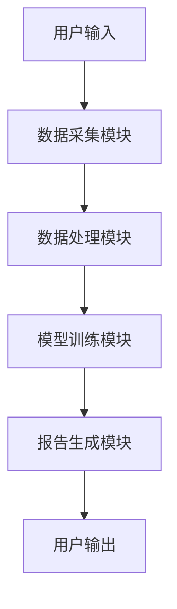
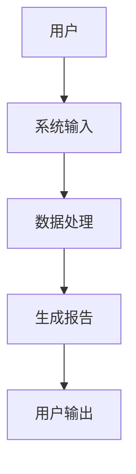

                 


# AI在金融监管报告生成中的应用

> 关键词：AI, 金融监管, 自然语言处理, 机器学习, 生成模型

> 摘要：本文探讨了人工智能技术在金融监管报告生成中的应用，分析了AI技术的核心概念、算法原理和系统架构，并通过实际案例展示了AI在提升金融监管效率和准确性的巨大潜力。

---

## 第一章：AI在金融监管报告生成中的背景与挑战

### 1.1 金融监管报告的背景与重要性

#### 1.1.1 金融监管的基本概念
金融监管是指通过法律、法规和监管机构对金融机构和市场行为进行监督和管理，以维护金融市场的稳定和投资者利益。金融监管报告是监管机构评估金融机构合规性、风险暴露和市场行为的重要工具。

#### 1.1.2 传统金融监管报告的特点与局限性
传统金融监管报告主要依赖人工编写，存在以下问题：
- **效率低**：手工收集、整理和分析数据耗时长，难以应对海量金融数据。
- **准确性差**：人工操作容易出错，且难以覆盖所有潜在风险点。
- **一致性不足**：不同报告的格式和内容可能存在不一致，增加了审核难度。

#### 1.1.3 AI技术在金融监管中的潜在价值
AI技术可以通过自动化数据处理、智能分析和自动生成报告，显著提高金融监管的效率和准确性。AI还能帮助监管机构发现隐藏的模式和风险，提供更深入的洞察。

---

### 1.2 AI技术的基本概念与应用领域

#### 1.2.1 AI技术的定义与核心特征
人工智能（AI）是指通过计算机模拟人类智能的技术，其核心特征包括：
- 数据驱动
- 自动化决策
- 自我学习与优化

#### 1.2.2 AI在金融领域的典型应用
- **风险评估**：利用机器学习模型预测市场风险和信用风险。
- **欺诈检测**：通过异常检测算法识别 fraudulent transactions。
- **智能投顾**：为投资者提供个性化的投资建议。

#### 1.2.3 AI在监管报告生成中的独特优势
- **自动化处理**：AI可以自动从海量数据中提取关键信息，生成初步报告。
- **实时监控**：AI能够实时分析市场动态，及时更新监管报告。
- **一致性与可扩展性**：AI生成的报告格式统一，且能够快速扩展到大规模数据。

---

## 第二章：AI驱动的金融监管报告生成框架

### 2.1 核心概念与原理

#### 2.1.1 自然语言处理（NLP）在报告生成中的作用
NLP技术可以帮助AI理解监管规则和报告模板，生成符合要求的自然语言文本。例如，可以使用预训练的大模型（如GPT）进行文本生成。

#### 2.1.2 机器学习（ML）在数据处理中的应用
ML算法可以对金融数据进行分类、聚类和预测，为报告生成提供支持。

#### 2.1.3 大模型（如GPT）在文本生成中的优势
大模型具有强大的上下文理解和生成能力，能够生成逻辑清晰、语言流畅的监管报告。

---

### 2.2 核心概念的ER实体关系图



---

### 2.3 算法流程图



---

## 第三章：AI驱动的金融监管报告生成算法原理

### 3.1 Transformer模型简介

#### 3.1.1 Transformer的基本结构
Transformer由编码器和解码器组成，其核心是注意力机制。

#### 3.1.2 注意力机制的数学公式
$$
\text{Attention}(Q,K,V) = \text{softmax}\left(\frac{QK^T}{\sqrt{d_k}}\right)V
$$

---

### 3.2 GPT模型的优化与改进

#### 3.2.1 GPT的训练目标函数
$$
\mathcal{L} = -\sum_{i=1}^{n}\log p(w_i|w_{<i})
$$

#### 3.2.2 梯度下降优化算法
$$
\theta = \theta - \eta \nabla_\theta \mathcal{L}
$$

---

### 3.3 实例分析：生成监管报告摘要

#### 3.3.1 数据输入与处理
输入金融数据，包括市场波动、交易记录和公司财务数据。

#### 3.3.2 模型生成过程
模型根据输入数据生成监管报告的初稿，初稿经过人工审核后输出最终报告。

#### 3.3.3 生成结果的评估与优化
评估指标包括准确率、召回率和F1分数，优化方向包括改进模型结构和调整超参数。

---

## 第四章：AI驱动的金融监管报告生成系统架构

### 4.1 系统功能设计

#### 4.1.1 数据采集模块
从金融机构和市场数据源获取数据。

#### 4.1.2 数据处理模块
对数据进行清洗、转换和特征提取。

#### 4.1.3 模型训练与生成模块
训练AI模型并生成初步报告。

#### 4.1.4 报告审核与输出模块
人工审核报告并输出最终结果。

---

### 4.2 系统架构设计



---

### 4.3 接口设计与交互流程

#### 4.3.1 系统接口定义
系统提供API接口，支持JSON格式的数据输入和输出。

#### 4.3.2 用户交互流程图



---

## 第五章：项目实战与案例分析

### 5.1 环境安装

#### 5.1.1 安装Python
```bash
python --version
pip install --upgrade pip
```

#### 5.1.2 安装依赖库
```bash
pip install numpy pandas transformers
```

---

### 5.2 系统核心实现源代码

#### 5.2.1 数据处理代码
```python
import pandas as pd
import numpy as np

def preprocess_data(data):
    # 数据清洗
    data = data.dropna()
    # 特征提取
    features = data[['交易金额', '交易时间', '用户ID']]
    return features
```

#### 5.2.2 模型训练代码
```python
from transformers import GPT2Tokenizer, GPT2Model

tokenizer = GPT2Tokenizer.from_pretrained('gpt2')
model = GPT2Model.from_pretrained('gpt2')
```

---

### 5.3 实际案例分析

#### 5.3.1 案例背景
某金融机构需要生成月度监管报告，涵盖交易数据、市场风险和合规性评估。

#### 5.3.2 数据处理与模型训练
使用上述代码对交易数据进行预处理，并训练生成模型。

#### 5.3.3 生成报告
模型生成初稿，人工审核后输出最终报告。

---

## 第六章：总结与展望

### 6.1 本章总结
AI技术在金融监管报告生成中的应用显著提高了效率和准确性，但仍需解决数据隐私和模型解释性等问题。

### 6.2 未来展望
随着大模型和NLP技术的进步，AI在金融监管中的应用将更加广泛和深入。

---

## 附录：工具与参考文献

### 工具
- **Python**：编程语言
- **Transformers库**：NLP模型库
- **Mermaid**：图表工具

### 参考文献
1. "Deep Learning" by Ian Goodfellow
2. "Attention Is All You Need" by Vaswani et al.
3. "GPT-3: Language Models in AI" by OpenAI

---

## 作者：AI天才研究院/AI Genius Institute & 禅与计算机程序设计艺术 /Zen And The Art of Computer Programming

