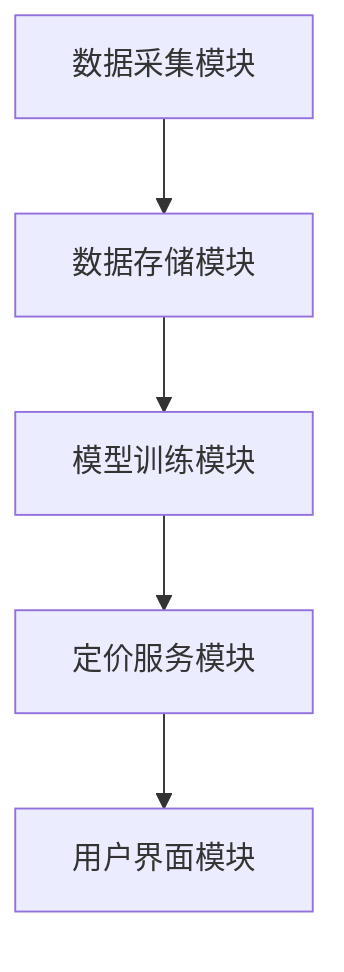
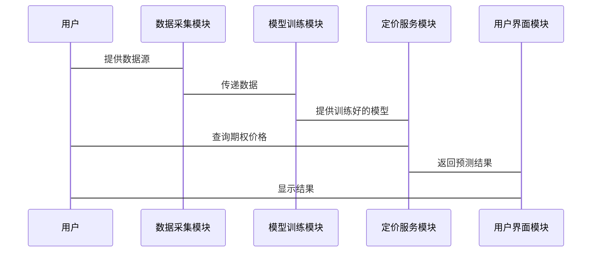

                 


# AI在金融衍生品定价中的深度应用研究

## 关键词：人工智能，金融衍生品，定价模型，深度学习，金融时间序列

## 摘要：  
本文深入探讨了人工智能技术在金融衍生品定价中的应用，从基础的金融衍生品定价原理到复杂的深度学习模型实现，结合实际案例，详细分析了AI在金融衍生品定价中的优势与挑战。文章内容涵盖金融衍生品定价的基本原理、AI技术的核心概念、基于深度学习的定价模型实现、系统架构设计以及实际项目案例分析，旨在为读者提供一个全面且系统的研究框架。

---

## 第1章: 金融衍生品定价基础

### 1.1 金融衍生品的基本概念  
金融衍生品是一种金融合约，其价值来源于基础资产（如股票、债券、商品等）的价格变动。常见的金融衍生品包括期权、期货、掉期和互换等。  

#### 1.1.1 期权的基本定价原理  
以股票期权为例，其定价受到以下几个因素的影响：  
1. 标的资产价格（S）  
2. 行权价（K）  
3. 到期时间（T）  
4. 无风险利率（r）  
5. 波动率（σ）  

Black-Scholes模型是期权定价的经典公式，适用于欧式期权：  
$$ C = S N(d_1) - K e^{-rT} N(d_2) $$  
其中，$d_1 = \frac{\ln(\frac{S}{K}) + (r + \frac{\sigma^2}{2})T}{\sigma \sqrt{T}}$，$d_2 = d_1 - \sigma \sqrt{T}$，$N()$为标准正态分布的累积分布函数。  

#### 1.1.2 金融衍生品的市场现状  
随着金融市场的复杂化，传统定价模型逐渐暴露出以下问题：  
1. 无法处理高维数据（如多资产组合）  
2. 需要大量假设（如波动率恒定）  
3. 难以捕捉非线性关系  

### 1.2 AI技术在金融领域的应用背景  
人工智能技术的快速发展为金融衍生品定价带来了新的可能性，尤其是在以下方面：  
1. **数据处理能力**：AI能够处理海量的非结构化数据（如新闻、社交媒体数据）  
2. **高维建模**：AI算法擅长处理多变量问题，适合金融衍生品的复杂定价需求  
3. **自动特征提取**：深度学习能够自动提取有用的特征，减少人工特征工程的工作量  

### 1.3 本章小结  
本章主要介绍了金融衍生品的基本概念和定价原理，分析了传统定价模型的局限性，并引出了人工智能技术在其中的应用潜力。

---

## 第2章: AI在金融衍生品定价中的核心问题  

### 2.1 金融衍生品定价的基本原理  
#### 2.1.1 常见定价模型概述  
1. **Black-Scholes模型**：适用于欧式期权定价  
2. **蒙特卡洛模拟**：适用于高维问题，但计算成本较高  
3. **波动率模型**：如GARCH模型，用于估计资产价格的波动性  

#### 2.1.2 蒙特卡洛模拟的实现流程  
1. 生成随机数模拟资产价格路径  
2. 计算每条路径下的期权 payoff  
3. 求平均值得到期权的期望价值  

#### 2.1.3 金融衍生品定价的核心要素  
1. 标的资产价格  
2. 波动率  
3. 时间价值  

### 2.2 AI在金融衍生品定价中的优势  
#### 2.2.1 数据处理能力  
AI能够从多源数据中提取有用的信息，如新闻、社交媒体和宏观经济指标。  

#### 2.2.2 高维问题建模  
传统模型在处理多资产组合时面临维数灾难，而深度学习可以有效处理高维数据。  

#### 2.2.3 自动特征提取  
AI能够自动发现隐含的特征，如通过LSTM捕捉时间序列中的模式。  

### 2.3 本章小结  
本章分析了金融衍生品定价的基本原理，并探讨了AI技术在其中的应用优势。

---

## 第3章: AI与金融衍生品定价的结合  

### 3.1 金融衍生品定价中的AI算法  
#### 3.1.1 神经网络在定价中的应用  
神经网络可以用于直接预测期权价格，输入为标的资产价格、波动率等，输出为期权的理论价格。  

#### 3.1.2 支持向量机在定价中的应用  
支持向量机（SVM）可以用于分类问题，例如判断期权是否被低估或高估。  

#### 3.1.3 随机森林在定价中的应用  
随机森林可以用于特征重要性分析，帮助识别影响期权价格的关键因素。  

### 3.2 基于深度学习的金融衍生品定价模型  
#### 3.2.1 深度学习的基本原理  
深度学习通过多层神经网络提取数据的高层次特征，适合处理复杂的非线性关系。  

#### 3.2.2 基于LSTM的金融时间序列预测  
LSTM（长短期记忆网络）适用于时间序列数据，能够捕捉长期依赖关系。  

#### 3.2.3 基于Transformer的金融文本分析  
Transformer模型可以用于分析新闻、报告等文本数据，提取市场情绪对期权价格的影响。  

### 3.3 本章小结  
本章探讨了多种AI算法在金融衍生品定价中的应用，重点分析了深度学习模型的优势。

---

## 第4章: 金融衍生品定价中的AI算法实现  

### 4.1 神经网络模型的构建  
#### 4.1.1 模型输入设计  
输入包括标的资产价格、波动率、时间、行权价等。  

#### 4.1.2 网络结构设计  
使用多层感知机（MLP）或LSTM网络，输出为期权的理论价格。  

#### 4.1.3 损失函数与优化器选择  
损失函数可以选择均方误差（MSE），优化器选择Adam。  

#### 4.1.4 Python代码实现  
```python
import numpy as np
import tensorflow as tf

# 输入数据
X = np.array([...])
y = np.array([...])

# 模型构建
model = tf.keras.Sequential([
    tf.keras.layers.Dense(64, activation='relu'),
    tf.keras.layers.Dense(1, activation='linear')
])

# 编译模型
model.compile(optimizer='adam', loss='mse')

# 训练模型
model.fit(X, y, epochs=100, batch_size=32)
```

### 4.2 基于深度学习的定价模型实现  
#### 4.2.1 数据预处理  
包括归一化、特征选择和数据增强。  

#### 4.2.2 模型训练  
使用训练数据拟合模型，调整超参数（如学习率、批量大小）。  

#### 4.2.3 模型评估  
使用测试数据评估模型的预测能力，计算均方误差（MSE）和R平方值。  

### 4.3 本章小结  
本章详细介绍了神经网络模型在金融衍生品定价中的实现过程，包括数据预处理、模型构建和训练。

---

## 第5章: 金融衍生品定价中的系统架构设计  

### 5.1 系统架构概述  
系统包括数据采集模块、模型训练模块、定价服务模块和用户界面模块。  

#### 5.1.1 系统功能模块划分  
1. 数据采集模块：从多种数据源获取数据  
2. 模型训练模块：训练定价模型  
3. 定价服务模块：提供实时定价服务  
4. 用户界面模块：用户查询和结果展示  

#### 5.1.2 系统架构设计图  


### 5.2 系统接口设计  
#### 5.2.1 数据接口  
1. 数据输入接口：接收标的资产价格、波动率等数据  
2. 数据输出接口：输出预测的期权价格  

#### 5.2.2 模型接口  
1. 模型输入接口：接收输入数据  
2. 模型输出接口：输出预测结果  

#### 5.2.3 用户接口  
1. 用户输入接口：用户输入查询参数  
2. 用户输出接口：显示预测结果  

### 5.3 系统交互流程  


### 5.4 本章小结  
本章详细设计了金融衍生品定价系统的架构，包括功能模块划分、接口设计和交互流程。

---

## 第6章: 项目实战  

### 6.1 环境安装与配置  
#### 6.1.1 安装必要的库  
1. Python 3.6+
2. TensorFlow/PyTorch
3. Pandas、NumPy
4. Matplotlib

#### 6.1.2 数据集获取  
从金融数据供应商（如Yahoo Finance）获取标的资产价格和期权市场数据。  

### 6.2 系统核心实现  
#### 6.2.1 数据预处理  
```python
import pandas as pd
import numpy as np

# 数据加载
data = pd.read_csv('stock_data.csv')

# 数据预处理
data['date'] = pd.to_datetime(data['date'])
data.set_index('date', inplace=True)
```

#### 6.2.2 模型实现  
```python
import tensorflow as tf
from tensorflow.keras import layers

# 模型构建
model = tf.keras.Sequential([
    layers.LSTM(64, input_shape=(None, 1)),
    layers.Dense(1)
])

# 编译模型
model.compile(optimizer='adam', loss='mse')

# 训练模型
model.fit(X_train, y_train, epochs=100, batch_size=32)
```

#### 6.2.3 模型评估  
```python
# 预测结果
y_pred = model.predict(X_test)

# 评估指标
from sklearn.metrics import mean_squared_error, r2_score

mse = mean_squared_error(y_test, y_pred)
r2 = r2_score(y_test, y_pred)
print(f'MSE: {mse}, R^2: {r2}')
```

### 6.3 实际案例分析  
以股票期权为例，利用训练好的模型预测期权的价格，并与市场实际价格进行对比，分析模型的准确性和鲁棒性。  

### 6.4 本章小结  
本章通过实际案例展示了AI技术在金融衍生品定价中的应用，从环境配置到模型实现，再到结果分析，详细描述了整个流程。

---

## 第7章: 总结与展望  

### 7.1 总结  
本文深入探讨了人工智能技术在金融衍生品定价中的应用，从理论到实践，详细分析了AI技术的优势和挑战。通过实际案例，验证了深度学习模型在定价中的有效性。  

### 7.2 未来展望  
1. **多模态数据融合**：结合文本、图像等多种数据源进行定价  
2. **解释性增强**：开发可解释的AI模型，满足金融监管需求  
3. **实时定价系统**：构建低延迟的实时定价服务  

### 7.3 最佳实践Tips  
1. 数据是关键，确保数据质量和完整性  
2. 模型选择要根据实际问题，避免盲目追求复杂性  
3. 注重模型的解释性，满足监管要求  

### 7.4 本章小结  
本文总结了AI在金融衍生品定价中的研究成果，并展望了未来的发展方向。

---

## 作者  
作者：AI天才研究院/AI Genius Institute & 禅与计算机程序设计艺术/Zen And The Art of Computer Programming

