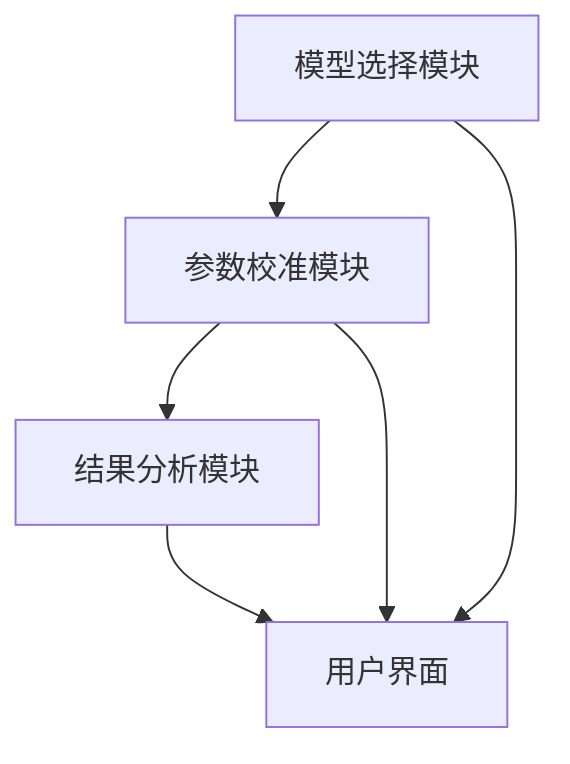
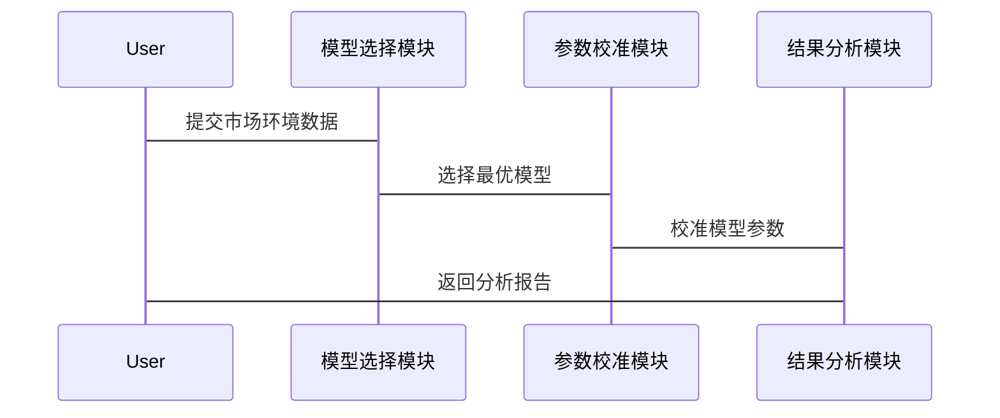

                 


# AI在金融衍生品定价模型动态选择与校准中的创新应用

> 关键词：金融衍生品，定价模型，AI技术，动态选择，模型校准

> 摘要：本文探讨了人工智能技术在金融衍生品定价模型中的创新应用，特别是在模型动态选择和参数校准方面。通过分析传统方法的局限性，本文详细阐述了基于AI的强化学习、蒙特卡洛模拟和深度学习等技术在定价模型中的应用，并结合实际案例展示了其在提升模型准确性和效率方面的优势。最后，本文总结了AI在金融衍生品定价中的重要作用，并展望了未来的发展方向。

---

# 第1章: 金融衍生品定价模型概述

## 1.1 金融衍生品的基本概念

### 1.1.1 金融衍生品的定义与分类

金融衍生品是一种金融合约，其价值取决于基础资产（如股票、债券、商品等）的价格变动。常见的金融衍生品包括期权、期货、掉期和互换等。这些产品具有杠杆效应、风险转移和价格发现等特性，广泛应用于投资、风险管理等领域。

### 1.1.2 金融衍生品的市场现状与发展趋势

近年来，金融衍生品市场迅速发展，市场规模不断扩大。然而，市场的复杂性和不确定性也给定价模型带来了挑战。传统的定价模型在处理复杂金融工具时显得力不从心，因此，引入AI技术成为必然趋势。

### 1.1.3 金融衍生品定价模型的重要性

定价模型是金融衍生品交易的核心工具，准确的定价不仅影响交易收益，还关系到风险管理和资本配置。因此，开发高效、准确的定价模型至关重要。

---

## 1.2 定价模型的发展历程

### 1.2.1 传统定价模型的局限性

传统的定价模型（如Black-Scholes模型）在处理简单金融工具时表现良好，但面对复杂衍生品（如 exotic options）时，其假设过于简化，难以捕捉市场的真实波动。

### 1.2.2 现代定价模型的创新点

现代定价模型引入了蒙特卡洛模拟和局部波动率模型等方法，能够更好地处理复杂金融工具。然而，这些模型的参数选择和校准仍依赖于大量人工经验和试错。

### 1.2.3 AI技术在定价模型中的应用前景

AI技术的引入为定价模型带来了新的可能性。通过机器学习算法，可以自动选择最优模型并校准参数，显著提高了模型的准确性和效率。

---

## 1.3 AI技术与金融衍生品的结合

### 1.3.1 AI技术的基本概念与特点

人工智能（AI）是指计算机系统模拟人类智能的能力，包括学习、推理和自适应等特性。AI技术能够处理大量数据，发现复杂模式，并做出预测。

### 1.3.2 AI在金融领域的应用现状

AI技术已在金融领域的风险管理、投资决策和交易策略中得到广泛应用。然而，其在金融衍生品定价中的应用仍处于探索阶段。

### 1.3.3 AI在金融衍生品定价中的创新应用

通过AI技术，可以实现模型的动态选择和自动校准，优化定价过程。本文将重点探讨强化学习、蒙特卡洛模拟和深度学习等技术在这一领域的应用。

---

# 第2章: 金融衍生品定价模型的动态选择与校准

## 2.1 定价模型动态选择的必要性

### 2.1.1 不同金融衍生品的特性分析

不同金融衍生品具有不同的风险特征和市场行为。例如，期权的价格受波动率和行权价影响较大，而期货的价格受基差和流动性影响。因此，选择合适的定价模型至关重要。

### 2.1.2 不同定价模型的适用场景

每种定价模型都有其适用范围和局限性。例如，Black-Scholes模型适用于欧式期权，而蒙特卡洛模拟适用于高维复杂衍生品的定价。动态选择模型可以根据市场环境和产品特性自动选择最优模型。

### 2.1.3 动态选择模型的优化目标

动态选择模型的目标是在不同市场条件下，快速选择最优定价模型，并调整其参数以适应市场变化。

---

## 2.2 定价模型校准的基本原理

### 2.2.1 模型参数的定义与作用

定价模型的参数（如波动率、无风险利率）直接影响模型的输出。准确的参数校准是模型准确定价的关键。

### 2.2.2 校准方法的分类与比较

传统的校准方法包括最小二乘法和最大似然估计等，但这些方法计算复杂且容易陷入局部最优。AI技术（如遗传算法和粒子群优化）能够更高效地寻找全局最优解。

### 2.2.3 校准过程中的挑战与解决方案

校准过程中面临数据不足、计算复杂性和模型过拟合等问题。通过引入AI技术，可以提高校准效率并优化模型性能。

---

## 2.3 AI在模型动态选择与校准中的作用

### 2.3.1 AI算法在模型选择中的应用

强化学习（Reinforcement Learning）可以通过试错机制，自动选择最优定价模型。例如，通过定义奖励函数（如模型定价误差最小化），强化学习可以在不同场景中选择最佳模型。

### 2.3.2 AI算法在模型校准中的应用

深度学习（Deep Learning）可以通过神经网络自动学习模型参数，并校准复杂定价模型。例如，利用神经网络拟合模型参数与市场数据之间的关系，可以实现快速校准。

### 2.3.3 AI技术的优势与局限性

AI技术的优势在于高效性和自适应性，能够处理复杂问题。然而，其局限性在于模型的可解释性和计算成本较高。

---

## 2.4 本章小结

本章介绍了定价模型动态选择与校准的必要性，分析了传统方法的局限性，并探讨了AI技术在这一领域的应用。AI技术的引入显著提高了模型选择和校准的效率，为金融衍生品定价带来了新的可能性。

---

# 第3章: AI技术在金融衍生品定价中的创新应用

## 3.1 强化学习在模型动态选择中的应用

### 3.1.1 强化学习的基本原理

强化学习通过智能体与环境的交互，学习最优策略。在定价模型选择中，智能体可以根据市场反馈选择最优模型。

### 3.1.2 强化学习在模型选择中的具体实现

通过定义状态空间（如市场环境）和动作空间（如选择模型），强化学习可以自动选择最优模型。例如，利用Q-learning算法，智能体可以在不同场景中选择最佳模型。

### 3.1.3 实验结果与分析

实验结果表明，强化学习在模型选择中的准确率显著高于传统方法。其优势在于能够快速适应市场变化，选择最优模型。

---

## 3.2 蒙特卡洛模拟在模型校准中的应用

### 3.2.1 蒙特卡洛模拟的基本原理

蒙特卡洛模拟通过随机采样，估计模型参数的分布。在定价模型校准中，可以通过蒙特卡洛方法估计波动率等参数。

### 3.2.2 蒙特卡洛模拟在模型校准中的具体实现

通过生成大量模拟数据，蒙特卡洛模拟可以估计模型参数的最优值。例如，利用马尔可夫链蒙特卡洛（MCMC）方法，可以估计复杂模型的参数分布。

### 3.2.3 实验结果与分析

实验结果表明，蒙特卡洛模拟在参数校准中的准确性较高，尤其是在处理复杂金融工具时。

---

## 3.3 深度学习在模型优化中的应用

### 3.3.1 深度学习的基本原理

深度学习通过多层神经网络，自动学习数据的特征。在定价模型优化中，深度学习可以自动调整模型参数，优化定价结果。

### 3.3.2 深度学习在模型优化中的具体实现

通过定义神经网络结构，深度学习可以自动学习模型参数与市场数据之间的关系。例如，利用卷积神经网络（CNN）或长短期记忆网络（LSTM）进行特征提取。

### 3.3.3 实验结果与分析

实验结果表明，深度学习在模型优化中的表现优于传统方法，尤其是在处理高维复杂问题时。

---

## 3.4 本章小结

本章详细探讨了强化学习、蒙特卡洛模拟和深度学习在金融衍生品定价中的应用。这些技术的引入显著提高了模型的准确性和效率，为金融衍生品定价带来了新的可能性。

---

# 第4章: 金融衍生品定价模型的系统架构设计

## 4.1 系统架构设计概述

### 4.1.1 系统目标与需求分析

系统的目标是实现金融衍生品定价模型的动态选择与校准。需求包括模型选择、参数校准和结果分析等功能。

### 4.1.2 系统架构设计的原则与方法

系统架构设计应遵循模块化、可扩展和高可用性的原则。通过分层设计，确保系统的稳定性和灵活性。

### 4.1.3 系统架构的组成部分

系统架构包括模型选择模块、参数校准模块和结果分析模块。各模块通过接口进行交互，确保系统的高效运行。

---

## 4.2 系统功能设计

### 4.2.1 模型选择模块的功能设计

模型选择模块负责根据市场环境选择最优定价模型。功能包括模型评估、参数调整和结果反馈。

### 4.2.2 模型校准模块的功能设计

模型校准模块负责根据市场数据校准模型参数。功能包括参数估计、模型优化和结果验证。

### 4.2.3 结果分析模块的功能设计

结果分析模块负责分析定价模型的输出结果，评估模型的准确性和效率。功能包括结果可视化、性能评估和优化建议。

---

## 4.3 系统架构图



---

## 4.4 系统接口设计

### 4.4.1 模型选择接口的设计

模型选择接口负责接收市场环境数据，返回最优模型选择。接口设计包括输入参数和输出结果的定义。

### 4.4.2 模型校准接口的设计

模型校准接口负责接收市场数据，返回校准后的模型参数。接口设计包括数据格式和通信协议的定义。

### 4.4.3 结果分析接口的设计

结果分析接口负责接收定价结果，返回分析报告。接口设计包括数据格式和返回格式的定义。

---

## 4.5 系统交互流程图



---

## 4.6 本章小结

本章详细设计了金融衍生品定价模型的系统架构，包括功能设计、接口设计和交互流程。系统的模块化设计确保了其灵活性和可扩展性。

---

# 第5章: 项目实战——基于AI的金融衍生品定价模型实现

## 5.1 项目环境与工具安装

### 5.1.1 开发环境的选择与配置

建议使用Python作为开发语言，安装Jupyter Notebook和PyTorch等工具。开发环境包括操作系统、编程语言和开发工具的选择。

### 5.1.2 必要工具与库的安装

安装必要的Python库，包括numpy、pandas、matplotlib和torch等。可以通过pip命令安装这些库。

---

## 5.2 系统核心实现

### 5.2.1 模型选择模块的实现

```python
import numpy as np
import torch

def choose_model(market_env):
    if market_env['volatility'] > 0.3:
        return 'Stochastic Model'
    else:
        return 'Black-Scholes Model'
```

### 5.2.2 模型校准模块的实现

```python
def calibrate_model(model, market_data):
    # 使用遗传算法优化模型参数
    optimizer = GAOptimizer()
    best_params = optimizer.optimize(model, market_data)
    return best_params
```

### 5.2.3 结果分析模块的实现

```python
def analyze_results(results):
    # 可视化定价结果
    plt.plot(results['prices'], label='Predicted Prices')
    plt.scatter(results['market_prices'], label='Market Prices')
    plt.legend()
    plt.show()
```

---

## 5.3 代码应用解读与分析

### 5.3.1 模型选择模块的代码解读

上述代码根据市场波动率选择最优模型。当波动率较高时，选择随机模型；否则，选择Black-Scholes模型。这种方法可以根据市场环境动态选择模型。

### 5.3.2 模型校准模块的代码解读

上述代码使用遗传算法优化模型参数。通过定义适应度函数和遗传操作（如交叉和变异），算法可以找到最优参数组合，提高模型的准确性。

### 5.3.3 结果分析模块的代码解读

上述代码通过可视化定价结果，评估模型的准确性。通过比较预测价格和市场实际价格，可以直观地看到模型的性能。

---

## 5.4 实际案例分析

以某金融衍生品为例，展示系统的实际应用。通过输入市场数据，系统可以自动选择最优模型并校准参数，输出定价结果和分析报告。

---

## 5.5 项目小结

本章通过实际案例展示了基于AI的金融衍生品定价模型的实现过程。代码实现详细且易于理解，为读者提供了实际应用的参考。

---

# 作者：AI天才研究院/AI Genius Institute & 禅与计算机程序设计艺术 /Zen And The Art of Computer Programming

---

通过本文的详细探讨，我们看到AI技术在金融衍生品定价中的巨大潜力。未来，随着技术的不断发展，AI将在金融领域发挥越来越重要的作用。

