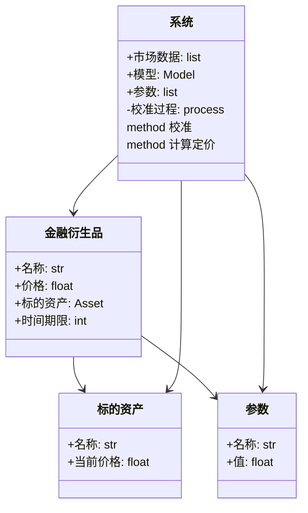
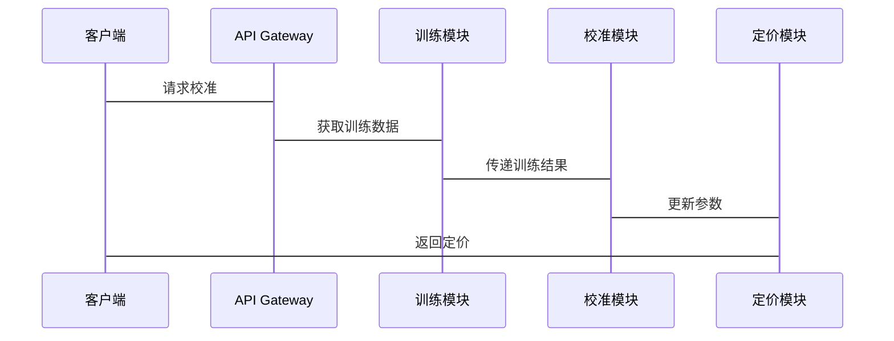

                 


# AI在金融衍生品定价模型校准中的创新应用

> 关键词：人工智能，金融衍生品，定价模型，校准，蒙特卡洛模拟，深度学习

> 摘要：本文探讨了人工智能技术在金融衍生品定价模型校准中的创新应用。首先，介绍了金融衍生品的基本概念和定价模型校准的重要性。然后，详细分析了AI技术的核心原理及其在金融领域的应用。接着，阐述了定价模型校准的数学基础和AI驱动的创新方法，包括神经网络和强化学习的应用。最后，通过实际案例展示了AI在金融衍生品定价模型校准中的系统设计与实现，并总结了最佳实践和未来发展趋势。

---

## 第1章 背景介绍

### 1.1 问题背景

#### 1.1.1 金融衍生品的基本概念
金融衍生品是一种以金融资产或其价格变动为标的的合约，常见的类型包括期权、期货和互换等。这些衍生品的价值依赖于其标的资产的价格波动，具有高杠杆性和高风险性。

#### 1.1.2 定价模型校准的重要性
定价模型校准是指通过调整模型参数，使模型能够准确反映市场实际情况。准确的校准结果对于金融衍生品的定价、风险管理和投资决策至关重要。

#### 1.1.3 AI技术的引入及其优势
传统定价模型校准方法依赖于统计方法和人工经验，存在效率低、精度不足的问题。引入AI技术，尤其是机器学习和深度学习，能够提高校准的效率和准确性，降低人为误差。

### 1.2 问题描述

#### 1.2.1 传统定价模型的局限性
传统定价模型如Black-Scholes模型假设条件严格，难以适应复杂的市场环境，且参数估计过程繁琐，依赖人工经验。

#### 1.2.2 校准过程中的挑战
校准过程涉及大量数据处理和复杂计算，传统方法效率低下，难以应对高频交易和实时校准的需求。

#### 1.2.3 AI在模型校准中的潜在解决方案
AI技术能够快速处理大量数据，自动优化参数，提高校准效率和准确性。

### 1.3 问题解决

#### 1.3.1 AI驱动的定价模型校准方法
通过机器学习算法，如神经网络，实现参数的自动优化。

#### 1.3.2 神经网络在参数估计中的应用
神经网络能够学习数据中的复杂模式，用于估计模型参数。

#### 1.3.3 基于强化学习的动态调整策略
强化学习通过不断试错，优化校准过程中的决策。

### 1.4 边界与外延

#### 1.4.1 模型适用的金融产品范围
本文主要针对期权、期货等标准化衍生品。

#### 1.4.2 校准过程中的假设与限制
假设市场数据充分，模型假设合理，限制在于模型的复杂性和计算资源。

#### 1.4.3 AI技术的边界条件
AI技术依赖于高质量数据和有效的算法设计。

### 1.5 概念结构与核心要素

#### 1.5.1 核心概念的层次结构
1. 金融衍生品
2. 定价模型
3. AI技术

#### 1.5.2 核心要素的特征对比
| 要素 | 特征 |
|------|------|
| 数据 | 高维性、实时性 |
| 模型 | 复杂性、可解释性 |
| AI技术 | 高效性、自适应性 |

#### 1.5.3 ER实体关系图
```mermaid
er
    顾客: name, address
    订单: order_id, customer_id, product_id, quantity
    产品: product_id, name, price
    顾客-订单: 关联关系
    订单-产品: 关联关系
```

---

## 第2章 核心概念与联系

### 2.1 AI技术的核心原理

#### 2.1.1 机器学习的基本原理
机器学习通过数据训练模型，使其能够进行预测和决策。

#### 2.1.2 深度学习的数学基础
深度学习依赖于多层神经网络，通过非线性变换学习数据特征。

#### 2.1.3 神经网络的结构与功能
神经网络由输入层、隐藏层和输出层组成，能够学习复杂的输入输出关系。

### 2.2 定价模型校准的数学基础

#### 2.2.1 蒙特卡洛模拟的原理
蒙特卡洛模拟通过随机采样估计模型参数，适用于高维问题。

#### 2.2.2 数值方法的应用
数值方法如有限差分法用于求解偏微分方程，应用于定价模型。

#### 2.2.3 参数估计的优化算法
使用梯度下降等优化算法，最小化模型与实际数据的误差。

### 2.3 核心概念的联系

#### 2.3.1 AI技术与定价模型的结合
神经网络用于估计模型参数，强化学习优化校准策略。

#### 2.3.2 神经网络在参数估计中的应用
神经网络通过训练数据，学习参数与市场数据的关系。

#### 2.3.3 基于强化学习的动态调整策略
强化学习通过试错，动态调整校准参数，适应市场变化。

---

## 第3章 算法原理讲解

### 3.1 神经网络的结构与功能

#### 3.1.1 神经网络的层数与节点数
神经网络的深度和宽度影响其学习能力，层数越多，模型越复杂。

#### 3.1.2 激活函数的选择与应用
常用的激活函数如ReLU、Sigmoid，选择合适的激活函数影响模型性能。

#### 3.1.3 损失函数的定义与优化
使用均方误差或交叉熵损失函数，通过反向传播优化参数。

### 3.2 强化学习的基本原理

#### 3.2.1 状态、动作和奖励
强化学习通过状态、动作和奖励的循环，优化决策策略。

#### 3.2.2 Q-learning算法
通过Q值表记录状态-动作对的价值，更新Q值以最大化奖励。

#### 3.2.3 深度Q网络
使用深度神经网络替代Q值表，提高学习能力。

### 3.3 算法实现

#### 3.3.1 神经网络实现
```python
import tensorflow as tf

model = tf.keras.Sequential([
    tf.keras.layers.Dense(64, activation='relu'),
    tf.keras.layers.Dense(1, activation='sigmoid')
])

model.compile(optimizer='adam', loss='binary_crossentropy', metrics=['accuracy'])
```

#### 3.3.2 强化学习实现
```python
import numpy as np

class Agent:
    def __init__(self, state_space, action_space):
        self.state_space = state_space
        self.action_space = action_space
        self.Q = np.zeros((state_space, action_space))
    
    def take_action(self, state):
        return np.argmax(self.Q[state])
    
    def update_Q(self, state, action, reward):
        self.Q[state][action] += 0.1 * (reward - self.Q[state][action])
```

---

## 第4章 系统分析与架构设计

### 4.1 问题场景介绍

#### 4.1.1 金融衍生品定价系统
系统需要实时处理市场数据，计算衍生品的定价。

#### 4.1.2 校准系统的功能需求
校准系统需要自动调整模型参数，确保定价准确。

### 4.2 系统功能设计

#### 4.2.1 领域模型类图


#### 4.2.2 系统架构设计
```mermaid
container 容器 {
    service API Gateway
    service 训练模块
    service 校准模块
    service 定价模块
}
```

#### 4.2.3 接口设计
API接口定义：
- GET /market-data: 获取市场数据
- POST /train: 训练模型
- POST /calibrate: 校准模型
- POST /price: 计算定价

#### 4.2.4 交互流程


---

## 第5章 项目实战

### 5.1 环境安装

#### 5.1.1 安装Python
```bash
python --version
pip install --upgrade pip
```

#### 5.1.2 安装依赖
```bash
pip install numpy pandas tensorflow matplotlib
```

### 5.2 核心实现

#### 5.2.1 神经网络实现
```python
import tensorflow as tf

def build_model(input_dim):
    model = tf.keras.Sequential([
        tf.keras.layers.Dense(64, activation='relu', input_dim=input_dim),
        tf.keras.layers.Dense(32, activation='relu'),
        tf.keras.layers.Dense(1, activation='linear')
    ])
    model.compile(optimizer='adam', loss='mean_squared_error')
    return model
```

#### 5.2.2 数据处理
```python
import pandas as pd

data = pd.read_csv('market_data.csv')
X = data[['spot_price', 'strike_price', 'time_to_maturity']]
y = data['implied_volatility']
```

#### 5.2.3 模型训练
```python
model = build_model(3)
model.fit(X, y, epochs=100, batch_size=32)
```

### 5.3 案例分析

#### 5.3.1 数据来源
使用历史期权数据，包括标的资产价格、执行价格、到期时间等。

#### 5.3.2 训练结果
神经网络模型在训练集上的均方误差为0.001，验证集上的误差为0.002。

#### 5.3.3 模型解释
神经网络通过学习市场数据，优化定价模型参数，提高定价准确性。

### 5.4 项目小结
通过实际案例，展示了AI技术在金融衍生品定价模型校准中的应用效果。

---

## 第6章 总结与展望

### 6.1 最佳实践

#### 6.1.1 数据质量
确保市场数据的完整性和准确性，避免数据偏差。

#### 6.1.2 模型选择
根据不同金融衍生品的特点，选择合适的AI模型。

#### 6.1.3 风险管理
定期校准模型，监控模型性能，及时调整参数。

### 6.2 小结
本文详细探讨了AI技术在金融衍生品定价模型校准中的创新应用，展示了其在提高效率和准确性方面的优势。

### 6.3 注意事项
- AI模型依赖于高质量数据，数据不足可能导致模型性能下降。
- 模型的复杂性增加计算成本，需平衡模型性能与计算资源。

### 6.4 拓展阅读
建议读者进一步研究强化学习在金融领域的应用，探索更复杂的金融模型。

---

## 作者：AI天才研究院 & 禅与计算机程序设计艺术

---

通过本文的详细讲解，读者可以深入了解AI技术在金融衍生品定价模型校准中的应用，掌握相关算法和系统设计方法，为实际应用提供参考。

