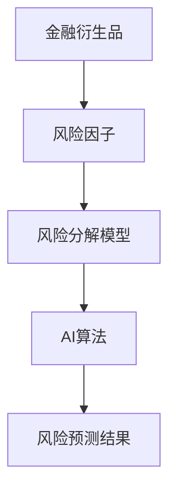
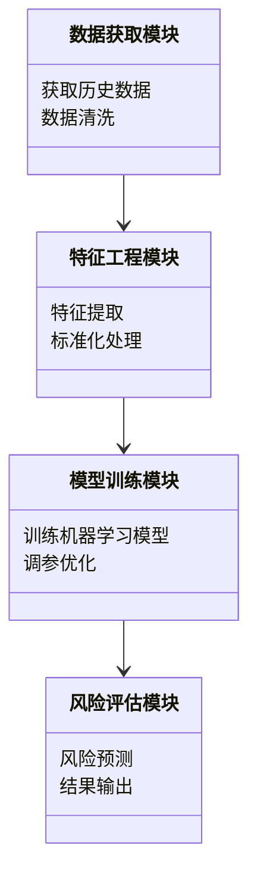
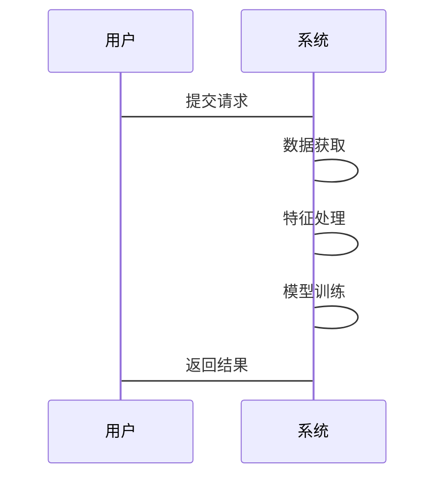

                 


# AI在金融衍生品组合风险分解中的创新应用

> **关键词**: AI, 金融衍生品, 风险分解, 机器学习, 金融数学模型

> **摘要**: 本文探讨了人工智能在金融衍生品组合风险分解中的创新应用，通过分析传统方法的局限性，介绍机器学习算法如线性回归、支持向量机、随机森林和神经网络的应用，详细讲解算法原理、系统架构设计，并通过项目实战展示具体实现，最后总结最佳实践和未来趋势。

---

# 第一部分: AI与金融衍生品组合风险分解的背景与基础

# 第1章: 背景介绍

## 1.1 核心概念

### 1.1.1 问题背景

#### 1.1.1.1 金融衍生品的基本概念

金融衍生品是一种金融合约，其价值依赖于基础资产的价格变动。常见的衍生品包括期权、期货、掉期和互换。

#### 1.1.1.2 组合风险分解的必要性

金融衍生品的组合风险分解是理解其市场风险的关键，帮助投资者评估和管理投资组合的潜在损失。

### 1.1.2 问题描述

#### 1.1.2.1 金融衍生品组合风险的复杂性

组合风险涉及多个资产的价格波动，导致复杂的风险因素相互作用。

#### 1.1.2.2 风险分解的目标与意义

目标是将组合风险分解为单个资产的风险贡献，便于管理和优化。

### 1.1.3 问题解决

#### 1.1.3.1 传统方法的局限性

传统方法如方差-协方差矩阵难以捕捉非线性关系和复杂交互。

#### 1.1.3.2 创新应用的思路

利用AI算法处理复杂数据，捕捉非线性关系，提高风险预测的准确性。

### 1.1.4 边界与外延

#### 1.1.4.1 金融衍生品的范围界定

包括期权、期货等标准化产品，但不包括场外衍生品。

#### 1.1.4.2 风险分解的适用场景

适用于投资组合风险评估和管理，特别是在高维复杂资产的情况下。

### 1.1.5 概念结构与核心要素

#### 1.1.5.1 金融衍生品的基本属性

- 标的资产
- 合约期限
- 行权价格
- 条款类型

#### 1.1.5.2 风险分解的关键要素

- 风险因子
- 风险敏感度
- 价格波动性

---

# 第2章: AI与金融衍生品组合风险分解的核心概念与联系

## 2.1 核心概念原理

### 2.1.1 金融衍生品的数学模型

衍生品的价格由数学模型如Black-Scholes模型决定。

### 2.1.2 AI在风险分解中的作用

AI通过机器学习算法分析历史数据，预测价格波动和风险因素。

## 2.2 概念属性特征对比

### 表2-1: 传统方法与AI方法在风险分解中的属性对比

| 属性 | 传统方法 | AI方法 |
|------|----------|--------|
| 效率 | 低       | 高     |
| 准确性 | 中等     | 高     |
| 复杂性 | 高       | 中等   |

## 2.3 ER实体关系图



---

# 第3章: AI在金融衍生品组合风险分解中的算法原理

## 3.1 算法原理讲解

### 3.1.1 线性回归模型

线性回归用于预测资产价格变化，公式为：

$$ y = \beta_0 + \beta_1x + \epsilon $$

### 3.1.2 支持向量机

支持向量机通过寻找超平面分割数据，用于分类和回归任务。

### 3.1.3 随机森林

随机森林通过集成树模型提高预测准确性，适用于特征重要性分析。

### 3.1.4 神经网络

神经网络处理非线性关系，适用于复杂风险预测。

---

## 3.2 算法实现与优化

### 3.2.1 特征工程

特征选择和处理是关键步骤，包括标准化、去噪和降维。

### 3.2.2 模型调优

通过网格搜索和交叉验证优化模型参数，如学习率和正则化系数。

### 3.2.3 模型评估

使用均方误差（MSE）、R²和AUC等指标评估模型性能。

---

# 第4章: 系统分析与架构设计方案

## 4.1 问题场景介绍

## 4.2 项目介绍

## 4.3 系统功能设计

### 图4-1 系统功能类图



## 4.4 系统架构设计

### 图4-2 系统架构图


## 4.5 接口设计

## 4.6 交互流程

### 图4-3 交互流程图



---

# 第5章: 项目实战

## 5.1 环境安装

安装Python、机器学习库如scikit-learn、pandas和numpy。

## 5.2 核心代码实现

### 5.2.1 数据获取与预处理

```python
import pandas as pd
import numpy as np
from sklearn.model_selection import train_test_split
from sklearn.linear_model import LinearRegression
from sklearn.metrics import mean_squared_error

# 示例数据
data = pd.DataFrame({
    '资产A': np.random.randn(100) * 10 + 50,
    '资产B': np.random.randn(100) * 15 + 70,
    '风险因子': np.random.randn(100) * 5 + 20,
    '标签': np.random.randint(0, 2, 100)
})

# 数据分割
X = data[['资产A', '资产B', '风险因子']]
y = data['标签']
X_train, X_test, y_train, y_test = train_test_split(X, y, test_size=0.2)
```

### 5.2.2 模型训练与评估

```python
# 训练模型
model = LinearRegression()
model.fit(X_train, y_train)

# 预测与评估
y_pred = model.predict(X_test)
mse = mean_squared_error(y_test, y_pred)
print(f"均方误差: {mse}")
print(f"决定系数 R²: {model.score(X_test, y_test)}")
```

## 5.3 应用解读与分析

### 5.3.1 数据分析结果

### 5.3.2 风险分解结果

### 5.3.3 模型优化建议

## 5.4 项目小结

---

# 第6章: 最佳实践与总结

## 6.1 最佳实践

### 6.1.1 数据质量的重要性

### 6.1.2 模型选择的策略

### 6.1.3 系统设计的注意事项

## 6.2 小结

## 6.3 注意事项

## 6.4 未来展望

## 6.5 拓展阅读

---

# 作者

作者：AI天才研究院/AI Genius Institute & 禅与计算机程序设计艺术 /Zen And The Art of Computer Programming

---

通过以上目录大纲，您可以逐步深入理解AI在金融衍生品组合风险分解中的创新应用，从基础概念到算法实现，再到系统设计和项目实战，全面掌握这一领域的最新进展和技术细节。

