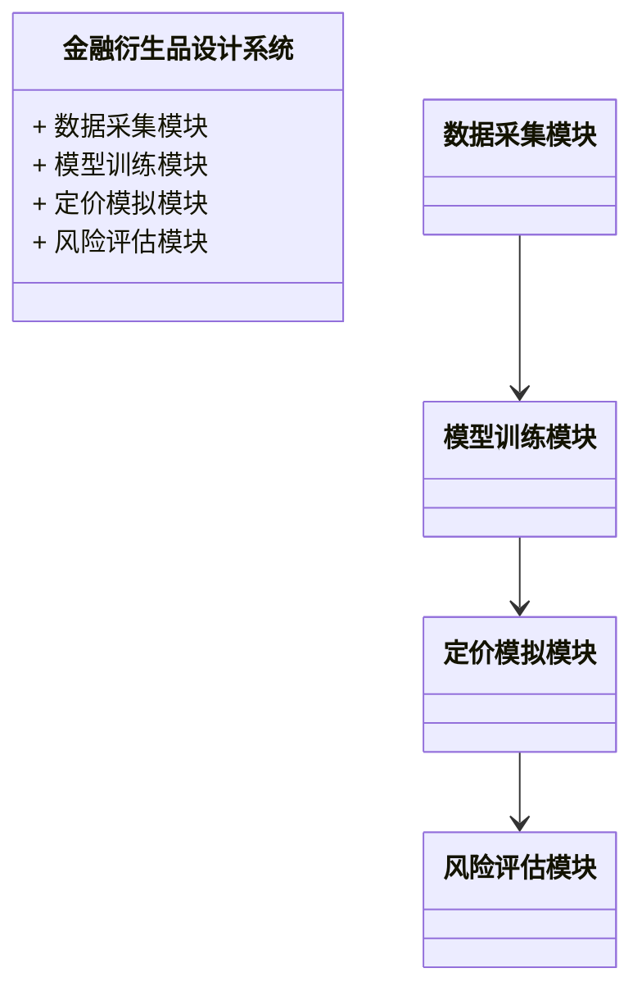

                 


# AI在金融衍生品设计中的创新应用

**关键词**：人工智能，金融衍生品，生成对抗网络，强化学习，迁移学习，系统架构设计，风险评估

**摘要**：随着人工智能技术的迅速发展，AI在金融领域的应用越来越广泛。本文探讨了AI技术在金融衍生品设计中的创新应用，分析了生成对抗网络、强化学习和迁移学习在金融衍生品定价、风险评估和交易策略优化中的作用。同时，本文详细讲解了AI驱动的金融衍生品设计系统架构，并通过实际案例分析，展示了AI在金融衍生品设计中的潜力和优势。

---

## 第一部分：AI在金融衍生品设计中的背景与核心概念

### 第1章：金融衍生品与AI的背景介绍

#### 1.1 金融衍生品的基本概念
金融衍生品是一种以基础金融资产（如股票、债券、货币等）为标的物的合约，其价值来源于基础资产的价格波动。常见的金融衍生品包括期货、期权、互换和掉期等。

- **期货**：双方约定在未来某一特定时间以预定价格购买或出售某种资产的合约。
- **期权**：买方有权在特定时间内以预定价格购买或出售资产，卖方则承担相应的义务。
- **互换**：双方约定在未来某一时间交换现金流的合约。

#### 1.2 AI技术的基本概念
人工智能（AI）是模拟人类智能的计算机系统，主要涵盖机器学习、自然语言处理、计算机视觉等领域。深度学习作为机器学习的一种，通过多层神经网络模拟人类大脑的处理方式，广泛应用于金融领域的数据分析和预测。

#### 1.3 AI在金融衍生品设计中的背景与问题背景
传统金融衍生品设计依赖于复杂的数学模型和人类经验，存在以下痛点：
- **定价模型的局限性**：传统模型难以捕捉复杂市场环境中的非线性关系。
- **风险评估的不准确性**：市场波动和不确定性增加了风险预测的难度。
- **交易策略的优化问题**：传统策略优化需要大量试错，效率低下。

AI技术的应用为解决这些问题提供了新的思路：
- 利用深度学习模型捕捉复杂市场关系。
- 通过强化学习优化交易策略。
- 利用生成对抗网络（GAN）生成多样化的金融场景。

---

### 第2章：AI在金融衍生品设计中的核心概念与联系

#### 2.1 AI与金融衍生品设计的核心概念原理
AI在金融衍生品设计中的应用主要体现在以下几个方面：
- **数据驱动的金融衍生品设计**：利用历史数据训练模型，预测未来价格走势。
- **AI算法在金融衍生品定价中的应用**：通过神经网络模型优化定价模型。
- **金融衍生品风险评估的AI方法**：使用机器学习算法识别潜在风险。

#### 2.2 核心概念属性特征对比表格
表2-1：AI技术与传统金融衍生品设计方法的对比

| **方面**             | **传统方法**                              | **AI方法**                                |
|----------------------|------------------------------------------|-------------------------------------------|
| 数据需求             | 依赖少量历史数据                        | 需要大量多样化数据                          |
| 模型复杂性           | 模型简单，易于解释                      | 模型复杂，非线性强                          |
| 处理效率             | 人工干预多，效率低                      | 自动化处理，效率高                          |
| 精确性               | 可能存在模型偏差                       | 可以捕捉更多市场信息                          |
| 应用范围             | 主要用于简单场景                         | 适用于复杂多变的市场环境                      |

#### 2.3 ER实体关系图与Mermaid流程图
以下是一个简单的ER图，展示了金融衍生品设计中的关键实体关系：

```mermaid
erd
  entity 金融衍生品 {
    [ID, 价格, 时间, 类型]
  }
  entity 市场数据 {
    [ID, 时间, 收盘价, 开盘价, 最高价, 最低价]
  }
  entity 交易数据 {
    [ID, 时间, 买入方, 卖出方, 数量, 价格]
  }
  entity 风险数据 {
    [ID, 时间, 风险值, 类型]
  }
  金融衍生品 --N> 市场数据: 反映市场波动
  金融衍生品 --N> 交易数据: 表示交易行为
  金融衍生品 --N> 风险数据: 表示风险状况
```

---

### 第3章：AI驱动的金融衍生品设计算法原理

#### 3.1 生成对抗网络（GAN）在金融衍生品设计中的应用
生成对抗网络是一种由生成器和判别器组成的模型，通过对抗训练生成逼真的数据。在金融衍生品设计中，GAN可以用于生成多样化的市场场景，帮助设计者测试不同市场条件下的产品表现。

##### 3.1.1 GAN的基本原理
生成器的目标是生成与真实数据相似的数据，而判别器的目标是区分生成数据和真实数据。通过交替训练，生成器和判别器不断优化，最终生成器能够生成高质量的数据。

##### 3.1.2 GAN在金融衍生品定价中的创新应用
通过GAN生成多种市场情景数据，训练定价模型，从而提高定价的准确性和鲁棒性。

##### 3.1.3 GAN的数学模型与公式
生成器的损失函数：
$$ L_G = \mathbb{E}[\log(D(G(z)))] $$
判别器的损失函数：
$$ L_D = -\mathbb{E}[\log(D(x)) + \log(1 - D(G(z)))] $$

#### 3.2 强化学习在金融衍生品策略优化中的应用
强化学习通过试错机制优化决策策略，在金融衍生品设计中，可以用于优化交易策略和风险管理。

##### 3.2.1 强化学习的基本原理
智能体通过与环境互动，学习最优策略，以最大化累积奖励。

##### 3.2.2 强化学习在金融衍生品交易策略中的应用
通过训练智能体在不同市场环境下做出最优交易决策，提高收益和降低风险。

##### 3.2.3 强化学习的数学模型与公式
策略评估方程：
$$ Q(s, a) = r + \gamma \max_{a'} Q(s', a') $$

#### 3.3 迁移学习在金融衍生品设计中的应用
迁移学习通过将一个领域的知识迁移到另一个领域，减少数据依赖，提高模型的泛化能力。

##### 3.3.1 迁移学习的基本原理
将源领域的特征迁移到目标领域，减少目标领域的数据需求。

##### 3.3.2 迁移学习在跨市场金融衍生品设计中的应用
利用源市场的数据训练模型，迁移到目标市场，提高设计效率。

##### 3.3.3 迁移学习的数学模型与公式
源领域和目标领域的模型共享部分参数：
$$ f_{\text{source}}(x) = f_{\text{target}}(x) $$

---

### 第4章：金融衍生品设计的系统分析与架构设计方案

#### 4.1 问题场景介绍
金融衍生品设计系统需要处理复杂的市场数据和交易需求，涉及多方面的数据处理和分析。

#### 4.2 系统功能设计
系统功能包括数据采集、模型训练、定价模拟和风险评估。

##### 4.2.1 系统功能模型


#### 4.3 系统架构设计
系统架构采用分层设计，包括数据层、算法层和应用层。

##### 4.3.1 系统架构图


---

### 第5章：项目实战

#### 5.1 环境安装
需要安装Python、TensorFlow、Keras和相关金融数据处理库。

#### 5.2 核心实现源代码
以下是一个简单的强化学习模型代码示例：

```python
import numpy as np
import tensorflow as tf

# 定义神经网络模型
model = tf.keras.Sequential([
    tf.keras.layers.Dense(64, activation='relu'),
    tf.keras.layers.Dense(1, activation='sigmoid')
])

# 定义损失函数和优化器
model.compile(loss='binary_crossentropy', optimizer='adam')

# 训练模型
model.fit(x_train, y_train, epochs=10, batch_size=32)
```

#### 5.3 案例分析与解读
通过训练好的模型，分析不同市场环境下金融衍生品的定价策略。

#### 5.4 项目小结
项目展示了AI在金融衍生品设计中的潜力，但也面临数据质量和模型解释性等挑战。

---

## 第六章：AI在金融衍生品设计中的最佳实践与总结

### 6.1 小结
本文详细探讨了AI在金融衍生品设计中的创新应用，分析了生成对抗网络、强化学习和迁移学习在定价、风险评估和策略优化中的作用。

### 6.2 注意事项
在实际应用中，需要注意数据质量、模型解释性和合规性问题。

### 6.3 拓展阅读
建议读者进一步阅读《深度学习》和《算法交易》等书籍，深入理解AI在金融领域的应用。

---

**作者**：AI天才研究院（AI Genius Institute） & 禅与计算机程序设计艺术（Zen And The Art of Computer Programming）

---

以上是《AI在金融衍生品设计中的创新应用》的技术博客文章的完整内容，涵盖从背景介绍到实际应用的各个方面，旨在为读者提供全面的技术见解和实用的案例分析。

