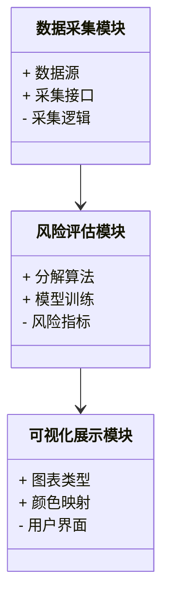
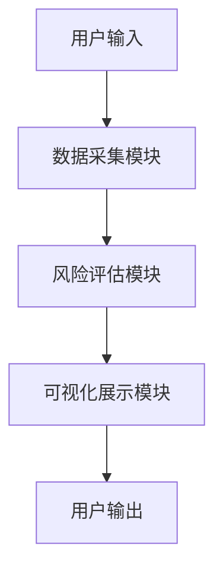

                 


# AI在金融衍生品风险分解与可视化中的创新应用

## 关键词：AI，金融衍生品，风险分解，数据可视化，风险管理，机器学习

## 摘要：本文探讨了人工智能技术在金融衍生品风险分解与可视化中的创新应用。通过分析传统风险分解方法的局限性，结合现代AI技术的优势，提出了一种基于机器学习和深度学习的新型风险分解模型。同时，本文还介绍了如何利用AI技术实现风险的交互式动态可视化，并通过实际案例展示了这些方法在金融衍生品风险管理中的应用效果。本文最后总结了AI技术在金融衍生品风险管理中的优势和未来发展方向。

---

# 第一部分：金融衍生品与AI技术基础

## 第1章：金融衍生品风险管理概述

### 1.1 金融衍生品的基本概念

#### 1.1.1 金融衍生品的定义与分类
金融衍生品是指其价值依赖于其他基础资产（如股票、债券、商品等）的价格变动的金融工具。常见的金融衍生品包括期货、期权、互换和远期合约等。这些工具可以用于对冲风险、投机或套利。

#### 1.1.2 金融衍生品的风险来源
金融衍生品的风险主要来源于以下几个方面：
1. **市场风险**：市场价格波动可能导致衍生品的价值变化。
2. **信用风险**：交易对手无法履行合约义务的风险。
3. **流动性风险**：衍生品在需要时难以迅速变现的风险。
4. **操作风险**：由于操作失误或系统故障导致的损失风险。

#### 1.1.3 金融衍生品风险管理的重要性
有效的风险管理是确保金融机构稳健运营的关键。金融衍生品的复杂性和杠杆效应使得风险管理尤为重要。通过科学的风险分解和可视化，可以帮助金融机构更好地识别、量化和监控风险。

---

## 第2章：风险分解与可视化的核心概念

### 2.1 风险分解的基本原理

#### 2.1.1 风险分解的定义
风险分解是指将整体风险分解为多个组成部分，以便更好地理解和管理每个部分的风险。

#### 2.1.2 风险分解的方法与步骤
风险分解通常包括以下几个步骤：
1. **数据收集**：收集与金融衍生品相关的市场数据、交易数据和历史数据。
2. **数据预处理**：清洗数据、处理缺失值和异常值。
3. **特征提取**：从数据中提取有助于风险分析的特征。
4. **模型构建**：选择合适的模型（如随机森林、神经网络等）进行风险分解。
5. **结果分析**：解读分解结果，识别主要风险来源。

#### 2.1.3 风险分解的核心要素
风险分解的核心要素包括：
- 数据来源与质量
- 分解模型的选择与优化
- 分解结果的可解释性

### 2.2 可视化在风险管理中的作用

#### 2.2.1 数据可视化的定义与特点
数据可视化是将数据以图形化的方式展示，以便更直观地理解和分析数据。其特点包括直观性、交互性和动态性。

#### 2.2.2 可视化在金融衍生品风险管理中的应用
在金融衍生品风险管理中，可视化技术可以用于：
- 展示市场波动对衍生品价值的影响
- 可视化风险分解结果，帮助识别主要风险来源
- 实时监控风险变化，及时发现潜在问题

#### 2.2.3 可视化工具与技术的选择
常用的可视化工具包括Tableau、Power BI和Python的Matplotlib等。选择合适的工具和方法可以提高可视化的效果和效率。

---

## 第3章：AI技术在风险分解与可视化中的创新应用

### 3.1 AI技术在风险分解中的创新方法

#### 3.1.1 基于机器学习的风险分解模型
机器学习算法（如随机森林和梯度提升树）可以用于风险分解。通过训练模型，可以识别出对风险贡献最大的因素。

#### 3.1.2 深度学习在风险分解中的应用
深度学习模型（如神经网络）可以处理复杂的非线性关系，适用于高维数据的风险分解。

#### 3.1.3 统计套利与风险分解的结合
统计套利是一种利用市场定价偏差进行套利的策略。结合统计套利和风险分解，可以更有效地识别和管理风险。

### 3.2 AI技术在风险可视化中的创新方法

#### 3.2.1 基于AI的交互式可视化工具
AI驱动的交互式可视化工具可以根据用户输入动态生成可视化结果，帮助用户更好地理解和分析风险。

#### 3.2.2 可视化数据的动态更新与实时分析
通过实时数据分析和可视化，金融机构可以及时发现和应对市场风险。

#### 3.2.3 AI驱动的可视化效果优化
AI技术可以自动优化可视化效果，例如通过颜色映射和图表布局的优化，提高可视化结果的可读性。

---

## 第4章：风险分解与可视化的核心算法原理

### 4.1 风险分解算法原理

#### 4.1.1 随机森林在风险分解中的应用
随机森林是一种基于决策树的集成学习方法。它通过构建多个决策树并取其平均，可以有效捕捉数据中的非线性关系。

#### 4.1.2 神经网络在风险分解中的应用
神经网络是一种强大的非线性模型，适用于处理高维数据和复杂关系。通过训练神经网络，可以实现对金融衍生品风险的准确分解。

#### 4.1.3 蒙特卡洛模拟在风险分解中的应用
蒙特卡洛模拟是一种通过随机采样方法进行风险评估的技术。它可以用于估计金融衍生品在不同市场条件下的风险敞口。

### 4.2 可视化算法原理

#### 4.2.1 数据清洗与特征提取
数据清洗是处理缺失值、异常值和重复值的过程。特征提取则是从数据中提取有助于风险分析的特征。

#### 4.2.2 数据变换与降维技术
数据变换（如标准化和归一化）可以提高模型的性能。降维技术（如主成分分析）可以减少数据的维度，提高计算效率。

#### 4.2.3 可视化效果的优化算法
通过颜色映射、图表布局优化和动态交互技术，可以提高可视化效果的可读性和用户体验。

---

## 第5章：风险分解与可视化的数学模型与公式

### 5.1 风险分解的数学模型

#### 5.1.1 风险分解的基本公式
风险分解的基本公式可以表示为：
$$
R = \sum_{i=1}^{n} w_i R_i
$$
其中，$R$ 表示整体风险，$w_i$ 表示第 $i$ 个风险因素的权重，$R_i$ 表示第 $i$ 个风险因素的风险值。

#### 5.1.2 基于协方差的风险分解模型
协方差矩阵可以用于衡量资产之间的相关性。风险分解可以通过协方差矩阵进行：
$$
Cov(X, Y) = E[(X - E[X])(Y - E[Y])]
$$

#### 5.1.3 基于因子分析的风险分解模型
因子分析是一种将多个变量归结为少数几个潜在因子的方法。其公式为：
$$
X = \lambda F + \epsilon
$$
其中，$X$ 表示观测变量，$\lambda$ 表示因子载荷，$F$ 表示潜在因子，$\epsilon$ 表示误差项。

### 5.2 可视化的数学基础

#### 5.2.1 数据可视化的坐标系模型
坐标系模型可以表示为：
$$
(x, y) = (a, b)
$$
其中，$x$ 和 $y$ 表示坐标轴，$a$ 和 $b$ 表示坐标值。

#### 5.2.2 数据可视化的颜色映射函数
颜色映射函数可以将数值映射为颜色，例如：
$$
Color(i) = f(i)
$$
其中，$i$ 表示数值，$f(i)$ 表示颜色映射函数。

#### 5.2.3 数据可视化的交互模型
交互模型可以通过用户输入（如缩放、过滤）动态更新可视化结果。

---

## 第6章：系统架构与设计

### 6.1 系统应用场景介绍

#### 6.1.1 金融衍生品交易场景
系统可以应用于金融衍生品交易的实时风险监控和管理。

#### 6.1.2 机构投资者的风险管理
机构投资者可以利用系统进行风险分解和可视化，优化投资组合。

### 6.2 系统功能设计

#### 6.2.1 数据采集模块
数据采集模块负责从多种数据源（如数据库、API）获取金融数据。

#### 6.2.2 风险评估模块
风险评估模块基于AI算法对金融衍生品进行风险评估和分解。

#### 6.2.3 可视化展示模块
可视化展示模块将风险分解结果以图表形式展示，帮助用户直观理解风险。

### 6.3 系统架构设计

#### 6.3.1 系统功能模块的类图
以下是系统功能模块的类图：



#### 6.3.2 系统架构的流程图
以下是系统架构的流程图：



---

## 第7章：项目实战

### 7.1 环境安装

#### 7.1.1 安装必要的库
需要安装以下Python库：
- NumPy
- Pandas
- Scikit-learn
- Matplotlib
- Seaborn

安装命令：
```
pip install numpy pandas scikit-learn matplotlib seaborn
```

### 7.2 核心实现源代码

#### 7.2.1 风险分解代码

```python
import numpy as np
import pandas as pd
from sklearn.ensemble import RandomForestRegressor

# 数据加载
data = pd.read_csv('financial_data.csv')

# 特征提取
X = data.drop('risk', axis=1)
y = data['risk']

# 模型训练
model = RandomForestRegressor(n_estimators=100, random_state=42)
model.fit(X, y)

# 风险分解
importances = model.feature_importances_
feature_names = X.columns
risk_factors = pd.DataFrame({'Feature': feature_names, 'Importance': importances})
risk_factors = risk_factors.sort_values('Importance', ascending=False)
```

#### 7.2.2 可视化代码

```python
import matplotlib.pyplot as plt
import seaborn as sns

# 可视化特征重要性
plt.figure(figsize=(10, 6))
sns.barplot(x='Importance', y='Feature', data=risk_factors)
plt.title('Feature Importance')
plt.xlabel('Importance')
plt.ylabel('Feature')
plt.show()
```

### 7.3 案例分析与解读

#### 7.3.1 案例分析
以股票期权为例，利用上述代码进行风险分解和可视化。通过分析结果，可以识别出波动率和标的资产价格对期权风险的主要影响。

#### 7.3.2 可视化效果解读
可视化结果展示了各个风险因素的重要性。例如，波动率可能是最重要的风险因素，而标的资产价格的变化次之。

---

## 第8章：总结与展望

### 8.1 最佳实践 tips
- 数据预处理是关键，确保数据质量和完整性。
- 选择合适的AI算法，结合业务需求进行模型优化。
- 可视化结果需要直观易懂，结合动态交互提升用户体验。

### 8.2 小结
本文详细介绍了AI技术在金融衍生品风险分解与可视化中的创新应用。通过结合机器学习和深度学习算法，可以更准确地识别和管理风险。同时，利用可视化技术，可以帮助用户更好地理解和应对风险。

### 8.3 注意事项
- 数据隐私和安全问题需要高度重视。
- 模型的可解释性是实际应用中的重要考量因素。
- 系统的实时性和稳定性需要通过严格的测试来保证。

### 8.4 拓展阅读
- 《Python机器学习实战》
- 《深度学习在金融中的应用》
- 《数据可视化指南》

---

# 作者：AI天才研究院 & 禅与计算机程序设计艺术

