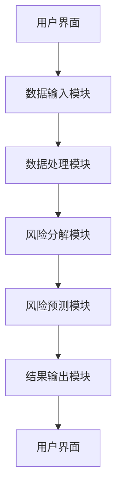
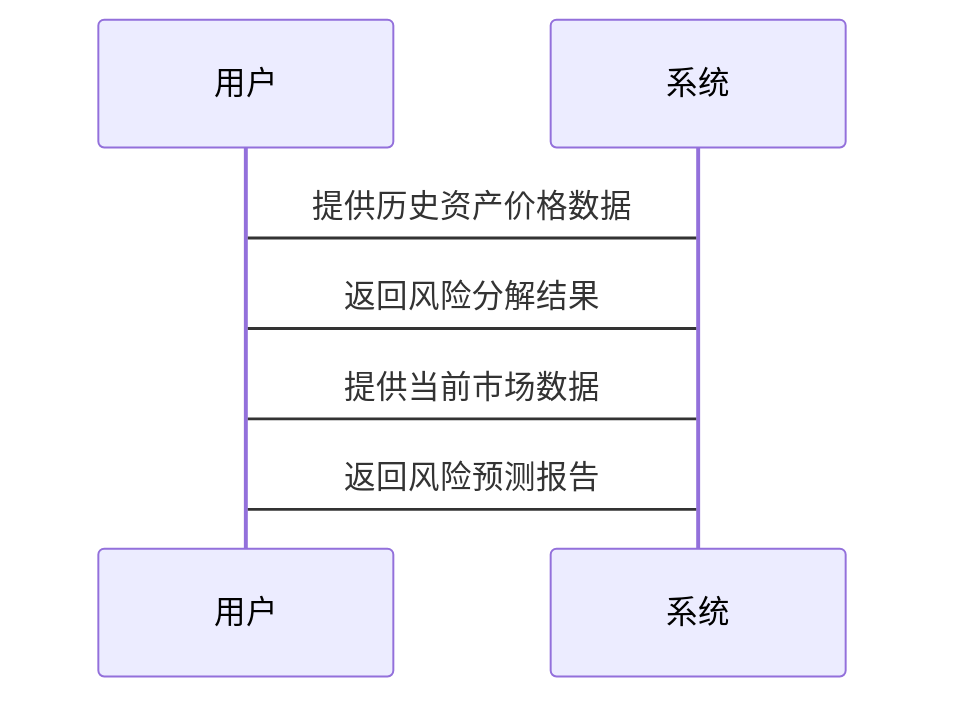

                 


# AI在金融衍生品风险分解中的创新应用

## 关键词
- 人工智能, 金融衍生品, 风险分解, 机器学习, 深度学习, 蒙特卡洛模拟

## 摘要
本文探讨了人工智能（AI）在金融衍生品风险分解中的创新应用。随着金融市场的复杂化，传统的风险分解方法面临诸多挑战，而AI技术的引入为解决这些问题提供了新的思路。本文首先介绍了金融衍生品的基本概念和风险分解的重要性，接着深入分析了AI技术在风险分解中的优势。随后，详细阐述了金融衍生品风险分解的核心数学模型，如蒙特卡洛模拟和VaR模型，并探讨了AI模型在这些模型中的应用原理。最后，通过实际案例展示了如何构建一个AI驱动的金融衍生品风险分解系统，并总结了AI在该领域的最佳实践和未来发展方向。

---

## 第一部分: 金融衍生品与AI风险分解的背景介绍

### 第1章: 金融衍生品的基本概念

#### 1.1 金融衍生品的定义与分类
金融衍生品是一种金融合约，其价值取决于基础资产（如股票、债券、商品等）的价格变动。衍生品的主要类型包括：
- **远期合约（Forwards）**：约定在未来某一特定时间以预定价格购买或出售资产的协议。
- **期货合约（Futures）**：标准化的远期合约，通常在交易所进行交易。
- **期权合约（Options）**：赋予买方在特定时间内以预定价格购买或出售资产的权利，而非义务。
- **掉期合约（Swaps）**：约定在未来某一时期内交换资产或现金流的协议。

衍生品的市场价值受多种因素影响，包括市场波动性、利率变化、信用风险等。因此，准确分解这些风险因素对于金融机构的稳健运营至关重要。

#### 1.2 风险分解的重要性
风险分解是指将复杂的金融风险分解为多个基本风险因素的过程。通过风险分解，金融机构可以更好地理解其风险敞口，制定有效的风险管理策略。例如，将市场风险分解为利率风险、汇率风险和信用风险，有助于金融机构分别应对这些风险。

#### 1.3 AI技术在金融衍生品风险分解中的应用背景
AI技术的快速发展为金融衍生品的风险管理提供了新的工具。传统的风险分解方法依赖于统计模型，可能无法捕捉复杂的非线性关系。而AI技术，尤其是机器学习和深度学习，能够处理海量数据，发现隐藏的模式，从而提高风险分解的准确性和效率。

---

### 第2章: 金融衍生品风险分解的数学模型

#### 2.1 风险分解的基本数学模型
风险分解的核心在于建立数学模型，描述不同风险因素之间的关系。以下是一些常用的风险分解模型：

##### 2.1.1 线性回归模型
线性回归是一种简单但强大的统计模型，用于描述变量之间的线性关系。在风险分解中，线性回归可以用于预测资产价格的变化趋势。

$$ y = \beta_0 + \beta_1 x_1 + \beta_2 x_2 + \ldots + \beta_n x_n + \epsilon $$

其中，$y$ 是目标变量（如资产价格），$x_i$ 是自变量（如市场指数、利率等），$\beta_i$ 是回归系数，$\epsilon$ 是误差项。

##### 2.1.2 时间序列分析模型
时间序列分析用于研究变量随时间的变化趋势。ARIMA（自回归积分滑动平均）模型是一种常用的时间序列模型。

$$ ARIMA(p, d, q) $$

其中，$p$ 是自回归阶数，$d$ 是差分阶数，$q$ 是滑动平均阶数。

##### 2.1.3 马尔可夫链模型
马尔可夫链是一种描述系统状态转移的模型，假设当前状态仅依赖于前一状态。在风险分解中，马尔可夫链可以用于模拟资产价格的短期波动。

#### 2.2 常见的风险分解方法
##### 2.2.1 蒙特卡洛模拟
蒙特卡洛模拟是一种通过随机采样方法来估计概率分布的技术。在金融衍生品风险分解中，蒙特卡洛模拟可以用于估计资产价格的潜在波动范围。

##### 2.2.2 VaR（Value at Risk）模型
VaR模型用于估计在给定置信水平下，资产可能遭受的最大损失。例如，95%置信水平下的VaR表示在95%的概率下，资产的最大损失不会超过该值。

##### 2.2.3 Copula方法
Copula方法用于描述多个变量之间的相关性。在风险分解中，Copula方法可以帮助理解不同资产价格之间的相互关系。

---

### 第3章: AI模型在风险分解中的应用原理

#### 3.1 机器学习模型在风险分解中的应用
##### 3.1.1 线性回归模型
线性回归模型适用于线性关系的建模。在风险分解中，可以用于预测资产价格的变化趋势。

##### 3.1.2 支持向量机（SVM）
SVM是一种监督学习模型，适用于分类和回归问题。在风险分解中，SVM可以用于预测资产价格的涨跌趋势。

##### 3.1.3 随机森林模型
随机森林是一种基于树的集成学习模型，具有较强的抗过拟合能力。在风险分解中，随机森林可以用于识别影响资产价格的关键因素。

#### 3.2 深度学习模型在风险分解中的应用
##### 3.2.1 神经网络模型
神经网络是一种强大的非线性模型，适用于复杂模式的识别。在风险分解中，神经网络可以用于预测资产价格的非线性波动。

##### 3.2.2 长短期记忆网络（LSTM）
LSTM是一种特殊的循环神经网络，适用于时间序列数据的建模。在风险分解中，LSTM可以用于捕捉资产价格的长期依赖关系。

---

## 第四部分: 系统设计与架构

### 第6章: AI驱动的金融衍生品风险分解系统

#### 6.1 系统功能设计
##### 6.1.1 风险分解模块
- 输入：历史资产价格数据、市场指标等。
- 输出：资产价格的风险分解结果。

##### 6.1.2 风险预测模块
- 输入：当前市场数据。
- 输出：未来资产价格的潜在风险。

#### 6.2 系统架构设计
使用Mermaid绘制系统架构图：



#### 6.3 系统接口设计
- **输入接口**：接收历史资产价格数据、市场指标等。
- **输出接口**：提供风险分解结果和风险预测报告。

#### 6.4 系统交互流程
使用Mermaid绘制交互流程图：



---

## 第五部分: 项目实战

### 第7章: 金融衍生品风险分解系统实现

#### 7.1 环境安装
- **Python 3.8+**
- **NumPy、Pandas、Scikit-learn、Keras、TensorFlow**

#### 7.2 核心实现代码
##### 7.2.1 数据预处理
```python
import numpy as np
import pandas as pd

# 加载数据
data = pd.read_csv('financial_data.csv')

# 数据清洗
data.dropna()
```

##### 7.2.2 模型训练
```python
from sklearn.model_selection import train_test_split
from sklearn.ensemble import RandomForestRegressor

# 划分训练集和测试集
X_train, X_test, y_train, y_test = train_test_split(data.drop('target', axis=1), data['target'], test_size=0.2)

# 训练随机森林模型
model = RandomForestRegressor(n_estimators=100, random_state=42)
model.fit(X_train, y_train)
```

##### 7.2.3 模型预测
```python
# 进行预测
y_pred = model.predict(X_test)

# 输出结果
print('预测结果:', y_pred)
```

#### 7.3 案例分析
假设我们有一个股票的每日收盘价数据，希望通过随机森林模型预测其未来的价格波动。

##### 数据准备
```python
import pandas as pd
import matplotlib.pyplot as plt

# 加载数据
data = pd.read_csv('stock_price.csv')

# 绘制收盘价趋势图
plt.figure(figsize=(10, 6))
plt.plot(data['Date'], data['Close'])
plt.title('Stock Price Trend')
plt.xlabel('Date')
plt.ylabel('Price')
plt.show()
```

##### 模型应用
```python
# 数据预处理
data['Close'] = data['Close'].shift(1)
data = data.dropna()

# 划分训练集和测试集
X_train = data[['Date', 'Open', 'High', 'Low']]
y_train = data['Close']

model.fit(X_train, y_train)

# 预测未来价格
future_date = pd.date_range(start='2024-01-01', periods=7)
future_data = pd.DataFrame({'Date': future_date})
future_data['Close'] = model.predict(future_data[['Date', 'Open', 'High', 'Low']])
```

---

## 第六部分: 总结与展望

### 8.1 最佳实践
- 数据质量是关键，确保数据的完整性和准确性。
- 选择合适的模型，根据问题特点和数据规模进行调整。
- 定期更新模型，适应市场变化。

### 8.2 小结
本文详细探讨了AI技术在金融衍生品风险分解中的创新应用，从背景介绍到系统实现，全面分析了AI技术的优势和实现方法。

### 8.3 注意事项
- 风险分解模型需要结合实际情况进行调整。
- 模型的解释性是实际应用中的重要考量因素。

### 8.4 拓展阅读
- 推荐阅读《机器学习实战》和《深度学习》等书籍，深入了解AI技术在金融领域的应用。

---

## 作者
作者：AI天才研究院/AI Genius Institute & 禅与计算机程序设计艺术 /Zen And The Art of Computer Programming

