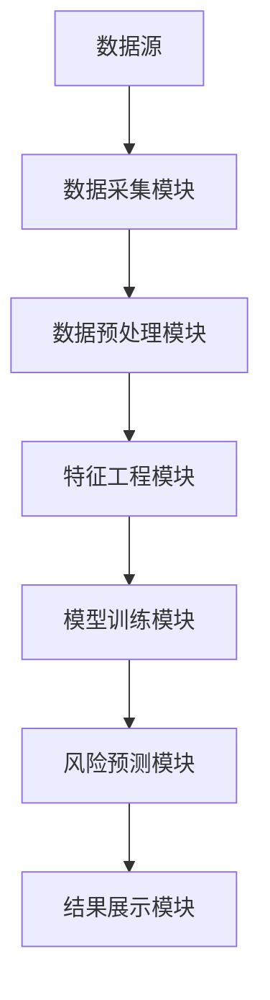

                 


# AI在金融衍生品风险度量中的应用

**关键词：** AI, 金融衍生品, 风险度量, 机器学习, 深度学习, VaR, CVaR

**摘要：** 本文探讨了人工智能技术在金融衍生品风险度量中的应用，分析了传统风险度量方法的局限性，介绍了基于机器学习和深度学习的新型风险度量模型，并通过实际案例展示了这些模型的实现过程和效果。文章还总结了AI在金融衍生品风险度量中的优势与挑战，并展望了未来的发展方向。

---

## 第1章: AI与金融衍生品概述

### 1.1 金融衍生品的基本概念

#### 1.1.1 金融衍生品的定义与分类
金融衍生品是一种金融合约，其价值取决于基础资产的价格波动。常见的衍生品包括期货、期权、掉期和互换等。衍生品可以按执行方式分为欧式期权和美式期权，按标的资产分为股票期权、股指期权等。

#### 1.1.2 金融衍生品的市场现状
近年来，金融衍生品市场迅速发展，市场规模庞大，且品种日益多样化。衍生品在风险管理、价格发现和投机套利方面发挥着重要作用。

#### 1.1.3 金融衍生品的风险特征
衍生品的价格波动性大，风险较高。常见的风险包括市场风险、信用风险和流动性风险。这些风险的复杂性使得传统的风险度量方法面临挑战。

### 1.2 AI技术的基本概念

#### 1.2.1 人工智能的定义与技术栈
人工智能（AI）是指模拟人类智能的计算机系统，技术栈包括数据采集、特征工程、算法模型和结果解释等。常见的AI技术包括机器学习、深度学习和自然语言处理。

#### 1.2.2 机器学习的核心原理
机器学习是一种通过数据训练模型的技术，分为监督学习、非监督学习和强化学习。监督学习用于有标签数据的预测，非监督学习用于无标签数据的聚类，强化学习用于策略优化。

#### 1.2.3 深度学习的基本概念
深度学习是一种基于人工神经网络的机器学习方法，通过多层非线性变换提取数据特征。深度学习在图像识别、语音识别等领域表现出色。

### 1.3 AI在金融领域的应用现状

#### 1.3.1 传统金融分析的局限性
传统金融分析依赖统计方法和专家经验，但在处理非线性关系和高维数据时存在不足，难以捕捉复杂市场中的隐含风险。

#### 1.3.2 AI在金融领域的典型应用
AI在金融领域的应用包括股票预测、信用评分、欺诈检测和算法交易等。AI技术的引入显著提高了金融分析的效率和准确性。

#### 1.3.3 AI在金融衍生品中的潜在价值
AI能够通过大数据分析和复杂模型捕捉衍生品市场的潜在风险，优化风险度量模型，提高风险管理的精确性和及时性。

### 1.4 本章小结
本章介绍了金融衍生品的基本概念和市场现状，分析了传统风险度量方法的局限性，探讨了AI技术的基本原理及其在金融领域的应用潜力。

---

## 第2章: 金融衍生品风险度量的核心概念

### 2.1 风险度量的核心概念

#### 2.1.1 风险的定义与分类
风险是未来收益的不确定性，分为市场风险、信用风险、流动性风险和操作风险等。

#### 2.1.2 风险度量的目标与原则
风险度量的目标是量化潜在损失，为决策提供依据。原则包括全面性、准确性和可操作性。

#### 2.1.3 风险度量的常用指标
常用指标包括VaR、CVaR、波动率和相关系数等。VaR是指在一定置信水平下可能的最大损失，CVaR是VaR的期望损失。

### 2.2 常见的金融衍生品风险模型

#### 2.2.1 VaR模型
VaR模型通过统计方法估计资产的潜在损失，适用于线性组合的资产。

#### 2.2.2 CVaR模型
CVaR模型考虑了VaR模型的不足，计算在VaR水平下的平均损失，适用于非线性组合的资产。

#### 2.2.3 波动率模型
波动率模型通过估计资产价格的波动性，预测未来的价格变化范围。

### 2.3 AI驱动的风险度量优势

#### 2.3.1 数据驱动的精准度量
AI技术能够处理海量数据，捕捉数据中的隐含模式，提高风险度量的准确性。

#### 2.3.2 非线性关系的捕捉能力
AI模型能够处理复杂的非线性关系，适用于衍生品市场的复杂性。

#### 2.3.3 高维数据的处理能力
AI技术能够处理高维数据，适用于衍生品市场的多因素分析。

### 2.4 本章小结
本章分析了风险度量的核心概念和常用模型，探讨了AI技术在风险度量中的优势，为后续的算法分析奠定了基础。

---

## 第3章: AI技术在金融衍生品风险度量中的算法原理

### 3.1 机器学习在风险度量中的应用

#### 3.1.1 监督学习与风险预测
监督学习通过训练数据预测风险，适用于基于历史数据的风险预测。

#### 3.1.2 非监督学习与风险识别
非监督学习通过聚类分析识别风险因子，适用于无标签数据的风险识别。

#### 3.1.3 强化学习与风险优化
强化学习通过策略优化寻找最优风险控制方案，适用于动态风险环境下的优化问题。

### 3.2 常见机器学习算法解析

#### 3.2.1 线性回归模型
线性回归通过最小二乘法拟合直线，适用于线性关系的风险预测。

#### 3.2.2 支持向量机（SVM）
SVM通过构造超平面分离数据，适用于非线性分类和回归问题。

#### 3.2.3 随机森林与梯度提升树
随机森林通过集成学习提高模型的泛化能力，梯度提升树通过逐步优化损失函数提高预测精度。

### 3.3 深度学习模型在风险度量中的应用

#### 3.3.1 神经网络的基本原理
神经网络通过多层非线性变换提取数据特征，适用于复杂模式的识别。

#### 3.3.2 卷积神经网络（CNN）的应用
CNN通过卷积操作提取空间特征，适用于图像和序列数据的风险分析。

#### 3.3.3 循环神经网络（RNN）的应用
RNN通过处理序列数据，适用于时间序列的风险预测。

### 3.4 算法优缺点对比

#### 3.4.1 各种算法的性能对比
线性回归适用于线性关系，SVM适用于小样本数据，随机森林适用于高维数据，神经网络适用于复杂模式。

#### 3.4.2 算法适用场景分析
监督学习适用于有标签数据，非监督学习适用于无标签数据，强化学习适用于动态环境。

#### 3.4.3 算法选择的注意事项
需要根据数据特征和问题类型选择合适的算法，避免过拟合和欠拟合。

### 3.5 本章小结
本章分析了机器学习和深度学习算法在风险度量中的应用，比较了不同算法的优缺点，为后续的系统设计提供了算法选择的依据。

---

## 第4章: 金融衍生品风险度量的系统架构与设计

### 4.1 系统架构与设计

#### 4.1.1 系统功能设计
系统功能包括数据采集、模型训练、风险预测和结果展示。数据采集模块负责收集市场数据，模型训练模块负责训练AI模型，风险预测模块负责预测风险，结果展示模块负责可视化结果。

#### 4.1.2 系统架构图


#### 4.1.3 系统接口设计
系统接口包括数据接口和模型接口。数据接口负责与数据源交互，模型接口负责与AI模型交互。

#### 4.1.4 系统交互流程
系统交互流程包括数据采集、数据预处理、特征工程、模型训练、风险预测和结果展示。

### 4.2 本章小结
本章设计了金融衍生品风险度量系统的架构，包括功能设计、架构图和接口设计，为后续的系统实现提供了指导。

---

## 第5章: 项目实战

### 5.1 环境安装与配置

#### 5.1.1 Python环境的安装
需要安装Python 3.6及以上版本，安装Anaconda或Miniconda。

#### 5.1.2 依赖库的安装
安装必要的依赖库，如NumPy、Pandas、Scikit-learn、Keras和TensorFlow。

#### 5.1.3 数据集的准备
准备金融衍生品市场数据，包括期货价格、期权价格和市场指数等。

### 5.2 系统核心实现源代码

#### 5.2.1 数据预处理代码
```python
import pandas as pd
import numpy as np

# 读取数据
data = pd.read_csv('derivatives.csv')

# 数据清洗
data = data.dropna()
data = data.reset_index(drop=True)
```

#### 5.2.2 特征工程代码
```python
from sklearn.preprocessing import StandardScaler

# 标准化处理
scaler = StandardScaler()
features = data.drop(columns=['label'])
features = scaler.fit_transform(features)
```

#### 5.2.3 模型训练代码
```python
from sklearn.ensemble import RandomForestRegressor
from tensorflow.keras.models import Sequential
from tensorflow.keras.layers import Dense

# 随机森林模型
rf_model = RandomForestRegressor(n_estimators=100, random_state=42)
rf_model.fit(features, labels)

# 神经网络模型
model = Sequential()
model.add(Dense(64, activation='relu', input_dim=features.shape[1]))
model.add(Dense(32, activation='relu'))
model.add(Dense(1))
model.compile(optimizer='adam', loss='mse')
model.fit(features, labels, epochs=100, batch_size=32)
```

#### 5.2.4 风险预测代码
```python
import numpy as np
import pandas as pd
from sklearn.metrics import mean_squared_error

# 预测风险
rf_predictions = rf_model.predict(features)
nn_predictions = model.predict(features)

# 评估模型
mse_rf = mean_squared_error(labels, rf_predictions)
mse_nn = mean_squared_error(labels, nn_predictions)

print(f'随机森林模型MSE: {mse_rf}')
print(f'神经网络模型MSE: {mse_nn}')
```

### 5.3 案例分析与结果解读

#### 5.3.1 案例分析
以某期货品种为例，利用随机森林和神经网络模型进行风险预测，比较两种模型的预测效果。

#### 5.3.2 结果解读
比较随机森林和神经网络模型的MSE，分析哪种模型在该案例中表现更好。

### 5.4 本章小结
本章通过一个实际案例展示了AI技术在金融衍生品风险度量中的应用，详细讲解了环境配置、数据预处理、模型训练和结果解读的过程。

---

## 第6章: 总结与展望

### 6.1 总结
本文探讨了AI技术在金融衍生品风险度量中的应用，分析了传统方法的局限性，介绍了基于机器学习和深度学习的新型模型，通过实际案例展示了这些模型的实现过程和效果。

### 6.2 展望
未来，随着AI技术的不断发展，金融衍生品风险度量将更加精准和高效。可能出现的新技术包括更复杂的深度学习模型、多模态数据的融合和实时风险监控系统。

### 6.3 本章小结
本章总结了全文的主要内容，展望了未来的发展方向，为读者提供了进一步研究的方向。

---

## 最佳实践 tips

- 在实际应用中，应结合具体业务需求选择合适的AI算法。
- 数据预处理和特征工程是模型性能的关键，需要仔细处理。
- 模型评估时，应综合考虑准确率、召回率和F1值等指标。
- 风险度量模型应定期更新，以适应市场环境的变化。

---

**作者：AI天才研究院/AI Genius Institute & 禅与计算机程序设计艺术 /Zen And The Art of Computer Programming**

