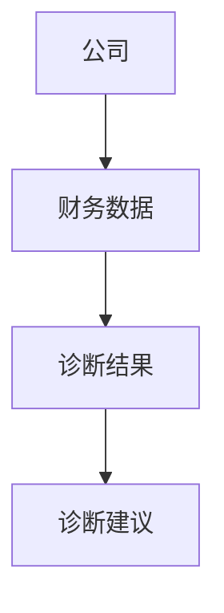
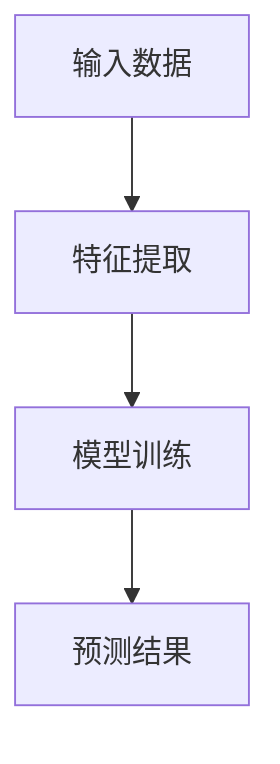
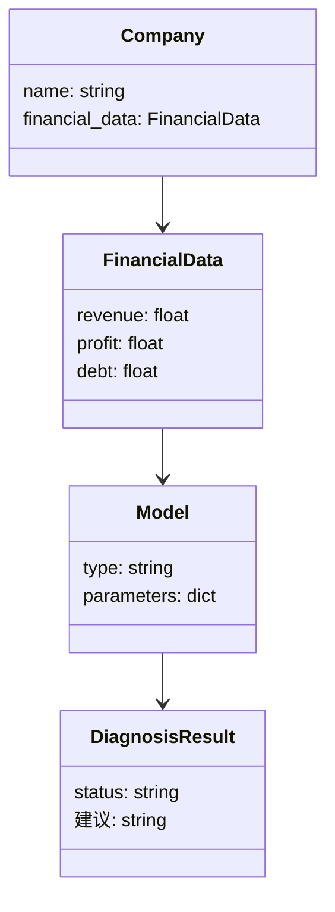
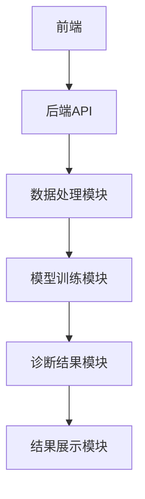
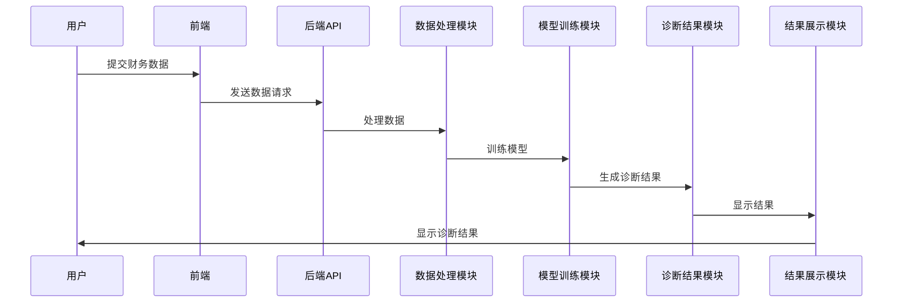

                 


## 第二部分: 核心概念与联系

### 第2章: 核心概念原理

#### 2.1 数据采集与预处理

##### 2.1.1 数据来源的多样性
在公司财务健康诊断中，数据来源可以包括财务报表、交易记录、市场数据、行业基准等。这些数据需要经过清洗和预处理，以确保数据的准确性和一致性。

##### 2.1.2 数据清洗与特征提取
数据清洗步骤包括处理缺失值、异常值和重复数据。特征提取则涉及从原始数据中提取有意义的特征，如收入增长率、利润率、资产负债率等。

##### 2.1.3 数据标准化与归一化
标准化和归一化是为了消除不同特征之间的尺度差异，通常使用Z-score标准化或Min-Max归一化。

#### 2.2 模型训练与优化

##### 2.2.1 选择合适的算法
根据问题类型选择合适的算法，如逻辑回归用于分类问题，随机森林用于特征重要性分析。

##### 2.2.2 超参数调优
使用网格搜索或随机搜索来优化模型的超参数，如学习率、树的深度等。

##### 2.2.3 模型评估与验证
使用交叉验证、ROC-AUC曲线等方法评估模型的性能，并进行调优以提高准确性。

#### 2.3 结果解释与可视化

##### 2.3.1 可视化工具的选择
使用Matplotlib、Seaborn等工具进行数据可视化，帮助理解模型结果。

##### 2.3.2 结果的可解释性
通过特征重要性分析解释模型的预测结果，确保决策过程的透明性。

##### 2.3.3 用户友好的界面设计
设计直观的用户界面，使非技术用户也能轻松理解和使用诊断结果。

## 第3章: 核心概念属性对比

### 3.1 概念对比表格

表3-1展示了AI增强型诊断与传统诊断的对比：

| 对比维度        | 传统诊断                  | AI增强型诊断               |
|-----------------|--------------------------|---------------------------|
| 数据处理        | 手动处理，耗时           | 自动化处理，高效           |
| 模型复杂度      | 简单模型，准确率有限      | 复杂模型，高准确率         |
| 可扩展性        | 有限，难以处理大规模数据  | 强大，可扩展到大规模数据    |
| 可解释性        | 较高，基于规则           | 可能较低，依赖模型内部机制  |

## 第4章: ER实体关系图

### 4.1 实体关系图



---

## 第三部分: 算法原理讲解

### 第5章: 算法原理

#### 5.1 逻辑回归算法

##### 5.1.1 算法流程图



##### 5.1.2 逻辑回归模型

逻辑回归是一种常用的分类算法，其核心是通过sigmoid函数将线性组合映射到概率空间。

##### 模型公式

$$ P(y=1|x) = \frac{1}{1 + e^{-\beta x}} $$

其中，$\beta$是回归系数，$x$是输入特征。

##### 优化目标

最小化对数损失函数：

$$ \mathcal{L} = -\sum_{i=1}^{n} [y_i \ln p_i + (1 - y_i) \ln (1 - p_i)] $$

##### 示例

假设我们有公司A的收入和利润数据，我们可以训练一个逻辑回归模型来预测其财务健康状况。

---

## 第四部分: 系统分析与架构设计方案

### 第6章: 系统分析与架构设计

#### 6.1 问题场景介绍

公司财务健康诊断系统需要处理大量财务数据，实时分析并提供诊断结果和建议。

#### 6.2 系统功能设计

系统功能包括数据采集、特征提取、模型训练、诊断结果生成和用户界面。

#### 6.3 领域模型类图



#### 6.4 系统架构设计



#### 6.5 系统接口设计

使用RESTful API进行通信，如POST请求发送数据，返回诊断结果。

#### 6.6 系统交互序列图



---

## 第五部分: 项目实战

### 第7章: 项目实战

#### 7.1 环境安装

安装Python、Pandas、Scikit-learn等库。

#### 7.2 核心代码实现

##### 数据预处理代码

```python
import pandas as pd

# 加载数据
data = pd.read_csv('financial_data.csv')

# 处理缺失值
data = data.dropna()

# 标准化处理
from sklearn.preprocessing import StandardScaler
scaler = StandardScaler()
data_scaled = scaler.fit_transform(data)
```

##### 模型训练代码

```python
from sklearn.linear_model import LogisticRegression
model = LogisticRegression()
model.fit(X_train, y_train)
```

##### 诊断结果生成

```python
predictions = model.predict(X_test)
print("预测结果:", predictions)
```

#### 7.3 案例分析

分析某公司数据，生成诊断结果和建议，如“公司财务状况健康，建议继续优化利润结构”。

#### 7.4 项目小结

总结项目实施过程中的经验和教训，强调AI在提高诊断效率和准确率方面的优势。

---

## 第六部分: 最佳实践

### 第8章: 最佳实践

#### 8.1 小结

AI增强型公司财务健康诊断通过自动化和智能化提升诊断效率和准确性。

#### 8.2 注意事项

- 数据质量至关重要，需确保数据的准确性和完整性。
- 模型需要定期更新，以适应市场变化。
- 结果需结合业务知识，避免过度依赖模型。

#### 8.3 拓展阅读

推荐相关书籍和资源，如《机器学习实战》、《Python机器学习》等。

---

## 作者

作者：AI天才研究院/AI Genius Institute & 禅与计算机程序设计艺术 /Zen And The Art of Computer Programming

