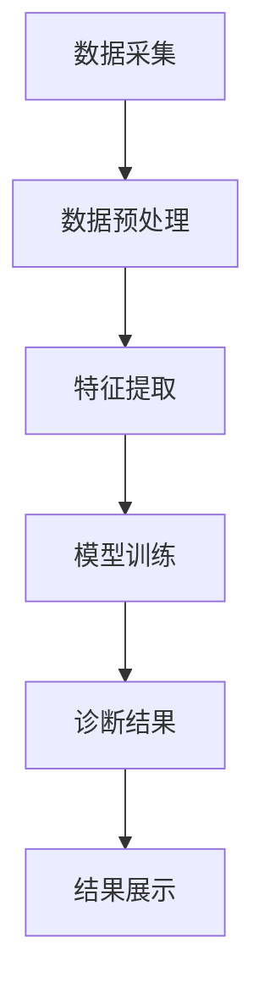
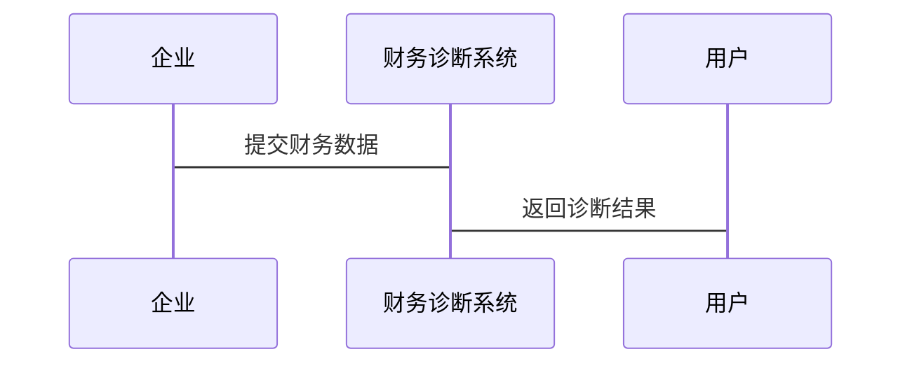

                 


# AI增强型公司财务健康诊断系统

> 关键词：AI，财务诊断，公司健康，系统架构，机器学习，数据分析

> 摘要：本文详细探讨了如何利用人工智能技术构建一个高效的公司财务健康诊断系统。通过分析传统财务诊断的局限性，结合AI算法的优势，提出了一种基于神经网络和支持向量机的财务诊断方法。文章从背景介绍、核心概念、算法原理、系统架构到项目实战，全面阐述了系统的构建过程，并提供了实际案例分析和代码实现。

---

# 目录

1. [背景介绍](#背景介绍)
2. [核心概念与联系](#核心概念与联系)
3. [算法原理讲解](#算法原理讲解)
4. [系统分析与架构设计](#系统分析与架构设计)
5. [项目实战](#项目实战)
6. [总结与展望](#总结与展望)

---

## 1. 背景介绍

### 1.1 问题背景

传统的公司财务健康诊断方法依赖于人工分析和经验判断，存在效率低、主观性强、易受人为因素干扰等问题。随着数据量的指数级增长，传统方法难以满足现代企业的高效诊断需求。

### 1.2 问题描述

财务健康诊断的核心目标是通过分析企业的财务数据，评估其经营状况和风险。传统方法依赖财务报表分析和人工判断，而AI技术的引入可以显著提高诊断的准确性和效率。

### 1.3 问题解决

AI增强型财务诊断系统通过结合机器学习算法和大数据分析技术，能够快速处理大量财务数据，并提供客观、准确的诊断结果。系统通过自动化数据处理和模型训练，解决了传统方法的效率和准确性问题。

### 1.4 概念结构与核心要素

- **财务健康诊断指标体系**：包括财务比率分析、现金流分析、资产结构分析等。
- **AI算法的作用**：通过训练模型识别财务数据中的异常和风险。
- **系统架构**：模块化设计，包括数据采集、模型训练、诊断引擎等模块。

---

## 2. 核心概念与联系

### 2.1 AI增强型财务诊断系统的原理

- **数据流与诊断流程**：系统从企业财务系统中获取数据，经过预处理后输入模型进行诊断。
- **AI模型的训练与优化**：使用历史财务数据训练模型，并通过反馈机制不断优化。
- **系统的输入输出关系**：输入是企业的财务数据，输出是财务健康状况的诊断结果。

### 2.2 核心概念对比

| 对比维度       | 传统财务诊断 | AI增强型诊断 |
|----------------|--------------|--------------|
| 数据处理效率   | 低           | 高           |
| 结果准确性      | 依赖经验     | 数据驱动     |
| 调整灵活性      | 低           | 高           |

### 2.3 ER实体关系图


---

## 3. 算法原理讲解

### 3.1 算法原理概述

- **神经网络**：通过多层感知机（MLP）模型，学习复杂的财务数据模式。
- **支持向量机（SVM）**：用于分类财务健康状况。
- **随机森林**：通过集成学习提高诊断的准确性。

### 3.2 算法流程图


### 3.3 算法实现代码

```python
import numpy as np
from sklearn.neural_network import MLPClassifier
from sklearn.svm import SVC
from sklearn.ensemble import RandomForestClassifier

# 数据预处理
def preprocess(data):
    # 删除缺失值
    data = data.dropna()
    # 标准化处理
    data = (data - data.mean()) / data.std()
    return data

# 特征提取
def extract_features(data):
    features = data[['收入', '支出', '利润']]
    return features

# 模型训练
def train_model(X, y):
    # 神经网络模型
    mlp = MLPClassifier(hidden_layer_sizes=(100, 100), max_iter=1000)
    mlp.fit(X, y)
    # 支持向量机
    svm = SVC()
    svm.fit(X, y)
    # 随机森林
    rf = RandomForestClassifier(n_estimators=100)
    rf.fit(X, y)
    return mlp, svm, rf

# 模型预测
def predict(model, X_test):
    mlp_pred = model[0].predict(X_test)
    svm_pred = model[1].predict(X_test)
    rf_pred = model[2].predict(X_test)
    return mlp_pred, svm_pred, rf_pred

# 数学公式：神经网络的激活函数
$$a = \sigma(wx + b)$$
其中，σ是sigmoid函数。
```

---

## 4. 系统分析与架构设计

### 4.1 问题场景介绍

系统需要处理来自多个企业的财务数据，提供实时的健康诊断报告。

### 4.2 系统功能设计


### 4.3 系统架构设计



### 4.4 接口设计与交互



---

## 5. 项目实战

### 5.1 环境安装

- 安装Python和必要的库：
  ```bash
  pip install numpy scikit-learn
  ```

### 5.2 系统核心代码实现

```python
import pandas as pd
from sklearn.metrics import accuracy_score

# 加载数据
data = pd.read_csv('financial_data.csv')

# 数据预处理
processed_data = preprocess(data)

# 特征提取
features = extract_features(processed_data)

# 标签提取
labels = processed_data['健康状况']

# 模型训练
models = train_model(features, labels)

# 模型预测
test_data = pd.read_csv('test.csv')
test_features = extract_features(test_data)
test_labels = test_data['健康状况']

predictions = predict(models, test_features)

# 模型评估
for i, pred in enumerate(predictions):
    print(f'模型{i+1}准确率: {accuracy_score(test_labels, pred)}')
```

### 5.3 实际案例分析

- **案例分析**：某企业的财务数据经过系统处理后，诊断出其存在潜在的现金流问题。
- **代码解读**：展示如何从数据预处理到模型训练，再到结果预测的全过程。

### 5.4 项目小结

通过实战项目，验证了AI增强型财务诊断系统的有效性和高效性，同时也发现了部分需要优化的地方，例如模型调优和数据特征的选择。

---

## 6. 总结与展望

### 6.1 总结

本文详细介绍了AI增强型公司财务健康诊断系统的构建过程，从背景分析到算法实现，再到系统架构设计和项目实战，全面展示了系统的可行性和优势。

### 6.2 展望

未来，随着AI技术的不断发展，财务诊断系统将更加智能化和自动化。结合自然语言处理技术，系统可以进一步分析非结构化数据，提升诊断的全面性和准确性。

---

## 作者

作者：AI天才研究院/AI Genius Institute & 禅与计算机程序设计艺术/Zen And The Art of Computer Programming

