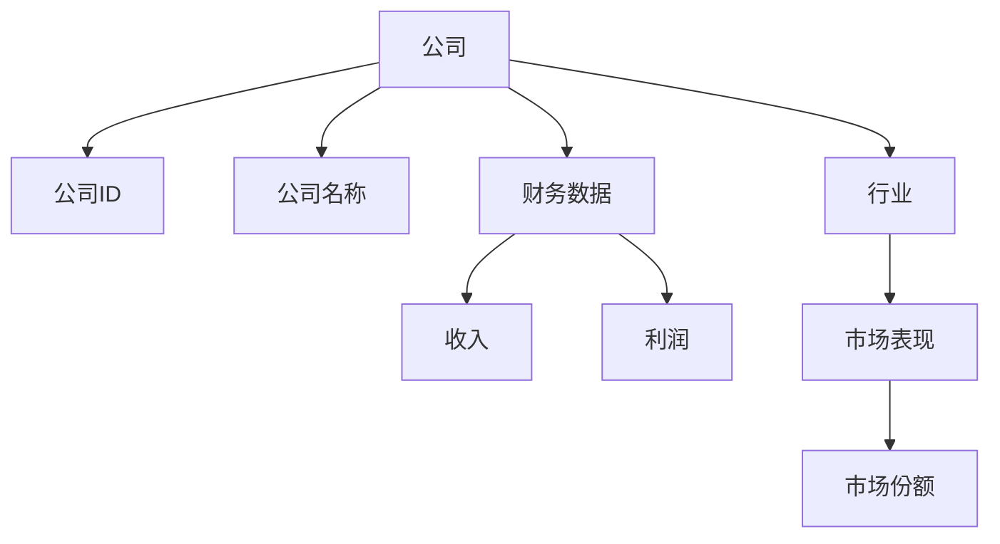
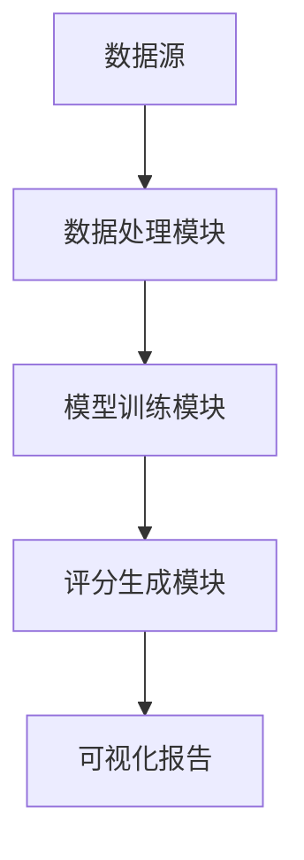
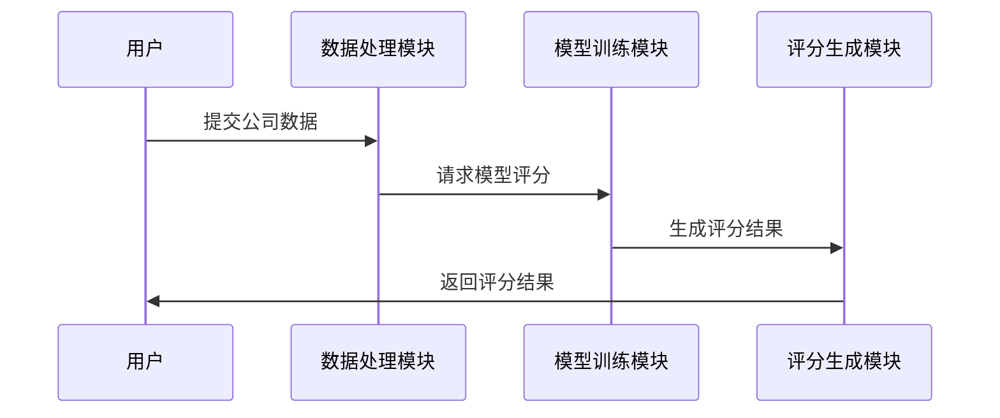

                 


# AI增强型公司质量评分系统

## 关键词：AI增强型评分系统、公司质量评分、AI技术、评分模型、系统架构

## 摘要：
本文详细探讨了如何利用人工智能技术构建公司质量评分系统。文章首先分析了传统评分系统的局限性，随后介绍了AI增强型评分系统的核心概念与优势。接着，从算法原理、系统架构、项目实战等方面展开，详细讲解了评分模型的构建过程，包括数据预处理、特征工程、模型训练与调优。同时，文章通过实际案例分析，展示了如何将AI技术应用于公司质量评分系统中，并提供了系统设计与优化的最佳实践。最后，文章总结了AI增强型评分系统的优势，并展望了其未来的发展趋势。

---

# 第1章: 背景与核心概念

## 1.1 问题背景

### 1.1.1 传统公司质量评分的局限性
传统的公司质量评分系统主要依赖于人工评估或简单的规则引擎，存在以下问题：
- **主观性**：评分结果受评估人员主观因素影响，缺乏客观性。
- **效率低下**：人工评估耗时长，难以实时更新。
- **数据孤岛**：各维度数据分散，难以整合分析。

### 1.1.2 AI技术如何解决传统评分系统的问题
人工智能技术可以通过以下方式提升公司质量评分系统的性能：
- **自动化处理**：利用机器学习算法自动分析大量数据，提高评估效率。
- **多维度分析**：整合公司运营、财务、市场等多个维度的数据，提供更全面的评估。
- **动态更新**：实时更新数据，确保评分结果的及时性。

### 1.1.3 市场需求与技术发展的结合
随着企业数字化转型的推进，市场对自动化、智能化的评分系统需求日益增长。AI技术的快速发展为实现高效的公司质量评分系统提供了技术基础。

## 1.2 问题描述

### 1.2.1 公司质量评分的核心要素
公司质量评分的核心要素包括：
- **财务表现**：收入、利润、资产负债率等。
- **运营效率**：供应链效率、库存周转率等。
- **市场表现**：市场份额、品牌影响力等。
- **管理能力**：领导层素质、团队稳定性等。

### 1.2.2 传统评分系统的主要缺陷
- **单一性**：仅依赖财务数据，忽视其他重要指标。
- **静态性**：评分结果难以实时更新，缺乏动态性。
- **可解释性差**：复杂的模型难以解释评分结果的原因。

### 1.2.3 AI增强型评分系统的必要性
AI增强型评分系统能够整合多维度数据，利用机器学习模型进行深度分析，提供更准确、更全面的评分结果。

## 1.3 解决方案

### 1.3.1 AI增强型评分系统的定义
AI增强型评分系统是一种结合人工智能技术，通过整合公司多维度数据，利用机器学习模型进行评估和预测的系统。

### 1.3.2 系统设计的主要目标
- 提供实时、动态的公司质量评分。
- 整合公司运营、财务、市场等多维度数据。
- 提供评分结果的可解释性和透明度。

### 1.3.3 关键技术的选择与实现
- 数据采集与处理：从多个数据源获取数据，进行清洗和预处理。
- 模型选择：选择适合的机器学习模型，如随机森林、神经网络等。
- 模型优化：通过交叉验证等方法优化模型性能。

## 1.4 系统的边界与外延

### 1.4.1 系统的输入与输出
- **输入**：公司运营数据、财务数据、市场数据等。
- **输出**：公司质量评分、评分报告、趋势分析等。

### 1.4.2 系统与其他模块的交互
- **数据源**：与财务系统、CRM系统等进行数据交互。
- **用户界面**：提供给用户直观的评分结果和报告。

### 1.4.3 系统的适用范围与限制
- **适用范围**：适用于各种规模的企业，尤其适合数据丰富的行业。
- **限制**：依赖高质量的数据，模型性能受数据质量影响。

## 1.5 核心概念与组成

### 1.5.1 数据采集与处理
- 数据来源：公司内部数据、公开数据、第三方数据。
- 数据清洗：处理缺失值、异常值等。

### 1.5.2 AI模型训练与优化
- 模型选择：根据数据特征选择合适的模型。
- 超参数调优：通过网格搜索等方法优化模型性能。

### 1.5.3 评分系统的设计与实现
- 评分规则：根据模型输出制定评分标准。
- 可视化报告：生成评分报告，提供直观的分析结果。

## 1.6 本章小结

---

# 第2章: 核心概念与联系

## 2.1 AI在评分系统中的作用

### 2.1.1 AI技术提升评分准确性的原理
- **数据融合**：整合多源数据，提供更全面的分析。
- **深度学习**：利用神经网络模型捕捉数据中的复杂模式。

### 2.1.2 AI模型的可解释性问题
- **可解释性的重要性**：用户需要了解评分结果的原因。
- **解决方法**：使用可解释性模型（如XGBoost）或提供解释性报告。

### 2.1.3 多维度数据的融合与分析
- **数据融合技术**：如主成分分析（PCA）。
- **特征选择方法**：如Lasso回归。

## 2.2 数据特征与模型选择

### 2.2.1 数据特征分析
| 特征类型 | 描述 |
|----------|------|
| 财务特征 | 收入、利润等 |
| 运营特征 | 库存周转率、供应链效率等 |
| 市场特征 | 市场份额、品牌影响力等 |

### 2.2.2 模型选择与对比
| 模型类型 | 优点 | 缺点 |
|----------|------|------|
| 线性回归 | 简单易懂 | 无法捕捉非线性关系 |
| 随机森林 | 高准确性 | 黑箱模型，可解释性差 |
| 神经网络 | 强大学习能力 | 训练时间长 |

### 2.2.3 数据特征与模型性能的关系
- 数据特征的多样性直接影响模型的性能。
- 特征工程是提升模型准确性的关键步骤。

## 2.3 ER实体关系图



---

# 第3章: 算法原理

## 3.1 数据预处理

### 3.1.1 数据清洗
- 处理缺失值：使用均值、中位数或删除缺失数据。
- 处理异常值：使用Z-score或IQR方法。

### 3.1.2 数据标准化
- 标准化：将数据转换为均值为0，方差为1。
- 缩放：归一化或最小-最大缩放。

### 3.1.3 数据分割
- 训练集、验证集、测试集的划分：通常采用80-10-10的比例。

## 3.2 特征工程

### 3.2.1 特征选择
- 基于统计的方法：卡方检验、ANOVA。
- 基于模型的方法：Lasso回归、随机森林特征重要性。

### 3.2.2 特征变换
- 主成分分析（PCA）：降低维度。
- 独热编码：将分类变量转换为二进制变量。

## 3.3 模型训练

### 3.3.1 机器学习模型的选择
- 针对回归问题，选择随机森林或神经网络。

### 3.3.2 模型训练流程
1. 数据预处理。
2. 特征工程。
3. 模型训练。
4. 模型评估。

## 3.4 模型调优

### 3.4.1 超参数调优
- 使用网格搜索或随机搜索优化模型参数。

### 3.4.2 模型评估
- 使用交叉验证评估模型性能。

### 3.4.3 模型部署
- 将模型部署到评分系统中，实时处理数据并输出评分。

---

# 第4章: 系统分析与架构设计

## 4.1 项目背景

### 4.1.1 项目目标
- 构建一个实时、动态的公司质量评分系统。
- 提供多维度数据分析和评分结果的可视化。

## 4.2 系统功能设计

### 4.2.1 功能模块
- 数据采集模块：从多个数据源获取数据。
- 数据处理模块：清洗、预处理数据。
- 模型训练模块：训练评分模型。
- 评分生成模块：根据模型输出生成评分。
- 可视化报告模块：生成评分报告。

### 4.2.2 系统架构


## 4.3 系统接口设计

### 4.3.1 API接口
- 数据接口：提供数据获取的API。
- 评分接口：提供公司质量评分的API。

### 4.3.2 接口交互流程
1. 用户通过API提交公司数据。
2. 数据处理模块清洗数据。
3. 模型训练模块生成评分。
4. 返回评分结果。

## 4.4 交互序列图



---

# 第5章: 项目实战

## 5.1 环境安装

### 5.1.1 安装Python环境
- 使用Anaconda安装Python 3.8及以上版本。

### 5.1.2 安装依赖库
```bash
pip install pandas numpy scikit-learn
```

## 5.2 核心代码实现

### 5.2.1 数据预处理
```python
import pandas as pd
import numpy as np

# 数据加载
data = pd.read_csv('company_data.csv')

# 处理缺失值
data = data.dropna()

# 标准化处理
from sklearn.preprocessing import StandardScaler
scaler = StandardScaler()
scaled_data = scaler.fit_transform(data)
```

### 5.2.2 模型训练
```python
from sklearn.ensemble import RandomForestRegressor
from sklearn.model_selection import train_test_split

# 数据分割
X_train, X_test, y_train, y_test = train_test_split(scaled_data, target, test_size=0.2)

# 模型训练
model = RandomForestRegressor()
model.fit(X_train, y_train)

# 模型预测
y_pred = model.predict(X_test)
```

## 5.3 案例分析

### 5.3.1 数据分析
- 通过特征重要性分析，确定关键影响因素。

### 5.3.2 模型评估
- 计算模型的均方误差（MSE）和R²值。

## 5.4 项目总结

---

# 第6章: 最佳实践与总结

## 6.1 最佳实践

### 6.1.1 数据质量的重要性
- 确保数据的完整性和准确性。

### 6.1.2 模型选择的注意事项
- 根据数据特征选择合适的模型。

### 6.1.3 系统维护
- 定期更新模型，确保评分结果的准确性。

## 6.2 应用案例
- 某公司的质量评分系统成功应用案例。

## 6.3 未来展望
- 探索更先进的AI技术，如图神经网络，进一步提升评分系统的性能。

---

# 作者：AI天才研究院/AI Genius Institute & 禅与计算机程序设计艺术 /Zen And The Art of Computer Programming

