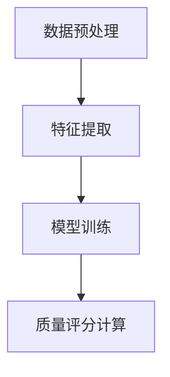

                 


# AI增强型公司质量评分系统

## 关键词：AI增强型系统，公司质量评分，企业评估，机器学习，评分模型

## 摘要：本文介绍了一种基于人工智能的企业质量评分系统，探讨了该系统的核心概念、算法原理、系统架构以及实际应用。通过详细的技术分析和案例说明，展示了如何利用AI技术提升企业质量评估的效率和准确性。

---

# 第1章: 企业质量评分系统的背景与挑战

## 1.1 企业质量评估的重要性

### 1.1.1 企业质量评估的定义与作用

企业质量评估是通过对公司的多维度数据进行分析，以衡量其整体质量、竞争力和潜在风险。有效的质量评估能够帮助企业识别优势和改进点，为管理层决策提供数据支持。

### 1.1.2 传统企业质量评估的局限性

传统质量评估方法通常依赖于人工收集和分析数据，存在以下问题：
- 数据收集范围有限，难以覆盖所有影响企业质量的因素。
- 评估结果主观性强，受评估者经验影响较大。
- 处理速度较慢，难以满足实时评估的需求。

### 1.1.3 引入AI技术的必要性

人工智能技术可以通过自动化数据处理、模式识别和预测分析，显著提升企业质量评估的效率和准确性。AI能够处理大量非结构化数据，并发现传统方法难以察觉的潜在问题。

## 1.2 AI增强型质量评分系统的概念

### 1.2.1 系统的核心目标

AI增强型公司质量评分系统的目标是通过整合多源数据，利用机器学习算法，生成客观、准确的企业质量评分。

### 1.2.2 系统的主要功能

- 数据采集：从企业财务报表、市场反馈、社交媒体等多个渠道获取数据。
- 数据预处理：清洗和标准化数据，确保数据质量。
- 模型训练：利用机器学习算法训练评分模型。
- 质量评分计算：基于训练好的模型，输出企业质量评分。
- 可视化展示：以图表形式展示评分结果，方便用户理解。

### 1.2.3 系统的适用场景与边界

适用于需要快速、准确评估企业质量的场景，如投资决策、风险评估等。系统适用于数据充足的行业，但需注意数据隐私和合规性问题。

## 1.3 本章小结

企业质量评估是企业管理中的重要环节，传统方法存在诸多局限。引入AI技术，构建AI增强型质量评分系统，能够显著提升评估效率和准确性。下一章将详细探讨系统的核心概念。

---

# 第2章: AI增强型公司质量评分系统的原理与核心概念

## 2.1 系统的核心概念

### 2.1.1 数据源的定义与分类

数据源包括企业财务数据、市场反馈、社交媒体评论等。分类如下：
- 结构化数据：如财务报表中的数值型数据。
- 非结构化数据：如文本评论、图像等。

### 2.1.2 AI模型的作用机制

AI模型通过学习数据中的特征，识别影响企业质量的关键因素，并预测企业质量评分。

### 2.1.3 质量评分的计算逻辑

质量评分是基于多个特征的加权和，每个特征的重要性由模型学习确定。

## 2.2 核心概念之间的关系

### 2.2.1 数据源与AI模型的关系

数据源是模型训练的基础，模型通过学习数据源中的特征，生成评分结果。

### 2.2.2 AI模型与质量评分的关系

AI模型是评分计算的核心工具，模型输出即为质量评分。

### 2.2.3 质量评分与企业决策的关系

质量评分用于辅助企业决策，如投资决策、风险控制等。

## 2.3 系统的核心要素

### 2.3.1 数据采集模块

负责从多个渠道获取企业数据。

### 2.3.2 数据预处理模块

清洗和标准化数据，确保数据质量。

### 2.3.3 AI模型训练模块

利用机器学习算法训练评分模型。

### 2.3.4 质量评分计算模块

基于训练好的模型，输出企业质量评分。

## 2.4 本章小结

AI增强型质量评分系统的核心概念包括数据源、AI模型和质量评分。下一章将详细讲解系统的算法原理。

---

# 第3章: AI增强型质量评分系统的算法原理

## 3.1 算法原理概述

### 3.1.1 系统的总体流程

1. 数据预处理：清洗和标准化数据。
2. 特征提取：提取影响企业质量的关键特征。
3. 模型训练：训练机器学习模型。
4. 质量评分计算：利用模型计算企业质量评分。

## 3.2 算法实现细节

### 3.2.1 数据特征提取

- 文本特征提取：使用TF-IDF提取关键词。
- 图像特征提取：使用CNN提取图像特征。

### 3.2.2 模型训练与优化

- 选择合适的算法：如随机森林、神经网络。
- 调整超参数：如学习率、树深度。

### 3.2.3 质量评分计算

- 使用训练好的模型预测质量评分。

## 3.3 算法的数学模型与公式

### 3.3.1 线性回归模型

$$ y = \beta_0 + \beta_1x + \epsilon $$

### 3.3.2 逻辑回归模型

$$ P(y=1|x) = \frac{e^{\beta_0 + \beta_1x}}{1 + e^{\beta_0 + \beta_1x}} $$

### 3.3.3 神经网络模型

$$ y = f(Wx + b) $$

## 3.4 算法流程图



## 3.5 本章小结

本章详细讲解了AI增强型质量评分系统的算法原理，包括数据预处理、特征提取和模型训练。下一章将介绍系统的架构设计。

---

# 第4章: AI增强型公司质量评分系统的系统分析与架构设计

## 4.1 系统分析

### 4.1.1 问题场景介绍

企业需要快速、准确地评估其质量，以支持投资决策和风险控制。

### 4.1.2 系统需求分析

- 数据采集：实时采集企业数据。
- 数据处理：高效处理数据。
- 模型训练：快速训练模型。

## 4.2 系统架构设计

### 4.2.1 系统功能设计

- 数据采集模块：从多个来源获取数据。
- 数据处理模块：清洗和标准化数据。
- 模型训练模块：训练评分模型。
- 质量评分计算模块：输出质量评分。

### 4.2.2 系统架构图


## 4.3 系统接口设计

### 4.3.1 系统交互流程

1. 用户提交企业ID。
2. 系统采集企业数据。
3. 数据预处理。
4. 训练模型并计算质量评分。
5. 返回质量评分。

## 4.4 本章小结

本章详细介绍了系统的架构设计和接口设计，为后续的实现奠定了基础。

---

# 第5章: AI增强型公司质量评分系统的项目实战

## 5.1 环境安装

- Python 3.8+
- 机器学习库：scikit-learn、TensorFlow
- 数据处理库：Pandas、NumPy
- 可视化库：Matplotlib、Seaborn

## 5.2 系统核心实现源代码

```python
import pandas as pd
import numpy as np
from sklearn.model_selection import train_test_split
from sklearn.linear_model import LinearRegression
from sklearn.metrics import mean_squared_error

# 数据加载
data = pd.read_csv('company_data.csv')

# 数据预处理
# 假设目标变量是'score'
X = data.drop('score', axis=1)
y = data['score']

# 划分训练集和测试集
X_train, X_test, y_train, y_test = train_test_split(X, y, test_size=0.2, random_state=42)

# 模型训练
model = LinearRegression()
model.fit(X_train, y_train)

# 模型预测
y_pred = model.predict(X_test)

# 模型评估
mse = mean_squared_error(y_test, y_pred)
print(f"均方误差: {mse}")
```

## 5.3 代码应用解读与分析

上述代码展示了如何使用线性回归模型进行质量评分预测。数据加载、预处理、模型训练和评估是实现评分系统的关键步骤。

## 5.4 实际案例分析

以某公司为例，假设数据中包含财务指标和市场反馈。通过模型训练，可以预测该公司的质量评分。

## 5.5 项目小结

本章通过实际案例展示了AI增强型质量评分系统的实现过程，从数据准备到模型训练，再到结果分析，帮助读者掌握系统的实际应用。

---

# 第6章: 总结与展望

## 6.1 总结

AI增强型公司质量评分系统通过整合多源数据和机器学习算法，显著提升了企业质量评估的效率和准确性。系统的实现依赖于数据预处理、模型训练和评分计算三个核心步骤。

## 6.2 优化建议

- 数据源扩展：引入更多维度的数据。
- 模型优化：尝试更复杂的模型，如深度学习模型。
- 可视化提升：开发用户友好的可视化界面。

## 6.3 未来展望

随着AI技术的不断发展，AI增强型质量评分系统将在企业评估领域发挥更重要的作用，帮助企业在复杂多变的市场环境中做出更明智的决策。

## 6.4 注意事项

- 数据隐私：确保数据处理符合相关法规。
- 模型解释性：选择解释性较强的模型，便于用户理解。
- 系统维护：定期更新模型，确保评估结果的准确性。

## 6.5 拓展阅读

建议读者进一步学习机器学习和自然语言处理技术，以深入了解系统的实现细节。

---

# 作者：AI天才研究院 & 禅与计算机程序设计艺术

通过本文的详细介绍，读者可以全面理解AI增强型公司质量评分系统的实现过程，并将其应用于实际的企业评估场景中。

