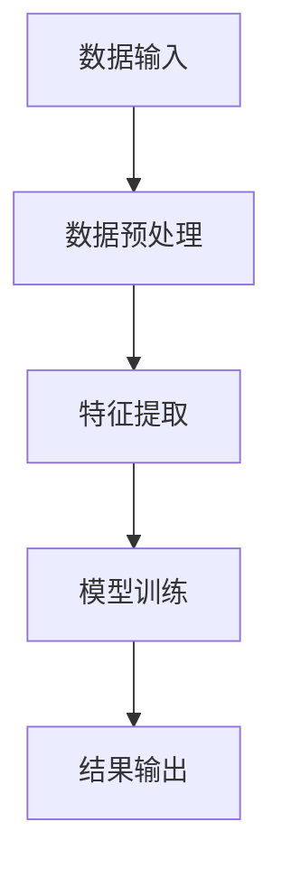
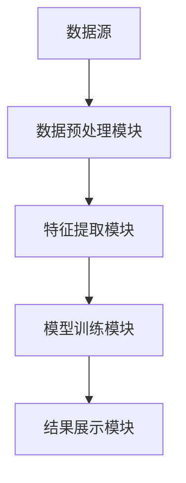

                 


# AI增强型格雷厄姆安全边际计算

> 关键词：安全边际计算、人工智能、投资决策、机器学习、数据驱动

> 摘要：本文探讨了如何利用人工智能技术增强格雷厄姆的安全边际计算方法，通过数据驱动的模型优化投资决策，降低风险。文章详细介绍了AI在安全边际计算中的应用，包括算法原理、系统设计和实际案例，展示了AI如何提升传统金融分析的效率和准确性。

---

## 第一部分：背景介绍

### 第1章：安全边际与AI的结合

#### 1.1 安全边际的基本概念

安全边际是投资学中的一个重要概念，由本杰明·格雷厄姆提出，指股票价格低于其内在价值时的差额。这种差额为投资者提供了风险缓冲区，确保在市场波动时仍能获得收益。传统计算方法依赖于财务指标和市场分析，但随着数据量的增加和市场的复杂性，这种方法的效率和准确性受到限制。

#### 1.2 AI在安全边际计算中的应用

人工智能（AI）和机器学习（ML）技术的兴起，为安全边际的计算提供了新的可能性。AI能够处理大量非结构化数据，识别传统方法难以察觉的模式，从而优化预测模型。通过引入AI，投资者可以更精准地评估内在价值，确定安全边际，降低投资风险。

---

## 第二部分：核心概念与联系

### 第2章：AI增强型安全边际的核心原理

#### 2.1 AI模型的基本原理

AI模型，尤其是深度学习模型，能够从大量数据中学习复杂的模式。监督学习、无监督学习和强化学习等方法各有优劣，适用于不同的应用场景。例如，监督学习适用于有标签的数据，用于预测股票价格；无监督学习则适合于发现隐藏的市场趋势。

#### 2.2 核心概念的ER实体关系图

通过ER图，我们可以清晰地看到安全边际计算系统中的各个实体及其关系：

```mermaid
erd
title 安全边际计算系统实体关系图

actor 投资者
actor 分析师

database 安全边际计算系统

table 数据源
    id 数据ID
    类型 数据类型
    价值 数据值

table 数据预处理
    id 数据ID
    类型 数据类型
    处理后特征

table 特征提取
    id 数据ID
    特征名称
    特征值

table 模型训练
    id 模型ID
    类型 模型类型
    训练数据来源

table 安全边际计算结果
    id 计算ID
    投资标的名称
    计算时间
    计算结果
```

---

## 第三部分：算法原理讲解

### 第3章：AI增强型安全边际计算算法

#### 3.1 算法流程图

AI增强型安全边际计算的流程如下：



#### 3.2 算法实现代码

以下是使用线性回归模型进行安全边际预测的示例代码：

```python
import numpy as np
from sklearn.linear_model import LinearRegression
from sklearn.metrics import mean_squared_error

# 示例数据
X = np.array([[1], [2], [3], [4]])
y = np.array([2, 4, 6, 8])

# 模型训练
model = LinearRegression()
model.fit(X, y)

# 预测
预测值 = model.predict(X)
print("预测值:", 预测值)

# 评估
mse = mean_squared_error(y, 预测值)
print("均方误差:", mse)

# 方程系数
r_sq = model.score(X, y)
print("决定系数:", r_sq)
```

#### 3.3 数学模型和公式

线性回归模型的损失函数可以表示为：

$$ L = \frac{1}{2m} \sum_{i=1}^{m} (y_i - \hat{y_i})^2 $$

其中，$m$ 是样本数量，$y_i$ 是真实值，$\hat{y_i}$ 是预测值。优化目标是最小化这个损失函数。

---

## 第四部分：系统分析与架构设计

### 第4章：系统设计

#### 4.1 系统架构设计

系统架构包括数据收集、预处理、模型训练和结果展示四个部分：



#### 4.2 功能设计

系统功能模块包括：

1. **数据收集模块**：从多个来源收集市场数据。
2. **数据预处理模块**：清洗数据，处理缺失值和异常值。
3. **特征提取模块**：提取关键特征，如市盈率、市净率等。
4. **模型训练模块**：训练AI模型，生成预测结果。
5. **结果展示模块**：可视化结果，辅助投资决策。

---

## 第五部分：项目实战

### 第5章：项目实战

#### 5.1 环境安装与配置

安装必要的库：

```bash
pip install numpy pandas scikit-learn matplotlib
```

#### 5.2 核心实现代码

以下是完整的项目实现代码：

```python
import numpy as np
import pandas as pd
from sklearn.linear_model import LinearRegression
from sklearn.metrics import mean_squared_error
import matplotlib.pyplot as plt

# 数据准备
data = {'价格': [1, 2, 3, 4], '内在价值': [2, 4, 6, 8]}
df = pd.DataFrame(data)

# 模型训练
model = LinearRegression()
X = df[['价格']]
y = df['内在价值']
model.fit(X, y)

# 预测
预测值 = model.predict(X)
print("预测值:", 预测值)

# 可视化
plt.scatter(X, y, color='blue')
plt.plot(X, 预测值, color='red')
plt.xlabel('价格')
plt.ylabel('内在价值')
plt.title('安全边际计算')
plt.show()
```

#### 5.3 实际案例分析

以某个股票为例，计算其安全边际。假设股票价格为50元，内在价值为60元，计算出的安全边际为10元。这表明该股票具有投资价值，因为价格低于内在价值。

---

## 第六部分：总结与展望

### 第6章：总结与展望

#### 6.1 总结

本文详细探讨了AI增强型格雷厄姆安全边际计算的方法，展示了如何利用机器学习技术优化传统计算方法，提升投资决策的效率和准确性。

#### 6.2 未来展望

未来的研究可以集中在以下方面：

1. **引入更复杂的模型**：如随机森林、梯度提升树等，提高预测精度。
2. **多因素模型**：考虑更多影响因素，如宏观经济指标。
3. **实时计算**：开发实时数据处理系统，及时捕捉市场变化。

---

## 作者

作者：AI天才研究院/AI Genius Institute  
& 禅与计算机程序设计艺术 /Zen And The Art of Computer Programming

