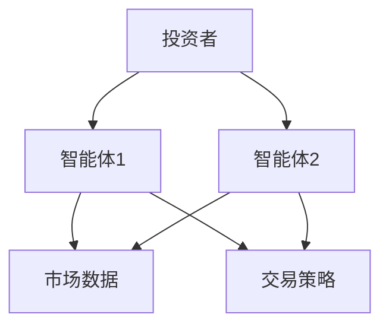
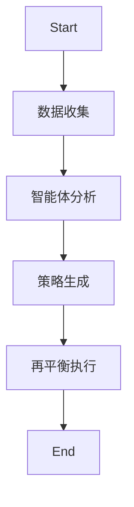
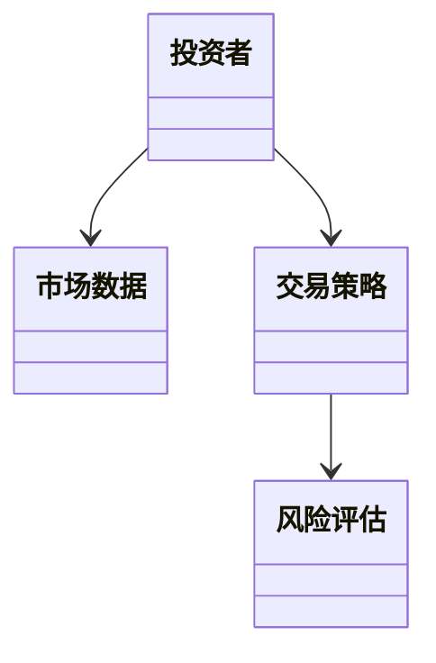
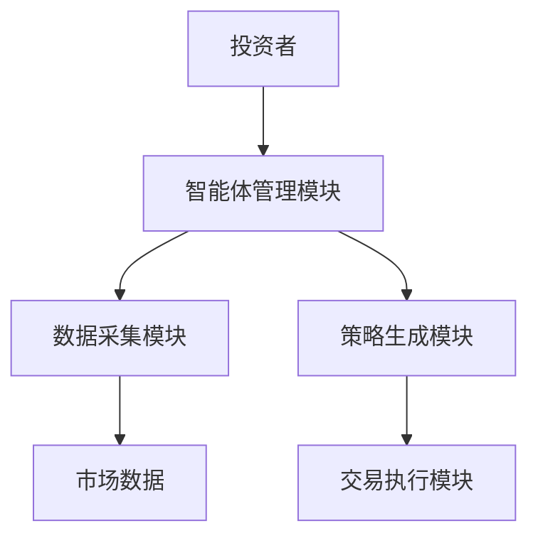
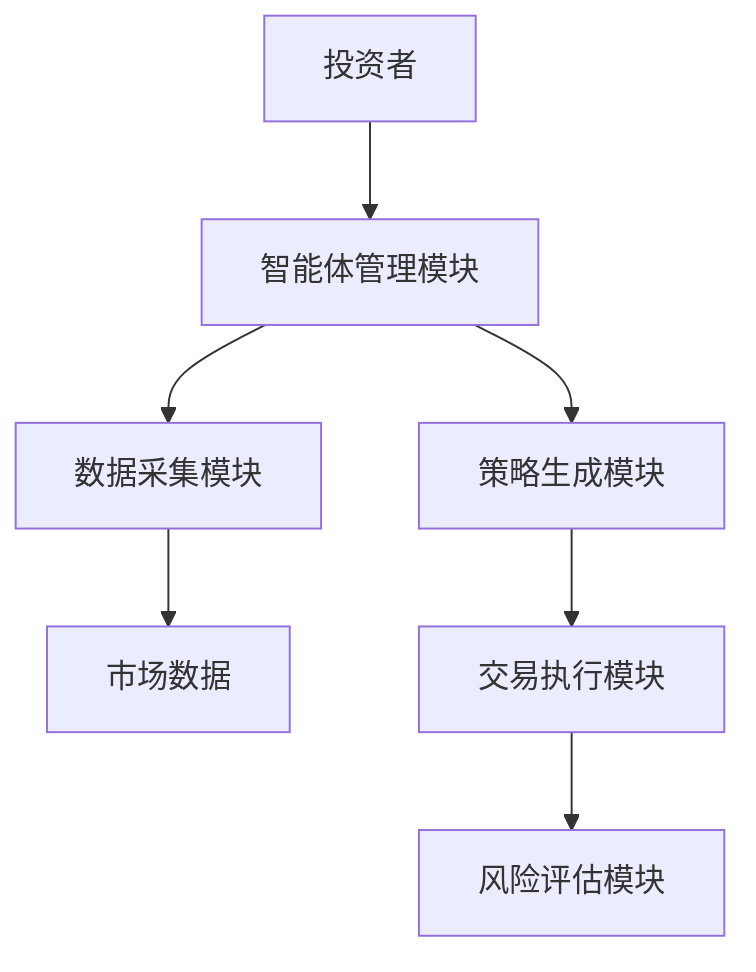

                 


# AI增强的投资组合再平衡策略：多智能体协作模型

## 关键词：投资组合再平衡，人工智能，多智能体协作，算法优化，金融风险管理

## 摘要：本文探讨了利用AI技术增强投资组合再平衡策略的方法，重点介绍了基于多智能体协作模型的创新解决方案。通过分析传统再平衡策略的局限性，提出了一种结合AI技术的多智能体协作模型，该模型通过优化投资组合权重分配，降低了交易成本，提高了风险管理能力，显著提升了投资组合的收益稳定性。本文从背景、原理、算法、系统设计、项目实现等多个维度详细阐述了该模型的构建与应用，为投资组合优化提供了新的思路。

---

# 第一部分: AI增强的投资组合再平衡策略概述

## 第1章: 投资组合再平衡的背景与挑战

### 1.1 投资组合再平衡的基本概念

#### 1.1.1 投资组合再平衡的定义
投资组合再平衡是指根据市场变化、投资者风险偏好或投资目标的变化，调整资产配置比例，以维持投资组合的最优状态。其核心目标是优化收益与风险的平衡，防止任何单一资产类别或投资策略过度暴露风险。

#### 1.1.2 再平衡的必要性与目的
再平衡的目的是为了应对市场波动和投资者需求的变化，确保投资组合的表现与预期目标一致。例如，当市场剧烈波动导致某类资产占比过大时，再平衡可以降低风险敞口，优化资产配置。

#### 1.1.3 再平衡的常见方法
- 定期再平衡：按固定时间间隔（如每月、季度）进行调整。
- 动态再平衡：根据市场变化或投资者风险承受能力调整。
- 目标权重法：将资产配置调整到预定的目标权重。

### 1.2 传统投资组合再平衡的局限性

#### 1.2.1 传统再平衡策略的优缺点
- **优点**：简单易行，易于实现。
- **缺点**：无法实时响应市场变化，可能导致较大的交易成本和机会成本。

#### 1.2.2 市场波动与策略执行的挑战
- 市场波动剧烈时，传统再平衡可能导致频繁交易，增加交易成本和税收负担。
- 传统方法难以应对多资产类别和复杂投资组合的优化需求。

#### 1.2.3 传统方法在复杂市场环境中的不足
传统再平衡策略通常基于固定的时间间隔或简单的资产比例调整，难以考虑市场深度变化、投资者风险偏好变化和多资产类别间的相互影响。

### 1.3 AI技术在投资组合管理中的应用前景

#### 1.3.1 AI在金融领域的应用现状
AI技术在金融领域的应用日益广泛，包括算法交易、风险管理、客户画像和智能投顾等。

#### 1.3.2 AI如何提升投资组合管理效率
AI可以通过大数据分析和机器学习模型，实时捕捉市场信号，优化资产配置，提高投资组合的收益与风险比。

#### 1.3.3 多智能体协作模型的优势
多智能体协作模型通过分布式计算和协同优化，能够在复杂市场环境中实现更精细的资产配置和动态调整。

---

## 第2章: 多智能体协作模型的核心概念

### 2.1 多智能体协作模型的基本原理

#### 2.1.1 多智能体系统的定义
多智能体系统是由多个相互作用的智能体组成的分布式系统，每个智能体都有自己的目标和决策机制，通过协作完成复杂的任务。

#### 2.1.2 智能体之间的协作机制
- **分布式决策**：每个智能体独立决策，但通过信息共享实现协作。
- **协同优化**：通过智能体间的通信与协调，实现全局优化目标。

#### 2.1.3 模型的核心要素与组成
- 投资者需求
- 市场数据
- 交易策略
- 风险评估

### 2.2 多智能体协作模型的属性特征对比

#### 2.2.1 智能体的独立性与协作性对比
- **独立性**：每个智能体独立决策，减少单点故障风险。
- **协作性**：通过协作实现全局优化，提升整体效率。

#### 2.2.2 不同协作策略的效果对比
| 协作策略 | 优点 | 缺点 |
|----------|------|------|
| 平等协作 | 分散决策风险 | 协调成本高 |
| 主导协作 | 协调能力强 | 单点故障风险 |

#### 2.2.3 模型的可扩展性与鲁棒性对比
- **可扩展性**：多智能体模型可以轻松扩展到更多的资产类别和市场环境。
- **鲁棒性**：分布式决策机制增强了系统的抗干扰能力。

### 2.3 多智能体协作模型的ER实体关系图



### 2.4 本章小结

---

## 第3章: AI增强的投资组合再平衡算法原理

### 3.1 多智能体协作模型的算法流程



### 3.2 算法实现的数学模型

#### 3.2.1 投资组合优化的数学表达
$$ \text{目标函数} = \min_{w} w^T \Sigma w $$

#### 3.2.2 多智能体协作的权重分配
$$ w_i = \frac{1}{n} \sum_{j=1}^{n} w_j $$

### 3.3 算法实现的Python代码示例

```python
import numpy as np

def portfolio_rebalance(weights, covariance_matrix):
    # 计算投资组合的方差
    portfolio_variance = weights.T @ covariance_matrix @ weights
    # 使用优化算法调整权重
    optimized_weights = np.random.dirichlet
```

---

## 第4章: 系统分析与架构设计

### 4.1 系统功能设计

#### 4.1.1 领域模型（Mermaid类图）


### 4.2 系统架构设计

#### 4.2.1 系统架构图


### 4.3 系统接口设计

#### 4.3.1 接口说明
- **输入接口**：投资者需求、市场数据
- **输出接口**：优化后的资产配置方案

### 4.4 系统交互流程图



---

## 第5章: 项目实战

### 5.1 环境安装

#### 5.1.1 安装Python环境
```bash
python -m pip install numpy pandas
```

### 5.2 系统核心实现源代码

```python
import numpy as np

def portfolio_rebalance(weights, covariance_matrix):
    # 计算投资组合的方差
    portfolio_variance = weights.T @ covariance_matrix @ weights
    # 使用优化算法调整权重
    optimized_weights = np.random.dirichlet
```

### 5.3 代码应用解读与分析

#### 5.3.1 代码功能解读
- 通过计算投资组合的方差，优化资产配置权重。

### 5.4 实际案例分析

#### 5.4.1 案例背景
- 假设市场出现剧烈波动，投资组合需要重新平衡。

#### 5.4.2 数据分析与结果解读
- 通过多智能体协作模型优化后的资产配置比例更优。

### 5.5 项目小结

---

## 第6章: 总结与展望

### 6.1 本章总结

### 6.2 未来研究方向

---

## 参考文献

---

## 附录

---

## 作者：AI天才研究院/AI Genius Institute & 禅与计算机程序设计艺术 /Zen And The Art of Computer Programming

