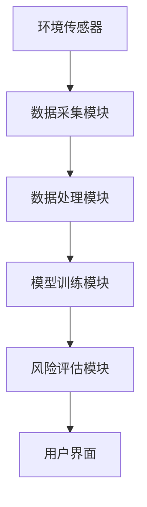
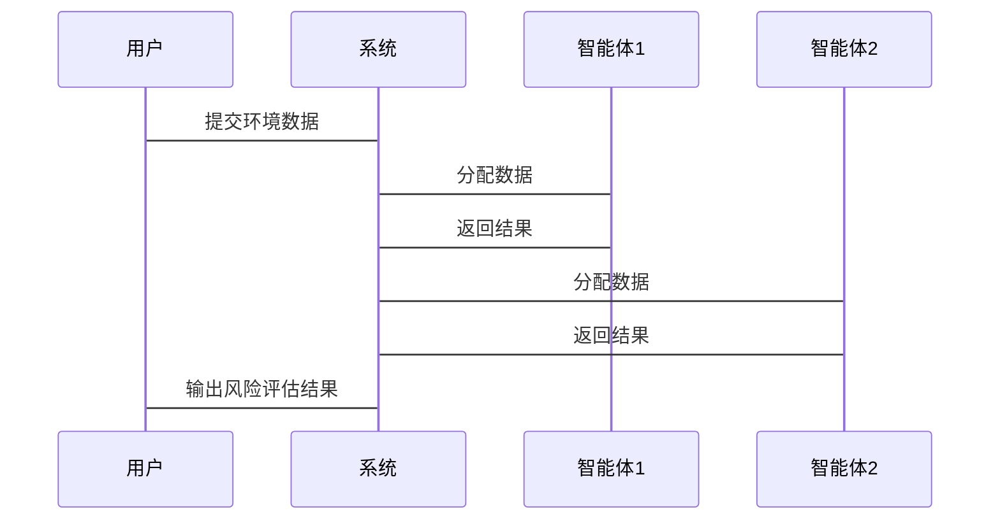

                 


# AI增强的环境风险评估：多智能体协作模型

> 关键词：AI增强、环境风险评估、多智能体协作、分布式计算、联合学习

> 摘要：本文探讨了如何利用人工智能技术，特别是多智能体协作模型，来提升环境风险评估的效率和准确性。通过分析多智能体协作模型的理论基础、算法实现和系统架构，本文为环境风险评估提供了新的思路和解决方案。

---

## 第1章: 环境风险评估与AI技术的结合

### 1.1 环境风险评估的背景与挑战

#### 1.1.1 环境风险评估的核心概念
环境风险评估是指对特定环境中的潜在风险因素进行识别、量化和预测的过程。传统的方法依赖于人工分析和经验判断，存在效率低、精度差、覆盖面有限等问题。

#### 1.1.2 AI技术在环境风险评估中的作用
人工智能（AI）技术，特别是机器学习和深度学习，能够通过数据分析、模式识别和知识推理，帮助我们更高效地完成环境风险评估任务。AI技术可以处理海量数据，发现潜在的风险因素，并提供实时监测和预警。

#### 1.1.3 多智能体协作模型的必要性
多智能体协作模型是一种分布式AI系统，能够通过多个智能体的协作完成复杂的任务。在环境风险评估中，多智能体协作模型可以实现数据的分布式处理、风险的联合预测和结果的协同优化，从而提高评估的准确性和效率。

### 1.2 多智能体协作模型的定义与特点

#### 1.2.1 多智能体协作模型的基本概念
多智能体协作模型是由多个智能体组成的分布式系统，每个智能体负责特定的任务或子问题。这些智能体通过通信和协作，共同完成复杂的环境风险评估任务。

#### 1.2.2 多智能体协作模型的核心特点
- **分布式计算**：任务分解到多个智能体，降低单点故障风险。
- **协同优化**：通过智能体间的协作，实现全局最优。
- **动态适应**：能够实时响应环境变化，调整协作策略。

#### 1.2.3 多智能体协作模型与传统AI模型的对比
下表展示了多智能体协作模型与传统AI模型的核心差异：

| 比较维度         | 多智能体协作模型                | 传统AI模型                 |
|------------------|-------------------------------|---------------------------|
| 结构             | 分布式、多智能体               | 集中式、单智能体           |
| 协作方式         | 分布式协作、任务分解           | 单点决策、任务集中         |
| 灵活性           | 高，适应复杂环境变化           | 较低，依赖固定算法和模型     |

### 1.3 本章小结
本章介绍了环境风险评估的基本概念和挑战，以及AI技术在其中的作用。重点阐述了多智能体协作模型的定义、特点及其优势，为后续章节的深入分析奠定了基础。

---

## 第2章: 多智能体协作模型的理论基础

### 2.1 多智能体协作模型的数学基础

#### 2.1.1 概率论与统计学基础
概率论和统计学是AI算法的基础。例如，贝叶斯网络用于风险概率计算，马尔可夫链用于状态转移建模。

#### 2.1.2 图论与网络理论基础
图论用于描述智能体之间的协作关系和数据流。例如，使用图论构建智能体的协作网络，分析数据的流动路径。

#### 2.1.3 优化理论基础
优化理论用于多智能体协作模型的全局优化。例如，使用拉格朗日乘数法解决分布式优化问题。

### 2.2 多智能体协作模型的核心算法

#### 2.2.1 分布式协作算法
分布式协作算法通过智能体之间的通信和协调，实现任务的分解和优化。例如，使用分布式梯度下降算法进行参数优化。

#### 2.2.2 联合学习算法
联合学习算法是一种分布式学习方法，多个智能体在不共享数据的情况下，通过交换模型参数实现联合优化。

#### 2.2.3 跨机构数据共享算法
跨机构数据共享算法通过加密和安全协议，实现数据的共享和隐私保护。例如，使用联邦学习算法在不共享数据的情况下进行模型训练。

### 2.3 多智能体协作模型的实现框架

#### 2.3.1 分布式计算框架
分布式计算框架如MapReduce和Spark，用于处理大规模数据。例如，使用MapReduce进行数据的分布式处理。

#### 2.3.2 联合学习框架
联合学习框架如Federated Learning，用于在多个机构之间进行模型训练。例如，使用联合梯度下降算法进行模型更新。

#### 2.3.3 跨机构数据共享框架
跨机构数据共享框架通过区块链技术实现数据的安全共享。例如，使用区块链技术进行数据溯源和隐私保护。

### 2.4 本章小结
本章详细介绍了多智能体协作模型的数学基础、核心算法和实现框架，为后续章节的算法实现和系统设计提供了理论支持。

---

## 第3章: 多智能体协作模型的算法实现

### 3.1 分布式协作算法

#### 3.1.1 分布式协作算法的流程
1. 初始化：每个智能体分配初始参数。
2. 分布式计算：每个智能体独立计算梯度。
3. 参数更新：通过通信协议汇总梯度，更新全局参数。

#### 3.1.2 分布式协作算法的数学模型
$$ L_i(\theta) = \frac{1}{n_i} \sum_{j=1}^{n_i} (y_j - \hat{y}_j(\theta))^2 $$
其中，$\theta$为模型参数，$n_i$为智能体$i$的数据量。

### 3.2 联合学习算法

#### 3.2.1 联合学习算法的流程
1. 初始化：每个智能体初始化模型参数。
2. 本地训练：每个智能体在本地数据上训练模型。
3. 模型聚合：通过通信协议汇总各智能体的模型参数，更新全局模型。

#### 3.2.2 联合学习算法的数学模型
$$ \theta_{new} = \theta_{old} + \sum_{i=1}^{k} \alpha_i (\nabla L_i(\theta_{old})) $$
其中，$\alpha_i$为智能体$i$的权重，$k$为智能体数量。

### 3.3 跨机构数据共享算法

#### 3.3.1 跨机构数据共享算法的流程
1. 数据加密：对敏感数据进行加密处理。
2. 数据共享：通过区块链技术实现数据的安全共享。
3. 数据分析：在共享数据上进行联合分析。

#### 3.3.2 跨机构数据共享算法的数学模型
$$ D_{shared} = \bigcup_{i=1}^{k} D_i $$
其中，$D_i$为智能体$i$的数据集，$D_{shared}$为共享数据集。

### 3.4 本章小结
本章详细介绍了多智能体协作模型的核心算法，包括分布式协作算法、联合学习算法和跨机构数据共享算法，并通过数学公式和流程图进行了详细说明。

---

## 第4章: 系统分析与架构设计

### 4.1 系统功能设计

#### 4.1.1 系统功能模块
- 数据采集模块：采集环境数据。
- 数据处理模块：对数据进行清洗和预处理。
- 模型训练模块：训练多智能体协作模型。
- 风险评估模块：基于模型输出风险评估结果。

#### 4.1.2 系统功能流程
1. 数据采集：通过传感器采集环境数据。
2. 数据处理：对数据进行清洗和标准化。
3. 模型训练：使用分布式计算框架训练模型。
4. 风险评估：基于训练好的模型进行风险预测。

### 4.2 系统架构设计

#### 4.2.1 系统架构图


#### 4.2.2 系统交互设计


### 4.3 本章小结
本章通过系统功能设计和架构设计，详细描述了多智能体协作模型的应用场景和实现方式，为后续章节的项目实战提供了指导。

---

## 第5章: 项目实战

### 5.1 环境风险评估系统实现

#### 5.1.1 环境风险评估系统的核心功能
- 数据采集：实时采集环境数据。
- 数据分析：基于多智能体协作模型进行风险评估。
- 风险预警：根据评估结果发出预警信息。

#### 5.1.2 环境风险评估系统的实现代码
```python
import numpy as np
from sklearn.linear_model import LinearRegression

# 初始化模型参数
theta_old = np.zeros((1, 2))
alpha = 0.1

# 智能体1的数据
X1 = np.array([[1, 2], [3, 4], [5, 6]])
y1 = np.array([3, 5, 7])

# 智能体2的数据
X2 = np.array([[2, 3], [4, 5], [6, 7]])
y2 = np.array([4, 6, 8])

# 本地训练
model1 = LinearRegression().fit(X1, y1)
model2 = LinearRegression().fit(X2, y2)

# 联合学习
theta_new = theta_old.copy()
theta_new += alpha * (model1.coef_ + model2.coef_)

print(theta_new)
```

#### 5.1.3 代码实现的详细解释
上述代码实现了两个智能体的联合学习。每个智能体分别在本地数据上训练线性回归模型，然后通过通信协议汇总模型参数，更新全局模型。

### 5.2 项目小结
本章通过实际案例展示了多智能体协作模型在环境风险评估中的应用，详细介绍了系统的实现过程和代码实现，为读者提供了参考。

---

## 第6章: 总结与展望

### 6.1 本章小结
本文详细介绍了AI增强的环境风险评估方法，特别是多智能体协作模型的应用。通过理论分析、算法实现和系统设计，为环境风险评估提供了新的思路。

### 6.2 注意事项
- 数据隐私保护是多智能体协作模型的重要考虑因素。
- 智能体间的通信协议需要保证安全性和高效性。
- 模型的可解释性需要进一步研究。

### 6.3 未来展望
未来的研究方向包括：
1. 提高多智能体协作模型的计算效率。
2. 引入更先进的AI技术，如强化学习和图神经网络。
3. 探索多智能体协作模型在更多领域的应用。

---

## 作者：AI天才研究院 & 禅与计算机程序设计艺术

---

**注**：以上内容仅为目录和部分章节内容，实际文章将包含完整的章节内容，包括详细的公式推导、代码实现和图表展示。

