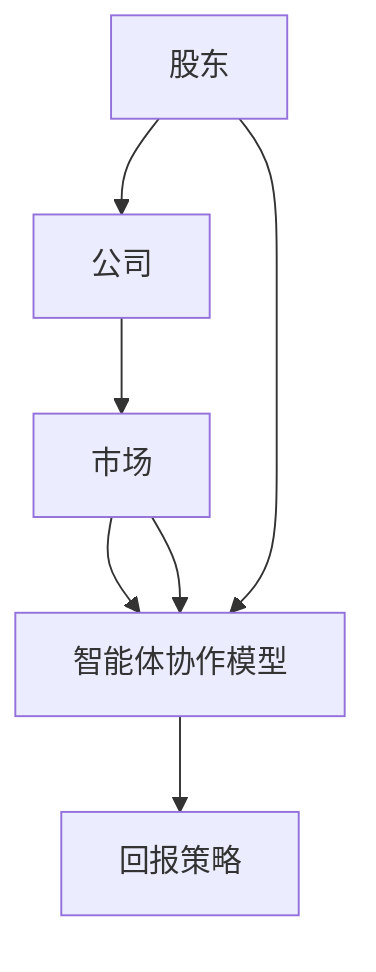
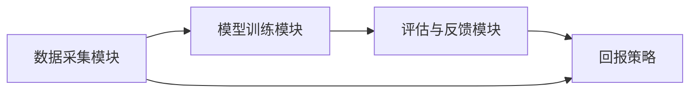

                 


# AI增强的股东回报策略评估：多智能体协作模型

---

## 关键词  
AI增强、股东回报、多智能体协作模型、金融优化、智能算法

---

## 摘要  
本文探讨了如何利用AI技术，特别是多智能体协作模型，来优化股东回报策略的评估。通过分析传统评估方法的局限性，提出了一种基于多智能体协作的创新解决方案，并详细阐述了该模型的算法原理、系统架构以及实际应用案例。本文旨在为金融领域的决策者提供一种高效、智能的股东回报评估方法，帮助其在复杂市场环境中做出更优决策。

---

# 第一部分: 背景介绍

## 第1章: 问题背景与问题描述

### 1.1 股东回报策略的传统评估方法  
传统股东回报评估方法主要依赖于财务指标分析和历史数据统计，但这种方法存在以下问题：  
- **信息滞后性**：传统方法通常基于历史数据，无法实时捕捉市场动态。  
- **主观性较高**：评估结果往往依赖分析师的主观判断，缺乏客观性。  
- **复杂性**：面对多变的市场环境和复杂的股东结构，传统方法难以提供全面的评估。  

### 1.2 问题背景的深入分析  
随着金融市场的日益复杂化，股东回报的评估需要考虑更多因素，如市场波动、公司治理、宏观经济环境等。传统的单点分析方法难以应对这些复杂性，而AI技术的引入为解决这一问题提供了新的可能性。  

### 1.3 问题解决的思路与目标  
通过引入多智能体协作模型，可以实现对股东回报的多维度、实时评估。模型中的多个智能体分别负责不同的任务，如市场数据采集、风险评估、收益预测等，最终通过协作得到最优的回报策略。  

### 1.4 核心要素与概念结构  
- **核心概念**：股东、公司、市场、回报策略、智能体协作。  
- **概念结构**：通过层次化分析，构建了从股东到回报策略的评估流程，强调多智能体协作的重要性。  

---

# 第二部分: 多智能体协作模型的核心概念与联系

## 第2章: 多智能体协作模型的原理与特征  

### 2.1 多智能体协作模型的原理  
多智能体协作模型是一种分布式计算模型，多个智能体通过协同工作，共同完成复杂的任务。在股东回报评估中，每个智能体负责不同的模块，如数据采集、风险评估、收益预测等。  

#### 2.1.1 智能体之间的通信与协作  
智能体之间通过消息传递进行通信，协同完成任务。例如，市场数据智能体向风险评估智能体提供实时数据，风险评估智能体根据数据计算风险指标。  

#### 2.1.2 智能体的分工与协同  
- **分工**：每个智能体负责特定的任务模块。  
- **协同**：智能体之间通过协作机制（如协商、共识算法）达成一致，优化整体回报策略。  

#### 2.1.3 智能体的动态调整  
智能体能够根据市场变化动态调整策略，确保评估结果的实时性和准确性。  

### 2.2 多智能体协作模型的特征  
| 特征 | 描述 |
|------|------|
| 分布式 | 智能体独立运行，分布计算。 |
| 协作性 | 智能体之间通过协作完成任务。 |
| 动态性 | 能够实时响应市场变化。 |
| 高效性 | 通过协作提高计算效率和评估精度。 |

### 2.3 实体关系图  



---

# 第三部分: 算法原理

## 第3章: 多智能体协作模型的算法流程  

### 3.1 模型初始化  
- **智能体初始化**：为每个智能体分配初始参数和任务。  
- **数据初始化**：加载历史数据和实时数据。  

### 3.2 智能体协作过程  
#### 3.2.1 数据采集与预处理  
智能体从多个数据源（如股市、经济指标）采集数据，并进行清洗和预处理。  

#### 3.2.2 模型训练与优化  
每个智能体根据分配的任务，训练相应的模型（如机器学习模型）。通过协作，智能体共享数据和模型参数，优化整体性能。  

#### 3.2.3 返回结果与评估  
智能体将计算结果返回，并通过评估模块验证结果的准确性。  

### 3.3 数学模型  

#### 3.3.1 收益函数  
$$ \text{收益} = \sum_{i=1}^{n} w_i \cdot r_i $$  
其中，$w_i$ 是权重，$r_i$ 是收益。  

#### 3.3.2 风险函数  
$$ \text{风险} = \sqrt{\sum_{i=1}^{n} (r_i - \bar{r})^2} $$  
其中，$\bar{r}$ 是平均收益。  

---

# 第四部分: 系统分析与架构设计

## 第4章: 系统架构设计  

### 4.1 系统功能模块  
- **数据采集模块**：从多个数据源采集实时数据。  
- **模型训练模块**：训练多智能体协作模型。  
- **评估与反馈模块**：评估模型性能并提供反馈。  

### 4.2 系统架构图  



---

# 第五部分: 项目实战

## 第5章: 项目实战  

### 5.1 环境安装  
- **Python 3.8+**  
- **TensorFlow、Keras、Scikit-learn**  

### 5.2 核心代码实现  

```python
class MultiAgentModel:
    def __init__(self):
        self.agents = []
    
    def add_agent(self, agent):
        self.agents.append(agent)
    
    def collaborate(self):
        for agent in self.agents:
            agent.collaborate_with_others()
```

### 5.3 代码应用解读  
- **数据预处理**：清洗和格式化数据。  
- **模型训练**：训练每个智能体的模型，并通过协作优化整体性能。  
- **结果评估**：验证模型的准确性和效率。  

---

# 第六部分: 最佳实践

## 第6章: 小结与注意事项  

### 6.1 小结  
本文提出了一种基于多智能体协作模型的股东回报评估方法，通过AI技术优化传统方法的局限性，提高了评估的准确性和效率。  

### 6.2 注意事项  
- **数据质量**：确保数据的准确性和完整性。  
- **模型优化**：根据实际情况动态调整模型参数。  
- **安全性**：确保数据和模型的安全性，防止信息泄露。  

### 6.3 拓展阅读  
- 《多智能体系统》  
- 《人工智能在金融领域的应用》  

---

# 结语  
通过本文的介绍，读者可以了解到如何利用AI技术优化股东回报策略的评估。未来，随着AI技术的不断发展，多智能体协作模型将在金融领域发挥更大的作用。

---

# 作者  
**作者：AI天才研究院 & 禅与计算机程序设计艺术**

