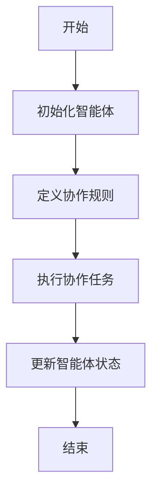
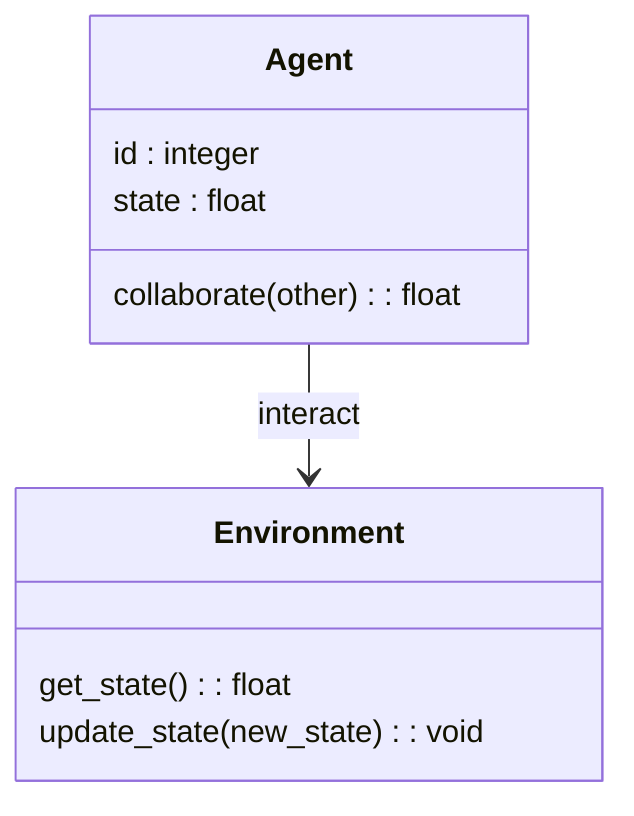
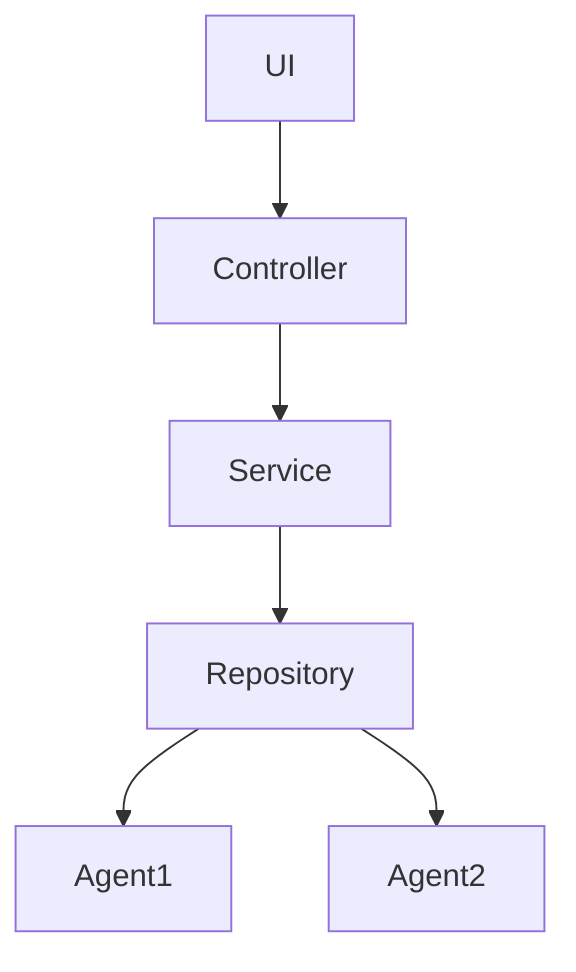

                 


# AI增强的长期增长可持续性评估：多智能体协作模型

**关键词：** AI增强、长期增长、可持续性评估、多智能体协作、评估模型

**摘要：**  
本文探讨了利用多智能体协作模型增强AI在长期增长可持续性评估中的应用。通过分析多智能体协作的原理、算法实现和系统架构，本文提供了从理论到实践的全面指导，展示了如何通过多智能体协作模型提升评估的准确性和效率。

---

## 目录大纲

### 第一部分: AI增强的长期增长可持续性评估背景与概念

#### 第1章: AI增强的长期增长可持续性评估概述

##### 1.1 问题背景与挑战
- 1.1.1 经济增长的可持续性问题
- 1.1.2 AI在可持续性评估中的作用
- 1.1.3 多智能体协作模型的必要性

##### 1.2 多智能体协作模型的基本概念
- 1.2.1 多智能体系统的定义
- 1.2.2 多智能体协作模型的特征
- 1.2.3 模型与传统评估方法的对比

### 第二部分: 多智能体协作模型的核心概念与联系

#### 第2章: 多智能体协作模型的原理

##### 2.1 多智能体协作模型的核心算法
- 2.1.1 分布式计算与协作机制
- 2.1.2 联合学习与知识共享
- 2.1.3 动态权重分配策略

##### 2.2 算法的数学模型
- 2.2.1 协作函数的定义
  $$ f_{collaboration}(x_i, x_j) = \alpha x_i + \beta x_j $$
- 2.2.2 动态权重更新公式
  $$ \omega_i^{(t+1)} = \omega_i^{(t)} + \lambda (x_i - \mu) $$

#### 第3章: 多智能体协作模型的实现算法

##### 3.1 算法流程图


##### 3.2 核心代码实现
```python
class Agent:
    def __init__(self, id, state):
        self.id = id
        self.state = state

def collaborate(agent1, agent2):
    # 定义协作规则
    new_state = (agent1.state + agent2.state) / 2
    return new_state

# 示例代码
agent1 = Agent(1, 0.5)
agent2 = Agent(2, 0.7)
new_state = collaborate(agent1, agent2)
print(f"新状态：{new_state}")
```

### 第三部分: 系统分析与架构设计方案

#### 第4章: 系统架构设计

##### 4.1 问题场景介绍
- 评估经济指标的长期可持续性
- 多智能体协作优化资源分配

##### 4.2 系统功能设计
- **领域模型**：定义系统中的智能体及其交互


##### 4.3 系统架构设计
- **分层架构**：包括数据层、逻辑层和应用层
- **通信机制**：智能体间的通信协议设计


#### 第5章: 系统接口与交互设计

##### 5.1 系统接口设计
- API接口定义
  ```json
  {
    "interface": "collaborate",
    "params": {
        "agent1_id": "1",
        "agent2_id": "2"
    }
  }
  ```

##### 5.2 系统交互流程
- 交互流程图
```mermaid
sequenceDiagram
    participant 用户
    participant 控制器
    participant 服务层
    participant 数据库
    用户 -> 控制器: 请求协作评估
    控制器 -> 服务层: 获取智能体状态
    服务层 -> 数据库: 查询数据
    返回
    服务层 -> 控制器: 更新协作结果
    控制器 -> 用户: 返回评估结果
```

### 第四部分: 项目实战

#### 第6章: 项目实战

##### 6.1 环境安装
- 安装Python、依赖库（如numpy、scikit-learn）
- 安装mermaid和相关工具

##### 6.2 核心代码实现
- 多智能体协作算法实现
```python
import numpy as np

class MultiAgentSystem:
    def __init__(self, num_agents):
        self.agents = [Agent(i) for i in range(num_agents)]
        self.env = Environment()

    def run_episode(self):
        for agent in self.agents:
            state = self.env.get_state()
            action = agent.decide_action(state)
            next_state = self.env.update_state(action)
            agent.update_policy(state, action, next_state)

# 示例
system = MultiAgentSystem(3)
system.run_episode()
```

##### 6.3 代码解读与分析
- 代码功能说明
- 性能优化技巧

##### 6.4 案例分析
- 真实案例分析
- 评估结果解读

### 第五部分: 优化与展望

#### 第7章: 优化与展望

##### 7.1 小结
- 本章总结
- 关键点回顾

##### 7.2 注意事项
- 实施过程中的注意事项
- 常见问题解答

##### 7.3 拓展阅读
- 推荐相关书籍和论文
- 提供进一步学习的方向

---

**作者：AI天才研究院 & 禅与计算机程序设计艺术**  
通过以上目录结构，文章将系统地介绍AI增强的长期增长可持续性评估中的多智能体协作模型，从理论到实践，层层深入，帮助读者全面理解和应用这一模型。

