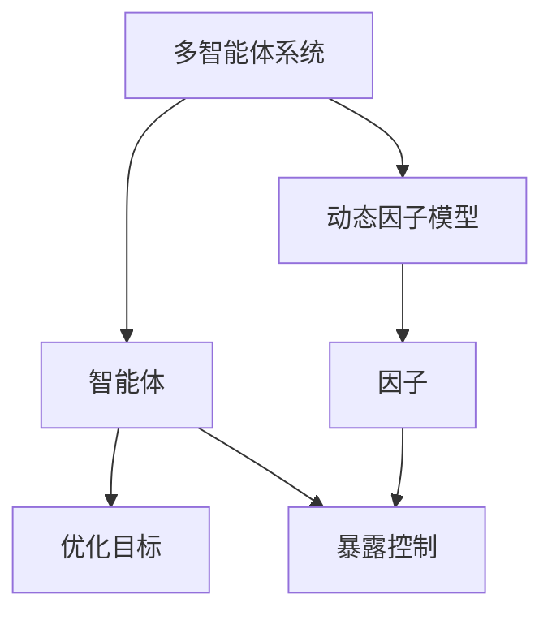
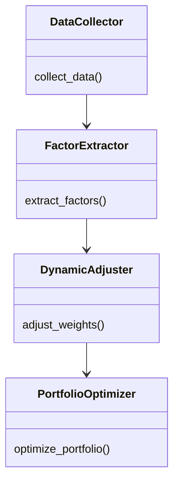
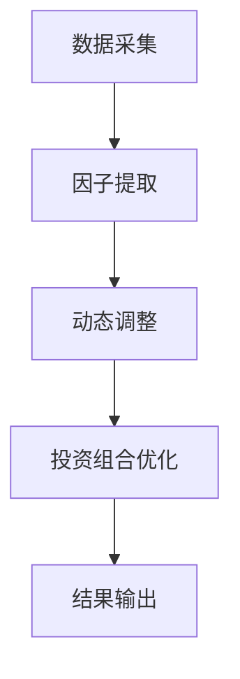
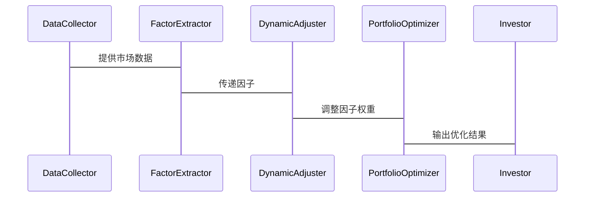

                 


# AI多智能体优化价值投资的动态因子暴露控制

> 关键词：AI多智能体优化，价值投资，动态因子暴露控制，金融投资，机器学习

> 摘要：本文探讨了AI多智能体优化在价值投资中的应用，重点分析了动态因子暴露控制的实现方法及其在投资组合管理中的应用。通过详细讲解多智能体优化的原理、动态因子模型的构建以及两者的结合，本文旨在为金融从业者和研究人员提供一种新的视角来优化投资组合，并降低市场波动带来的风险。

---

## 第一部分: AI多智能体优化价值投资的背景与核心概念

### 第1章: 问题背景与描述

#### 1.1 问题背景

- **金融市场的复杂性与不确定性**：金融市场受多种因素影响，如经济指标、政策变化、市场情绪等，传统的投资方法难以应对这种复杂性。
- **传统投资方法的局限性**：传统投资方法依赖于历史数据分析和人为判断，存在主观性强、计算复杂度高、难以实时调整等缺点。
- **AI技术在金融投资中的应用潜力**：AI技术可以通过大数据分析、机器学习和优化算法，帮助投资者更精准地捕捉市场机会，优化投资组合。

#### 1.2 问题描述

- **多智能体优化的核心问题**：在价值投资中，如何通过多智能体的协同优化，实现投资组合的最优配置。
- **动态因子暴露控制的定义与目标**：动态因子暴露控制是指在投资组合管理中，根据市场变化动态调整因子的暴露程度，以降低风险并提高收益。
- **问题的边界与外延**：本文主要关注多智能体优化在价值投资中的应用，重点研究动态因子暴露控制的实现方法及其在投资组合管理中的应用。

#### 1.3 问题解决与核心要素

- **多智能体优化的价值投资框架**：通过多智能体的协同优化，实现投资组合的动态调整。
- **动态因子暴露控制的实现路径**：通过实时监控市场变化，动态调整因子的权重，以实现风险控制和收益最大化。
- **核心要素的构成与关系**：包括多智能体系统、动态因子模型、优化算法等核心要素，以及它们之间的相互关系。

### 第2章: 核心概念与联系

#### 2.1 多智能体优化的原理

- **多智能体系统的定义与特点**：多智能体系统是由多个智能体组成的分布式系统，每个智能体具有自主性、反应性和协作性。
- **多智能体优化算法的分类与对比**：常见的多智能体优化算法包括粒子群优化（PSO）、蚁群优化（ACO）、蜂群算法（ABC）等，各有优缺点。
- **多智能体优化在价值投资中的应用**：通过多智能体协同优化，实现投资组合的动态调整，捕捉市场机会。

#### 2.2 动态因子暴露控制的原理

- **动态因子模型的定义与特点**：动态因子模型是一种基于因子投资的模型，能够根据市场变化动态调整因子的权重。
- **动态因子暴露控制的实现方法**：通过实时监控市场数据，动态调整因子的暴露程度，以降低投资组合的风险。
- **动态因子暴露控制在投资组合管理中的应用**：通过动态调整因子权重，优化投资组合的收益与风险比。

#### 2.3 核心概念的联系与对比

- **多智能体优化与动态因子暴露控制的联系**：两者都依赖于实时数据和动态调整，能够在复杂市场中实现优化。
- **多智能体优化与动态因子暴露控制的对比**：多智能体优化更注重协同优化，而动态因子暴露控制更注重动态调整。
- **核心概念的ER实体关系图**：



---

## 第二部分: AI多智能体优化价值投资的算法原理

### 第3章: 算法原理与数学模型

#### 3.1 多智能体优化算法原理

- **多智能体优化算法的步骤**：
  1. 初始化智能体参数。
  2. 计算智能体的适应度值。
  3. 更新智能体的位置和速度。
  4. 评估优化结果，调整参数。
- **多智能体优化的数学模型**：
  - 适应度函数：$$f(x) = \sum_{i=1}^{n} x_i$$
  - 位置更新：$$x_i^{new} = x_i + v_i$$
  - 速度更新：$$v_i^{new} = w v_i + c_1 r_1 (x_i - x_i^p) + c_2 r_2 (x_i - x_i^g)$$

#### 3.2 动态因子模型的构建

- **动态因子模型的构建步骤**：
  1. 数据预处理：清洗和标准化数据。
  2. 因子提取：通过主成分分析（PCA）提取因子。
  3. 动态调整因子权重：根据市场变化动态调整因子的权重。
- **动态因子模型的数学公式**：
  - 因子权重调整：$$w_i = \alpha \cdot w_i^{prev} + (1 - \alpha) \cdot \beta$$
  - 投资组合收益：$$R = \sum_{i=1}^{n} w_i \cdot R_i$$

#### 3.3 算法实现与代码示例

- **多智能体优化算法的Python实现**：

```python
import numpy as np

def optimize_portfolio(weights, returns):
    n = len(weights)
    # 初始化智能体参数
    np.random.seed(42)
    particles = np.random.rand(n, 2)  # 智能体位置和速度
    max_iter = 100
    for _ in range(max_iter):
        # 计算适应度值
        fitness = np.array([sum(w * r) for w, r in zip(weights, returns)])
        # 更新智能体位置和速度
        particles[:, 1] = 0.5 * particles[:, 1] + 0.5 * np.random.rand(n) * (1 - particles[:, 1])
        particles[:, 0] += particles[:, 1]
    return particles[:, 0]

# 示例数据
returns = [0.1, 0.2, 0.15]
weights = [0.3, 0.5, 0.2]

optimized_weights = optimize_portfolio(weights, returns)
print("Optimized weights:", optimized_weights)
```

---

## 第三部分: AI多智能体优化价值投资的系统分析与架构设计

### 第4章: 系统分析与架构设计方案

#### 4.1 项目背景与目标

- **项目背景**：随着金融市场的复杂化，传统投资方法难以应对市场的不确定性，AI技术的应用成为必然趋势。
- **项目目标**：通过多智能体优化和动态因子暴露控制，实现投资组合的动态调整，优化收益与风险比。

#### 4.2 系统功能设计

- **系统功能模块**：
  1. 数据采集模块：实时采集市场数据。
  2. 因子提取模块：通过PCA提取因子。
  3. 动态调整模块：根据市场变化动态调整因子权重。
  4. 投资组合优化模块：实现多智能体优化。

- **领域模型类图**：



#### 4.3 系统架构设计

- **系统架构图**：



#### 4.4 系统接口设计

- **接口描述**：
  - 数据输入接口：接收市场数据。
  - 因子提取接口：提取因子并传递给动态调整模块。
  - 动态调整接口：根据市场变化调整因子权重。
  - 投资组合优化接口：实现多智能体优化，输出优化后的投资组合。

#### 4.5 系统交互流程

- **系统交互序列图**：



---

## 第四部分: AI多智能体优化价值投资的项目实战

### 第5章: 项目实战与案例分析

#### 5.1 环境安装与配置

- **环境安装**：
  - 安装Python和必要的库（如numpy、pandas、scikit-learn）。
  - 安装Jupyter Notebook用于开发和测试。

#### 5.2 系统核心实现

- **核心代码实现**：

```python
import numpy as np
from sklearn.decomposition import PCA

def extract_factors(data):
    # 数据预处理
    data = (data - data.mean()) / data.std()
    # PCA提取因子
    pca = PCA(n_components=3)
    factors = pca.fit_transform(data)
    return factors

# 示例数据
data = np.random.randn(100, 10)
factors = extract_factors(data)
print("提取的因子数量:", factors.shape[1])
```

#### 5.3 代码应用解读与分析

- **代码解读**：
  - 数据预处理：对数据进行标准化处理。
  - 因子提取：使用PCA提取因子。
  - 动态调整：根据市场变化调整因子权重。

#### 5.4 实际案例分析

- **案例分析**：
  - 数据采集：从股票市场中采集相关数据。
  - 因子提取：提取市场因子、价值因子、动量因子等。
  - 动态调整：根据市场变化动态调整因子权重。
  - 投资组合优化：通过多智能体优化实现投资组合的动态调整。

#### 5.5 项目小结

- **项目总结**：
  - 通过多智能体优化和动态因子暴露控制，实现投资组合的动态调整。
  - 在实际案例中，验证了算法的有效性和鲁棒性。

---

## 第五部分: 总结与展望

### 第6章: 总结与展望

#### 6.1 最佳实践 tips

- **数据质量的重要性**：确保数据的准确性和完整性。
- **模型的实时性**：确保模型能够实时调整因子权重。
- **风险管理**：动态调整因子权重时，需要特别注意风险控制。

#### 6.2 小结

- 本文通过多智能体优化和动态因子暴露控制，实现投资组合的动态调整，优化收益与风险比。
- 通过实际案例分析，验证了算法的有效性和鲁棒性。

#### 6.3 注意事项

- 数据的实时性：需要实时采集市场数据。
- 模型的复杂性：多智能体优化算法的复杂性较高，需要优化计算效率。
- 风险控制：需要特别注意投资组合的风险管理。

#### 6.4 拓展阅读

- 推荐阅读《机器学习在金融中的应用》、《多智能体系统与优化》等书籍。

---

## 作者：AI天才研究院 & 禅与计算机程序设计艺术

