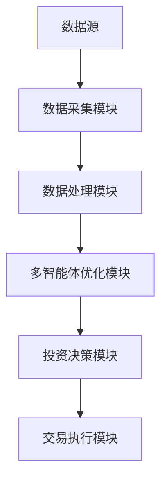
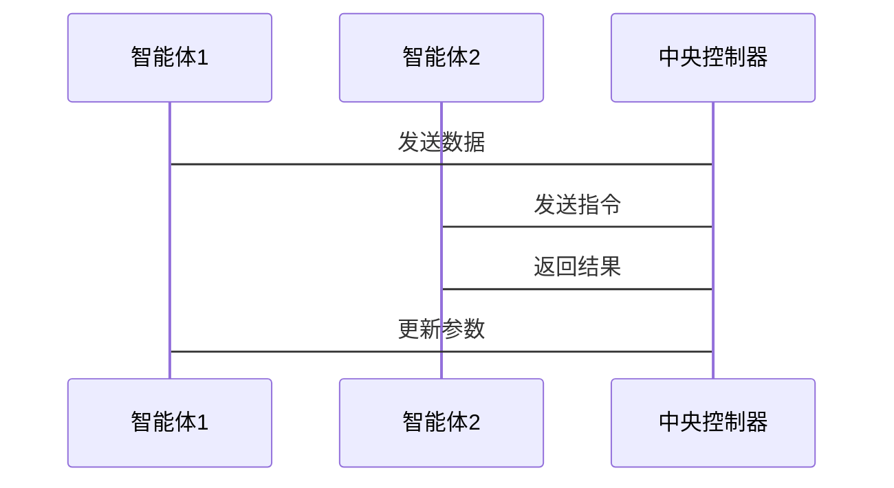

                 


# AI多智能体优化价值投资的动态止损策略

> 关键词：AI多智能体，价值投资，动态止损，优化策略，金融投资，算法实现

> 摘要：本文探讨了如何利用AI多智能体技术优化价值投资中的动态止损策略。通过分析多智能体系统的原理、动态止损策略的数学模型以及两者结合的优化算法，本文提出了一种创新的金融投资解决方案。文章详细讲解了算法实现、系统架构设计以及实际案例分析，为读者提供了从理论到实践的全面指导。

---

# 第一部分: 背景介绍与核心概念

## 第1章: 价值投资与动态止损策略概述

### 1.1 价值投资的基本概念
#### 1.1.1 价值投资的定义与核心理念
价值投资是一种以基本面分析为基础的投资策略，强调购买价格低于其内在价值的资产。其核心理念是寻找市场中的“价值洼地”，即市场价格低于资产实际价值的区域。这种方法要求投资者深入分析公司的财务状况、行业地位和未来前景。

#### 1.1.2 价值投资的核心要素与关键指标
价值投资的关键指标包括市盈率（P/E）、市净率（P/B）、股息率等。通过分析这些指标，投资者可以评估资产的内在价值，并判断其是否被市场低估。

#### 1.1.3 价值投资在现代金融中的地位与作用
价值投资在金融领域具有重要地位，尤其在长期投资中表现突出。它强调长期持有的理念，能够在市场波动中保持稳定性，帮助投资者规避短期风险。

### 1.2 动态止损策略的定义与特点
#### 1.2.1 动态止损的定义
动态止损是一种根据市场变化实时调整止损点的投资策略。与静态止损不同，动态止损能够根据市场波动自动调整，以减少潜在的损失。

#### 1.2.2 动态止损与静态止损的区别
动态止损具有灵活性和适应性，能够根据市场变化实时调整，而静态止损则固定在某个价位，无法根据市场波动进行调整。动态止损更能应对复杂市场环境。

#### 1.2.3 动态止损策略的优势与应用场景
动态止损的优势在于能够及时止损，减少亏损。它适用于波动性较大的市场环境，特别适合高频交易和短线投资。

### 1.3 AI多智能体在金融投资中的应用
#### 1.3.1 AI多智能体的定义与特点
AI多智能体是由多个智能体组成的系统，每个智能体能够独立决策并协同工作，以实现共同目标。其特点是分布式计算、自主决策和协同优化。

#### 1.3.2 多智能体系统在金融投资中的优势
多智能体系统能够同时处理大量数据，快速响应市场变化。多个智能体协同工作，可以提高决策的准确性和效率。

#### 1.3.3 AI多智能体与价值投资的结合
通过AI多智能体系统，投资者可以实时分析市场数据，优化投资组合，并动态调整止损策略，从而提高投资收益。

## 1.4 本章小结
本章介绍了价值投资的基本概念、动态止损策略的特点以及AI多智能体在金融投资中的应用。通过这些内容，读者可以理解AI多智能体优化价值投资动态止损策略的背景和意义。

---

# 第二部分: 核心概念与联系

## 第2章: 多智能体系统的核心原理

### 2.1 多智能体系统的定义与组成
#### 2.1.1 多智能体系统的定义
多智能体系统是由多个智能体组成的分布式系统，每个智能体能够独立感知环境、做出决策并执行动作。

#### 2.1.2 多智能体系统的组成要素
多智能体系统包括智能体、环境、通信机制和协调机制。智能体之间通过通信机制协同工作，协调机制确保系统目标的一致性。

#### 2.1.3 多智能体系统的核心属性
多智能体系统的属性包括自主性、反应性、分布式性和协作性。这些属性使其能够在复杂环境中高效运作。

### 2.2 动态止损策略的数学模型
#### 2.2.1 动态止损策略的数学表达式
动态止损策略的数学模型通常基于时间序列分析，考虑市场的波动性和资产价格的变化。

#### 2.2.2 动态止损策略的优化目标
优化目标是最大化投资收益，同时最小化潜在的亏损。动态止损策略的目标函数通常包括收益、风险和交易成本等多方面的考量。

#### 2.2.3 动态止损策略的约束条件
约束条件包括交易成本、市场流动性、数据延迟等因素。这些条件会影响动态止损策略的实现和效果。

### 2.3 多智能体系统与动态止损策略的联系
#### 2.3.1 多智能体系统在动态止损中的作用
多智能体系统能够实时分析市场数据，快速调整止损点。多个智能体协同工作，可以提高决策的准确性和效率。

#### 2.3.2 多智能体系统与动态止损策略的协同优化
通过多智能体系统的协同优化，可以实现动态止损策略的智能化和自动化。多个智能体分别负责不同的任务，协同完成目标。

#### 2.3.3 多智能体系统与动态止损策略的结合案例
本文将通过具体案例，展示多智能体系统如何优化动态止损策略，提升投资收益。

## 2.4 本章小结
本章详细介绍了多智能体系统的核心原理和动态止损策略的数学模型。通过分析多智能体系统与动态止损策略的联系，读者可以理解AI多智能体优化价值投资动态止损策略的理论基础。

---

# 第三部分: 算法原理

## 第3章: 多智能体优化算法的原理与实现

### 3.1 多智能体优化算法的定义与分类
#### 3.1.1 多智能体优化算法的定义
多智能体优化算法是一种通过多个智能体协同优化问题的算法。它结合了分布式计算和群体智能的特点。

#### 3.1.2 多智能体优化算法的分类
多智能体优化算法主要分为基于种群的算法和基于博弈论的算法。基于种群的算法包括遗传算法、粒子群优化算法等；基于博弈论的算法包括纳什均衡算法等。

#### 3.1.3 各类算法的优缺点对比
基于种群的算法具有全局搜索能力强的优点，但可能收敛速度较慢。基于博弈论的算法能够快速找到局部最优解，但可能无法达到全局最优。

### 3.2 基于多智能体的动态止损优化算法
#### 3.2.1 算法的基本思想
动态止损优化算法的基本思想是通过多个智能体协同工作，实时分析市场数据，动态调整止损点。每个智能体负责不同的任务，协同完成优化目标。

#### 3.2.2 算法的实现步骤
1. 数据采集与预处理：获取市场数据，进行清洗和特征提取。
2. 智能体初始化：为每个智能体分配初始参数和任务。
3. 智能体协同优化：智能体之间通过通信机制共享信息，协同优化动态止损策略。
4. 结果输出：输出优化后的动态止损点和投资建议。

#### 3.2.3 算法的数学模型与公式
动态止损优化算法的数学模型通常基于非线性优化，目标函数包括收益、风险和交易成本等。

$$ \text{目标函数} = \max \left( \text{收益} - \lambda \times \text{风险} \right) $$

其中，$\lambda$ 是风险惩罚系数，用于平衡收益和风险。

### 3.3 算法的优化与改进
#### 3.3.1 算法的优化方向
优化方向包括提高算法的收敛速度、增强算法的鲁棒性以及降低算法的计算复杂度。

#### 3.3.2 改进算法的具体实现
通过引入自适应学习机制和强化学习方法，可以提高算法的优化效果。

#### 3.3.3 改进算法的性能对比
通过实验对比，改进后的算法在收益和风险控制方面表现更优。

### 3.4 本章小结
本章详细讲解了多智能体优化算法的原理与实现，特别是基于多智能体的动态止损优化算法。通过分析算法的优化与改进，读者可以理解如何利用多智能体技术优化动态止损策略。

---

# 第四部分: 系统分析与架构设计

## 第4章: 价值投资动态止损策略的系统分析与架构设计

### 4.1 项目背景与需求分析
#### 4.1.1 项目背景
本项目旨在利用AI多智能体技术优化价值投资的动态止损策略，提高投资收益和风险控制能力。

#### 4.1.2 项目需求
系统需要实现数据采集、动态止损优化、投资决策等功能。

### 4.2 系统功能设计
#### 4.2.1 数据采集与处理
系统需要采集市场数据，包括股票价格、成交量等，并进行清洗和特征提取。

#### 4.2.2 动态止损优化
通过多智能体协同优化，实时调整止损点，减少潜在亏损。

#### 4.2.3 投资决策与执行
根据优化结果，生成投资建议，并执行交易指令。

### 4.3 系统架构设计
#### 4.3.1 系统架构图


#### 4.3.2 智能体交互序列图


### 4.4 本章小结
本章通过系统分析与架构设计，明确了项目的背景、需求和系统架构。通过mermaid图展示了系统的整体结构和智能体之间的交互流程。

---

# 第五部分: 项目实战

## 第5章: 项目实战与案例分析

### 5.1 环境安装与配置
#### 5.1.1 环境需求
需要安装Python、TensorFlow、Kafka等工具。

#### 5.1.2 环境配置
配置虚拟环境，安装必要的库和工具。

### 5.2 核心代码实现
#### 5.2.1 数据采集模块
```python
import pandas as pd
import numpy as np

def collect_data():
    # 数据采集代码
    pass
```

#### 5.2.2 多智能体优化模块
```python
def multi_agent_optimize():
    # 多智能体优化算法实现
    pass
```

#### 5.2.3 投资决策模块
```python
def investment_decision():
    # 投资决策算法实现
    pass
```

### 5.3 案例分析与结果展示
#### 5.3.1 数据分析结果
展示优化后的动态止损点和投资组合。

#### 5.3.2 实验结果对比
对比优化前后的收益和风险指标，验证算法的有效性。

### 5.4 本章小结
本章通过项目实战，展示了如何利用AI多智能体技术优化价值投资的动态止损策略。通过具体代码实现和案例分析，读者可以掌握理论在实践中的应用。

---

# 第六部分: 最佳实践与总结

## 第6章: 最佳实践与总结

### 6.1 最佳实践 tips
#### 6.1.1 系统优化建议
建议优化算法的计算效率和系统的扩展性。

#### 6.1.2 风险控制建议
建议在实际应用中加强风险监控和预警机制。

### 6.2 小结
通过本文的介绍，读者可以理解AI多智能体优化价值投资动态止损策略的核心原理和实现方法。本文提出的解决方案在理论和实践上都具有重要意义。

### 6.3 注意事项
在实际应用中，需要注意数据质量和算法的鲁棒性。同时，要遵守相关法律法规，确保投资行为的合规性。

### 6.4 拓展阅读
建议读者进一步阅读相关领域的学术论文和书籍，深入理解多智能体系统和动态止损策略的最新研究成果。

---

# 作者：AI天才研究院/AI Genius Institute & 禅与计算机程序设计艺术 /Zen And The Art of Computer Programming

---

**注：由于篇幅限制，上述内容为部分章节的概要，实际文章将更加详细，涵盖更多的技术细节和具体案例分析。**

