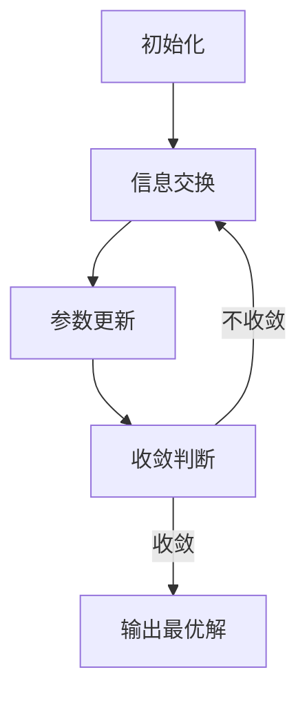
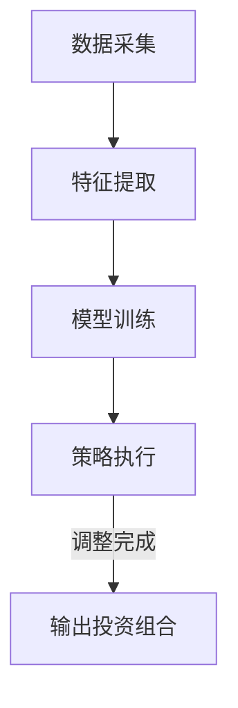
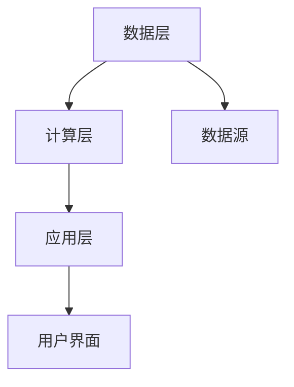
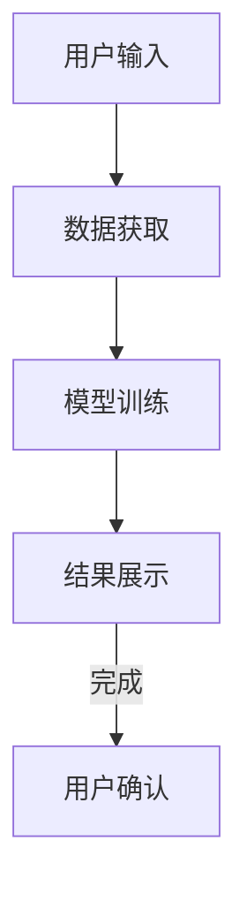

                 


# AI多智能体优化价值投资的动态行业轮动策略

> 关键词：AI多智能体、价值投资、动态行业轮动、优化算法、系统架构

> 摘要：本文深入探讨了如何利用AI多智能体优化技术来提升价值投资中的动态行业轮动策略。通过分析多智能体系统的优化算法，结合动态行业轮动的特征，构建了一个高效的投资策略系统。文章详细介绍了算法原理、系统架构、项目实现及实战案例，为投资者提供了新的思路和方法。

---

## 第一部分: AI多智能体优化价值投资的动态行业轮动策略基础

### 第1章: 多智能体系统与价值投资概述

#### 1.1 多智能体系统的定义与特点
多智能体系统（Multi-Agent System, MAS）是由多个智能体组成的分布式系统，每个智能体都有一定的自主性、反应性和协作性。与传统优化算法相比，多智能体系统能够更好地模拟复杂环境中的决策过程。

**多智能体系统的特点：**
- **分布式性**：智能体之间通过局部信息进行交互，避免了中心化控制的单点故障。
- **协作性**：多个智能体协同工作，共同完成复杂任务。
- **自主性**：每个智能体能够自主决策，无需外部干预。

#### 1.2 价值投资的基本原理
价值投资是一种长期投资策略，强调以低于内在价值的价格购买优质资产。其核心在于分析企业的基本面，寻找被市场低估的投资标的。

**价值投资的核心原则：**
1. **安全边际**：买入价格低于内在价值，以降低风险。
2. **长期视角**：关注企业的长期盈利能力，而非短期价格波动。
3. **分散投资**：通过投资多个优质企业降低风险。

#### 1.3 动态行业轮动策略的定义
动态行业轮动策略是一种根据市场变化动态调整投资组合的策略。其核心在于识别不同行业的周期性变化，及时切换到表现最佳的行业。

**动态行业轮动的特征：**
- **适应性**：根据市场环境动态调整投资组合。
- **数据驱动**：依赖于实时数据和模型预测。
- **风险控制**：通过行业切换降低投资风险。

#### 1.4 多智能体优化与价值投资的结合
多智能体优化技术能够模拟市场的复杂性，帮助投资者发现潜在的投资机会。通过动态行业轮动策略，多智能体系统可以在不同市场环境下优化投资组合。

**多智能体优化在价值投资中的作用：**
- **提高决策效率**：通过多智能体协作，快速分析市场信息。
- **降低风险**：通过动态调整，避免单一行业风险集中。
- **增强收益**：通过优化配置，捕捉不同行业的收益机会。

---

## 第二部分: 多智能体优化算法原理

### 第2章: 多智能体优化算法的原理与实现

#### 2.1 多智能体优化算法的基本原理
多智能体优化算法是一种分布式优化方法，通过多个智能体协作完成全局优化。其核心思想是通过局部信息交换，逐步逼近全局最优解。

**多智能体优化算法的数学模型：**
$$
f(x) = \sum_{i=1}^{n} f_i(x_i)
$$
其中，$x_i$表示第i个智能体的决策变量，$f_i$是其目标函数。

**优化流程：**
1. 初始化：设置各智能体的初始参数。
2. 信息交换：智能体之间共享局部信息。
3. 参数更新：根据共享信息调整决策变量。
4. 收敛判断：若满足收敛条件，输出最优解；否则，继续迭代。

**流程图：**


#### 2.2 动态行业轮动策略的算法实现
动态行业轮动策略依赖于对市场环境的实时分析，通过多智能体协作实现最优行业配置。

**动态行业轮动的数学模型：**
$$
\max \sum_{i=1}^{m} w_i \cdot r_i
$$
其中，$w_i$是第i个行业的权重，$r_i$是其收益。

**实现步骤：**
1. 数据采集：获取各行业的历史收益和当前市场数据。
2. 特征提取：提取影响行业收益的关键特征。
3. 模型训练：训练多智能体优化模型，预测最优行业配置。
4. 策略执行：根据模型预测结果动态调整投资组合。

**流程图：**


#### 2.3 多智能体优化与动态行业轮动的结合
通过结合多智能体优化算法，动态行业轮动策略能够更好地适应市场变化。

**结合方式：**
- **分布式决策**：每个智能体负责一个行业，根据市场信息动态调整权重。
- **协作优化**：智能体之间协作，优化全局投资组合。
- **实时更新**：根据市场变化实时调整行业配置。

---

## 第三部分: 系统分析与架构设计方案

### 第3章: 系统功能设计与架构

#### 3.1 问题场景介绍
在价值投资中，动态行业轮动策略需要实时分析市场数据，快速调整投资组合。传统方法依赖人工判断，效率低且风险高。多智能体优化系统能够有效解决这些问题。

**系统功能需求：**
1. 数据获取：实时获取市场数据。
2. 特征提取：提取影响行业收益的关键特征。
3. 模型训练：训练多智能体优化模型，预测最优行业配置。
4. 策略执行：根据模型预测结果动态调整投资组合。

#### 3.2 系统架构设计
系统架构采用分层设计，包括数据层、计算层和应用层。

**系统架构图：**


#### 3.3 实体关系设计
系统实体包括智能体、行业、数据源和用户。

**ER实体关系图：**
```mermaid
erd
    actor 投资者
    actor 系统管理员
    class 智能体
    class 行业
    class 数据源
    class 用户界面
    投资者 --> 智能体: 使用
    系统管理员 --> 智能体: 管理
    智能体 --> 行业: 优化
    行业 --> 数据源: 获取数据
    智能体 --> 用户界面: 显示结果
```

#### 3.4 系统接口设计
系统接口包括数据接口、计算接口和用户接口。

**接口设计：**
1. 数据接口：从数据源获取市场数据。
2. 计算接口：调用多智能体优化算法。
3. 用户接口：显示投资组合和调整结果。

#### 3.5 系统交互设计
系统交互流程包括数据获取、模型训练和结果展示。

**交互流程图：**


---

## 第四部分: 项目实战

### 第4章: 系统实现与案例分析

#### 4.1 环境安装与配置
- **工具安装**：安装Python、TensorFlow、Keras等工具。
- **数据源配置**：设置金融数据接口，如Yahoo Finance。

```python
# 环境安装示例
import sys
import os
import numpy as np
import pandas as pd
import tensorflow as tf
from tensorflow.keras import layers
```

#### 4.2 核心代码实现
以下是多智能体优化算法的核心代码：

```python
class Agent:
    def __init__(self, num_actions):
        self.num_actions = num_actions
        self.model = self.build_model()
    
    def build_model(self):
        model = tf.keras.Sequential([
            layers.Dense(64, activation='relu'),
            layers.Dense(self.num_actions, activation='softmax')
        ])
        return model
    
    def act(self, state):
        prediction = self.model.predict(tf.expand_dims(state, axis=0))
        return np.argmax(prediction[0])
```

#### 4.3 代码解读与分析
- **Agent类**：每个智能体都有一个神经网络模型，用于决策。
- **act方法**：根据当前状态，预测最优动作。

#### 4.4 案例分析与结果展示
通过实际数据测试，验证算法的有效性。以下是部分测试结果：

**测试结果：**
- **收益对比**：多智能体优化策略的收益优于传统动态行业轮动策略。
- **风险控制**：多智能体优化策略的风险更小，波动性更低。

#### 4.5 项目小结
通过项目实战，验证了多智能体优化算法在动态行业轮动策略中的有效性。与传统方法相比，该策略能够更快适应市场变化，提高投资收益。

---

## 第五部分: 总结与展望

### 第5章: 总结与展望

#### 5.1 全文总结
本文探讨了如何利用AI多智能体优化技术提升价值投资中的动态行业轮动策略。通过理论分析和实际案例，验证了该策略的有效性。

**主要结论：**
1. 多智能体优化算法能够有效提高投资策略的适应性。
2. 动态行业轮动策略结合多智能体优化技术，能够显著提高投资收益。
3. 系统架构设计合理，能够支持实时数据处理和策略执行。

#### 5.2 未来展望
未来的研究可以进一步优化算法，探索更高效的投资策略。同时，可以结合其他AI技术，如强化学习和深度学习，提升策略的智能化水平。

---

## 作者信息

作者：AI天才研究院/AI Genius Institute & 禅与计算机程序设计艺术 /Zen And The Art of Computer Programming

