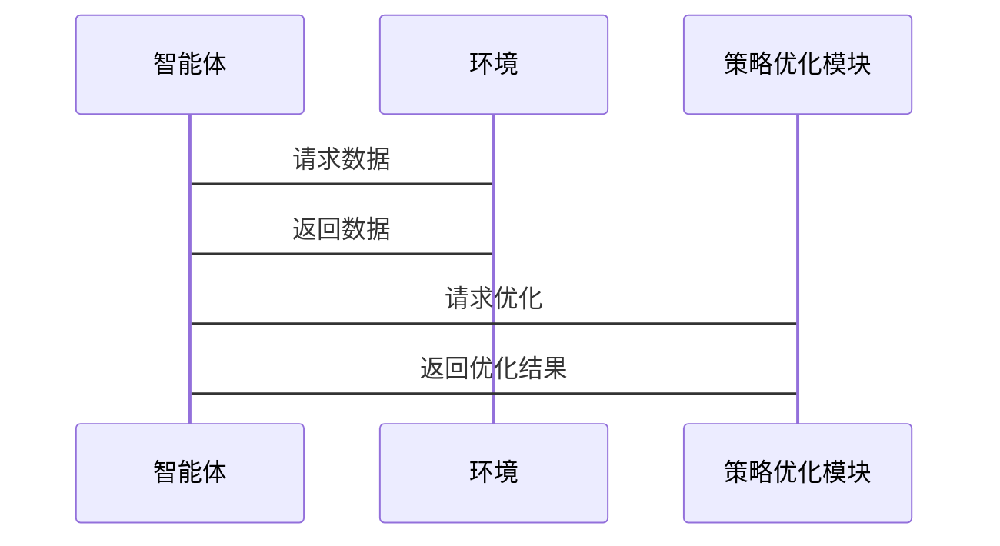

                 


# AI多智能体优化价值投资的动态风险平价策略

> 关键词：多智能体优化，动态风险平价，价值投资，AI，风险管理

> 摘要：本文探讨了如何利用AI多智能体优化技术来实现价值投资中的动态风险平价策略。通过分析多智能体系统的结构与优化方法，结合动态风险平价策略的数学模型，提出了基于强化学习和博弈论的优化算法。文章详细阐述了算法原理、系统架构设计以及实际项目实现，最后通过案例分析展示了该策略的有效性。

---

## 第1章 多智能体优化与价值投资概述

### 1.1 多智能体优化的定义与特点

多智能体优化是指通过多个智能体协同工作，以达到全局最优或帕累托最优的过程。与单智能体优化不同，多智能体优化强调各智能体之间的协作与竞争，能够更好地适应复杂动态环境。

#### 1.1.1 多智能体系统的定义
一个多智能体系统由多个智能体组成，每个智能体都有自己的目标、状态和决策机制。智能体之间通过通信和协作完成复杂的任务。

#### 1.1.2 多智能体优化的核心特点
- **分布式决策**：每个智能体独立决策，但通过协作实现全局优化。
- **动态性**：系统状态和环境动态变化，智能体需要实时调整策略。
- **博弈性**：智能体之间存在竞争与合作，需平衡个体目标与全局目标。

### 1.2 动态风险平价策略的定义与特点

动态风险平价策略是一种根据市场变化动态调整风险资产配置的方法，旨在在不同市场条件下保持风险水平的平衡。

#### 1.2.1 风险平价的定义
风险平价是一种投资组合优化方法，根据资产的风险贡献进行配置，使每种资产的风险贡献相等，从而分散风险。

#### 1.2.2 动态风险平价策略的核心要素
- **动态性**：根据市场变化实时调整资产配置。
- **风险分散**：通过动态调整降低单一资产的风险敞口。
- **适应性**：能够适应不同的市场周期和经济环境。

### 1.3 价值投资的定义与特点

价值投资是一种投资策略，通过寻找市场价格低于内在价值的资产进行投资，长期持有以实现收益。

#### 1.3.1 价值投资的定义
价值投资强调基本面分析，寻找被市场低估的资产，长期持有，等待价值回归。

#### 1.3.2 价值投资的核心理念
- **安全边际**：购买价格低于内在价值，确保足够的安全空间。
- **长期视角**：关注企业的长期价值，而非短期市场波动。
- **逆向思维**：在市场恐慌时寻找机会，在市场狂热时保持冷静。

### 1.4 本章小结

本章介绍了多智能体优化、动态风险平价策略和价值投资的基本概念及其特点，为后续内容奠定了基础。

---

## 第2章 AI多智能体优化的数学模型与算法原理

### 2.1 多智能体优化的数学模型

#### 2.1.1 状态空间的定义
状态空间表示系统在某一时刻的所有可能状态，由多个智能体的状态组成。

#### 2.1.2 动作空间的定义
动作空间表示每个智能体在给定状态下可以执行的所有动作。

#### 2.1.3 奖励函数的定义
奖励函数定义了智能体在特定动作下获得的奖励，引导智能体趋向于最优行为。

### 2.2 动态风险平价策略的数学模型

#### 2.2.1 风险平价的数学表达
风险平价的目标是最小化投资组合的风险，同时保持各资产的风险贡献相等。

#### 2.2.2 动态风险平价策略的数学表达
动态风险平价策略根据市场变化实时调整资产权重，以保持风险水平的平衡。

### 2.3 算法的数学推导

#### 2.3.1 强化学习算法的数学推导
强化学习算法通过智能体与环境的交互，逐步学习最优策略，使用Q-learning算法进行推导。

#### 2.3.2 动态风险平价策略的数学推导
动态风险平价策略基于均值-方差模型，通过优化资产权重实现风险平价。

---

## 第3章 系统分析与架构设计

### 3.1 系统应用场景

#### 3.1.1 金融市场中的应用场景
在金融投资中，动态风险平价策略可以应用于资产配置、风险管理等领域。

#### 3.1.2 价值投资中的应用场景
通过多智能体优化，可以实现对多个资产的动态配置，优化投资组合的风险收益比。

### 3.2 系统功能设计

#### 3.2.1 系统功能模块
- **数据采集模块**：采集市场数据和资产信息。
- **风险评估模块**：评估各资产的风险水平。
- **策略优化模块**：基于强化学习优化投资策略。
- **决策执行模块**：根据优化结果执行交易。

#### 3.2.2 领域模型类图


### 3.3 系统架构设计

#### 3.3.1 系统架构图


### 3.4 接口设计

#### 3.4.1 接口设计


---

## 第4章 项目实战

### 4.1 环境安装与配置

#### 4.1.1 环境安装
- 安装Python
- 安装相关库（如TensorFlow、numpy）

#### 4.1.2 环境配置
配置运行环境，包括路径设置和依赖库版本。

### 4.2 核心代码实现

#### 4.2.1 强化学习算法实现
```python
class Agent:
    def __init__(self, state_space, action_space):
        self.state_space = state_space
        self.action_space = action_space
        # 初始化模型参数
```

#### 4.2.2 动态风险平价策略实现
```python
def dynamic_risk_parity(weights, covariance_matrix):
    # 计算风险贡献
    return risk_contribution
```

### 4.3 代码解读与分析

#### 4.3.1 代码功能解读
解释代码的主要功能和实现逻辑。

#### 4.3.2 代码实现细节
详细分析代码实现中的关键点和技巧。

### 4.4 实际案例分析

#### 4.4.1 数据来源与预处理
描述数据来源和预处理步骤。

#### 4.4.2 策略实现与效果展示
展示策略在实际案例中的应用效果和优化结果。

### 4.5 项目总结

总结项目实现的关键点和经验教训，提出改进建议。

---

## 第5章 总结与展望

### 5.1 总结

总结本文的主要内容和研究成果，强调AI多智能体优化在价值投资中的重要性。

### 5.2 展望

展望未来的研究方向，提出可能的改进和优化方案。

---

## 作者信息

作者：AI天才研究院/AI Genius Institute & 禅与计算机程序设计艺术 /Zen And The Art of Computer Programming

---

本文通过系统地分析AI多智能体优化在价值投资中的应用，详细阐述了动态风险平价策略的实现方法和应用场景。结合理论与实践，为读者提供了全面的指导和深入的见解。

