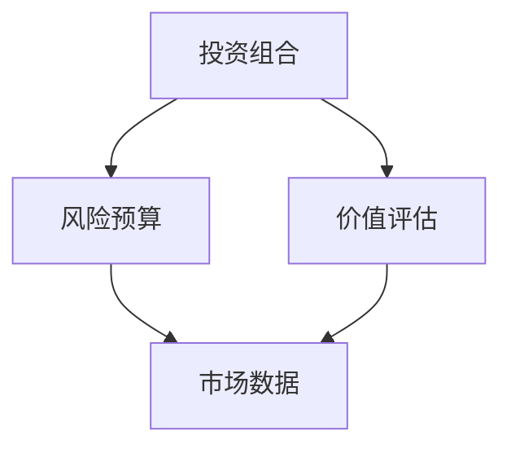
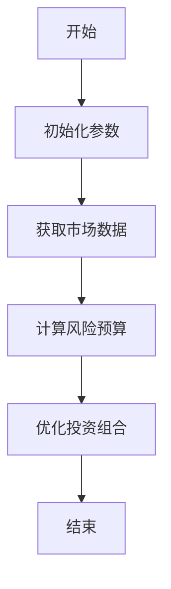
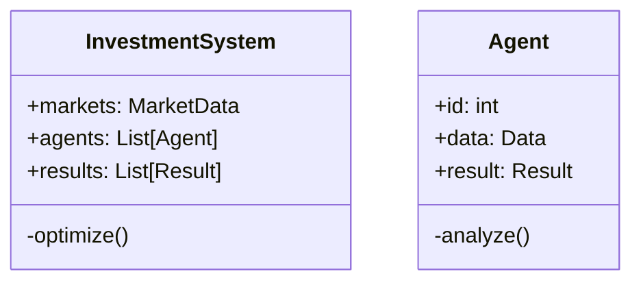
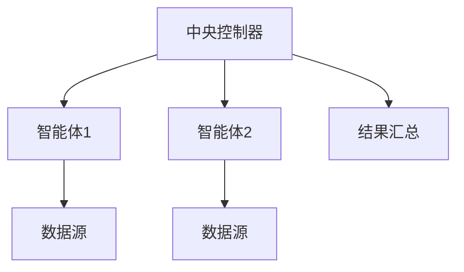
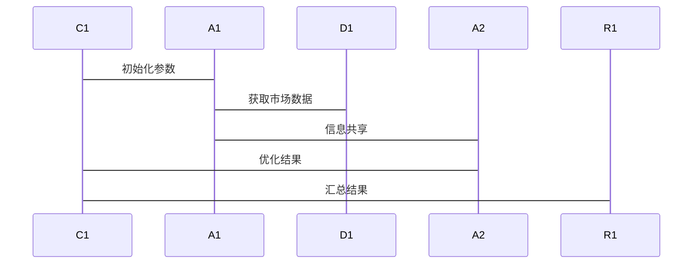

                 


# AI多智能体优化价值投资的动态风险预算分配

## 关键词：多智能体优化、价值投资、动态风险预算、AI算法、系统架构

## 摘要：
本文探讨了AI多智能体优化在价值投资中的应用，特别是在动态风险预算分配中的优化策略。通过分析多智能体系统的协同优化机制，构建数学模型和算法框架，并结合实际案例进行分析和解读。文章详细介绍了核心概念、算法原理、系统架构设计和项目实战，为读者提供了全面的视角和深入的技术解析。

---

# 正文

## 第1章 AI多智能体优化价值投资的背景与问题描述

### 1.1 问题背景
#### 1.1.1 传统投资与风险管理的局限性
传统投资依赖于人工分析和固定策略，难以适应市场的快速变化。风险管理通常基于静态模型，难以实时调整，导致潜在收益与风险不匹配。

#### 1.1.2 AI技术在金融领域的应用潜力
AI技术能够处理海量数据，发现复杂模式，并实时调整策略，为金融投资带来革新。多智能体系统通过协同优化，能够更好地应对动态市场环境。

#### 1.1.3 多智能体优化的必要性
单个智能体的决策受限，而多智能体系统通过协同优化，能够覆盖更多维度，提高投资组合的多样性和风险分散能力。

### 1.2 问题描述
#### 1.2.1 价值投资的定义与目标
价值投资旨在发现市场价格低于内在价值的资产，通过长期持有实现收益。动态风险预算分配是根据市场变化调整投资组合的风险敞口。

#### 1.2.2 多智能体协同优化的目标
通过多个智能体协同工作，优化投资组合的收益与风险平衡，实现动态调整。

### 1.3 问题解决思路
#### 1.3.1 多智能体优化的核心思想
各智能体独立决策，通过信息共享和协同机制优化整体目标。

#### 1.3.2 动态风险预算分配的数学模型
构建动态调整模型，根据市场波动实时分配风险预算。

#### 1.3.3 优化目标与约束条件
目标是最大化收益，约束条件包括风险限制、流动性要求等。

## 第2章 多智能体优化的核心概念与联系

### 2.1 多智能体优化的原理
#### 2.1.1 多智能体系统的定义
由多个智能体组成的系统，每个智能体具有自主性、反应性和协作性。

#### 2.1.2 多智能体优化的数学模型
使用博弈论和分布式优化方法，构建多智能体协同的数学框架。

### 2.2 价值投资与动态风险预算的核心要素
#### 2.2.1 核心概念属性特征对比表
| 概念 | 属性 | 特征 |
|------|-------|------|
| 多智能体优化 | 分布式决策 | 独立性和协同性 |
| 动态风险预算 | 实时调整 | 灵活性和适应性 |
| 价值投资 | 长期视角 | 深入分析和低买高卖 |

#### 2.2.2 ER实体关系图


## 第3章 多智能体优化算法原理

### 3.1 算法原理概述
#### 3.1.1 多智能体优化的基本原理
通过分布式计算和协同机制，实现全局优化。

#### 3.1.2 动态风险预算分配的算法框架
基于实时市场数据，动态调整风险预算。

### 3.2 算法流程图


### 3.3 算法实现代码
#### 3.3.1 环境安装
安装必要的Python库，如numpy、pandas、scipy。

#### 3.3.2 核心算法实现
```python
import numpy as np
import pandas as pd

def multi_agent_optimization(markets, agents):
    # 分配任务给各智能体
    for agent in agents:
        agent.analyze(markets)
    # 协同优化
    return global_optimization(agents.results)

class Agent:
    def __init__(self, id):
        self.id = id
        self.data = None
        self.result = None

    def analyze(self, markets):
        # 数据分析和决策
        pass

def global_optimization(results):
    # 全局优化
    pass
```

### 3.4 数学模型与公式
#### 3.4.1 多智能体优化的数学模型
$$ \text{目标函数} = \sum_{i=1}^{n} f_i(x_i) $$
其中，$x_i$是第i个智能体的决策变量。

#### 3.4.2 动态风险预算分配的数学公式
$$ \text{风险预算} = \sum_{i=1}^{m} w_i \cdot r_i $$
其中，$w_i$是第i个资产的权重，$r_i$是风险敞口。

## 第4章 系统分析与架构设计

### 4.1 问题场景介绍
描述一个多智能体系统在金融投资中的应用场景，包括数据获取、分析、优化和执行。

### 4.2 系统功能设计
#### 4.2.1 领域模型


### 4.3 系统架构设计


### 4.4 系统接口设计
定义智能体之间的接口，数据源接口，以及结果汇总接口。

### 4.5 系统交互流程


## 第5章 项目实战

### 5.1 环境安装
安装必要的Python库，如numpy、pandas、scipy。

### 5.2 核心代码实现
实现多智能体优化算法，包括数据处理、分析、优化和结果汇总。

### 5.3 案例分析
通过具体案例展示算法的应用，分析优化效果和风险预算分配的动态调整。

### 5.4 项目总结
总结项目成果，分析优缺点，并提出改进建议。

## 第6章 最佳实践与未来展望

### 6.1 最佳实践
#### 6.1.1 参数选择
合理选择智能体数量和算法参数，确保系统性能。

#### 6.1.2 系统监控
实时监控系统运行状态，及时调整参数。

#### 6.1.3 模型更新
定期更新模型，适应市场变化。

### 6.2 小结
总结文章内容，强调多智能体优化在价值投资中的重要性。

### 6.3 未来展望
探讨未来的研究方向，如更复杂的多智能体协同机制和更先进的算法。

---

# 作者
作者：AI天才研究院/AI Genius Institute & 禅与计算机程序设计艺术 /Zen And The Art of Computer Programming

