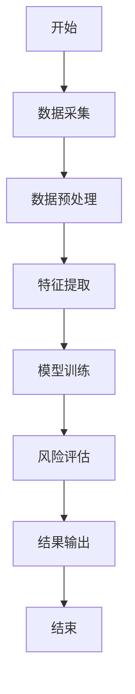
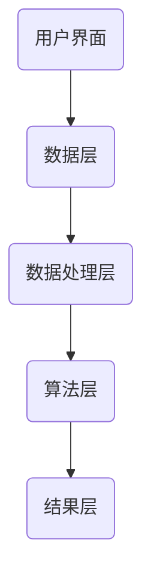
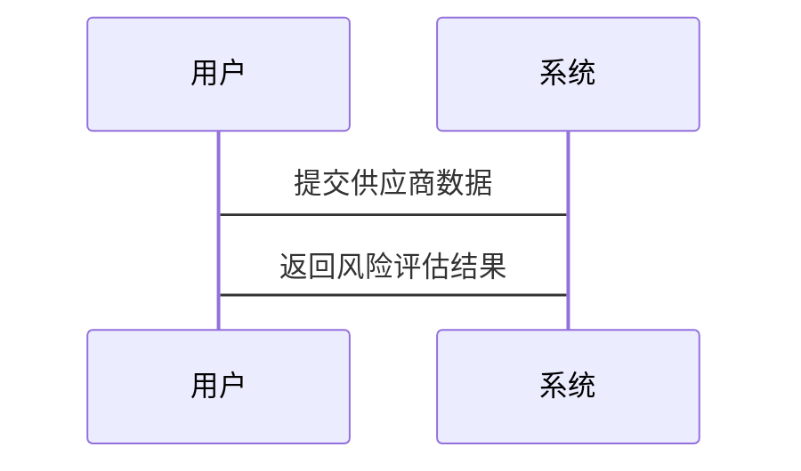

                 


# AI多智能体在价值投资中的供应商风险分析

> 关键词：AI多智能体，价值投资，供应商风险分析，风险评估模型，多智能体协作

> 摘要：本文探讨了AI多智能体技术在价值投资中的应用，特别是如何通过多智能体协作来分析和评估供应商风险。文章从基本概念、算法原理、系统架构到项目实战，全面解析了AI多智能体在供应商风险分析中的优势和实现方法。

---

# 第1章 供应商风险分析的背景与重要性

## 1.1 价值投资中的供应商风险分析

### 1.1.1 供应商风险分析的定义

供应商风险分析是指在供应链管理中，评估供应商在产品或服务提供过程中可能面临的各种风险，包括信用风险、交付风险、质量风险等。在价值投资中，供应商的稳定性直接影响企业的整体价值和投资回报。

### 1.1.2 问题背景与描述

在现代企业中，供应链的复杂性增加，供应商风险的管理变得至关重要。传统的供应商风险管理方法通常依赖人工分析，效率低下且容易遗漏关键风险点。因此，引入AI技术来提升供应商风险分析的效率和准确性成为必然趋势。

### 1.1.3 AI多智能体技术的应用

AI多智能体系统通过多个智能体协同工作，能够实时监控和分析供应商的动态数据，提供更加精准的风险评估。这种技术不仅提高了分析效率，还能捕捉到传统方法难以发现的潜在风险。

### 1.1.4 边界与外延

供应商风险分析的边界包括供应商的基本信息、历史数据和实时数据，而外延则涉及供应商的上下游关系和市场环境变化。

---

## 1.2 AI多智能体技术的引入

### 1.2.1 多智能体系统的定义

多智能体系统由多个相互作用的智能体组成，每个智能体都有自己的目标和决策机制。这些智能体通过协作完成复杂的任务。

### 1.2.2 AI多智能体技术的特点

AI多智能体技术具有分布式计算、自适应性和高容错性等特点，能够处理复杂环境中的不确定性。

### 1.2.3 技术优势

多智能体系统能够并行处理大量数据，提供实时反馈，并通过协作优化决策。

---

## 1.3 本章小结

本章介绍了供应商风险分析的重要性和AI多智能体技术的基本概念，为后续分析奠定了基础。

---

# 第2章 供应商风险分析的核心概念与联系

## 2.1 核心概念原理

### 2.1.1 供应商风险分析的核心要素

包括供应商的历史表现、财务状况、交付能力和市场环境等。

### 2.1.2 AI多智能体在风险分析中的作用

通过数据挖掘、机器学习和自然语言处理技术，多智能体系统能够快速识别和评估供应商风险。

---

## 2.2 核心概念属性特征对比

| 比较维度 | 传统方法 | AI多智能体方法 |
|----------|----------|----------------|
| 数据来源 | 单一来源 | 多源数据       |
| 分析效率 | 较低     | 高             |
| 精确度   | 一般     | 较高           |

---

## 2.3 ER实体关系图

```mermaid
erd
    供应商(供应商ID, 名称, 联系方式)
    产品(产品ID, 名称, 规格)
    订单(订单ID, 供应商ID, 数量, 日期)
    风险评估(评估ID, 供应商ID, 风险等级, 日期)
    供应链(供应链ID, 供应商ID, 产品ID)
```

---

## 2.4 本章小结

本章通过对比分析，展示了AI多智能体技术在供应商风险分析中的优势。

---

# 第3章 AI多智能体供应商风险分析算法原理

## 3.1 算法原理讲解

### 3.1.1 多智能体协作机制

多智能体系统通过分布式计算和协作学习，共同完成风险评估任务。

### 3.1.2 风险评估模型

使用机器学习算法对供应商的历史数据进行建模，预测潜在风险。

---

## 3.2 算法流程图



---

## 3.3 算法实现代码

```python
import numpy as np
from sklearn import linear_model

# 数据准备
X = np.array([[x1, x2, x3], ...])  # 特征向量
y = np.array([y1, y2, y3, ...])    # 标签

# 模型训练
model = linear_model.LogisticRegression()
model.fit(X, y)

# 预测
new_X = np.array([[new_x1, new_x2, new_x3]])
预测结果 = model.predict(new_X)
```

---

## 3.4 本章小结

本章详细介绍了AI多智能体系统的算法原理和实现方法。

---

# 第4章 数学模型与公式

## 4.1 风险评估模型

$$ R = \sum_{i=1}^{n} w_i x_i $$

其中，\( R \) 表示风险评分，\( w_i \) 是特征 \( x_i \) 的权重。

## 4.2 多智能体协作模型

$$ w_i = \frac{1}{1 + e^{-k x_i}} $$

其中，\( k \) 是比例常数。

---

## 4.3 本章小结

本章通过数学公式详细描述了风险评估模型和协作机制。

---

# 第5章 系统分析与架构设计

## 5.1 系统功能设计

### 5.1.1 功能模块

包括数据采集、风险评估、结果展示和报告生成。

---

## 5.2 系统架构设计



---

## 5.3 系统接口设计



---

## 5.4 本章小结

本章详细描述了系统的架构设计和功能模块。

---

# 第6章 项目实战

## 6.1 环境安装

### 6.1.1 安装Python

```bash
pip install python
```

### 6.1.2 安装库

```bash
pip install numpy scikit-learn
```

---

## 6.2 核心代码实现

```python
import numpy as np
from sklearn import linear_model

# 数据预处理
X = ...
y = ...

# 模型训练
model = linear_model.LogisticRegression()
model.fit(X, y)

# 预测
new_X = ...
预测结果 = model.predict(new_X)
```

---

## 6.3 代码解读

### 6.3.1 数据预处理

对供应商的历史数据进行清洗和标准化。

### 6.3.2 模型训练

使用逻辑回归模型进行风险分类。

---

## 6.4 实际案例分析

以某公司为例，分析其供应商的信用风险，展示模型的预测结果。

---

## 6.5 项目小结

本章通过实际案例展示了AI多智能体技术在供应商风险分析中的应用。

---

# 第7章 最佳实践与注意事项

## 7.1 小结

AI多智能体技术能够显著提升供应商风险分析的效率和准确性。

## 7.2 注意事项

确保数据质量和模型的可解释性，定期更新模型参数。

---

# 作者

作者：AI天才研究院/AI Genius Institute & 禅与计算机程序设计艺术 /Zen And The Art of Computer Programming

---

感谢您的耐心阅读，希望本文能为您提供有价值的信息和启发！

