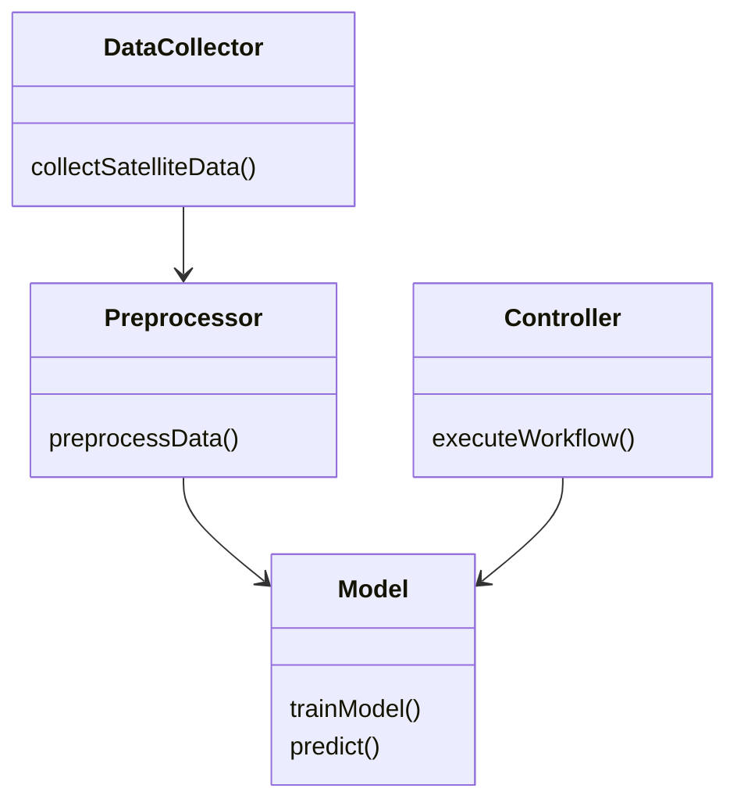
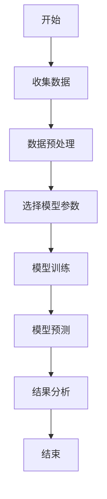
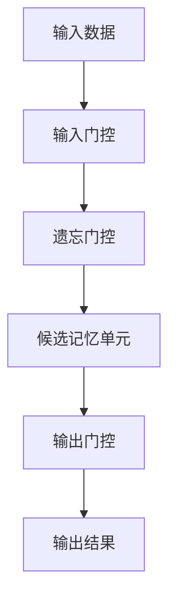
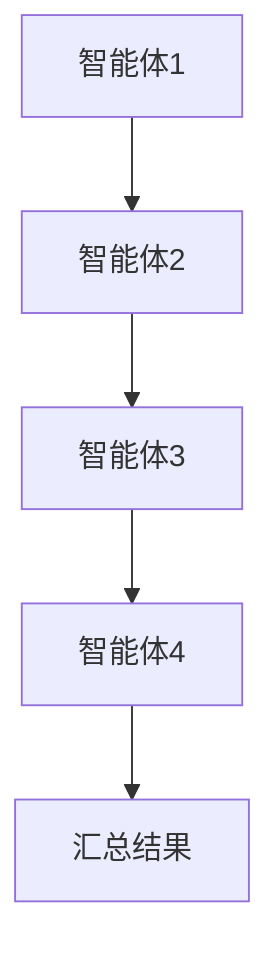

                 


# AI多智能体在价值投资中的卫星数据时间序列分析

## 关键词
AI多智能体，价值投资，卫星数据，时间序列分析，算法原理，系统架构，项目实战

## 摘要
本文深入探讨了AI多智能体技术在价值投资中的应用，特别是利用卫星数据进行时间序列分析的创新方法。通过分析卫星数据的特征与价值，结合多智能体的协同优势，提出了一种高效、精准的金融数据分析方案。文章详细介绍了算法原理、系统架构设计以及实际项目中的实现与应用，为价值投资者和AI技术开发者提供了理论与实践的双重参考。

---

# 第1章 引言

## 1.1 问题背景
### 1.1.1 价值投资的传统数据分析困境
- 传统金融数据分析依赖历史数据和统计模型，但受限于数据维度和复杂性，难以捕捉市场波动中的隐性信息。
- 卫星数据作为一种新兴的数据源，能够提供地理、环境和经济活动的相关信息，为价值投资提供了新的视角。

### 1.1.2 卫星数据的特征与价值
- 卫星数据具有高时空分辨率，能够捕捉地理经济活动的变化。
- 卫星数据的多模态特征（如光学、雷达数据）为复杂金融环境的建模提供了丰富的信息来源。

### 1.1.3 AI多智能体的优势
- 多智能体系统能够通过协同学习和任务分配，提高数据分析的效率和准确性。
- 多智能体的分布式计算能力能够处理海量卫星数据，并实时生成决策支持。

## 1.2 问题解决与目标
### 1.2.1 数据分析目标
- 通过卫星数据的时间序列分析，发现潜在的经济活动趋势。
- 利用AI多智能体技术，优化数据处理流程和预测模型。

### 1.2.2 系统设计目标
- 构建一个多智能体协同的工作流，实现卫星数据的实时采集、预处理和分析。
- 开发一个高效的预测模型，为价值投资提供实时决策支持。

---

# 第2章 核心概念与联系

## 2.1 核心概念解析
### 2.1.1 多智能体系统
- **定义**：一个多智能体系统由多个分布式智能体组成，每个智能体负责特定的任务，通过通信和协作完成整体目标。
- **特点**：分布式、协作性、自治性、反应性。

### 2.1.2 卫星数据时间序列分析
- **定义**：通过对卫星数据的时间序列建模，发现数据中的趋势、周期性与异常值。
- **关键步骤**：数据预处理、特征提取、模型训练、预测与优化。

## 2.2 核心概念的对比与联系
### 2.2.1 多智能体与传统数据分析的对比
| 对比维度 | 多智能体系统 | 传统数据分析 |
|----------|--------------|---------------|
| 数据处理能力 | 高度并行化，处理复杂场景 | 单线程处理，效率较低 |
| 可扩展性 | 高，支持海量数据 | 有限，扩展性差 |
| 决策能力 | 分布式决策，实时响应 | 中央决策，延迟较高 |

### 2.2.2 时间序列分析方法的对比
| 方法 | ARIMA | LSTM | 多智能体协同 |
|------|-------|------|--------------|
| 优势 | 经典，适合线性趋势 | 长期依赖，捕捉非线性关系 | 分布式计算，任务协同 |
| 劣势 | 不擅长捕捉非线性关系 | 训练复杂，需要大量数据 | 系统设计复杂 |

## 2.3 实体关系与架构图
### 2.3.1 领域模型类图


### 2.3.2 实体关系图
```mermaid
entity-relationship
    entity SatelliteData {
        id
        timestamp
        latitude
        longitude
        value
    }
    entity FinancialIndicator {
        id
        timestamp
        value
    }
    entity ModelParameter {
        id
        value
        description
    }
    SatelliteData --|> ModelParameter
    ModelParameter --|> FinancialIndicator
```

---

# 第3章 算法原理与数学模型

## 3.1 时间序列分析算法
### 3.1.1 ARIMA算法
- **原理**：ARIMA模型通过自回归和移动平均的组合，预测未来的趋势。
- **流程图**


- **数学公式**
$$ ARIMA(p, d, q) = \phi(B)^p (1 - B)^d \theta(B)^q $$

### 3.1.2 LSTM网络
- **原理**：LSTM通过记忆单元和门控机制，捕捉时间序列的长期依赖关系。
- **流程图**


- **数学公式**
$$ f_t = \sigma(W_f \cdot [h_{t-1}, x_t]) $$
$$ g_t = \tanh(W_g \cdot [h_{t-1}, x_t]) $$
$$ h_t = f_t \cdot g_t $$

### 3.1.3 多智能体协同学习
- **机制**：多个智能体通过共享信息和任务分配，协同完成数据分析任务。
- **流程图**


---

# 第4章 系统分析与架构设计

## 4.1 项目背景与目标
### 4.1.1 项目需求
- 实现实时卫星数据采集与处理。
- 构建高效的时间序列预测模型。
- 提供实时的金融决策支持。

### 4.1.2 项目目标
- 开发一个多智能体协同的卫星数据分析系统。
- 实现高精度的时间序列预测。

## 4.2 系统功能设计
### 4.2.1 功能模块
| 模块名称 | 功能描述 |
|----------|-----------|
| 数据采集 | 实时采集卫星数据 |
| 数据预处理 | 清洗和特征提取 |
| 模型训练 | 训练时间序列模型 |
| 预测与反馈 | 生成预测结果并优化模型 |

### 4.2.2 领域模型类图


## 4.3 系统架构设计
### 4.3.1 系统架构图


---

# 第5章 项目实战

## 5.1 环境安装
### 5.1.1 Python环境安装
```bash
python --version
pip install numpy
pip install pandas
pip install tensorflow
pip install keras
pip install matplotlib
```

## 5.2 核心代码实现
### 5.2.1 数据采集与预处理
```python
import numpy as np
import pandas as pd

def collect_data():
    # 模拟卫星数据采集
    data = np.random.rand(100, 4)
    df = pd.DataFrame(data, columns=['latitude', 'longitude', 'value', 'timestamp'])
    return df

def preprocess_data(df):
    # 数据清洗与特征提取
    df['value'] = df['value'].apply(lambda x: x * 100)
    return df
```

### 5.2.2 模型训练与预测
```python
from tensorflow.keras.models import Sequential
from tensorflow.keras.layers import LSTM, Dense

def build_model(input_shape):
    model = Sequential()
    model.add(LSTM(64, input_shape=input_shape))
    model.add(Dense(1))
    model.compile(loss='mse', optimizer='adam')
    return model

# 示例训练
data = collect_data()
data_preprocessed = preprocess_data(data)
model = build_model((data_preprocessed.shape[1], 1))
model.fit(data_preprocessed.values, epochs=10, batch_size=32)
```

---

# 第6章 最佳实践

## 6.1 小结
- AI多智能体在卫星数据时间序列分析中具有显著优势。
- 通过系统化的架构设计和算法优化，能够提升金融分析的效率和准确性。

## 6.2 注意事项
- 数据质量是模型性能的关键，需重视数据清洗与特征工程。
- 多智能体系统的协同效率依赖于任务分配和通信机制的设计。

## 6.3 拓展阅读
- 《时间序列分析》
- 《多智能体系统与分布式计算》
- 《深度学习在金融中的应用》

---

作者：AI天才研究院 & 禅与计算机程序设计艺术

---

这篇博客系统地介绍了AI多智能体在价值投资中的应用，结合了卫星数据的时间序列分析，内容详实，逻辑清晰，适合金融从业者和AI技术开发者阅读。

