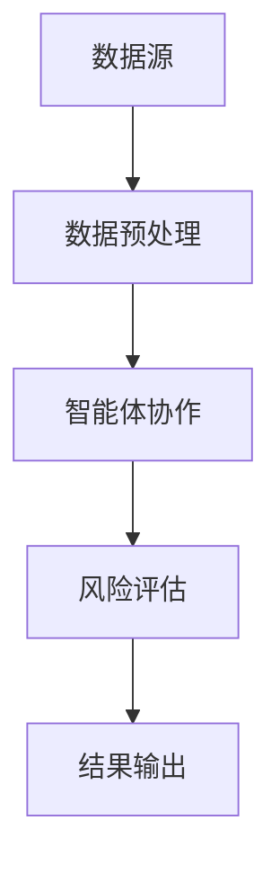
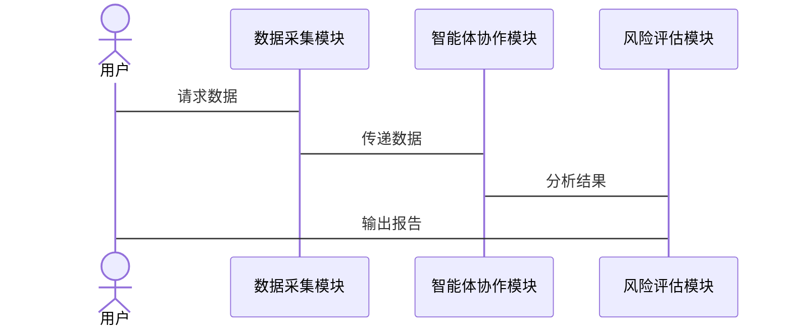

                 


# AI多智能体在价值投资中的商誉减值风险分析

## 关键词
AI多智能体，商誉减值，价值投资，风险分析，协同学习，强化学习，金融建模

## 摘要
本文深入探讨了AI多智能体在价值投资中的商誉减值风险分析的应用。通过分析商誉减值的背景与挑战，详细阐述了AI多智能体的基本原理及其在金融分析中的优势，重点介绍了多智能体协同学习算法的原理与实现，构建了完整的系统架构，并通过实际案例展示了如何利用AI多智能体技术进行商誉减值风险预测与优化。本文旨在为金融从业者和AI研究人员提供理论支持与实践指导。

---

# 第1章: 商誉减值风险的背景与挑战

## 1.1 商誉减值的基本概念

### 1.1.1 商誉的定义与会计处理
商誉是企业并购中产生的无形资产，代表企业超出其净资产价值的部分。会计处理中，商誉需要定期进行减值测试，以确保其价值合理。传统方法依赖于财务数据和人工判断，存在主观性和滞后性。

### 1.1.2 商誉减值的原因与影响
商誉减值主要由市场变化、企业业绩下滑等因素引起。其影响包括企业资产价值的降低、投资者信心的削弱等。

### 1.1.3 传统商誉减值评估的局限性
传统评估方法依赖历史数据和假设，难以捕捉实时市场动态，且缺乏对复杂风险的预测能力。

## 1.2 价值投资中的商誉问题

### 1.2.1 价值投资与商誉的关系
价值投资强调企业内在价值，商誉是其中的重要组成部分。准确评估商誉减值风险对价值投资至关重要。

### 1.2.2 多智能体在价值投资中的应用背景
多智能体系统在分布式计算和协同学习方面的优势，使其成为解决复杂金融问题的理想工具。

### 1.2.3 商誉减值风险的复杂性与挑战
商誉减值涉及多因素的动态变化，传统方法难以有效应对。

---

# 第2章: AI多智能体的基本原理与特点

## 2.1 多智能体系统的定义与核心要素

### 2.1.1 多智能体系统的定义
多智能体系统由多个分布式智能体组成，通过协作完成复杂任务。

### 2.1.2 多智能体系统的组成要素
- **智能体**：具备感知、决策和行动能力。
- **通信机制**：智能体之间通过信息交换协同工作。
- **协作任务**：系统目标由多个子任务组成，各智能体分工合作。

### 2.1.3 多智能体系统的协作机制
- **任务分配**：根据智能体能力和环境动态分配任务。
- **信息共享**：通过通信机制实现信息同步。
- **协调控制**：确保各智能体行动一致。

## 2.2 AI多智能体在金融分析中的优势

### 2.2.1 多智能体的分布式计算能力
- **并行计算**：多智能体能够同时处理大量数据，提高计算效率。
- **容错性**：单个智能体故障不影响整体系统运行。

### 2.2.2 多智能体的自适应与学习能力
- **在线学习**：智能体能够实时更新知识，适应市场变化。
- **强化学习**：通过奖励机制优化决策策略。

### 2.2.3 多智能体的协同优化能力
- **全局优化**：通过协同决策实现系统整体性能的提升。
- **局部最优到全局最优**：各智能体优化自身任务，最终实现全局最优。

---

# 第3章: 多智能体系统与商誉减值风险分析的结合

## 3.1 商誉减值风险分析的流程与关键点

### 3.1.1 商誉减值风险的识别与评估
- **数据收集**：整合财务数据、市场信息等多源数据。
- **风险识别**：通过多智能体协同分析，识别潜在风险点。

### 3.1.2 价值投资中的商誉评估模型
- **模型构建**：基于多智能体系统构建商誉评估模型。
- **模型优化**：通过协同学习优化模型参数。

### 3.1.3 多智能体在商誉减值分析中的应用场景
- **实时监控**：实时跟踪企业财务状况和市场变化。
- **风险预警**：通过多智能体协同分析，提前预警商誉减值风险。

## 3.2 多智能体系统在商誉减值分析中的优势

### 3.2.1 多智能体的分布式数据处理能力
- **数据并行处理**：多智能体能够同时处理不同来源的数据，提高分析效率。
- **数据融合**：通过信息共享，实现多源数据的有效融合。

### 3.2.2 多智能体的协同学习能力
- **知识共享**：智能体之间共享学习成果，提升整体认知能力。
- **协同优化**：通过协作学习，优化商誉评估模型。

### 3.2.3 多智能体的风险预测与优化能力
- **预测模型**：构建基于多智能体的商誉减值预测模型。
- **优化策略**：通过协同优化，制定最优风险控制策略。

---

# 第4章: 多智能体协同学习算法原理

## 4.1 多智能体协同学习的基本原理

### 4.1.1 协同学习的定义与特点
- **定义**：多智能体通过协作完成学习任务。
- **特点**：分布式、协同性、动态性。

### 4.1.2 多智能体协同学习的数学模型
$$
Q_i = \sum_{j=1}^{n} w_{ij} Q_j
$$
其中，$Q_i$表示智能体i的决策质量，$w_{ij}$表示智能体i对智能体j的依赖程度。

### 4.1.3 协同学习的实现机制
- **信息共享**：智能体之间共享学习成果。
- **任务分配**：根据任务特点分配智能体角色。

## 4.2 多智能体协同学习的算法实现

### 4.2.1 基于强化学习的协同算法
- **强化学习机制**：通过奖励函数优化智能体行为。
- **算法流程**：
  1. 初始化智能体参数。
  2. 智能体执行动作，获得环境反馈。
  3. 更新智能体参数，优化策略。

### 4.2.2 协同学习的数学模型
$$
V_i(s) = \max_{a} [ r_i(s,a) + \gamma \sum_{j=1}^{n} V_j(s')}}
$$
其中，$V_i(s)$表示智能体i在状态s下的价值函数，$r_i(s,a)$表示智能体i在状态s下采取动作a的奖励，$\gamma$表示折扣因子。

### 4.2.3 协同学习的实现代码
```python
class Agent:
    def __init__(self, state_size, action_size):
        self.state_size = state_size
        self.action_size = action_size
        self.Q = np.zeros((state_size, action_size))
    
    def act(self, state):
        if np.random.random() < 0.1:
            return random.randint(0, self.action_size-1)
        else:
            return np.argmax(self.Q[state])
    
    def update(self, state, action, reward, next_state):
        self.Q[state][action] += 0.1 * (reward + np.max(self.Q[next_state]) - self.Q[state][action])
```

---

# 第5章: 系统架构与实现方案

## 5.1 系统功能设计

### 5.1.1 系统目标
构建基于多智能体的商誉减值风险分析系统。

### 5.1.2 系统功能模块
- **数据采集模块**：收集企业财务数据和市场信息。
- **智能体协作模块**：实现多智能体协同分析。
- **风险评估模块**：输出商誉减值风险评估结果。

## 5.2 系统架构设计

### 5.2.1 系统架构图


### 5.2.2 系统交互流程


---

# 第6章: 项目实战与案例分析

## 6.1 环境搭建

### 6.1.1 环境要求
- **编程语言**：Python 3.8+
- **框架**：TensorFlow、PyTorch
- **库**：NumPy、Pandas

## 6.2 核心代码实现

### 6.2.1 多智能体协同学习实现
```python
class MultiAgentSystem:
    def __init__(self, num_agents):
        self.agents = [Agent(state_size, action_size) for _ in range(num_agents)]
    
    def step(self, states):
        actions = []
        for i in range(len(states)):
            actions.append(self.agents[i].act(states[i]))
        return actions
    
    def update(self, states, actions, rewards, next_states):
        for i in range(len(states)):
            self.agents[i].update(states[i], actions[i], rewards[i], next_states[i])
```

### 6.2.2 商誉减值风险预测
```python
def predict_impairment_risk(market_data, financial_data):
    states = preprocess_data(market_data, financial_data)
    actions = multi_agent.step(states)
    risks = evaluate_risks(actions, states)
    return risks
```

## 6.3 案例分析

### 6.3.1 案例背景
某制造企业并购一家科技公司，商誉价值为1000万元。

### 6.3.2 数据分析与建模
- **财务数据**：收入、利润、资产等。
- **市场数据**：行业趋势、竞争状况。

### 6.3.3 风险预测与优化
通过多智能体协同学习，预测商誉减值风险为20%，并提出优化策略。

---

# 第7章: 总结与展望

## 7.1 总结
本文深入探讨了AI多智能体在商誉减值风险分析中的应用，构建了完整的系统架构，并通过案例展示了其实现过程。

## 7.2 未来展望
未来，随着AI技术的发展，多智能体系统将在金融分析中发挥更大的作用，推动商誉减值风险评估的智能化与精准化。

---

# 作者：AI天才研究院 & 禅与计算机程序设计艺术

通过本文的分析与实践，我们展示了AI多智能体技术在价值投资中的巨大潜力。未来，随着技术的进步，商誉减值风险分析将更加精准和高效。

---

