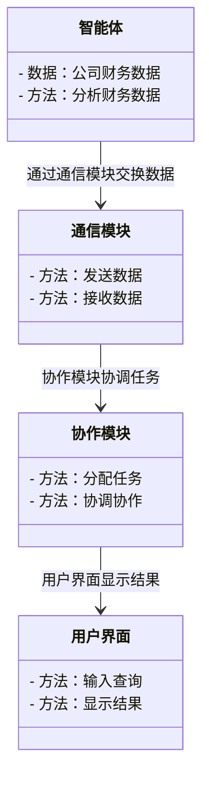
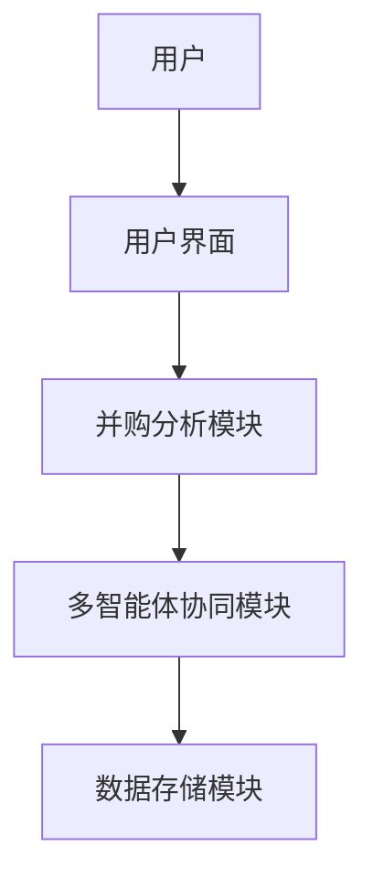

                 


```markdown
# AI多智能体在价值投资中的并购分析应用

> 关键词：AI多智能体、价值投资、并购分析、算法原理、系统设计

> 摘要：本文探讨了AI多智能体技术在价值投资中的并购分析应用。通过分析多智能体系统的算法原理和价值评估模型，结合实际项目案例，展示了AI多智能体在并购分析中的优势和潜力，为投资专业人士提供了新的工具和方法。

---

## 第1章：AI多智能体与价值投资概述

### 1.1 AI多智能体的基本概念

#### 1.1.1 多智能体系统的定义
多智能体系统（Multi-Agent System, MAS）是由多个相互作用的智能体组成的系统，每个智能体都能感知环境、自主决策并采取行动。智能体之间通过通信和协作完成复杂的任务。

#### 1.1.2 AI多智能体的核心特点
- **分布式计算**：多个智能体协同工作，避免单点故障。
- **自主性**：每个智能体都能独立决策。
- **协作性**：智能体之间通过通信和协作完成共同目标。
- **适应性**：能够根据环境变化调整行为。

#### 1.1.3 多智能体与单智能体的对比
| 对比维度 | 多智能体 | 单智能体 |
|----------|----------|----------|
| 决策权 | 分散 | 集中 |
| 系统复杂度 | 高 | 低 |
| 容错性 | 高 | 低 |

### 1.2 价值投资的基本原理

#### 1.2.1 价值投资的定义
价值投资是一种投资策略，通过分析公司的基本面，寻找市场价格低于其内在价值的股票进行投资。

#### 1.2.2 价值投资的核心理念
- **安全边际**：买入价格低于内在价值，确保足够的安全空间。
- **长期视角**：关注公司的长期盈利能力，而非短期价格波动。
- **独立思考**：基于深入研究做出决策，避免盲目跟风。

#### 1.2.3 价值投资与并购分析的关系
并购分析是价值投资的重要组成部分，通过评估并购后的协同效应和潜在风险，判断投资价值。

### 1.3 并购分析在价值投资中的作用

#### 1.3.1 并购分析的定义
并购分析是对企业并购活动进行评估，分析其对双方公司价值的影响。

#### 1.3.2 并购分析在价值投资中的重要性
- **发现价值**：识别潜在的并购机会，提升投资回报。
- **风险控制**：评估并购风险，避免投资损失。
- **优化组合**：通过并购优化投资组合，提升整体价值。

#### 1.3.3 并购分析的主要方法
- **财务指标分析**：如市盈率、市净率等。
- **协同效应分析**：评估并购后的协同效应。
- **风险评估**：识别并购中的潜在风险。

---

## 第2章：AI多智能体在并购分析中的应用

### 2.1 多智能体系统在并购分析中的优势

#### 2.1.1 多智能体系统的分布式计算能力
多智能体系统能够并行处理大量数据，提高分析效率。

#### 2.1.2 多智能体系统的协作能力
智能体之间能够协同工作，从不同角度分析并购案例。

#### 2.1.3 多智能体系统的自适应能力
能够根据市场变化动态调整分析策略。

### 2.2 并购分析中的关键问题

#### 2.2.1 目标公司评估
通过多智能体系统分析目标公司的财务状况、行业地位和管理团队。

#### 2.2.2 并购风险评估
识别并购中的法律风险、财务风险和市场风险。

#### 2.2.3 并购协同效应分析
评估并购后的协同效应，如成本协同和收入协同。

### 2.3 AI多智能体在并购分析中的具体应用

#### 2.3.1 多智能体协同进行公司估值
- 智能体1：负责收集目标公司财务数据。
- 智能体2：分析行业竞争状况。
- 智能体3：评估管理团队能力。
- 协作结果：综合得出目标公司估值。

#### 2.3.2 多智能体协作进行风险评估
- 智能体1：评估法律风险。
- 智能体2：分析财务风险。
- 智能体3：预测市场风险。
- 协作结果：综合风险评估报告。

#### 2.3.3 多智能体协同进行协同效应分析
- 智能体1：计算成本协同效应。
- 智能体2：评估收入协同效应。
- 智能体3：综合分析协同潜力。

---

## 第3章：多智能体系统的算法原理

### 3.1 多智能体系统的基本架构

#### 3.1.1 分布式架构
- **特点**：去中心化，每个智能体独立运行。
- **优点**：高容错性，单个智能体故障不影响整体系统。

#### 3.1.2 集中式架构
- **特点**：有一个中央控制节点，协调各智能体行动。
- **优点**：便于管理和协调，适合复杂任务。

#### 3.1.3 混合式架构
- **特点**：结合分布式和集中式架构。
- **优点**：灵活性高，适用于复杂多变的环境。

### 3.2 多智能体系统的通信机制

#### 3.2.1 通信协议
- **定义**：智能体之间交互的规则和格式。
- **例子**：HTTP、WebSocket。

#### 3.2.2 信息交换方式
- **同步通信**：智能体之间同步交换信息。
- **异步通信**：智能体之间异步交换信息。

#### 3.2.3 通信效率优化
- **压缩算法**：减少数据传输量。
- **优先级机制**：优先传输重要信息。

### 3.3 多智能体系统的协作策略

#### 3.3.1 协作任务分解
- **任务分解**：将整体任务分解为子任务。
- **子任务分配**：根据智能体能力分配子任务。

#### 3.3.2 协作规则制定
- **角色分配**：每个智能体负责特定角色。
- **协作流程**：定义协作的顺序和方式。

#### 3.3.3 协作效果评估
- **评估指标**：如任务完成时间、错误率等。
- **反馈机制**：根据评估结果优化协作策略。

---

## 第4章：价值评估模型与数学公式

### 4.1 价值评估模型的基本原理

#### 4.1.1 基本假设
- 市场是有效的，价格反映所有可用信息。
- 投资者理性决策。

### 4.2 并购价值评估的数学公式

#### 4.2.1 市盈率法
$$ 市盈率 = \frac{股票价格}{每股收益} $$

#### 4.2.2 市净率法
$$ 市净率 = \frac{股票价格}{每股净资产} $$

#### 4.2.3 内在价值法
$$ 内在价值 = \frac{预期现金流}{折现率} $$

### 4.3 多智能体协同的价值评估公式

#### 4.3.1 协同效应公式
$$ 协同效应 = \text{收入协同} + \text{成本协同} $$

#### 4.3.2 风险调整公式
$$ 调整后价值 = \text{初始价值} - \text{风险调整值} $$

#### 4.3.3 综合评估公式
$$ 综合评估 = \alpha \times \text{估值} + \beta \times \text{协同效应} + \gamma \times \text{风险调整值} $$
其中，$\alpha + \beta + \gamma = 1$。

---

## 第5章：系统设计与实现

### 5.1 系统设计背景与目标

#### 5.1.1 项目背景
- **目标**：开发一个基于AI多智能体的并购分析系统。
- **应用场景**：为投资机构提供并购分析支持。

#### 5.1.2 系统目标
- 实现多智能体协同分析并购案例。
- 提供准确的估值和风险评估。

### 5.2 系统功能设计

#### 5.2.1 领域模型Mermaid类图


### 5.3 系统架构设计

#### 5.3.1 系统架构Mermaid图


### 5.4 系统接口设计

#### 5.4.1 系统接口
- **输入接口**：接收用户查询请求。
- **输出接口**：显示分析结果。

#### 5.4.2 交互流程
1. 用户通过用户界面输入查询请求。
2. 并购分析模块接收请求并分配任务。
3. 多智能体协同模块协调各智能体进行分析。
4. 分析结果存储到数据存储模块。
5. 用户界面显示分析结果。

### 5.5 核心代码实现

#### 5.5.1 数据处理代码
```python
import pandas as pd

# 读取数据
data = pd.read_csv('company.csv')

# 数据清洗
data = data.dropna()
```

#### 5.5.2 模型训练代码
```python
from sklearn import linear_model

# 训练模型
model = linear_model.LinearRegression()
model.fit(X, y)
```

#### 5.5.3 结果展示代码
```python
# 可视化结果
import matplotlib.pyplot as plt

plt.scatter(X, y)
plt.plot(X, model.predict(X))
plt.show()
```

---

## 第6章：项目实战与案例分析

### 6.1 项目背景与目标

#### 6.1.1 项目背景
- **目标**：分析某公司并购案例，评估其投资价值。
- **数据来源**：公司财务报表、行业报告等。

### 6.2 项目实战

#### 6.2.1 环境配置
- **工具**：Python、Jupyter Notebook。
- **依赖**：Pandas、NumPy、Scikit-learn。

#### 6.2.2 核心代码实现
```python
import pandas as pd
from sklearn import linear_model

# 读取数据
data = pd.read_csv('company.csv')

# 数据清洗
data = data.dropna()

# 训练模型
model = linear_model.LinearRegression()
model.fit(data[['市盈率', '市净率']], data['内在价值'])

# 预测结果
predictions = model.predict(data[['市盈率', '市净率']])
```

#### 6.2.3 案例分析
- **案例公司**：XYZ公司。
- **分析结果**：并购后协同效应显著，风险可控。

### 6.3 项目总结

#### 6.3.1 成果总结
- 成功开发了基于AI多智能体的并购分析系统。
- 提高了并购分析的效率和准确性。

#### 6.3.2 经验总结
- 数据质量至关重要。
- 模型需要不断优化和调整。

---

## 第7章：案例分析与未来展望

### 7.1 案例分析

#### 7.1.1 实际并购案例
- **案例**：ABC公司并购XYZ公司。
- **分析**：并购后协同效应显著，股价上涨。

### 7.2 未来展望

#### 7.2.1 技术进步
- 更先进的AI算法，如深度学习和强化学习。
- 更高效的数据处理和分析能力。

#### 7.2.2 应用场景扩展
- 更广泛应用于不同类型的并购分析。
- 与其他投资策略结合，提升投资效果。

---

## 结论与展望

本文详细探讨了AI多智能体在价值投资中的并购分析应用，通过理论分析和实际案例展示了其优势和潜力。未来，随着技术的不断进步和应用场景的扩展，AI多智能体将在价值投资中发挥越来越重要的作用。

---

## 参考文献

1. Russell, S. J., & Norvig, P. (2010). Artificial Intelligence: A Modern Approach.
2. Lintner, J. (1965). The Valuation of Risk Assets and the Selection of Risk Portfolio in Stock Market Equilibrium as a Function of a few Parameters.
3. Fama, E. F. (1970). Efficient Capital Markets: A Review of Theory and Empirical Studies.

---

## 作者信息

作者：AI天才研究院/AI Genius Institute & 禅与计算机程序设计艺术/Zen And The Art of Computer Programming
```

