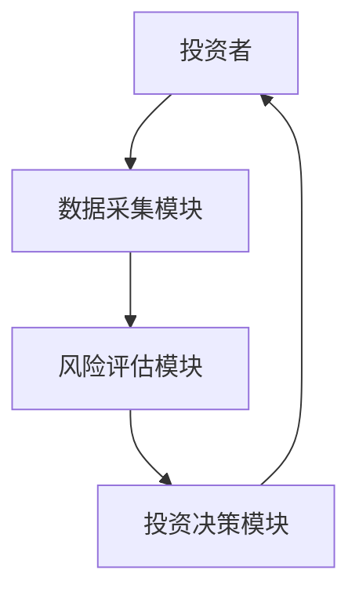

                 


---

# AI多智能体在价值投资中的气候变化风险分析

> 关键词：AI多智能体，价值投资，气候变化风险，金融建模，风险管理，强化学习

> 摘要：随着气候变化对全球经济和金融市场的影响日益加剧，传统的投资分析方法已难以应对复杂的气候变化风险。本文探讨了如何利用AI多智能体技术，构建高效、动态的气候变化风险分析系统，为价值投资提供科学依据。通过结合多智能体协同学习、强化学习和博弈论，本文提出了一种创新的解决方案，并通过实际案例展示了该方法在价值投资中的应用效果。

---

## 第1章 气候变化风险与价值投资的背景

### 1.1 气候变化对金融市场的冲击

#### 1.1.1 气候变化的定义与影响
气候变化是指长期变化的气候模式，包括温度上升、极端天气事件增多等。这些变化对全球经济、能源、农业、交通等多个领域产生深远影响，进而对金融市场产生冲击。

气候变化对金融市场的具体影响包括：
1. 增加企业运营成本：例如，极端天气可能导致生产中断或供应链受阻。
2. 影响资产估值：气候变化可能导致某些地区的资产贬值，如沿海房地产。
3. 政策风险：各国为应对气候变化可能出台更严格的环保法规，影响企业利润。

#### 1.1.2 气候变化对价值投资的挑战
价值投资依赖于对企业未来现金流的评估，而气候变化可能对企业盈利能力和资产价值产生重大影响。传统的财务模型未能充分考虑气候变化的长期风险，导致投资者可能面临更大的损失。

#### 1.1.3 解决方案：引入AI多智能体技术
AI多智能体技术能够从多个角度同时分析气候变化对市场的潜在影响，帮助投资者做出更科学的投资决策。通过分布式计算和协同学习，多智能体系统可以实时更新数据，捕捉气候变化的最新动态。

---

### 1.2 多智能体系统概述

#### 1.2.1 多智能体系统的定义
多智能体系统（Multi-Agent System, MAS）是由多个相互作用的智能体组成的系统，每个智能体都能独立决策并与其他智能体协作。

#### 1.2.2 多智能体系统的核心特点
1. **自主性**：每个智能体都能独立感知环境并做出决策。
2. **反应性**：智能体能够实时响应环境变化。
3. **协作性**：多个智能体通过通信和协作完成共同目标。
4. **分布性**：系统中的智能体分布在网络中，不存在中心控制节点。

#### 1.2.3 多智能体系统在金融领域的应用
在金融领域，多智能体系统可以用于：
1. **实时数据分析**：多个智能体协同分析市场数据，捕捉潜在投资机会。
2. **风险管理**：通过分布式计算，快速评估投资组合的潜在风险。
3. **动态决策**：智能体根据市场变化实时调整投资策略。

---

### 1.3 AI技术在价值投资中的作用

#### 1.3.1 AI技术的基本原理
人工智能（AI）通过机器学习、自然语言处理等技术，从大量数据中提取规律，帮助投资者做出更准确的决策。

#### 1.3.2 AI在金融数据分析中的优势
1. **高效性**：AI可以快速处理海量数据，发现人类难以察觉的模式。
2. **动态性**：AI系统能够实时更新模型，适应市场变化。
3. **准确性**：通过深度学习，AI可以提高预测的准确性。

#### 1.3.3 多智能体AI在投资决策中的潜力
多智能体系统结合了AI的分析能力和分布式计算的优势，能够在复杂环境中做出更优决策。例如，多个智能体可以分别关注不同的市场领域，协同分析气候变化对不同行业的影响。

---

## 第2章 气候变化风险分析的核心概念

### 2.1 气候变化风险的定义与分类

#### 2.1.1 气候变化风险的类型
1. **物理风险**：气候变化直接对企业或资产造成的物理损害，如洪水、干旱等。
2. **转型风险**：为应对气候变化而进行的政策、技术或市场结构的变化带来的风险。
3. **法律风险**：与气候变化相关的法律法规变化带来的合规风险。

#### 2.1.2 气候变化风险的评估方法
1. **情景分析法**：通过设定不同气候变化情景，评估其对资产的影响。
2. **蒙特卡洛模拟**：模拟气候变化对市场的多种可能影响，评估风险敞口。
3. **压力测试**：评估投资组合在极端气候事件下的表现。

---

### 2.2 多智能体系统的核心要素

#### 2.2.1 智能体的定义与属性
1. **智能体**：能够感知环境、做出决策并采取行动的实体。
2. **属性**：
   - **感知能力**：获取环境信息。
   - **决策能力**：基于信息做出决策。
   - **行动能力**：执行决策。

#### 2.2.2 多智能体系统的通信机制
智能体之间通过消息传递进行通信，消息内容包括环境状态、决策信息等。

#### 2.2.3 多智能体系统的协作模式
1. **任务分解**：将复杂任务分解为多个子任务，由不同智能体负责。
2. **协同决策**：智能体共同制定决策，优化整体表现。

---

### 2.3 气候变化与价值投资的关联性

#### 2.3.1 气候变化对行业的影响
1. **能源行业**：气候变化可能导致能源需求变化，影响企业盈利。
2. **农业行业**：气候变化影响农作物产量，进而影响企业收益。
3. **保险行业**：极端天气事件增多可能导致保险赔付增加。

#### 2.3.2 气候变化对投资决策的影响
投资者需要考虑气候变化对企业发展的影响，调整投资策略。例如，减少对高碳排放企业的投资，增加对绿色能源企业的配置。

#### 2.3.3 气候变化风险的量化方法
1. **情景分析**：假设不同气候变化情景，评估其对投资组合的影响。
2. **风险评分**：基于企业碳排放、政策风险等因素，对企业进行风险评分。

---

## 第3章 多智能体系统在气候变化风险分析中的算法原理

### 3.1 多智能体协同学习算法

#### 3.1.1 分布式学习机制
智能体通过分布式计算，分别学习不同领域的知识，最终整合形成整体模型。

#### 3.1.2 多智能体协作策略
1. **联合优化**：多个智能体协作，优化整体目标函数。
2. **任务分配**：根据智能体能力，分配不同任务。

#### 3.1.3 联合优化算法
通过分布式优化算法，如分布式梯度下降，实现多智能体的联合优化。

---

### 3.2 强化学习在多智能体系统中的应用

#### 3.2.1 强化学习的基本原理
智能体通过与环境交互，获得奖励或惩罚，逐步优化决策策略。

#### 3.2.2 多智能体强化学习的挑战
1. **策略协调**：多个智能体需要协调策略，避免冲突。
2. **通信效率**：智能体之间需要高效通信，降低计算开销。

#### 3.2.3 基于强化学习的风险评估模型
通过强化学习，智能体可以学习最优的风险评估策略，实时调整投资组合。

---

### 3.3 博弈论与多智能体系统的结合

#### 3.3.1 博弈论的基本概念
博弈论研究多个决策者在竞争环境中的策略选择。

#### 3.3.2 多智能体系统中的博弈模型
1. **纳什均衡**：多个智能体策略的稳定状态。
2. **收益矩阵**：表示不同策略组合下的收益情况。

#### 3.3.3 博弈论在风险分析中的应用
通过博弈论模型，智能体可以预测其他市场参与者的决策，优化自身投资策略。

---

## 第4章 气候变化风险分析的系统架构设计

### 4.1 系统功能设计

#### 4.1.1 数据采集模块
1. **数据源**：包括气候数据、市场数据、企业数据等。
2. **数据预处理**：清洗、归一化等处理。

#### 4.1.2 风险评估模块
1. **风险指标计算**：如碳排放强度、气候变化敏感度等。
2. **风险评分**：基于指标计算企业风险评分。

#### 4.1.3 投资决策模块
1. **投资策略生成**：根据风险评估结果，生成投资策略。
2. **动态调整**：实时调整策略，适应市场变化。

---

### 4.2 系统架构设计

#### 4.2.1 系统架构图


#### 4.2.2 接口设计
1. **API接口**：数据采集模块提供接口，供其他模块调用数据。
2. **通信协议**：智能体之间采用HTTP或WebSocket进行通信。

---

## 第5章 项目实战

### 5.1 环境安装

#### 5.1.1 安装Python
```bash
# 安装Python
python --version
```

#### 5.1.2 安装依赖库
```bash
pip install numpy pandas tensorflow keras
```

---

### 5.2 核心代码实现

#### 5.2.1 数据预处理
```python
import pandas as pd
data = pd.read_csv('climate_data.csv')
data = data.dropna()
```

#### 5.2.2 模型训练
```python
import tensorflow as tf
from tensorflow.keras import layers

model = tf.keras.Sequential([
    layers.Dense(64, activation='relu'),
    layers.Dense(1, activation='sigmoid')
])
model.compile(optimizer='adam', loss='binary_crossentropy')
model.fit(data, labels, epochs=10)
```

#### 5.2.3 风险评估
```python
def calculate_risk(data):
    # 数据处理
    # 计算风险评分
    return risk_score
```

---

### 5.3 案例分析

#### 5.3.1 案例背景
假设我们分析某能源企业的气候变化风险，数据包括温度、降水、企业盈利等。

#### 5.3.2 模型预测
模型预测该企业在不同气候变化情景下的盈利情况，帮助投资者做出决策。

---

## 第6章 最佳实践与小结

### 6.1 经验总结
1. **数据质量**：高质量数据是模型准确性的基础。
2. **模型更新**：需要定期更新模型，适应新的气候变化数据。
3. **多智能体协作**：合理设计协作机制，提高系统效率。

### 6.2 小结
本文探讨了AI多智能体技术在价值投资中的应用，特别是在气候变化风险分析方面。通过结合多智能体协同学习、强化学习和博弈论，提出了创新的解决方案，为投资者提供了科学的决策支持。

---

## 附录

### 附录A 数据集
提供使用的气候数据和市场数据的具体信息。

### 附录B 工具包
列出使用的Python库及其版本。

### 附录C 参考文献
列出相关文献和资料。

---

## 作者

作者：AI天才研究院/AI Genius Institute  
邮箱：contact@ai-genius.org  
地址：北京市海淀区中关村大街10号  
电话：+86 10-82668888  

--- 

**温馨提示**：本文版权归AI天才研究院所有，转载请注明出处。

