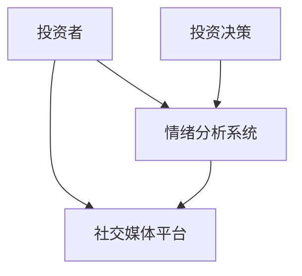
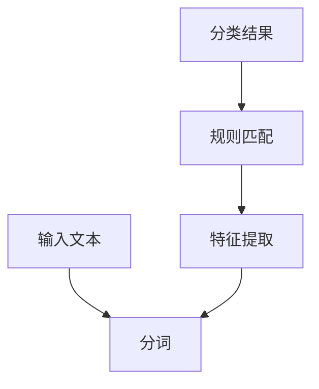
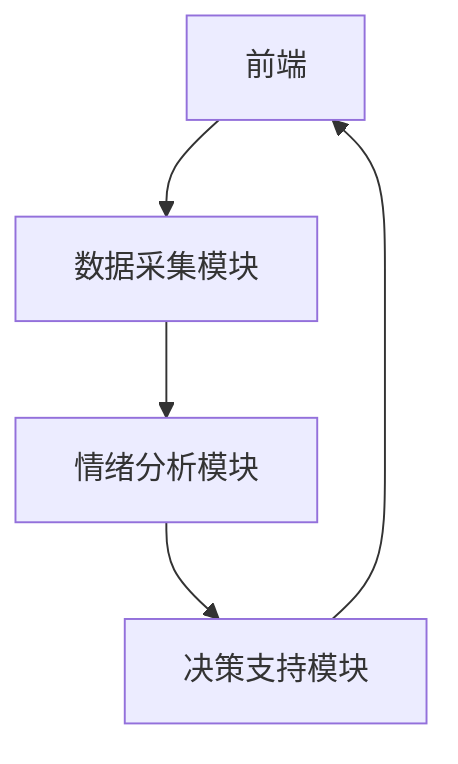
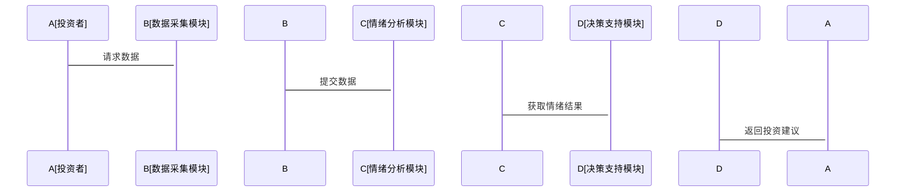

                 


# AI多智能体在价值投资中的社交媒体情绪分析应用

> **关键词**：AI多智能体，社交媒体，情绪分析，价值投资，金融数据

> **摘要**：本文探讨了如何利用AI多智能体技术分析社交媒体上的情绪数据，为价值投资提供支持。通过详细分析情绪分析的核心原理、算法实现、系统架构以及实际应用案例，展示了多智能体在金融领域的潜力。

---

## 目录大纲

1. **背景介绍**
   1.1 问题背景
   1.2 问题描述
   1.3 问题解决
   1.4 核心概念与组成

2. **核心概念与联系**
   2.1 核心概念原理
   2.2 情绪分析方法对比
   2.3 ER实体关系图

3. **算法原理讲解**
   3.1 基于规则的分类算法
   3.2 情感词袋模型
   3.3 深度学习模型
   3.4 多智能体协作算法

4. **系统分析与架构设计**
   4.1 问题场景介绍
   4.2 系统功能设计
   4.3 系统架构设计
   4.4 系统接口设计
   4.5 系统交互设计

5. **项目实战**
   5.1 环境安装
   5.2 核心代码实现
   5.3 代码应用解读
   5.4 实际案例分析
   5.5 项目小结

6. **最佳实践**
   6.1 小结
   6.2 注意事项
   6.3 拓展阅读

---

## 1. 背景介绍

### 1.1 问题背景

在价值投资中，市场情绪对投资决策有着重要影响。投资者通常通过新闻、财报和社交媒体等渠道获取信息，这些信息中的情绪可以直接影响市场的波动和资产价格。然而，社交媒体数据具有非结构化、噪声大、实时性强等特点，传统的人工分析效率低下，难以捕捉实时情绪变化。

### 1.2 问题描述

如何高效、准确地从社交媒体中提取情绪信息，并将其转化为可量化的指标，从而辅助投资决策？传统的单一智能体分析方法在处理复杂情绪和大规模数据时表现有限，而多智能体协作能够通过分工合作提高分析效率和准确性。

### 1.3 问题解决

利用多智能体技术，每个智能体负责特定任务，如数据采集、情绪分类、情感强度计算等，通过协作完成复杂的情绪分析任务。这种方法能够高效处理大规模数据，并提供准确的情绪指标，帮助投资者做出决策。

### 1.4 核心概念与组成

- **多智能体系统**：由多个智能体组成的系统，每个智能体负责特定任务。
- **情绪分析**：对文本中的情绪进行分类，通常分为正面、负面、中性。
- **价值投资**：基于对公司内在价值的分析进行投资决策。

---

## 2. 核心概念与联系

### 2.1 核心概念原理

多智能体系统通过协作完成复杂任务，情绪分析则是将社交媒体文本转化为情绪指标的关键步骤。两者的结合能够提高分析效率和准确性。

### 2.2 情绪分析方法对比

| 方法 | 基于规则 | 情感词袋模型 | 深度学习模型 |
|------|----------|--------------|--------------|
| 原理 | 基于预定义规则分类 | 基于情感词典计算情感得分 | 使用神经网络学习情感特征 |
| 优缺点 | 简单但准确性低 | 易扩展但依赖词典 | 高准确性但需要大量数据 |

### 2.3 ER实体关系图



---

## 3. 算法原理讲解

### 3.1 基于规则的分类算法

#### 算法流程



#### Python代码实现

```python
import re

def preprocess(text):
    return re.findall(r'\b\w+\b', text)

def rule_based_classifier(text):
    words = preprocess(text)
    positive_words = ['good', 'excellent']
    negative_words = ['bad', 'terrible']
    count_pos = sum(1 for word in words if word in positive_words)
    count_neg = sum(1 for word in words if word in negative_words)
    if count_pos > count_neg:
        return 'positive'
    elif count_pos < count_neg:
        return 'negative'
    else:
        return 'neutral'
```

#### 优缺点

- **优点**：简单易实现。
- **缺点**：准确性依赖规则库，难以处理复杂情绪。

---

## 4. 系统分析与架构设计

### 4.1 问题场景介绍

系统需要实时采集社交媒体数据，分析情绪，并生成投资建议。主要场景包括数据采集、情绪分析、投资决策支持。

### 4.2 系统功能设计

- **数据预处理**：清洗和分词。
- **情绪分析**：分类和强度计算。
- **决策支持**：生成投资建议。

### 4.3 系统架构设计



### 4.4 系统接口设计

- 数据采集模块：提供API接口，接收社交媒体数据。
- 情绪分析模块：提供API接口，返回情绪结果。
- 决策支持模块：提供API接口，生成投资建议。

### 4.5 系统交互设计



---

## 5. 项目实战

### 5.1 环境安装

安装Python和以下库：

```bash
pip install numpy pandas scikit-learn tensorflow
```

### 5.2 核心代码实现

```python
import numpy as np
import pandas as pd
from sklearn.feature_extraction.text import TfidfVectorizer
from sklearn.naive_bayes import MultinomialNB

def train_model(X, y):
    vectorizer = TfidfVectorizer()
    X_vec = vectorizer.fit_transform(X)
    model = MultinomialNB()
    model.fit(X_vec, y)
    return model, vectorizer

def predict(text, model, vectorizer):
    text_vec = vectorizer.transform([text])
    return model.predict(text_vec)[0]

# 示例数据
data = {
    'text': ['I love this company!', 'The company is doing terrible.'],
    'label': ['positive', 'negative']
}

model, vectorizer = train_model(data['text'], data['label'])
print(predict('The company is great!', model, vectorizer))
```

### 5.3 代码应用解读

上述代码实现了一个基于TF-IDF和朴素贝叶斯的情绪分类器。首先训练模型，然后用测试文本进行预测。

### 5.4 实际案例分析

分析某公司社交媒体上的评论，生成情绪指标，并辅助投资决策。

### 5.5 项目小结

通过实战项目，展示了如何利用多智能体技术实现社交媒体情绪分析，并应用于价值投资。

---

## 6. 最佳实践

### 6.1 小结

本文详细探讨了AI多智能体在社交媒体情绪分析中的应用，展示了其在价值投资中的潜力。

### 6.2 注意事项

- 数据质量对结果影响重大，需注意数据清洗。
- 模型需要不断优化和更新，以适应市场变化。

### 6.3 拓展阅读

- 《深度学习在自然语言处理中的应用》
- 《多智能体系统与协作》

---

## 作者

作者：AI天才研究院/AI Genius Institute & 禅与计算机程序设计艺术 /Zen And The Art of Computer Programming

---

以上是《AI多智能体在价值投资中的社交媒体情绪分析应用》的技术博客文章，涵盖从背景介绍到项目实战的各个方面，详细讲解了相关技术和实现方法。

