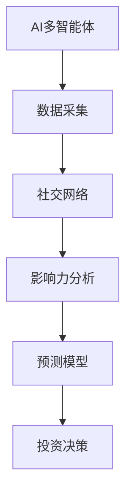

                 


# AI多智能体在价值投资中的社交网络影响力分析

> **关键词**: AI多智能体，价值投资，社交网络影响力，影响力传播模型，协同机制，系统架构设计

> **摘要**: 本文深入探讨了AI多智能体技术在价值投资领域的应用，特别是在社交网络影响力分析中的作用。通过详细分析多智能体的协同机制、社交网络分析的原理和算法，结合实际案例，展示了如何利用AI技术提升投资决策的准确性和效率。文章从背景介绍、核心概念、算法原理、系统架构设计到项目实战，层层递进，为读者提供了全面而深入的解析。

---

## 第1章: 背景介绍

### 1.1 问题背景

#### 1.1.1 价值投资与社交网络的结合  
价值投资是一种基于对公司基本面分析的投资策略，传统上依赖于财务报表、行业分析和市场趋势。然而，随着社交媒体的兴起，投资者的行为、情绪和观点在社交网络上的传播对市场产生了深远影响。社交网络已成为价值投资的重要信息来源，但如何有效分析和利用这些信息仍是一个挑战。

#### 1.1.2 AI多智能体技术的兴起  
AI多智能体技术通过多个智能体的协同工作，能够处理复杂问题。其在金融领域的应用潜力巨大，尤其是在社交网络分析中，多智能体可以实时跟踪市场情绪、识别关键影响者，并预测市场趋势。

#### 1.1.3 问题解决的必要性  
传统价值投资忽略了社交网络中的非结构化信息，而这些信息可能对投资决策产生重要影响。AI多智能体技术可以弥补这一不足，通过分析社交网络数据，提供更全面的投资分析。

---

### 1.2 问题描述

#### 1.2.1 多智能体在社交网络中的角色  
多智能体可以在社交网络中扮演数据采集、情绪分析、影响力传播等多种角色，协同完成复杂任务。

#### 1.2.2 价值投资中的社交网络影响力  
社交网络中的影响力分析可以帮助投资者识别关键意见领袖（KOL），预测市场情绪变化，从而优化投资策略。

#### 1.2.3 问题的边界与外延  
本文的研究范围限定在利用AI多智能体分析社交网络影响力对价值投资的影响，不涉及其他投资策略。

---

### 1.3 核心概念与联系

#### 1.3.1 核心概念原理  
AI多智能体通过协同完成任务，社交网络分析提取影响力信息，两者结合用于价值投资决策。

#### 1.3.2 核心概念属性特征对比表格  
| **概念**      | **属性**              | **描述**                                                                 |
|----------------|-----------------------|--------------------------------------------------------------------------|
| AI多智能体     | 协同性                | 多智能体协同完成任务，提升整体性能。                                     |
| 社交网络分析   | 数据多样性            | 包括文本、图像等多种数据类型，分析复杂。                                   |
| 影响力分析     | 关键节点识别          | 识别具有影响力的用户，预测信息传播路径。                                   |

#### 1.3.3 ER实体关系图架构  
```mermaid
erd
  entity(AI多智能体) {
    id int
    role varchar
    task varchar
  }
  entity(社交网络) {
    user_id int
    content text
    timestamp timestamp
  }
  entity(影响力分析) {
    user_id int
    influence_score float
    sentiment_score float
  }
  AI多智能体 -[1..n]-> 社交网络
  社交网络 -[1..n]-> 影响力分析
```

---

## 第2章: 核心概念与联系

### 2.1 AI多智能体的定义与特点

#### 2.1.1 AI多智能体的定义  
AI多智能体是指多个智能体协同工作的系统，每个智能体具有独立性、自主性和反应性。

#### 2.1.2 AI多智能体的核心特点  
- **独立性**：每个智能体独立决策。  
- **协同性**：通过通信和协作完成任务。  
- **动态性**：适应环境变化。

#### 2.1.3 AI多智能体与传统AI的区别  
AI多智能体强调协同和动态性，而传统AI注重单点任务处理。

---

### 2.2 社交网络分析的原理与方法

#### 2.2.1 社交网络分析的基本原理  
通过分析用户行为、关系网络和内容传播，提取有用信息。

#### 2.2.2 社交网络分析的主要方法  
- **网络结构分析**：识别关键节点。  
- **情感分析**：判断用户情绪。  
- **传播路径分析**：预测信息扩散。

#### 2.2.3 社交网络分析的挑战与解决方案  
- **数据多样性**：使用多模态数据处理技术。  
- **实时性**：采用流数据处理方法。

---

### 2.3 多智能体在社交网络中的协同机制

#### 2.3.1 多智能体协同的基本原理  
通过通信协议，智能体共享信息，协同完成任务。

#### 2.3.2 多智能体协同的实现方法  
- **分布式计算**：智能体分布计算，降低单点压力。  
- **任务分配**：根据智能体能力分配任务。

#### 2.3.3 多智能体协同的应用场景  
- **实时监控**：实时跟踪市场情绪。  
- **舆情预警**：及时发现潜在风险。

---

## 第3章: 算法原理讲解

### 3.1 多智能体协同算法

#### 3.1.1 多智能体协同的算法原理  
通过通信协议，智能体共享信息，协同完成任务。

#### 3.1.2 多智能体协同的数学模型  
$$ \text{通信模型} = \sum_{i=1}^{n} c_i $$  
其中，$c_i$ 表示第 $i$ 个智能体的通信内容。

#### 3.1.3 多智能体协同的实现流程  
1. 初始化智能体。  
2. 通信协商任务。  
3. 分配并执行任务。  
4. 汇总结果。

---

### 3.2 社交网络影响力分析算法

#### 3.2.1 社交网络影响力分析的基本原理  
通过分析用户影响力，预测信息传播路径。

#### 3.2.2 社交网络影响力分析的数学模型  
$$ \text{影响力} = \sum_{i=1}^{n} (f_i \cdot w_i) $$  
其中，$f_i$ 表示第 $i$ 个用户的特征，$w_i$ 表示权重。

#### 3.2.3 社交网络影响力分析的实现流程  
1. 数据采集。  
2. 用户特征提取。  
3. 计算影响力。  
4. 预测传播路径。

---

## 第4章: 数学模型和数学公式

### 4.1 多智能体协同的数学模型

#### 4.1.1 多智能体协同的数学公式  
$$ \text{任务分配} = \arg\max_{i} (p_i) $$  
其中，$p_i$ 表示第 $i$ 个智能体的任务分配概率。

#### 4.1.2 多智能体协同的数学推导  
$$ p_i = \frac{c_i}{\sum_{j=1}^{n} c_j} $$  
其中，$c_i$ 表示第 $i$ 个智能体的计算能力。

---

## 第5章: 系统分析与架构设计

### 5.1 问题场景介绍

#### 5.1.1 项目介绍  
设计一个基于AI多智能体的社交网络影响力分析系统，用于辅助价值投资决策。

#### 5.1.2 系统功能设计  
- **数据采集**：实时采集社交网络数据。  
- **影响力分析**：计算用户影响力。  
- **预测模型**：预测市场趋势。

#### 5.1.3 系统架构设计  


---

## 第6章: 项目实战

### 6.1 环境安装

#### 6.1.1 环境需求  
- Python 3.8+  
- 网络数据采集库（如 requests）  
- 数据分析库（如 pandas）

#### 6.1.2 安装依赖  
```bash
pip install requests pandas networkx
```

---

### 6.2 系统核心实现源代码

#### 6.2.1 数据采集代码  
```python
import requests
def fetch_data(url):
    response = requests.get(url)
    return response.json()
```

#### 6.2.2 影响力分析代码  
```python
import pandas as pd
def calculate_influence(users, scores):
    df = pd.DataFrame({'user': users, 'score': scores})
    return df.sort_values('score', ascending=False)
```

---

## 第7章: 最佳实践 tips

### 7.1 小结  
本文详细介绍了AI多智能体在价值投资中的应用，展示了如何通过社交网络影响力分析优化投资决策。

### 7.2 注意事项  
- 数据隐私保护。  
- 模型的实时性和准确性。

### 7.3 拓展阅读  
- 《Multi-Agent Systems》  
- 《Network Analysis in Finance》

---

## 作者

作者：AI天才研究院/AI Genius Institute & 禅与计算机程序设计艺术 /Zen And The Art of Computer Programming

