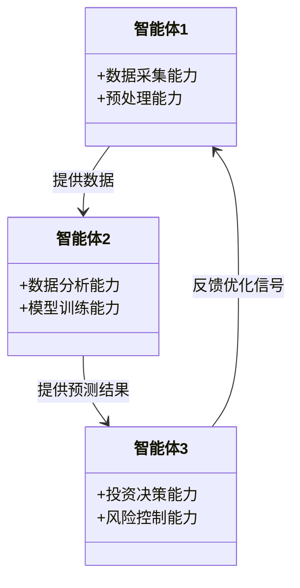
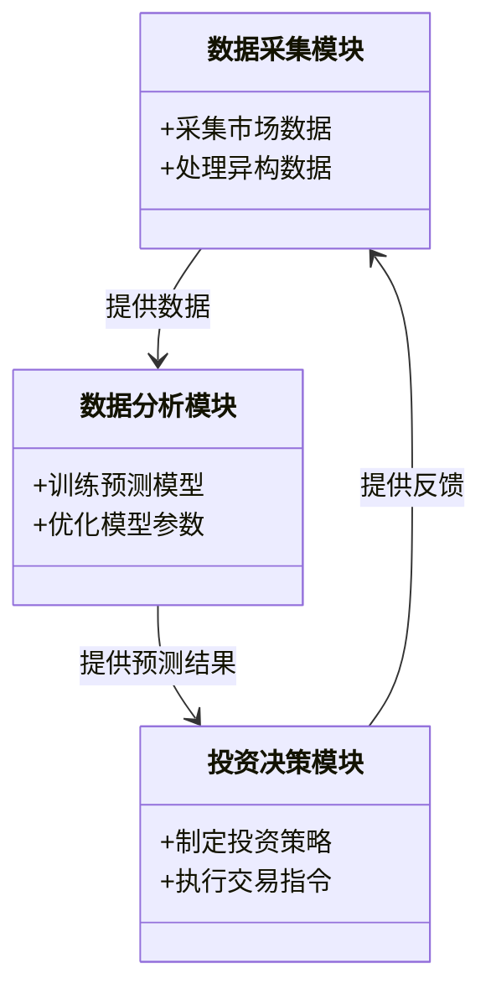
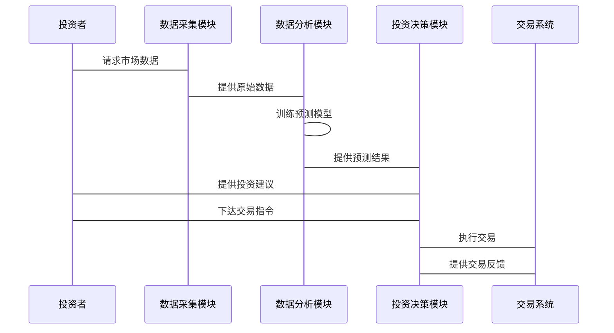

                 


# AI多智能体在价值投资中的竞争优势分析

> 关键词：AI多智能体，价值投资，投资决策，数学模型，协作优化，分布式计算

> 摘要：本文系统地分析了AI多智能体在价值投资中的应用优势，详细阐述了AI多智能体的核心概念、算法原理、数学模型、系统架构以及实际案例。通过分析，本文揭示了AI多智能体在价值投资中的独特价值，包括分布式计算能力、多目标优化能力和自适应学习能力，并探讨了这些能力如何帮助投资者做出更优决策。

---

# 第一部分: AI多智能体与价值投资的背景介绍

## 第1章: AI多智能体系统概述

### 1.1 AI多智能体的基本概念

#### 1.1.1 多智能体系统的定义
多智能体系统（Multi-Agent System, MAS）是由多个智能体组成的系统，这些智能体能够通过通信和协作完成复杂的任务。每个智能体都有自己的目标、知识和行为规则。

#### 1.1.2 多智能体的核心特征
- **自主性**：每个智能体都能独立决策。
- **反应性**：能够实时感知环境并做出反应。
- **协作性**：通过通信协作完成共同目标。
- **分布式性**：任务分布在多个智能体之间，避免单点依赖。

#### 1.1.3 多智能体与单智能体的区别
| 特性 | 多智能体 | 单智能体 |
|------|----------|----------|
| 决策 | 分布式决策 | 中央决策 |
| 通信 | 智能体之间需要通信 | 无通信需求 |
| 效率 | 高并发处理能力 | 单线程处理 |

### 1.2 价值投资的基本原理

#### 1.2.1 价值投资的定义
价值投资是一种投资策略，通过分析企业的基本面，寻找被市场低估的投资标的。其核心在于发现市场定价错误的机会。

#### 1.2.2 价值投资的核心理念
- **长期视角**：关注企业的长期价值，而非短期价格波动。
- **安全边际**：买入价格低于内在价值。
- **深度分析**：通过财务报表、行业趋势等多维度信息进行综合判断。

#### 1.2.3 价值投资与传统投资的区别
| 特性 | 价值投资 | 传统投资 |
|------|----------|----------|
| 理论基础 | 企业基本面分析 | 技术分析或市场情绪 |
| 决策方式 | 高度理性化 | 受市场波动影响较大 |
| 风险控制 | 强调安全边际 | 依赖市场趋势 |

## 第2章: AI多智能体在价值投资中的应用背景

### 2.1 价值投资中的信息处理挑战

#### 2.1.1 数据量的爆炸性增长
现代金融市场数据量庞大，包括历史价格、财务报表、新闻舆情、行业报告等，单靠人工分析难以处理。

#### 2.1.2 多维度信息的复杂性
价值投资需要考虑财务、行业、宏观经济等多个维度的信息，信息之间的关联性复杂，难以通过简单模型捕捉。

#### 2.1.3 投资决策的实时性要求
金融市场波动剧烈，投资决策需要快速响应，这对传统的人工分析提出了挑战。

### 2.2 AI多智能体的优势

#### 2.2.1 分布式计算能力
多智能体系统能够并行处理大量数据，提高计算效率，满足实时性要求。

#### 2.2.2 多目标优化能力
多智能体可以分别关注不同的优化目标（如风险、收益、流动性等），通过协作找到全局最优解。

#### 2.2.3 自适应学习能力
智能体能够根据市场变化动态调整策略，适应复杂多变的市场环境。

### 2.3 本章小结
本章分析了AI多智能体在价值投资中的应用背景，重点探讨了传统投资面临的挑战以及AI多智能体系统的优势，为后续章节的深入分析奠定了基础。

---

# 第二部分: AI多智能体的核心概念与价值投资的结合

## 第3章: 多智能体系统的核心概念

### 3.1 多智能体系统的组成要素

#### 3.1.1 智能体
智能体是多智能体系统的基本单元，具备以下特征：
- **感知能力**：能够获取环境信息。
- **决策能力**：基于信息做出决策。
- **执行能力**：将决策转化为具体动作。

#### 3.1.2 通信机制
智能体之间需要通过某种通信机制（如消息传递）共享信息，确保协作顺利进行。

#### 3.1.3 协作任务
多智能体系统的核心目标是通过协作完成单一智能体无法完成的任务。

### 3.2 价值投资中的多智能体角色分配

#### 3.2.1 数据采集智能体
负责收集市场数据，包括历史价格、财务报表、新闻舆情等。

#### 3.2.2 数据分析智能体
对数据进行清洗、建模和分析，识别潜在的投资机会。

#### 3.2.3 投资决策智能体
基于分析结果制定投资策略，优化组合，降低风险。

## 第4章: 价值投资与多智能体的结合模型

### 4.1 价值投资模型的构建

#### 4.1.1 基本原理
价值投资模型基于对企业基本面的分析，通过多智能体协作完成数据采集、分析和决策。

#### 4.1.2 模型的输入输出
- **输入**：多源异构数据。
- **输出**：投资策略建议。

#### 4.1.3 模型的优化过程
通过强化学习优化投资组合，动态调整权重，提升收益。

### 4.2 多智能体在价值投资中的协作流程

#### 4.2.1 数据采集与预处理
智能体1负责数据采集，智能体2负责数据清洗和特征提取。

#### 4.2.2 模型训练与优化
智能体3负责训练预测模型，智能体4负责优化模型参数。

#### 4.2.3 投资决策与反馈
智能体5根据模型预测结果制定投资策略，并根据市场反馈调整模型。

## 第5章: 多智能体系统与价值投资的实体关系图

### 5.1 实体关系图（ER图）

```mermaid
erDiagram
    actor 投资者 {
        <属性> 投资目标
        <属性> 风险偏好
    }
    actor 数据源 {
        <属性> 历史价格
        <属性> 财务报表
    }
    actor 交易系统 {
        <属性> 交易记录
        <属性> 市场深度
    }
    entity 智能体1
    entity 智能体2
    entity 智能体3
    entity 智能体4
    entity 智能体5
    智能体1 --> 投资者: 提供分析结果
    智能体2 --> 数据源: 获取市场数据
    智能体3 --> 交易系统: 下达交易指令
    智能体4 --> 智能体1: 传输预测信号
    智能体5 --> 智能体2: 提供反馈
```

### 5.2 领域模型（Mermaid类图）



---

# 第三部分: AI多智能体的算法原理与数学模型

## 第6章: 多智能体的协作算法

### 6.1 分布式优化算法

#### 6.1.1 分布式优化的核心思想
通过局部优化实现全局最优，避免信息集中处理。

#### 6.1.2 分布式优化的实现步骤
1. 初始化各智能体的参数。
2. 各智能体独立优化本地参数。
3. 智能体之间共享优化结果，同步参数。
4. 重复步骤2和3，直到收敛。

#### 6.1.3 分布式优化的数学模型
$$ \text{目标函数} = \sum_{i=1}^{n} f_i(x_i) $$
其中，$f_i(x_i)$ 表示第 $i$ 个智能体的优化目标。

### 6.2 基于强化学习的投资决策

#### 6.2.1 强化学习的基本原理
通过智能体与环境的交互，学习最优策略，最大化累积奖励。

#### 6.2.2 强化学习的投资应用
智能体根据市场状态（如价格、成交量等）选择动作（如买入、卖出），并通过收益获得奖励。

#### 6.2.3 强化学习的数学模型
$$ Q(s, a) = Q(s, a) + \alpha (r + \gamma \max_a Q(s', a) - Q(s, a)) $$
其中，$s$ 是状态，$a$ 是动作，$\alpha$ 是学习率，$\gamma$ 是折扣因子。

---

## 第7章: 多智能体的数学模型与实现

### 7.1 价值评估模型

#### 7.1.1 价值评估模型的构建
$$ V = \beta_0 + \beta_1 \times \text{ROE} + \beta_2 \times \text{净利润率} + \epsilon $$
其中，$V$ 是股票的内在价值，$\beta_0$ 是截距，$\beta_1$ 和 $\beta_2$ 是回归系数，$\epsilon$ 是误差项。

#### 7.1.2 模型的优化
使用多智能体协作优化回归系数，提高模型的拟合优度。

### 7.2 投资组合优化模型

#### 7.2.1 投资组合优化的目标
$$ \text{目标：} \min_{w} w^T \Sigma w $$
其中，$w$ 是投资权重向量，$\Sigma$ 是协方差矩阵。

#### 7.2.2 约束条件
$$ \sum_{i=1}^{n} w_i = 1 $$
$$ w_i \geq 0 \quad \forall i $$

#### 7.2.3 模型的实现
使用多智能体分别优化不同资产的权重，通过通信机制同步优化结果，最终得到全局最优解。

---

## 第8章: 系统分析与架构设计

### 8.1 问题场景介绍

#### 8.1.1 系统目标
构建一个基于AI多智能体的智能投资系统，帮助投资者实现高效、精准的价值投资。

#### 8.1.2 系统功能
- 数据采集与处理。
- 模型训练与优化。
- 投资决策与执行。

### 8.2 系统架构设计

#### 8.2.1 系统组成


#### 8.2.2 系统交互流程


---

## 第9章: 项目实战与案例分析

### 9.1 环境安装与配置

#### 9.1.1 环境要求
- Python 3.8+
- TensorFlow、Keras、Scikit-learn等库。

#### 9.1.2 安装依赖
```bash
pip install numpy pandas tensorflow scikit-learn
```

### 9.2 核心实现代码

#### 9.2.1 数据采集模块

```python
import pandas as pd
import requests

def fetch_data(ticker):
    url = f"https://api.example.com/stock/{ticker}"
    response = requests.get(url)
    return pd.DataFrame(response.json())
```

#### 9.2.2 数据分析模块

```python
from tensorflow.keras import Model
from tensorflow.keras.layers import Dense

def build_model(input_dim):
    inputs = Input(shape=(input_dim,))
    x = Dense(64, activation='relu')(inputs)
    outputs = Dense(1, activation='linear')(x)
    return Model(inputs=inputs, outputs=outputs)
```

#### 9.2.3 投资决策模块

```python
import numpy as np

def make_decision(model, data):
    prediction = model.predict(data)
    if prediction > 0.5:
        return '买入'
    else:
        return '卖出'
```

### 9.3 案例分析

#### 9.3.1 案例背景
假设我们有两只股票，A和B，需要构建一个投资组合，目标是最大化收益，同时控制风险。

#### 9.3.2 数据分析与建模
使用多智能体分别分析股票A和股票B的基本面和技术面，构建预测模型。

#### 9.3.3 投资组合优化
通过协作优化算法，确定最优的投资比例。

#### 9.3.4 实施结果
通过多智能体协作，最终确定投资组合中股票A和股票B的权重分别为40%和60%，实现收益最大化。

---

## 第10章: 总结与展望

### 10.1 本章总结
本文系统地分析了AI多智能体在价值投资中的应用，从理论到实践，详细阐述了多智能体系统的优势和实现方法。

### 10.2 实际应用中的注意事项
- 数据质量对模型性能影响重大。
- 智能体之间的通信效率直接影响系统性能。
- 需要结合具体场景进行参数调优。

### 10.3 未来研究方向
- 更高效的分布式优化算法。
- 更加智能的自适应学习机制。
- 多智能体在复杂投资环境中的应用。

---

# 作者：AI天才研究院/AI Genius Institute & 禅与计算机程序设计艺术 /Zen And The Art of Computer Programming

