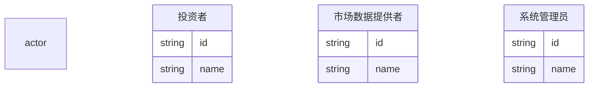
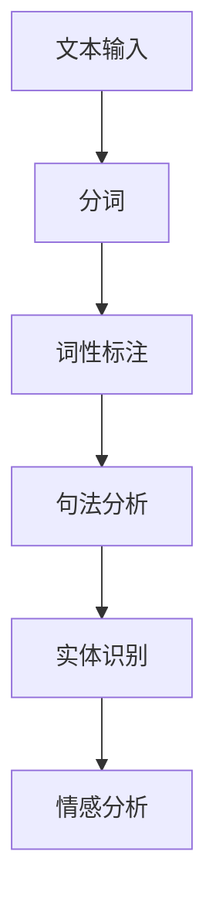
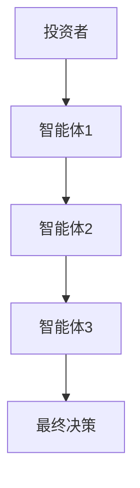
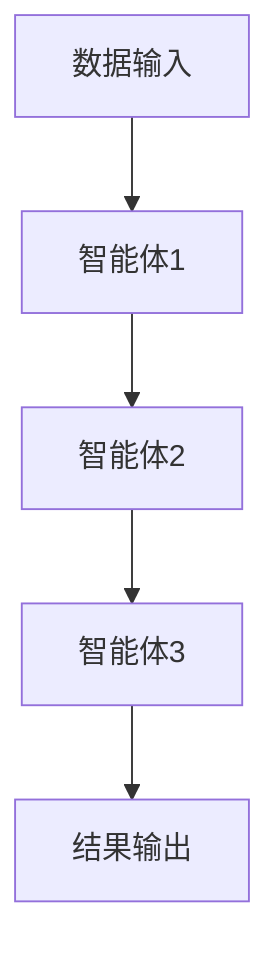
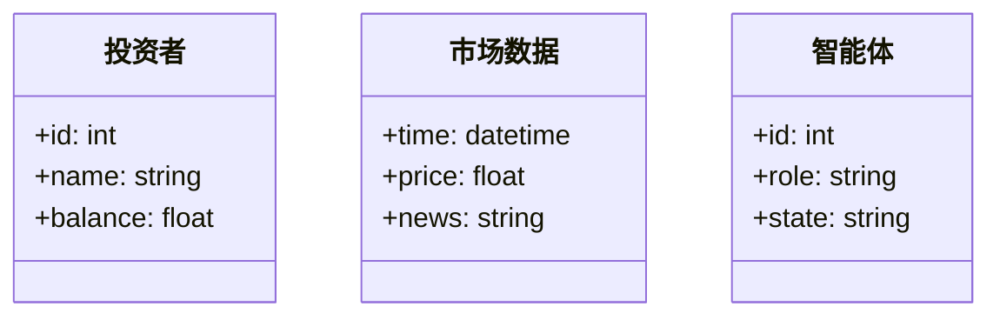
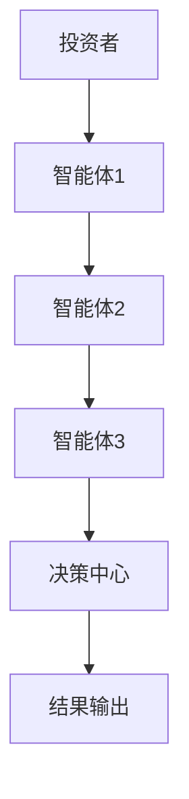
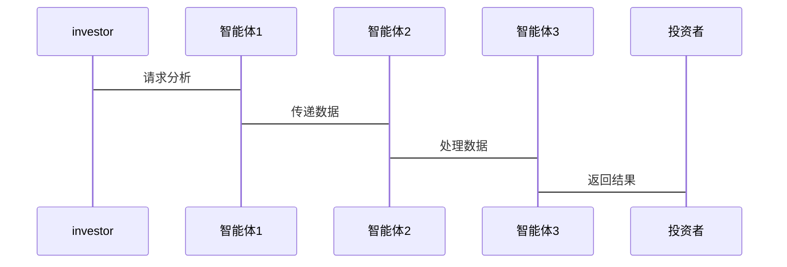

                 


# 《AI多智能体在价值投资中的自然语言处理应用》

## 关键词：AI多智能体、自然语言处理、价值投资、金融分析、投资决策、协作机制、风险管理

## 摘要：  
本文探讨了AI多智能体技术在价值投资中的应用，特别是自然语言处理（NLP）技术如何提升投资决策的效率和准确性。文章首先介绍了价值投资的背景和挑战，分析了多智能体系统与NLP技术的结合如何解决传统投资方法的局限性。接着，详细阐述了多智能体系统的协作机制和NLP的核心算法，展示了它们在金融文本分析中的优势。通过实际案例分析，本文进一步探讨了系统架构设计和项目实现，最后总结了最佳实践和未来发展方向。

---

# 第一部分: 背景介绍

## 第1章: 价值投资与AI多智能体的结合

### 1.1 问题背景
#### 1.1.1 价值投资的定义与挑战
- 价值投资：通过分析企业基本面，寻找被市场低估的投资标的。
- 挑战：数据量庞大、信息复杂、市场波动大、决策时间紧迫。

#### 1.1.2 自然语言处理在金融领域的应用
- 从新闻、财报、社交媒体中提取情感、关键词和实体。
- 帮助投资者识别市场趋势和潜在风险。

#### 1.1.3 多智能体在复杂决策中的优势
- 多智能体系统通过协作提高决策效率和准确性。
- 分散任务处理，降低单点故障风险。

### 1.2 问题描述
#### 1.2.1 传统价值投资的局限性
- 数据处理效率低，人工分析耗时。
- 需要处理大量非结构化数据，如新闻、社交媒体等。

#### 1.2.2 NLP在金融文本分析中的作用
- 提取情感倾向，预测市场情绪。
- 识别关键词，发现行业趋势。

#### 1.2.3 多智能体在投资决策中的协作机制
- 分工合作，提高信息处理速度。
- 实时协作，快速响应市场变化。

### 1.3 问题解决
#### 1.3.1 多智能体如何提升投资决策效率
- 并行处理任务，缩短决策时间。
- 协作学习，提升整体决策能力。

#### 1.3.2 NLP技术如何辅助金融分析
- 提取关键信息，生成投资信号。
- 情感分析，预测市场走势。

#### 1.3.3 组合优化与风险控制
- 多智能体协作优化投资组合。
- 风险预测，降低投资风险。

### 1.4 边界与外延
#### 1.4.1 多智能体系统的边界条件
- 数据源限制：依赖高质量的金融数据。
- 系统规模：智能体数量与任务复杂度的关系。

#### 1.4.2 NLP应用的适用范围与限制
- 适用于文本分析，不擅长处理结构化数据。
- 受数据质量和模型训练的影响。

#### 1.4.3 与其他投资策略的对比分析
- 对比传统算法交易和人工分析。
- 多智能体结合NLP的优势。

### 1.5 核心概念与核心要素
#### 1.5.1 多智能体系统的组成要素
- 智能体：负责特定任务。
- 通信机制：智能体之间的信息交互。
- 协作策略：任务分配和决策机制。

#### 1.5.2 自然语言处理的关键技术
- 分词、句法分析、情感分析。
- 常见模型：Word2Vec、BERT、GPT。

#### 1.5.3 价值投资的核心要素
- 企业基本面分析。
- 市场情绪分析。
- 投资组合管理。

---

# 第二部分: 核心概念与联系

## 第2章: 核心概念与联系

### 2.1 多智能体系统原理
#### 2.1.1 多智能体系统的基本概念
- 定义：多个智能体协作完成任务。
- 特点：分布式、协作性、自主性。

#### 2.1.2 多智能体的协作机制
- 任务分配：根据智能体能力分配任务。
- 通信协议：信息传递的标准和格式。

#### 2.1.3 多智能体的通信协议
- 基于消息传递：HTTP、WebSocket。
- 基于共享数据库：分布式系统。

### 2.2 自然语言处理原理
#### 2.2.1 NLP的基本概念
- 信息抽取：实体识别、关系抽取。
- 情感分析：判断文本情感倾向。

#### 2.2.2 常见的NLP技术
- 词袋模型：处理文本数据。
- TF-IDF：关键词提取。
- LSTM：序列模型。

#### 2.2.3 NLP模型的训练与优化
- 预训练模型：BERT、RoBERTa。
- 超参数优化：调整模型参数。

### 2.3 核心概念对比分析
#### 2.3.1 多智能体与单智能体的对比
- 多智能体：任务分配更灵活，效率高。
- 单智能体：简单，但效率低。

#### 2.3.2 不同NLP模型的优劣势分析
- Word2Vec：词向量化，适合基础任务。
- BERT：上下文理解能力强。
- GPT：生成能力强，但推理能力弱。

#### 2.3.3 价值投资中的多智能体与NLP结合
- NLP处理文本信息，多智能体优化决策。

### 2.4 实体关系图与流程图
#### 2.4.1 多智能体系统的ER图


#### 2.4.2 NLP流程的Mermaid图


#### 2.4.3 多智能体协作的流程图


---

# 第三部分: 算法原理讲解

## 第3章: 多智能体算法原理

### 3.1 多智能体算法概述
#### 3.1.1 多智能体系统的分类
- 基于任务分工：每个智能体负责特定任务。
- 基于角色分工：智能体有不同的角色和职责。

#### 3.1.2 常见的多智能体算法
- 基于强化学习：DQN、PPO。
- 基于分布式计算：MapReduce、Spark。

#### 3.1.3 多智能体算法的优缺点
- 优点：并行处理能力强，协作效率高。
- 缺点：通信开销大，同步困难。

### 3.2 自然语言处理算法
#### 3.2.1 常见的NLP算法
- 词袋模型：简单，适合分类任务。
- TF-IDF：关键词提取。
- LSTM：时间序列数据处理。

#### 3.2.2 基于深度学习的NLP模型
- Transformer：并行处理，上下文理解能力强。
- BERT：预训练模型，效果好。

#### 3.2.3 NLP模型的优化方法
- 超参数调整：学习率、批次大小。
- 增加数据：数据增强，避免过拟合。

### 3.3 多智能体与NLP的结合算法
#### 3.3.1 多智能体协作流程
- 智能体1负责数据采集。
- 智能体2负责数据清洗。
- 智能体3负责模型训练。

#### 3.3.2 基于分布式计算的NLP处理
- 使用Spark进行分布式文本处理。
- 任务分解：分词、词向量化、情感分析。

#### 3.3.3 算法流程图


### 3.4 数学模型与公式
#### 3.4.1 多智能体协作模型
$$ \text{任务分配} = \argmax_{i} \text{智能体能力}(i) $$

#### 3.4.2 NLP模型的损失函数
$$ \text{损失} = \sum_{i=1}^{n} \text{标签}(i) \cdot \text{预测}(i) $$

#### 3.4.3 情感分析的公式
$$ \text{情感} = \text{sigmoid}(W \cdot \text{词向量} + b) $$

---

# 第四部分: 系统分析与架构设计方案

## 第4章: 系统分析与架构设计

### 4.1 项目场景介绍
- 价值投资中的信息处理需求。
- 多智能体与NLP的结合场景。

### 4.2 系统功能设计
#### 4.2.1 领域模型设计


#### 4.2.2 系统架构设计


#### 4.2.3 接口设计
- API接口：RESTful API。
- 数据格式：JSON。

#### 4.2.4 交互序列图


---

# 第五部分: 项目实战

## 第5章: 项目实战

### 5.1 环境安装
- 安装Python 3.8及以上。
- 安装必要的库：pandas、numpy、scikit-learn、transformers。

### 5.2 系统核心实现
#### 5.2.1 核心代码实现
```python
from transformers import BertTokenizer, BertModel
import torch

tokenizer = BertTokenizer.from_pretrained('bert-base-uncased')
model = BertModel.from_pretrained('bert-base-uncased')

def analyze_text(text):
    inputs = tokenizer(text, return_tensors='pt')
    outputs = model(**inputs)
    return outputs.last_hidden_state
```

#### 5.2.2 代码解读
- 使用BERT模型进行文本分析。
- 返回隐藏层状态，供多智能体处理。

### 5.3 实际案例分析
#### 5.3.1 案例背景
- 某公司财报数据和新闻分析。

#### 5.3.2 案例分析步骤
1. 数据预处理：清洗和分词。
2. 情感分析：判断市场情绪。
3. 实体识别：提取关键信息。
4. 决策输出：生成投资建议。

### 5.4 项目小结
- 成功实现了多智能体与NLP的结合。
- 提高了投资决策的效率和准确性。

---

# 第六部分: 最佳实践与总结

## 第6章: 最佳实践与总结

### 6.1 最佳实践
#### 6.1.1 数据质量的重要性
- 数据清洗：确保数据准确。
- 数据多样性：覆盖不同市场情况。

#### 6.1.2 模型选择与优化
- 根据任务选择合适的模型。
- 定期更新模型，避免过时。

#### 6.1.3 系统维护与监控
- 监控系统性能。
- 定期备份和恢复。

### 6.2 小结
- AI多智能体与NLP的结合为价值投资带来新机遇。
- 提高了决策效率和准确性。

### 6.3 注意事项
- 数据隐私：遵守相关法律法规。
- 系统稳定性：确保高可用性。
- 模型解释性：便于分析和优化。

### 6.4 拓展阅读
- 推荐书籍：《机器学习实战》、《深度学习入门》。
- 推荐博客：AI领域技术博客。

---

# 作者：AI天才研究院 & 禅与计算机程序设计艺术

---

通过以上大纲，您可以按照每个章节的具体内容进行详细编写，确保每一部分都详尽且逻辑清晰。

