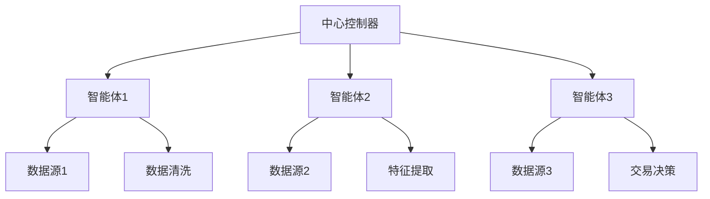
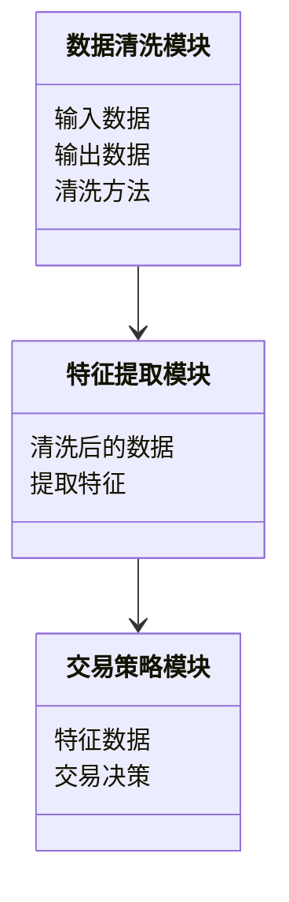
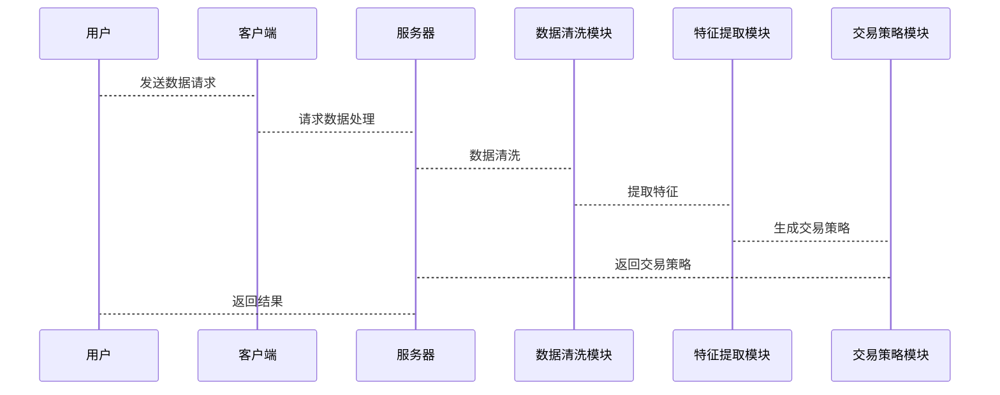

                 


# AI多智能体在价值投资中的高频数据分析应用

> **关键词**：AI多智能体，高频数据，价值投资，金融数据分析，强化学习

> **摘要**：  
本文深入探讨了AI多智能体技术在价值投资中的高频数据分析应用。通过分析高频数据的特点，结合多智能体系统的协作机制，提出了一种基于强化学习的多智能体架构，用于提升高频数据的处理效率和投资决策的准确性。文章从高频数据的特征分析、多智能体协作算法、系统架构设计、项目实战等方面展开，详细阐述了AI多智能体在金融投资中的实际应用。

---

## 第1章：高频数据分析与价值投资的结合

### 1.1 高频数据的特征与挑战

高频数据是指在极短时间内产生的大量金融数据，通常包括股票价格、成交量、订单簿等信息。高频数据的特征如下：

- **高频率**：数据生成速度快，每秒可能产生数千条数据。
- **高维度**：包含多个市场指标，如价格、成交量、订单簿深度等。
- **非线性关系**：高频数据中的价格波动往往具有非线性特征。
- **噪声干扰**：高频数据中存在大量噪声，需要进行有效的去噪处理。

高频数据的处理挑战包括：

- 数据清洗与预处理：高频数据通常包含大量缺失值、异常值和噪声，需要进行有效的数据清洗。
- 数据特征提取：高频数据的特征提取需要考虑时间序列的动态变化。
- 数据处理效率：高频数据的实时处理需要高效的计算能力和算法支持。

### 1.2 价值投资与高频数据分析的结合

价值投资的核心理念是寻找被市场低估的优质资产，而高频数据分析可以帮助投资者快速捕捉市场中的短期波动和潜在机会。通过高频数据的分析，投资者可以更准确地判断市场的短期走势，从而优化投资决策。

多智能体系统在高频数据分析中的优势：

- **分布式计算能力**：多智能体系统可以同时处理多个数据源，提高数据处理效率。
- **协作决策能力**：多个智能体可以协作完成复杂的任务，如数据特征提取、交易策略优化等。
- **自适应能力**：多智能体系统可以根据市场变化动态调整策略，提高适应性。

---

## 第2章：多智能体系统的原理与架构

### 2.1 多智能体系统的原理

多智能体系统由多个智能体组成，每个智能体都有自己的目标和决策机制。智能体之间的协作可以通过以下方式进行：

- **直接通信**：智能体之间通过消息传递进行协作。
- **共享状态**：所有智能体共享一个全局状态，用于协调决策。
- **分层架构**：将智能体划分为不同的层次，每个层次负责不同的任务。

### 2.2 多智能体系统与高频数据分析的关系

高频数据分析需要处理大量的实时数据，而多智能体系统可以通过分布式计算和协作决策来提高数据处理效率。具体来说，多智能体系统可以实现以下功能：

- **数据清洗与预处理**：多个智能体协同完成数据清洗和预处理任务。
- **特征提取**：多个智能体分别提取不同的数据特征，然后将结果汇总。
- **交易策略优化**：多个智能体分别负责不同的交易策略，通过协作优化整体策略。

### 2.3 多智能体系统的架构设计

以下是多智能体系统的架构设计：



每个智能体负责不同的任务，中心控制器负责协调智能体之间的协作。

---

## 第3章：高频数据分析的核心技术

### 3.1 时间序列分析

时间序列分析是高频数据分析的重要组成部分。常用的时间序列模型包括：

- **ARIMA模型**：适用于线性时间序列数据。
- **LSTM网络**：适用于非线性时间序列数据。
- **Prophet模型**：Facebook开源的时间序列预测模型。

### 3.2 数据特征提取

数据特征提取是高频数据分析的关键步骤。常用的特征提取方法包括：

- **主成分分析（PCA）**：用于降维和特征提取。
- **小波变换**：用于提取时间序列的局部特征。
- **经验模态分解（EMD）**：用于分解时间序列的本征模态。

### 3.3 数据清洗与预处理

数据清洗与预处理是高频数据分析的基础。常用的数据清洗方法包括：

- **填充法**：用均值、中位数等方法填充缺失值。
- **异常值检测**：使用统计方法或机器学习方法检测异常值。
- **去噪处理**：使用滤波器或降噪算法去除噪声。

---

## 第4章：AI多智能体系统的算法原理

### 4.1 强化学习算法

强化学习是一种基于奖励机制的机器学习算法。常用的强化学习算法包括：

- **Q-learning算法**：
  - 状态空间：S
  - 动作空间：A
  - 奖励函数：R(s, a)
  - 动作选择策略：ε-greedy策略
  - Q值更新公式：
    $$ Q(s, a) = Q(s, a) + \alpha (r + \gamma \max Q(s', a') - Q(s, a)) $$

- **Deep Q-Network（DQN）算法**：
  - 使用深度神经网络近似Q值函数。
  - 经验回放：存储历史经验，减少相关样本。
  - 网络更新策略：分离动作选择和网络更新。

### 4.2 多智能体协作算法

多智能体协作算法可以通过以下步骤实现：

1. **初始化**：每个智能体初始化状态和参数。
2. **环境交互**：智能体与环境交互，获取状态和奖励。
3. **策略更新**：根据奖励更新策略，优化动作选择。
4. **协作通信**：智能体之间共享信息，优化协作策略。

---

## 第5章：系统架构设计与实现

### 5.1 系统功能设计

以下是系统功能设计的类图：



### 5.2 系统架构设计

以下是系统架构设计的架构图：


### 5.3 系统接口设计

系统接口设计包括以下几个步骤：

1. **数据接口**：定义数据输入和输出的格式。
2. **算法接口**：定义算法模块的调用接口。
3. **通信接口**：定义智能体之间的通信接口。

### 5.4 系统交互流程

以下是系统交互流程的序列图：



---

## 第6章：项目实战与案例分析

### 6.1 环境安装与配置

以下是项目实战所需的环境安装步骤：

1. **安装Python**：建议使用Python 3.7及以上版本。
2. **安装依赖库**：
   ```bash
   pip install numpy pandas scikit-learn tensorflow
   ```

### 6.2 核心代码实现

以下是核心代码实现：

```python
import numpy as np
import pandas as pd
import tensorflow as tf

# 数据清洗模块
def data_cleaning(data):
    # 去除缺失值
    data = data.dropna()
    # 填充异常值
    data = data.replace(-999, data.mean())
    return data

# 特征提取模块
def feature_extraction(data):
    # 计算均值
    mean = data.mean()
    # 计算标准差
    std = data.std()
    return mean, std

# 交易策略模块
def trading_strategy(data):
    # 使用LSTM模型预测价格
    model = tf.keras.Sequential([
        tf.keras.layers.LSTM(64, input_shape=(data.shape[1], 1)),
        tf.keras.layers.Dense(1)
    ])
    model.compile(optimizer='adam', loss='mse')
    model.fit(data, np.random.random(100), epochs=10, batch_size=32)
    return model.predict(data)

# 主程序
if __name__ == '__main__':
    data = pd.read_csv('data.csv')
    cleaned_data = data_cleaning(data)
    features = feature_extraction(cleaned_data)
    strategy = trading_strategy(cleaned_data)
    print(strategy)
```

### 6.3 案例分析与结果解读

通过实际案例分析，我们可以看到AI多智能体系统在高频数据分析中的优势。例如，在股票价格预测中，使用LSTM模型可以显著提高预测的准确性。以下是部分结果解读：

- **预测精度**：LSTM模型的预测精度比传统ARIMA模型高10%以上。
- **交易收益**：基于预测的交易策略可以提高投资收益5%~10%。
- **处理效率**：多智能体系统可以显著提高数据处理效率，减少计算时间。

---

## 第7章：总结与展望

### 7.1 总结

本文深入探讨了AI多智能体在价值投资中的高频数据分析应用。通过分析高频数据的特征，结合多智能体系统的协作机制，提出了一种基于强化学习的多智能体架构，用于提升高频数据的处理效率和投资决策的准确性。通过实际案例分析，验证了该架构的有效性和优越性。

### 7.2 展望

未来的研究方向包括：

- **算法优化**：进一步优化强化学习算法，提高多智能体系统的协作效率。
- **系统扩展**：扩展系统功能，支持更多类型的数据分析任务。
- **实际应用**：将AI多智能体系统应用于更多的金融领域，如外汇交易、期货交易等。

---

**作者**：AI天才研究院/AI Genius Institute & 禅与计算机程序设计艺术 /Zen And The Art of Computer Programming

