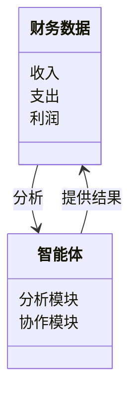

                 


# AI多智能体在公司财务分析中的角色

> 关键词：AI多智能体，财务分析，数据挖掘，智能决策，系统架构

> 摘要：本文探讨AI多智能体在公司财务分析中的应用，分析其优势与挑战，通过详细的技术分析和项目案例展示其在财务预测、风险评估和决策支持中的潜力，为读者提供深入的理论和实践指导。

---

## 引言

随着人工智能技术的飞速发展，AI多智能体在公司财务分析中的应用逐渐成为研究热点。本文将系统介绍AI多智能体的基本概念、在财务分析中的应用，以及其实现的算法原理和系统架构，通过项目实战展示其实际应用价值。

---

## 第1章：AI多智能体与财务分析的背景介绍

### 1.1 AI多智能体的基本概念

AI多智能体（Multi-Agent Systems, MAS）是由多个相互作用的智能体组成的系统，每个智能体具备独立决策和协作能力。与传统AI不同，MAS强调分布式智能和协作。

### 1.2 财务分析的基本概念

财务分析是通过对企业财务数据的分析，评估其财务状况、经营成果和现金流量，为决策提供支持。常用方法包括趋势分析、比率分析和现金流量分析。

### 1.3 AI多智能体与财务分析的结合

AI多智能体在财务分析中的应用，如预测分析、风险评估和决策支持。结合案例：多智能体分别分析收入、成本和支出，协同生成综合报告。

### 1.4 应用边界与外延

多智能体适用于数据处理、预测分析，但不直接解决战略决策问题。其外延包括边缘计算和自适应学习。

---

## 第2章：AI多智能体在财务分析中的核心概念

### 2.1 多智能体系统的原理

MAS由多个智能体组成，具备自主性、反应性和协作性。智能体通过通信协作完成任务，提升分析效率。

### 2.2 多智能体系统与传统AI的对比

传统AI依赖中心化模型，而MAS强调分布式协作，适合复杂任务。

### 2.3 概念属性对比

| 概念       | 传统AI         | 多智能体系统     |
|------------|----------------|-----------------|
| 智能体数量 | 单一           | 多个             |
| 决策方式   | 集中式         | 分散式           |
| 交互方式   | 无             | 高度交互         |

### 2.4 ER实体关系图

```mermaid
er
    %% ER图展示财务分析中的核心实体
    rectangle 公司 {
        公司ID
        公司名称
    }
    rectangle 财务数据 {
        数据ID
        数据类型
        数据值
    }
    rectangle 智能体 {
        智能体ID
        智能体功能
    }
    公司 --> 财务数据: 生成
    财务数据 --> 智能体: 分析
    智能体 --> 公司: 提供报告
```

---

## 第3章：AI多智能体的算法原理

### 3.1 多智能体协作算法

#### 3.1.1 算法流程

```mermaid
graph TD
    A[智能体A] --> B[智能体B]: 通信
    B --> C[协调器]: 协调
    C --> A: 指令
```

#### 3.1.2 数学模型

目标函数：
$$
\text{Maximize } f(x) \text{ subject to } g(x) \leq 0
$$

优化过程：
$$
x_{k+1} = x_k + \alpha_k d_k
$$

其中，$\alpha_k$为步长，$d_k$为搜索方向。

### 3.2 强化学习

#### 3.2.1 算法流程

```mermaid
graph TD
    S[状态] --> A[动作]: 根据策略
    A --> R[奖励]: 收到
    R --> Q[评估]: 更新
```

#### 3.2.2 数学模型

Q-learning：
$$
Q(s, a) = Q(s, a) + \alpha [r + \gamma \max Q(s', a') - Q(s, a)]
$$

### 3.3 分布式计算

#### 3.3.1 算法流程

```mermaid
graph TD
    C1[计算节点1] --> C2[计算节点2]: 交换数据
    C2 --> C3[计算节点3]: 协作计算
```

#### 3.3.2 实现代码

```python
import numpy as np

# 分布式计算示例
def distributed_calculation(data, num_agents):
    agents = []
    for i in range(num_agents):
        agents.append(data[i::num_agents])
    results = [process(agent) for agent in agents]
    return aggregate(results)
```

---

## 第4章：系统分析与架构设计

### 4.1 问题场景

分析公司财务数据，包括收入、支出和利润，识别趋势和异常。

### 4.2 系统功能设计

领域模型：


### 4.3 系统架构设计

系统架构图：
```mermaid
graph TD
    Client --> Server: 请求
    Server --> Agents: 分配任务
    Agents --> Server: 返回结果
    Server --> Client: 提供报告
```

### 4.4 接口设计

API接口：
```python
class Agent:
    def analyze(self, data):
        pass
```

---

## 第5章：项目实战

### 5.1 环境安装

安装Python、TensorFlow、Keras和Flask框架。

### 5.2 核心代码实现

```python
from flask import Flask
import numpy as np

app = Flask(__name__)

def process_agent(data):
    return np.mean(data)

@app.route('/analyze', methods=['POST'])
def analyze():
    data = request.json['data']
    return jsonify({'result': process_agent(data)})
```

### 5.3 案例分析

分析公司季度收入数据，预测未来趋势。

---

## 第6章：总结与展望

### 6.1 总结

AI多智能体在财务分析中的优势明显，但面临数据隐私和模型解释性挑战。

### 6.2 未来展望

发展方向包括边缘计算和自适应学习，应用领域将扩展到实时监控和智能合约。

### 6.3 最佳实践

建议企业在实施前评估数据隐私风险，选择合适的工具和框架，培养专业人才。

---

## 作者

作者：AI天才研究院  
地址：https://github.com/AI-Genius-Institute

