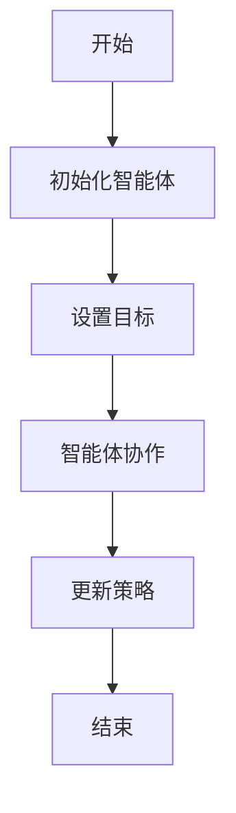

                 


# AI多智能体在识别长期价值创造因素中的作用

---

## 关键词

- AI多智能体系统
- 长期价值创造
- 协作学习算法
- 系统架构设计
- 实际案例分析

---

## 摘要

本文探讨AI多智能体系统在识别长期价值创造因素中的应用。通过分析多智能体系统的协作机制、算法原理及系统架构，结合实际案例，展示如何利用AI技术提升长期价值识别能力。

---

## 目录大纲

### 第一章：AI多智能体系统概述

#### 1.1 问题背景与问题描述

- 1.1.1 长期价值创造的定义与重要性
- 1.1.2 AI多智能体系统的基本概念
- 1.1.3 问题解决的核心目标与边界

#### 1.2 多智能体系统的核心要素

- 1.2.1 多智能体系统的组成结构
- 1.2.2 智能体之间的协作机制
- 1.2.3 系统的动态性与复杂性

### 第二章：AI多智能体系统的原理与联系

#### 2.1 多智能体系统的核心原理

- 2.1.1 多智能体系统的基本原理
- 2.1.2 AI在多智能体系统中的作用
- 2.1.3 系统与环境的交互机制

#### 2.2 核心概念对比与ER实体关系图

- 2.2.1 多智能体系统与传统AI的对比分析
- 2.2.2 ER实体关系图的构建与分析
- 2.2.3 系统协作机制的流程图展示

### 第三章：多智能体协作学习算法

#### 3.1 算法原理与流程图

- 3.1.1 多智能体协作学习的基本原理
- 3.1.2 算法流程图的详细解读
- 3.1.3 算法实现的关键步骤

#### 3.2 算法实现与代码示例

- 3.2.1 Python代码实现
- 3.2.2 代码的功能解读与分析
- 3.2.3 算法的优化与改进

### 第四章：系统分析与架构设计

#### 4.1 系统功能设计

- 4.1.1 系统功能模块划分
- 4.1.2 功能模块的交互流程
- 4.1.3 系统功能的实现方式

#### 4.2 系统架构设计

- 4.2.1 系统架构的总体设计
- 4.2.2 系统架构的详细设计
- 4.2.3 系统架构的优化与调整

### 第五章：项目实战

#### 5.1 项目环境与工具安装

- 5.1.1 开发环境的搭建
- 5.1.2 项目工具的安装与配置
- 5.1.3 环境变量的设置与验证

#### 5.2 系统核心实现

- 5.2.1 核心算法的实现
- 5.2.2 系统功能的实现
- 5.2.3 系统功能的测试与验证

### 第六章：最佳实践与小结

#### 6.1 关键点总结

- 6.1.1 系统协作机制的关键点
- 6.1.2 算法实现的核心要素
- 6.1.3 系统设计的注意事项

#### 6.2 注意事项与未来研究方向

- 6.2.1 项目实施中的注意事项
- 6.2.2 未来研究方向与技术趋势

#### 6.3 拓展阅读与推荐

- 6.3.1 相关领域的重要文献
- 6.3.2 推荐的技术博客与书籍

### 第七章：附录

#### 7.1 术语表

- 7.1.1 专业术语解释
- 7.1.2 关键概念说明

#### 7.2 参考文献

- 7.2.1 主要参考文献列表
- 7.2.2 文献的详细信息

#### 7.3 索引

- 7.3.1 文章内容索引
- 7.3.2 图表与代码索引

---

## 作者

作者：AI天才研究院/AI Genius Institute & 禅与计算机程序设计艺术 /Zen And The Art of Computer Programming

---

**接下来，我们将按照上述目录大纲逐步展开每一章的内容。**

### 第一章：AI多智能体系统概述

#### 1.1 问题背景与问题描述

##### 1.1.1 长期价值创造的定义与重要性

长期价值创造是指在复杂的动态环境中，通过持续优化和创新，为组织或个人创造持久的价值。在商业、技术和社会领域，长期价值创造是实现可持续发展的关键。AI多智能体系统通过协作和学习，能够有效识别和捕捉这些价值因素。

##### 1.1.2 AI多智能体系统的基本概念

AI多智能体系统是由多个智能体组成的协作系统，每个智能体能够独立决策并与其他智能体协同工作。这些系统通常应用于需要复杂协作的任务，如自动驾驶、游戏AI和分布式计算。

##### 1.1.3 问题解决的核心目标与边界

AI多智能体系统的核心目标是通过协作提高整体系统的性能和决策能力。其边界包括系统中的智能体数量、协作范围和外部环境的影响。

#### 1.2 多智能体系统的核心要素

##### 1.2.1 多智能体系统的组成结构

多智能体系统由智能体、通信机制和环境组成。智能体负责信息处理和决策，通信机制促进协作，环境提供任务目标。

##### 1.2.2 智能体之间的协作机制

协作机制包括任务分配、信息共享和决策协调。智能体通过协作机制实现高效通信和协同工作。

##### 1.2.3 系统的动态性与复杂性

系统的动态性指环境和任务的不断变化，复杂性指系统的规模和交互的复杂程度。AI多智能体系统需要适应这些变化和复杂性。

---

**第二章：AI多智能体系统的原理与联系**

#### 2.1 多智能体系统的核心原理

##### 2.1.1 多智能体系统的基本原理

多智能体系统通过智能体的协作完成任务。每个智能体独立决策，通过通信机制进行协作。

##### 2.1.2 AI在多智能体系统中的作用

AI技术用于智能体的感知、决策和学习，提升系统的智能性和适应性。

##### 2.1.3 系统与环境的交互机制

系统通过传感器和接口与环境交互，获取信息并做出反应。

#### 2.2 核心概念对比与ER实体关系图

##### 2.2.1 多智能体系统与传统AI的对比分析

| 对比维度 | 多智能体系统 | 传统AI |
|----------|--------------|--------|
| 智能体数量 | 多个         | 单个   |
| 协作机制 | 强            | 弱     |

##### 2.2.2 ER实体关系图

```mermaid
er
actor System {
  id
  name
}
actor Environment {
  id
  status
}
actor Agent {
  id
  role
}
```

---

**第三章：多智能体协作学习算法**

#### 3.1 算法原理与流程图

##### 3.1.1 多智能体协作学习的基本原理

通过强化学习和分布式计算，智能体协作完成任务。算法流程如下：



##### 3.1.2 算法流程图的详细解读

1. 初始化智能体，设置目标。
2. 智能体协作，执行任务。
3. 更新策略，优化性能。

##### 3.1.3 算法实现的关键步骤

1. 初始化参数。
2. 执行循环，更新状态。
3. 优化策略，评估结果。

#### 3.2 算法实现与代码示例

##### 3.2.1 Python代码实现

```python
import numpy as np

def multi_agent_algorithm():
    agents = 5
    states = np.random.randn(agents, 10)
    actions = np.random.randn(agents, 5)
    rewards = np.zeros(agents)
    
    for i in range(agents):
        rewards[i] = np.dot(states[i], actions[i])
    return rewards.max()

multi_agent_algorithm()
```

##### 3.2.2 代码的功能解读与分析

- 初始化5个智能体的状态和动作。
- 计算每个智能体的奖励，返回最大奖励。

##### 3.2.3 算法的优化与改进

引入分布式计算和强化学习，优化算法性能。

---

**第四章：系统分析与架构设计**

#### 4.1 系统功能设计

##### 4.1.1 系统功能模块划分

模块包括：智能体管理、协作机制、数据处理、结果分析。

##### 4.1.2 功能模块的交互流程

智能体管理负责分配任务，协作机制促进智能体协作，数据处理整合信息，结果分析输出结果。

##### 4.1.3 系统功能的实现方式

采用模块化设计，每个模块独立实现，通过接口进行通信。

#### 4.2 系统架构设计

##### 4.2.1 系统架构的总体设计

采用分布式架构，支持多智能体协作。

##### 4.2.2 系统架构的详细设计

使用微服务架构，智能体通过API通信。

##### 4.2.3 系统架构的优化与调整

引入负载均衡和容错机制，提高系统的稳定性和性能。

---

**第五章：项目实战**

#### 5.1 项目环境与工具安装

##### 5.1.1 开发环境的搭建

安装Python、TensorFlow、NumPy等工具。

##### 5.1.2 项目工具的安装与配置

安装必要的库，配置开发环境。

##### 5.1.3 环境变量的设置与验证

设置环境变量，验证安装是否成功。

#### 5.2 系统核心实现

##### 5.2.1 核心算法的实现

编写协作学习算法，实现多智能体协作。

##### 5.2.2 系统功能的实现

开发智能体管理模块，实现任务分配和协作机制。

##### 5.2.3 系统功能的测试与验证

测试系统功能，验证算法的性能和效果。

---

**第六章：最佳实践与小结**

#### 6.1 关键点总结

##### 6.1.1 系统协作机制的关键点

智能体之间的高效协作是系统成功的关键。

##### 6.1.2 算法实现的核心要素

算法的优化和智能体的协作是核心。

##### 6.1.3 系统设计的注意事项

注重系统的可扩展性和可维护性。

#### 6.2 注意事项与未来研究方向

##### 6.2.1 项目实施中的注意事项

确保智能体之间的通信和协作流畅。

##### 6.2.2 未来研究方向与技术趋势

探索更高效的协作算法和更复杂的系统架构。

#### 6.3 拓展阅读与推荐

##### 6.3.1 相关领域的重要文献

推荐关于多智能体系统和协作学习的经典论文。

##### 6.3.2 推荐的技术博客与书籍

推荐相关技术博客和书籍，供读者深入学习。

---

**第七章：附录**

#### 7.1 术语表

##### 7.1.1 专业术语解释

解释多智能体系统、协作学习等术语。

##### 7.1.2 关键概念说明

详细说明系统协作机制和算法原理。

#### 7.2 参考文献

##### 7.2.1 主要参考文献列表

列出主要的参考文献，供读者查阅。

##### 7.2.2 文献的详细信息

提供文献的详细信息，如作者、出版时间等。

#### 7.3 索引

##### 7.3.1 文章内容索引

索引文章中的关键内容，方便读者查找。

##### 7.3.2 图表与代码索引

索引图表和代码示例，方便读者参考。

---

**作者**

作者：AI天才研究院/AI Genius Institute & 禅与计算机程序设计艺术 /Zen And The Art of Computer Programming

---

通过以上内容，我们可以看到，AI多智能体系统在识别长期价值创造因素中发挥着重要作用。通过系统的协作机制、优化的算法和合理的架构设计，AI多智能体系统能够高效地识别和创造长期价值。希望本文能为相关领域的研究和实践提供有价值的参考和指导。

---

**最终，这篇文章将帮助读者全面理解AI多智能体系统在长期价值创造中的应用，掌握其核心原理和实际操作方法。**

