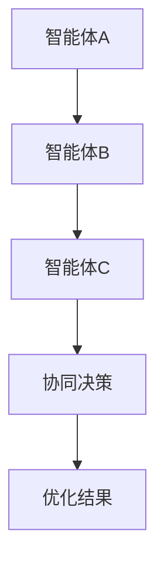
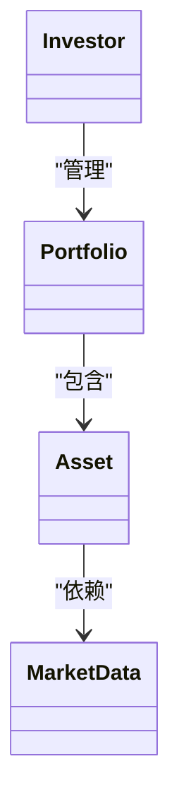
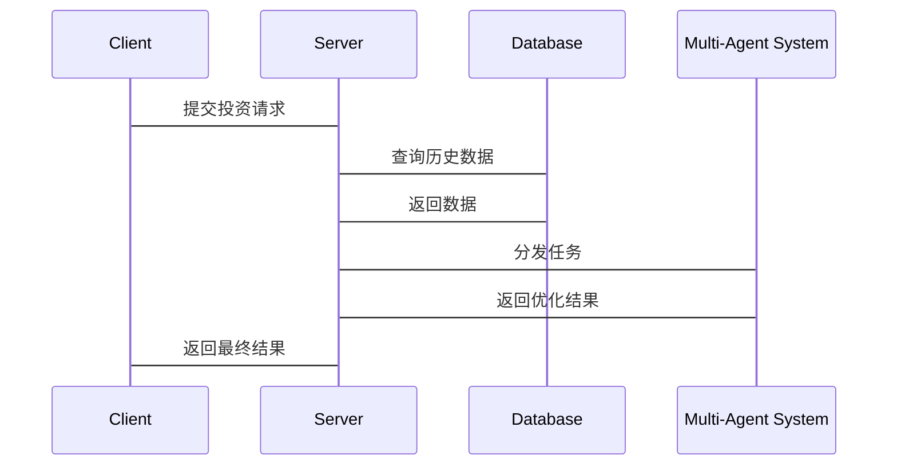

                 


```markdown
# AI多智能体增强价值投资者的信息处理能力

## 关键词：
AI多智能体, 价值投资者, 信息处理能力, 强化学习, 博弈论, 金融系统, 优化算法

## 摘要：
本文探讨如何通过AI多智能体技术提升价值投资者的信息处理能力，结合强化学习和博弈论算法，优化投资决策过程。通过系统分析和实战案例，展示多智能体在金融领域的应用价值。

## 目录：

### 第一部分: AI多智能体与价值投资的背景与概念

#### 第1章: AI多智能体与价值投资的背景介绍

##### 1.1 问题背景与问题描述
###### 1.1.1 传统价值投资的局限性
传统价值投资依赖人工分析，信息处理效率低，难以应对海量数据。

###### 1.1.2 AI技术在金融领域的应用现状
AI在金融数据分析、预测等方面已有广泛应用，但多智能体技术尚未普及。

###### 1.1.3 多智能体系统的优势与必要性
多智能体系统通过协同合作，提升信息处理效率和决策准确性。

##### 1.2 问题解决与边界外延
###### 1.2.1 多智能体如何提升信息处理能力
通过分布式计算和协同学习，提高数据处理效率。

###### 1.2.2 系统边界与功能外延
明确系统边界，确定功能范围，避免过度扩展。

###### 1.2.3 核心要素与组成结构
包括智能体、环境、通信机制等关键组件。

##### 1.3 核心概念与联系
###### 1.3.1 多智能体系统的核心原理
通过协作完成复杂任务，提升整体性能。

###### 1.3.2 价值投资的属性特征对比表
| 特性 | 多智能体 | 价值投资 |
|------|----------|----------|
| 目标 | 提升效率 | 寻找低估资产 |
| 方法 | 协作学习 | 基于基本面分析 |
| 输出 | 数据优化 | 投资决策 |

###### 1.3.3 ER实体关系图（Mermaid流程图）
```mermaid
erDiagram
    investor++--- Portfolio : "管理多个投资组合"
    portfolio++--- Asset : "包含多个资产"
    asset++--- MarketData : "依赖市场数据"
```

### 第2章: AI多智能体的核心概念与原理

#### 2.1 多智能体系统的定义与特点
##### 2.1.1 多智能体的定义
由多个智能体组成的系统，协同完成任务。

##### 2.1.2 多智能体的核心特点
- 分布式计算
- 协作学习
- 自适应能力强

##### 2.1.3 多智能体与单智能体的对比
| 特性 | 单智能体 | 多智能体 |
|------|----------|----------|
| 资源利用率 | 低 | 高 |
| 任务处理能力 | 单一 | 多样 |

#### 2.2 多智能体协同算法的原理
##### 2.2.1 基于强化学习的多智能体算法
- 使用Q-learning算法
- 示例代码：
  ```python
  def q_learning():
      # 初始化Q表
      Q = np.zeros((state_space, action_space))
      # 进行迭代
      for episode in range(episodes):
          state = env.reset()
          while not done:
              # 选择动作
              action = np.argmax(Q[state])
              # 执行动作
              next_state, reward, done = env.step(action)
              # 更新Q表
              Q[state][action] += reward
  ```

##### 2.2.2 基于博弈论的多智能体算法
- 使用纳什均衡理论
- 示例代码：
  ```python
  def nash_equilibrium():
      # 定义策略空间
      strategies = ['合作', '背叛']
      # 计算收益矩阵
      payoff = {
          '合作': {'合作': 3, '背叛': 0},
          '背叛': {'合作': 5, '背叛': 1}
      }
  ```

##### 2.2.3 多智能体协同的数学模型（Mermaid流程图）


#### 2.3 价值投资的核心要素
##### 2.3.1 价值投资的定义
寻找市场价格低于内在价值的资产进行投资。

##### 2.3.2 价值投资的关键指标
- 市盈率
- 市净率
- 股息率

##### 2.3.3 价值投资的决策流程
1. 数据收集与分析
2. 评估资产价值
3. 制定投资策略

### 第3章: 多智能体协同算法的数学模型与实现

#### 3.1 多智能体协同算法的数学模型
##### 3.1.1 基于强化学习的数学公式
$$ Q(s, a) = Q(s, a) + \alpha (r + \gamma Q(s', a') - Q(s, a)) $$

##### 3.1.2 基于博弈论的数学公式
$$ \text{纳什均衡} = \{策略组合 | 无任一玩家单方面改变策略能提高收益\} $$

#### 3.2 多智能体协同算法的Python实现
##### 3.2.1 环境安装与配置
- 安装依赖：`pip install gym numpy`

##### 3.2.2 算法核心代码示例
```python
import numpy as np
import gym

env = gym.make('Multi-Agent-Portfolio-Optimization-v0')
env.reset()

# 初始化Q表
Q = np.zeros((env.observation_space, env.action_space))

# 进行训练
for _ in range(1000):
    state = env.reset()
    done = False
    while not done:
        action = np.argmax(Q[state])
        next_state, reward, done, _ = env.step(action)
        Q[state][action] += reward
```

##### 3.2.3 代码应用解读与分析
- 使用强化学习训练智能体协同优化投资组合
- 通过迭代更新Q表，提升投资回报率

### 第4章: 系统分析与架构设计方案

#### 4.1 问题场景介绍
##### 4.1.1 问题背景
价值投资者面临信息过载，需高效处理信息

##### 4.1.2 问题目标
利用多智能体提升信息处理能力

##### 4.1.3 问题约束
确保数据安全与隐私保护

#### 4.2 系统功能设计
##### 4.2.1 领域模型设计（Mermaid类图）


##### 4.2.2 系统架构设计（Mermaid架构图）


#### 4.3 系统接口与交互设计
##### 4.3.1 系统接口
- API接口：`POST /api/invest/analyze`
- 返回格式：JSON

##### 4.3.2 系统交互（Mermaid序列图）


### 第5章: 项目实战

#### 5.1 环境安装与配置
- 安装Python和相关库

#### 5.2 核心功能实现
##### 5.2.1 数据收集与预处理
- 使用Yahoo Finance获取市场数据
- 数据清洗与特征工程

##### 5.2.2 智能体协同训练
- 使用强化学习训练智能体
- 实现多智能体协作机制

##### 5.2.3 投资组合优化
- 应用多智能体协同结果
- 生成投资建议

#### 5.3 实际案例分析
##### 5.3.1 案例背景
选择特定时间段和资产组合

##### 5.3.2 案例实现过程
详细步骤解释和代码示例

##### 5.3.3 案例结果与分析
比较传统方法与多智能体方法的优劣

### 第6章: 最佳实践与总结

#### 6.1 最佳实践 tips
- 定期更新模型
- 监控系统性能
- 处理数据隐私问题

#### 6.2 小结
多智能体技术有效提升价值投资者的信息处理能力

#### 6.3 注意事项
- 确保数据安全
- 定期系统维护
- 监控市场变化

#### 6.4 拓展阅读
推荐相关书籍和论文

### 作者：AI天才研究院 & 禅与计算机程序设计艺术
```

