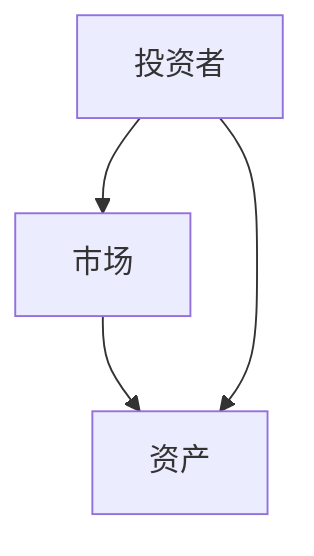
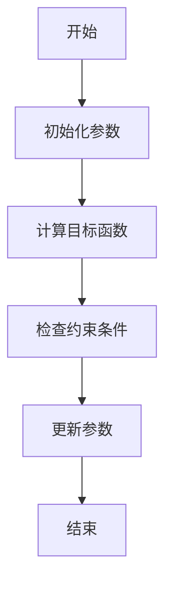
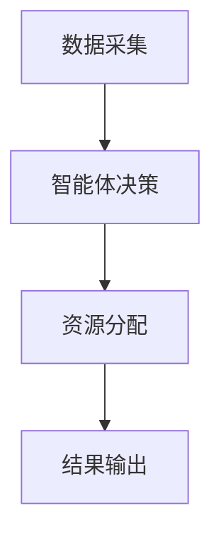

                 


# AI多智能体如何优化价值投资的全球资源配置策略

## 关键词：
- AI多智能体
- 价值投资
- 全球资源配置策略
- 优化算法
- 系统架构设计

## 摘要：
本文探讨了如何利用AI多智能体技术优化价值投资的全球资源配置策略。通过分析AI多智能体系统的核心原理，结合数学模型和算法实现，展示了如何在金融领域中有效配置资源。文章详细介绍了系统架构设计、项目实战和最佳实践，为读者提供全面的技术指导。

---

## 第一部分：背景与概述

### 第1章：AI多智能体与价值投资概述

#### 1.1 AI多智能体的基本概念
- **多智能体系统（MAS）**：由多个智能体组成的系统，每个智能体能够独立决策并协同工作。
- **价值投资**：一种投资策略，关注公司的内在价值，寻找被市场低估的投资标的。

#### 1.2 全球资源配置策略的重要性
- 资源配置需要考虑全球经济、市场波动等复杂因素。
- 优化资源配置能够提高投资收益，降低风险。

#### 1.3 AI多智能体在价值投资中的应用前景
- AI多智能体能够处理复杂数据，提供高效决策支持。
- 通过协同工作，优化全球资源配置，实现收益最大化。

---

## 第二部分：核心概念与联系

### 第2章：AI多智能体系统的核心原理

#### 2.1 多智能体系统的组成与交互
- **实体关系图（ER图）**：展示了智能体、环境、目标之间的关系。



- **智能体之间的通信与协作**：通过消息传递机制实现协作。

#### 2.2 价值投资中的资源配置模型
- **优化模型**：建立数学模型，实现多目标优化。

$$ \text{目标函数：} \quad \max \sum_{i} w_i v_i $$
$$ \text{约束条件：} \quad \sum_{i} w_i = 1, \quad w_i \geq 0 $$

---

## 第三部分：算法原理与实现

### 第3章：AI多智能体算法的数学模型

#### 3.1 资源配置的优化模型
- **线性规划模型**：用于解决资源分配问题。

$$ \text{最大化：} \quad \sum_{i=1}^{n} p_i x_i $$
$$ \text{约束：} \quad \sum_{i=1}^{n} x_i = 1, \quad x_i \geq 0 $$

- **非线性规划模型**：适用于更复杂的问题。

#### 3.2 智能体决策算法
- **强化学习**：通过试错学习优化决策策略。

### 第4章：AI多智能体算法的实现

#### 4.1 算法流程图



- **Python实现示例**：

```python
import numpy as np

def optimize_portfolio(returns):
    n = len(returns)
    cov_matrix = np.cov(returns)
    inv_cov = np.linalg.inv(cov_matrix)
    weights = np.dot(inv_cov, np.ones(n)) / np.sum(inv_cov.dot(np.ones(n)))
    return weights
```

---

## 第四部分：系统架构与设计

### 第5章：系统架构设计

#### 5.1 系统功能模块设计
- **数据采集模块**：收集市场数据。
- **智能体决策模块**：基于数据做出投资决策。
- **资源分配模块**：根据决策分配资源。

#### 5.2 系统架构图



#### 5.3 接口设计与交互流程
- **接口定义**：RESTful API。
- **交互流程**：数据输入、处理、输出结果。

---

## 第五部分：项目实战

### 第6章：项目实现与案例分析

#### 6.1 环境安装
- 安装必要的库：`numpy`, `pandas`, `scikit-learn`。

#### 6.2 核心代码实现

```python
import numpy as np

def allocate_assets(asset_returns):
    cov = np.cov(asset_returns)
    inv_cov = np.linalg.inv(cov)
    weights = inv_cov.dot(np.ones(len(asset_returns))) / np.sum(inv_cov.dot(np.ones(len(asset_returns))))
    return weights

# 示例数据
returns = np.array([0.1, 0.2, 0.15])
weights = allocate_assets(returns)
print("权重分配:", weights)
```

#### 6.3 案例分析
- 使用示例数据，展示权重分配结果。

---

## 第六部分：总结与展望

### 第7章：总结与展望

#### 7.1 总结
- AI多智能体能够有效优化资源配置，提升投资收益。
- 系统架构设计合理，实现高效决策。

#### 7.2 展望
- 结合更多数据源，提高决策准确性。
- 拓展应用场景，实现更复杂的优化任务。

---

## 作者
作者：AI天才研究院 & 禅与计算机程序设计艺术

---

以上是文章的完整目录和内容框架，涵盖了从背景介绍到系统实现的各个方面，帮助读者全面理解AI多智能体如何优化价值投资的全球资源配置策略。

