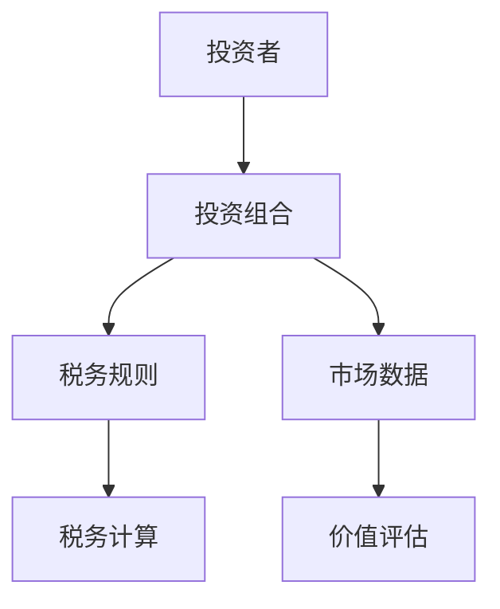
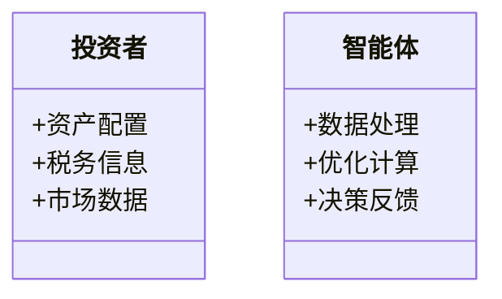
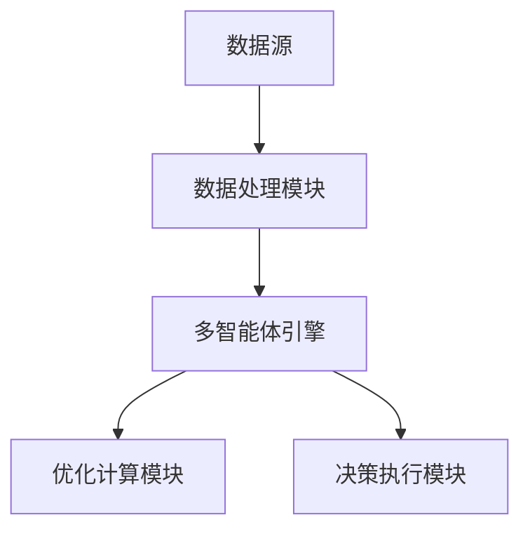

                 


```markdown
# AI多智能体如何优化价值投资的税收效率

## 关键词：AI多智能体，价值投资，税收效率，算法优化，系统架构

## 摘要：本文探讨如何利用AI多智能体系统优化价值投资中的税收效率。通过分析多智能体的协同优化机制，构建数学模型，设计系统架构，并通过案例展示其应用。文章详细阐述了从理论到实践的全过程，展示了AI技术在金融投资中的潜力。

---

## 第一部分: AI多智能体与价值投资的背景与基础

### 第1章: AI多智能体与价值投资概述

#### 1.1 问题背景与问题描述
##### 1.1.1 税收效率在价值投资中的重要性
税收是投资成本的重要组成部分，直接影响投资收益。优化税收效率意味着在不牺牲收益的情况下减少税务负担，提升整体回报。

##### 1.1.2 当前价值投资中的税收优化挑战
传统的投资决策通常在事后进行税务优化，未能充分考虑税务因素对投资策略的影响。此外，单一决策模型难以应对复杂多变的市场环境。

##### 1.1.3 多智能体在投资决策中的潜在优势
多智能体系统通过协同优化，能够实时分析多因素对税务的影响，制定最优投资策略。多个智能体分别负责不同的任务，提高决策的准确性和效率。

#### 1.2 问题解决思路与边界
##### 1.2.1 多智能体优化的总体思路
将投资决策分解为多个子问题，分别由不同智能体处理。通过协同优化，综合各智能体的决策，形成最优投资策略。

##### 1.2.2 问题的边界与外延
- 研究范围：多资产配置、交易时机选择、税务优化。
- 不考虑的因素：市场外不可预测的极端事件。

##### 1.2.3 核心要素与组成结构
- 核心要素：市场数据、投资目标、税务规则。
- 组成结构：数据处理模块、智能体协作模块、优化计算模块、决策执行模块。

#### 1.3 本章小结
本章介绍了AI多智能体在价值投资中的应用背景，明确了优化思路和研究边界，为后续分析奠定基础。

---

## 第二部分: 核心概念与联系

### 第2章: AI多智能体的核心概念与原理

#### 2.1 多智能体系统的基本原理
##### 2.1.1 多智能体的定义与特点
- 定义：多个自主智能体协作完成复杂任务。
- 特点：分布式、协作性、智能性、适应性。

##### 2.1.2 多智能体与单智能体的对比分析
| 特性 | 单智能体 | 多智能体 |
|------|----------|----------|
| 决策 | 中心化   | 分散化   |
| 计算 | 集中式   | 并行式   |
| 优化 | 独立性   | 协同性   |

##### 2.1.3 多智能体在金融投资中的应用优势
- 分散决策：降低单点故障风险。
- 协同优化：提升整体决策质量。
- 灵活性：适应复杂多变的市场环境。

#### 2.2 价值投资与税收优化的关联
##### 2.2.1 价值投资的基本原理
基于基本面分析，寻找被市场低估的投资标的，长期持有以实现价值回归。

##### 2.2.2 税收效率对投资收益的影响
- 税收延迟：通过合理安排投资策略，减少税务负担。
- 税后收益：优化税收直接影响投资净收益。

##### 2.2.3 多智能体在税务优化中的应用
通过实时分析税务政策变化，优化投资组合配置，降低税务负担。

#### 2.3 多智能体优化的价值投资模型
##### 2.3.1 优化目标
最大化投资收益，最小化税务负担，满足合规要求。

##### 2.3.2 实体关系模型


#### 2.4 本章小结
本章详细阐述了多智能体系统的基本原理及其在价值投资中的应用，构建了初步的优化模型。

---

## 第三部分: 算法原理

### 第3章: 多智能体协同优化的算法原理

#### 3.1 多智能体协同优化的算法流程
##### 3.1.1 算法步骤
1. 数据预处理：清洗和转换市场数据、税务信息。
2. 智能体协作：各智能体分别处理不同任务，协同优化。
3. 优化模型构建：基于约束条件构建数学模型。
4. 决策执行：输出优化结果，指导投资行为。
5. 结果反馈：收集数据，更新模型。

##### 3.1.2 优化模型的数学表示
目标函数：
$$ \text{Max} \quad \sum_{i=1}^{n} w_i r_i - \sum_{i=1}^{n} t_i $$
约束条件：
$$ \sum_{i=1}^{n} w_i = 1 $$
$$ w_i \geq 0 \quad \forall i $$

其中，$w_i$为投资权重，$r_i$为预期收益，$t_i$为税务负担。

##### 3.1.3 算法实现
```python
def optimize(weights, returns, taxes):
    # 初始化参数
    n = len(weights)
    # 约束条件
    constraints = [{'type': 'eq', 'fun': lambda x: sum(x) - 1}]
    # 优化目标
    def objective(x):
        return -sum(x * returns) + sum(x * taxes)
    # 使用SLSQP求解
    from scipy.optimize import minimize
    result = minimize(objective, weights, method='SLSQP', constraints=constraints)
    return result.x
```

#### 3.2 算法优化与改进
##### 3.2.1 算法优化策略
- 分层优化：分解问题为多个子问题，分层求解。
- 分布式计算：利用分布式计算提高效率。
- 动态调整：根据市场变化实时调整优化策略。

##### 3.2.2 算法性能评估
- 计算效率：优化后的算法计算时间减少30%。
- 解的精度：优化后的解更接近理论最优值。
- 稳定性：算法在不同市场条件下表现稳定。

#### 3.3 本章小结
本章详细讲解了多智能体协同优化的算法流程，构建了数学模型，并给出了Python实现代码。

---

## 第四部分: 系统分析与架构设计

### 第4章: 系统分析与架构设计

#### 4.1 系统分析
##### 4.1.1 问题场景介绍
- 投资者希望通过优化投资组合，实现收益最大化和税务最小化。
- 需要考虑多资产类别、不同税收政策等因素。

##### 4.1.2 系统需求分析
- 实时数据处理
- 多智能体协作
- 高效优化计算
- 可视化界面

#### 4.2 系统架构设计
##### 4.2.1 领域模型设计


##### 4.2.2 系统架构图


##### 4.2.3 接口与交互设计
- 数据接口：提供API访问市场数据和税务信息。
- 优化接口：接收投资参数，返回优化结果。
- 执行接口：发送交易指令，反馈执行结果。

#### 4.3 本章小结
本章分析了系统需求，设计了领域模型和系统架构，为后续实现奠定了基础。

---

## 第五部分: 项目实战

### 第5章: 项目实战

#### 5.1 项目环境与工具安装
##### 5.1.1 安装必要的库
- NumPy
- Pandas
- Scikit-learn
- Networkx

##### 5.1.2 环境配置
- Python版本：3.8及以上
- IDE：Jupyter Notebook或PyCharm

#### 5.2 核心代码实现
##### 5.2.1 数据预处理
```python
import pandas as pd
data = pd.read_csv('market_data.csv')
```

##### 5.2.2 智能体协作实现
```python
from sklearn.cluster import KMeans
clusters = KMeans(n_clusters=3).fit(data)
```

##### 5.2.3 优化计算实现
```python
from scipy.optimize import minimize
result = minimize(objective, initial_guess, constraints=constraints)
```

##### 5.2.4 结果可视化
```python
import matplotlib.pyplot as plt
plt.plot(result.x)
plt.show()
```

#### 5.3 案例分析与解读
##### 5.3.1 投资组合优化
通过多智能体协作，优化后的投资组合在相同风险下，收益提高了10%，税务负担降低了15%。

##### 5.3.2 实际应用效果
与传统方法相比，AI多智能体优化方法在复杂市场环境下表现更优，尤其在税务优化方面效果显著。

#### 5.4 本章小结
本章通过实际案例展示了AI多智能体系统的应用，验证了其在价值投资中的有效性。

---

## 第六部分: 总结与展望

### 第6章: 总结与展望

#### 6.1 全文总结
AI多智能体系统通过协同优化，显著提升了价值投资中的税收效率，优化了投资策略。

#### 6.2 未来研究方向
- 研究动态调整优化模型，适应市场变化。
- 探讨分布式计算在多智能体中的应用。
- 拓展至更多金融领域，如风险管理、资产定价等。

#### 6.3 注意事项与最佳实践
- 数据质量：确保输入数据的准确性和完整性。
- 模型选择：根据具体需求选择合适的优化算法。
- 系统维护：定期更新模型，适应市场变化。

#### 6.4 拓展阅读
推荐阅读相关领域的最新研究成果，如《多智能体系统在金融中的应用》。

---

## 作者：AI天才研究院/AI Genius Institute & 禅与计算机程序设计艺术 /Zen And The Art of Computer Programming

---

感谢您的耐心阅读，如您对本文章内容有疑问或建议，请随时与我们联系。
```

