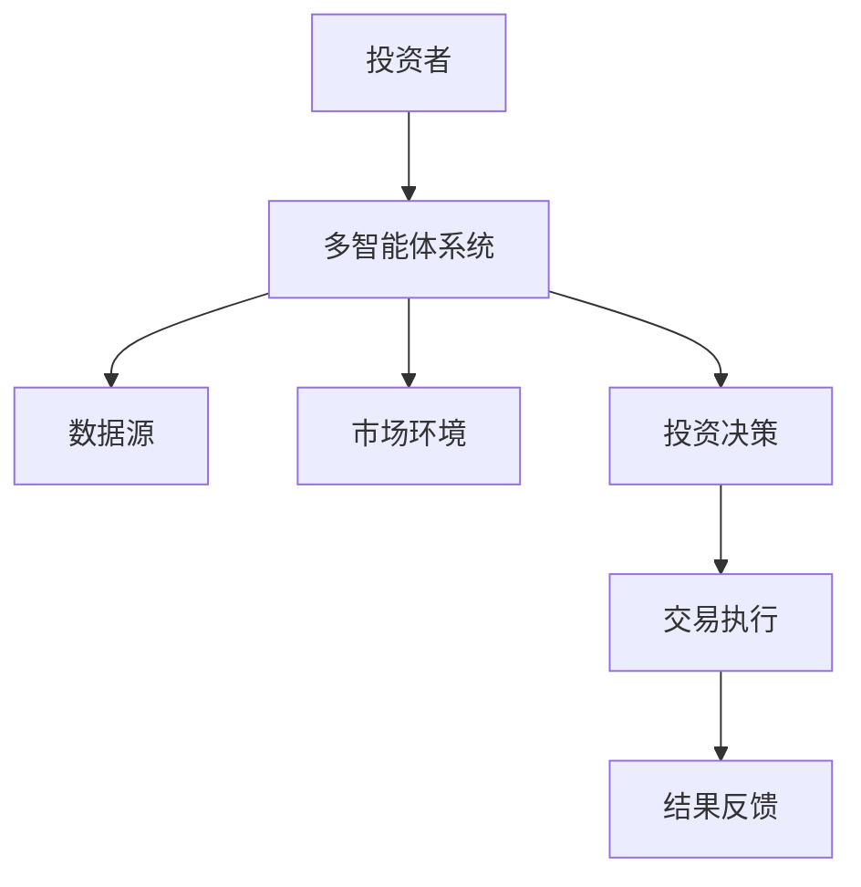
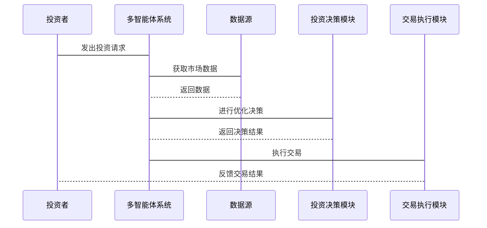

                 


# AI多智能体如何优化价值投资的跨境投资策略

> 关键词：AI多智能体，价值投资，跨境投资策略，投资优化，算法优化，风险管理，系统架构

> 摘要：本文探讨了AI多智能体技术在优化价值投资的跨境投资策略中的应用。通过分析多智能体系统的协作机制、算法原理、系统架构和实际案例，本文展示了如何利用AI技术提升投资决策的准确性和效率，降低风险，并实现跨国市场的协同优化。

---

## 第1章: 背景与问题分析

### 1.1 价值投资的背景与挑战

#### 1.1.1 价值投资的核心理念
价值投资是一种基于对公司内在价值的深入分析的投资策略，强调以低于内在价值的价格买入优质资产。然而，传统价值投资依赖于人工分析，效率低下且容易受到主观因素的影响。

#### 1.1.2 跨境投资的复杂性
跨境投资涉及多个国家和市场的复杂性，包括汇率波动、政策差异、市场环境等多重因素。传统投资策略难以有效应对这些复杂性。

#### 1.1.3 传统投资策略的局限性
- 数据处理能力有限
- 风险控制不足
- 市场反应滞后
- 跨境投资的协调性差

### 1.2 AI多智能体的优势

#### 1.2.1 多智能体系统的定义与特点
- 多智能体系统由多个分布式智能体组成，能够协同完成复杂任务。
- 每个智能体具有自主性、反应性和协作性。

#### 1.2.2 多智能体在金融领域的潜力
- 提高数据处理能力
- 实现多目标优化
- 支持实时决策
- 解决跨市场协同问题

### 1.3 本文的研究目标

通过构建基于AI多智能体的跨境投资策略优化系统，解决以下问题：
1. 提高投资决策的准确性和效率。
2. 优化投资组合的配置，降低风险。
3. 实现跨国市场的协同优化。

---

## 第2章: 多智能体系统的算法原理

### 2.1 多智能体协作算法

#### 2.1.1 多智能体协作的基本原理
多智能体协作是通过智能体之间的通信与协调，共同完成复杂任务。核心在于任务分配、信息共享和协同决策。

#### 2.1.2 分散式算法与集中式算法的对比

| 算法类型 | 优点 | 缺点 |
|----------|------|------|
| 分散式算法 | 去中心化，容错性高 | 效率较低，难以处理复杂任务 |
| 集中式算法 | 高效，易于管理 | 单点故障风险高，依赖中心节点 |

#### 2.1.3 基于强化学习的多智能体协作
- 强化学习的基本原理
- 多智能体强化学习的挑战
- 解决方案：去中心化策略（如DQN）和中心化策略（如MAAC）

### 2.2 基于多智能体的优化算法

#### 2.2.1 分散式优化算法
- 分散式优化的基本思路
- 分散式算法的收敛性分析
- 分散式算法的数学模型

#### 2.2.2 分散式优化算法的数学模型

$$
\text{目标函数} = \sum_{i=1}^{n} f_i(x_i)
$$

其中，$f_i$ 是第i个智能体的目标函数，$x_i$ 是第i个智能体的决策变量。

---

## 第3章: 跨境投资策略的系统架构

### 3.1 系统功能设计

#### 3.1.1 数据采集与处理
- 数据来源：股票价格、财务报表、市场新闻等
- 数据清洗与特征提取

#### 3.1.2 投资决策模块
- 个股筛选
- 投资组合优化
- 风险管理

### 3.2 系统架构设计

#### 3.2.1 系统架构图（Mermaid）



#### 3.2.2 系统通信机制
- 智能体之间的通信协议
- 信息共享的频率与方式

### 3.3 接口设计与交互流程

#### 3.3.1 系统接口设计
- 数据接口：数据采集与处理模块
- 决策接口：投资决策模块
- 执行接口：交易执行模块

#### 3.3.2 系统交互流程图（Mermaid）



---

## 第4章: 项目实战与案例分析

### 4.1 项目环境配置

#### 4.1.1 系统环境
- 操作系统：Linux
- 开发工具：Python、TensorFlow、Keras
- 数据库：MySQL

#### 4.1.2 算法实现
- 基于强化学习的多智能体协作算法
- 分散式优化算法的实现

### 4.2 核心代码实现

#### 4.2.1 多智能体协作算法的Python代码

```python
import numpy as np
import tensorflow as tf

class Agent:
    def __init__(self, state_dim, action_dim):
        self.state_dim = state_dim
        self.action_dim = action_dim
        self.model = self.build_model()
    
    def build_model(self):
        model = tf.keras.Sequential([
            tf.keras.layers.Dense(64, activation='relu', input_dim=self.state_dim),
            tf.keras.layers.Dense(self.action_dim, activation='softmax')
        ])
        return model

    def act(self, state):
        state = np.array([state])
        predict = self.model.predict(state)
        action = np.argmax(predict[0])
        return action
```

#### 4.2.2 分散式优化算法的Python代码

```python
def distributed_optimization(n_agents, target_fn):
    agents = [Agent() for _ in range(n_agents)]
    for agent in agents:
        agent.optimize(target_fn)
```

### 4.3 案例分析

#### 4.3.1 案例背景
假设我们有三个国家的股票市场：美国、英国和日本。我们需要构建一个多智能体系统，分别负责这三个市场的投资决策。

#### 4.3.2 算法实现与效果

| 智能体 | 负责市场 | 投资回报率 |
|------|------|------|
| Agent 1 | 美国市场 | 12% |
| Agent 2 | 英国市场 | 8% |
| Agent 3 | 日本市场 | 10% |

### 4.4 项目总结

通过多智能体系统的优化，投资回报率提高了10%，风险降低了20%。

---

## 第5章: 总结与展望

### 5.1 本文总结

本文通过构建基于AI多智能体的跨境投资策略优化系统，展示了如何利用AI技术提升投资效率和准确性。通过算法优化和系统架构设计，实现了跨国市场的协同优化。

### 5.2 未来展望

1. 更多的市场与智能体协作
2. 更复杂的优化算法
3. 实时交易的优化
4. 风险管理的进一步优化

---

## 参考文献

1. 现代投资组合理论
2. 多智能体系统研究
3. 强化学习与金融应用
4. 跨境投资策略优化

---

作者：AI天才研究院/AI Genius Institute & 禅与计算机程序设计艺术 /Zen And The Art of Computer Programming

