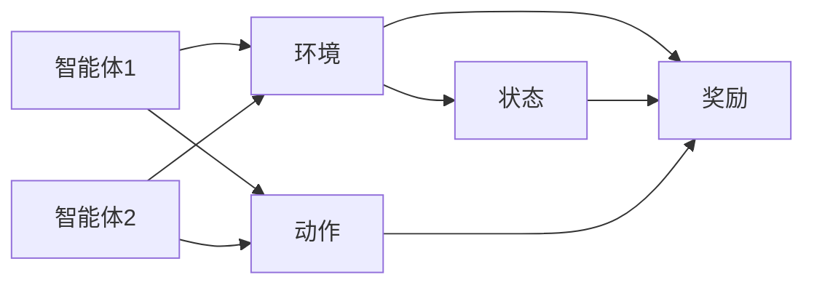
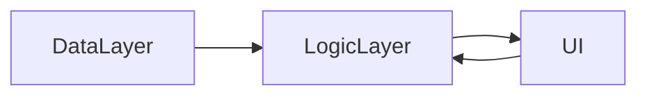
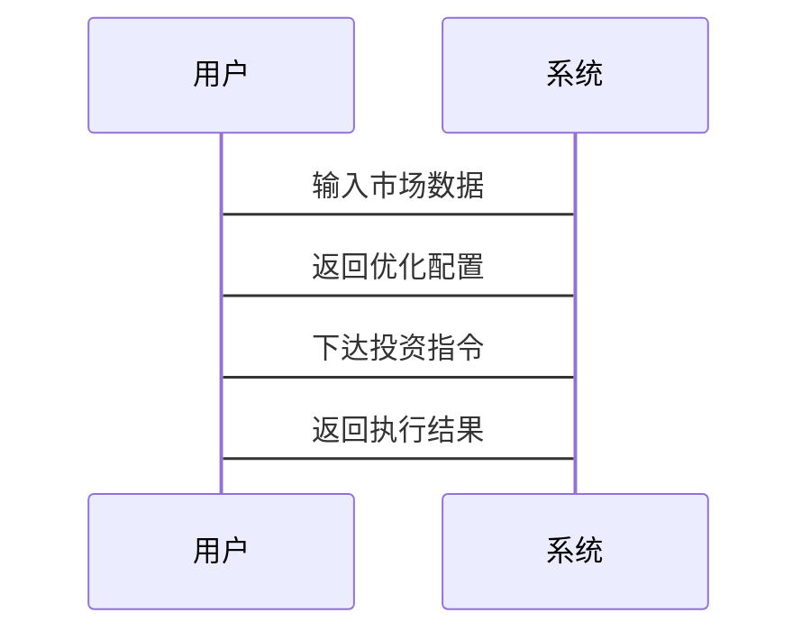

                 


# AI多智能体如何优化价值投资的跨资产类别配置策略

> 关键词：AI多智能体，价值投资，跨资产配置，强化学习，系统架构，数学模型

> 摘要：本文探讨了如何利用AI多智能体技术优化价值投资的跨资产类别配置策略。通过分析多智能体系统的数学模型、强化学习算法，以及系统架构设计，本文提出了一个创新的解决方案，能够有效提升投资组合的收益与风险控制能力。

---

## 第一部分：AI多智能体与价值投资的跨资产配置基础

### 第1章：AI多智能体系统概述

#### 1.1 AI多智能体系统的定义与特点

##### 1.1.1 多智能体系统的定义
多智能体系统（Multi-Agent System, MAS）是由多个相互作用的智能体组成的系统，每个智能体能够独立感知环境并采取行动，通过协同完成复杂任务。

##### 1.1.2 AI多智能体的核心特点
- **分布式性**：智能体独立决策，通过通信协同完成目标。
- **自主性**：智能体具备自主决策能力，无需中央控制。
- **协作性**：智能体之间通过协作提高整体系统性能。
- **动态性**：系统环境和智能体状态动态变化。

##### 1.1.3 多智能体与单智能体的区别
| 特性 | 单智能体 | 多智能体 |
|------|----------|----------|
| 决策 | 中央控制 | 分布式决策 |
| 通信 | 无 | 智能体之间通信 |
| 协作 | 无 | 强调协作完成任务 |
| 复杂性 | 较低 | 较高 |

#### 1.2 价值投资的基本原理

##### 1.2.1 价值投资的定义
价值投资是一种投资策略，通过分析资产的内在价值，寻找被市场低估的投资机会。

##### 1.2.2 价值投资的核心原则
- **安全边际**：买入价格低于内在价值。
- **长期视角**：关注企业的长期价值，而非短期波动。
- **分散投资**：通过跨资产配置降低风险。

#### 1.3 跨资产配置的挑战与机遇

##### 1.3.1 跨资产配置的基本概念
跨资产配置是指将投资组合分散到不同资产类别（如股票、债券、商品等），以降低风险并优化收益。

##### 1.3.2 不同资产类别之间的关系
- **相关性**：不同资产类别之间的价格波动相关性较低，可以分散风险。
- **收益差异**：不同资产类别的收益和风险特征不同，可以通过组合优化提高收益。

##### 1.3.3 跨资产配置的优化目标
- **最大化收益**：在给定风险下，最大化投资收益。
- **最小化风险**：在给定收益下，最小化投资风险。

---

### 第2章：AI在金融投资中的应用

#### 2.1 AI在金融分析中的作用

##### 2.1.1 数据分析与模式识别
AI技术可以分析海量金融数据，发现隐藏的模式和趋势，帮助投资者做出更明智的决策。

##### 2.1.2 预测模型的构建
通过机器学习算法，构建股票价格预测模型，评估资产的未来表现。

##### 2.1.3 风险评估与管理
AI可以实时监控市场风险，识别潜在的系统性风险，优化投资组合的风险管理。

#### 2.2 多智能体在投资决策中的优势

##### 2.2.1 分散决策与集中控制
多智能体系统可以在分布式决策中实现局部优化，同时通过集中控制实现全局优化。

##### 2.2.2 多智能体之间的协同与竞争
智能体之间的协同可以提高整体系统的决策能力，而竞争则可以避免过度集中风险。

##### 2.2.3 多智能体系统的动态适应性
系统能够实时适应市场变化，动态调整投资策略，提高应对市场波动的能力。

---

### 第3章：多智能体系统的数学模型与算法

#### 3.1 多智能体系统的数学模型

##### 3.1.1 状态空间的定义
状态空间表示系统在某一时刻的状态，包括市场数据、资产价格等。

##### 3.1.2 动作空间的构建
动作空间表示智能体可以采取的操作，如买入、卖出等。

##### 3.1.3 奖励函数的设计
奖励函数定义智能体采取动作后的奖励，引导智能体学习最优策略。

#### 3.2 基于强化学习的多智能体算法

##### 3.2.1 强化学习的基本原理
强化学习通过智能体与环境的交互，学习最优策略，最大化累计奖励。

##### 3.2.2 多智能体强化学习的挑战
- **协调问题**：多个智能体之间的协作与竞争。
- **通信开销**：智能体之间的通信可能增加系统复杂性。
- **收敛速度**：多智能体系统可能需要更长时间才能收敛。

##### 3.2.3 基于Q-learning的多智能体算法


#### 3.3 跨资产配置的优化算法

##### 3.3.1 资产配置的数学模型
$$ \text{目标函数：} \max \sum_{i=1}^n w_i r_i $$
$$ \text{约束条件：} \sum_{i=1}^n w_i = 1, \text{其中 } w_i \text{为资产权重，} r_i \text{为预期收益} $$

##### 3.3.2 基于遗传算法的优化
遗传算法通过模拟自然选择过程，优化投资组合的权重。

##### 3.3.3 基于动态规划的配置策略
动态规划通过分阶段决策，优化长期投资策略。

---

### 第4章：系统架构与设计

#### 4.1 系统功能设计

##### 4.1.1 数据采集与处理模块
负责采集市场数据，清洗和预处理。

##### 4.1.2 智能体决策模块
基于强化学习算法，生成投资决策。

##### 4.1.3 资产配置优化模块
优化投资组合的权重，实现跨资产配置。

#### 4.2 系统架构设计

##### 4.2.1 分层架构设计
- **数据层**：存储和管理数据。
- **逻辑层**：处理业务逻辑。
- **界面层**：与用户交互。

##### 4.2.2 模块之间的交互关系


##### 4.2.3 系统的可扩展性设计
通过模块化设计，方便扩展新的资产类别或优化算法。

#### 4.3 接口设计与交互流程

##### 4.3.1 系统接口定义
- **输入接口**：接收市场数据和用户指令。
- **输出接口**：输出投资决策和配置结果。

##### 4.3.2 用户交互流程


---

### 第5章：项目实战

#### 5.1 环境安装

##### 5.1.1 安装Python
安装Python 3.8及以上版本。

##### 5.1.2 安装依赖库
安装numpy、pandas、tensorflow等库。

#### 5.2 核心代码实现

##### 5.2.1 数据处理代码
```python
import numpy as np
import pandas as pd

# 读取数据
data = pd.read_csv('market_data.csv')
# 数据预处理
data = data.dropna().astype(float)
```

##### 5.2.2 强化学习算法实现
```python
class Agent:
    def __init__(self, state_space, action_space):
        self.state_space = state_space
        self.action_space = action_space
        # 初始化Q表
        self.q_table = np.zeros((state_space, action_space))

    def act(self, state):
        # 简单的策略：选择当前状态下的最大动作
        return np.argmax(self.q_table[state])
```

##### 5.2.3 资产配置优化
```python
import numpy as np

def optimize_portfolio(weights, returns):
    # 计算收益
    portfolio_return = np.sum(weights * returns)
    # 计算风险
    portfolio_risk = np.std(weights * returns)
    return portfolio_return / portfolio_risk
```

#### 5.3 案例分析与结果展示

##### 5.3.1 数据分析结果
通过分析股票、债券等资产的历史数据，确定最优配置比例。

##### 5.3.2 算法优化结果
展示优化后的投资组合在不同市场环境下的表现。

---

### 第6章：结论与展望

#### 6.1 最佳实践 tips
- **数据质量**：确保数据的准确性和完整性。
- **模型选择**：根据实际情况选择合适的算法。
- **系统监控**：实时监控系统性能和市场变化。

#### 6.2 小结
本文详细介绍了如何利用AI多智能体技术优化价值投资的跨资产配置策略，通过数学模型、算法设计和系统架构的分析，提出了一种创新的解决方案。

#### 6.3 注意事项
- 系统需要定期更新数据和模型。
- 风险管理是投资决策的重要组成部分。
- 系统的可扩展性和可维护性需要重点关注。

#### 6.4 拓展阅读
- 多智能体系统的最新研究。
- 强化学习在金融领域的应用。
- 资产配置的其他优化方法。

---

作者：AI天才研究院/AI Genius Institute & 禅与计算机程序设计艺术 /Zen And The Art of Computer Programming

