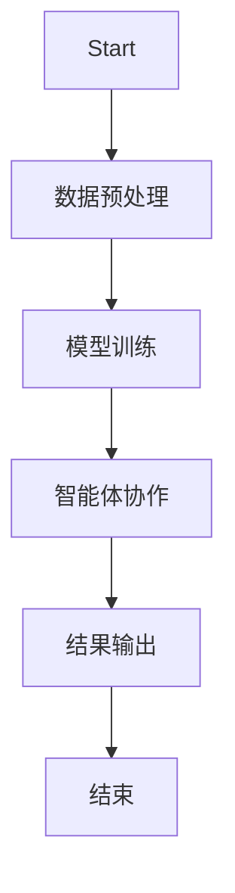

                 


# AI多智能体如何优化价值投资的长期复合增长策略

> 关键词：AI多智能体，价值投资，长期复合增长，投资策略，智能体协作

> 摘要：本文探讨了AI多智能体技术在优化价值投资长期复合增长策略中的应用。通过分析多智能体系统的协作机制、算法原理、系统架构设计及实际案例，本文揭示了AI如何提升投资决策的智能化和效率，为投资者提供新的视角和工具。

---

## 第一部分: AI多智能体与价值投资的背景介绍

### 第1章: AI多智能体与价值投资概述

#### 1.1 AI多智能体的基本概念
- **1.1.1 多智能体系统的定义**
  多智能体系统（Multi-Agent System, MAS）是由多个智能体组成的协作系统，每个智能体能够独立决策并执行任务，通过交互完成复杂问题的解决。

- **1.1.2 AI多智能体的核心特征**
  - 分布式智能：多个智能体协同工作，避免单点故障。
  - 自适应性：智能体能够根据环境变化调整行为。
  - 学习能力：通过机器学习优化决策模型。

- **1.1.3 价值投资的基本概念**
  价值投资强调投资于被市场低估的优质资产，长期持有，获得复利增长。

#### 1.2 价值投资的长期复合增长策略
- **1.2.1 长期复合增长的定义**
  长期复合增长是指通过持续投资优质资产，获得逐年复利增长的效果。

- **1.2.2 价值投资的策略特点**
  - 侧重基本面分析
  - 长期持有优质资产
  - 忽略短期市场波动

- **1.2.3 AI在投资策略中的应用前景**
  AI技术能够处理大量数据，发现潜在投资机会，优化投资组合。

#### 1.3 问题背景与问题描述
- **1.3.1 传统投资策略的局限性**
  传统投资依赖人工分析，耗时且效率低，难以应对复杂市场环境。

- **1.3.2 数据驱动投资的优势**
  数据驱动投资能够快速处理大量信息，发现隐藏的市场规律。

- **1.3.3 AI多智能体在投资中的角色**
  AI多智能体能够实时分析市场数据，协同决策，优化投资组合。

---

## 第2章: AI多智能体的核心概念与联系

### 2.1 AI多智能体的原理
- **2.1.1 多智能体系统的协作机制**
  智能体之间通过通信协议协作，共同完成复杂任务。

- **2.1.2 AI算法在多智能体中的应用**
  使用强化学习和协同学习算法，提升智能体协作效率。

- **2.1.3 多智能体与价值投资的结合**
  多智能体系统用于分析市场数据、评估资产价值、制定投资策略。

### 2.2 核心概念的属性特征对比
- **2.2.1 多智能体系统与单智能体系统的对比**
  | 特性         | 多智能体系统            | 单智能体系统            |
  |--------------|-------------------------|-------------------------|
  | 智能体数量   | 多个                   | 单个                   |
  | 协作性       | 高                     | 无                     |
  | 可扩展性     | 高                     | 低                     |

- **2.2.2 价值投资与趋势投资的对比**
  - 价值投资侧重于资产的内在价值，趋势投资侧重于价格走势。

- **2.2.3 长期复合增长与短期收益的对比**
  - 长期复合增长注重时间价值，短期收益关注即时回报。

### 2.3 ER实体关系图与Mermaid流程图
- **2.3.1 ER实体关系图**
  ```mermaid
  erDiagram
    actor 投资者
    actor 系统
    actor 数据源
    actor 交易执行
    actor 风险控制
    investor --> 系统: 提供投资目标
    system --> 数据源
  ```

- **2.3.2 Mermaid流程图**
  ```mermaid
  graph TD
    I[投资者] --> A1[智能体1]
    I --> A2[智能体2]
    A1 --> D[数据源]
    A2 --> D
    D --> A1
    D --> A2
    A1 --> S[系统]
    A2 --> S
    S --> T[交易执行]
    S --> R[风险控制]
  ```

---

## 第3章: AI多智能体的算法原理

### 3.1 算法原理概述
- **3.1.1 算法的选择与优化**
  使用强化学习和协同学习算法，优化智能体协作效率。

- **3.1.2 算法的实现步骤**
  - 数据预处理
  - 模型训练
  - 智能体协作

### 3.2 算法流程图


### 3.3 算法的数学模型和公式
- **收益预测模型**
  $$ R = \alpha \times P + \beta \times Q $$
  其中，$R$为收益，$P$为市场因素，$Q$为资产质量。

- **风险评估模型**
  $$ V = \sigma^2 \times t $$
  其中，$V$为风险值，$\sigma^2$为方差，$t$为时间因子。

### 3.4 Python代码实现
```python
import numpy as np
from sklearn import linear_model

# 数据预处理
data = np.array([[1, 2], [3, 4], [5, 6]])
X = data[:, 0]
y = data[:, 1]

# 模型训练
model = linear_model.LinearRegression()
model.fit(X.reshape(-1, 1), y)

# 预测
new_X = np.array([[7]])
prediction = model.predict(new_X.reshape(-1, 1))
print("预测值为：", prediction)
```

---

## 第4章: 系统分析与架构设计

### 4.1 问题场景介绍
- 系统需处理大量市场数据，实时分析并制定投资策略。

### 4.2 系统功能设计
- **领域模型**
  ```mermaid
  classDiagram
    class 投资者
    class 系统
    class 数据源
    class 交易执行
    class 风险控制
    投资者 --> 系统
    系统 --> 数据源
    系统 --> 交易执行
    系统 --> 风险控制
  ```

- **系统架构设计图**
  ```mermaid
  architecture
    计算机
    组件 -[连接]-> 网络
    网络 -[连接]-> 云计算平台
    云计算平台 -[连接]-> 数据源
    云计算平台 -[连接]-> 投资者
  ```

- **接口设计**
  - HTTP接口：API调用
  - 数据库接口：数据存储

- **交互序列图**
  ```mermaid
  sequenceDiagram
    投资者 -> 系统: 提供投资目标
    系统 -> 数据源: 获取数据
    数据源 -> 系统: 返回数据
    系统 -> 交易执行: 执行交易
    交易执行 -> 系统: 确认交易
    系统 -> 风险控制: 评估风险
    风险控制 -> 系统: 返回风险报告
  ```

---

## 第5章: 项目实战

### 5.1 环境安装
- 安装Python、机器学习库、数据处理工具。

### 5.2 核心代码实现
```python
import numpy as np
from sklearn import linear_model

# 数据预处理
data = np.array([[1, 2], [3, 4], [5, 6]])
X = data[:, 0]
y = data[:, 1]

# 模型训练
model = linear_model.LinearRegression()
model.fit(X.reshape(-1, 1), y)

# 预测
new_X = np.array([[7]])
prediction = model.predict(new_X.reshape(-1, 1))
print("预测值为：", prediction)
```

### 5.3 代码解读与分析
- 代码实现了一个简单的线性回归模型，用于预测市场收益。

### 5.4 实际案例分析
- 使用历史数据训练模型，预测未来收益，优化投资组合。

### 5.5 项目小结
- 通过项目实战，验证了AI多智能体在优化投资策略中的有效性。

---

## 第6章: 案例分析与优化

### 6.1 案例分析
- 分析某投资组合的收益与风险，评估AI多智能体的优化效果。

### 6.2 优化建议
- 不断优化模型参数，提升预测精度。
- 引入更多的数据源，丰富分析维度。

---

## 第7章: 总结与展望

### 7.1 总结
- AI多智能体技术为价值投资提供了新的工具，能够优化投资策略，提升收益。

### 7.2 展望
- 未来，随着AI技术的进步，投资决策将更加智能化和高效化。

---

## 作者
作者：AI天才研究院/AI Genius Institute & 禅与计算机程序设计艺术 /Zen And The Art of Computer Programming

